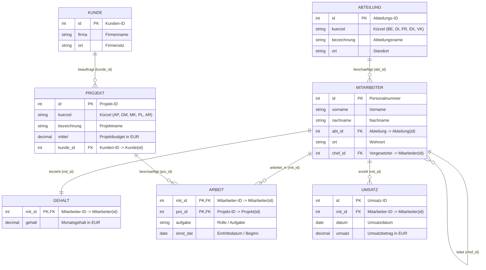

# 🤖 Workspace Guidelines: SQL-Fundamentals

## 🗄️ Single Source of Truth (SoT): `ProjektDB`

Für **alle** Module (`Day_01` bis `Day_27`) gilt die **`ProjektDB`** als verbindliche **Single Source of Truth (SoT)**.

### Kanonisches Schema & Entitäten

### Namenskonventionen & Feldzuordnungen
* **Mitarbeiter:** `id`, `vorname`, `nachname`, `abt_id`, `ort`, `chef_id`
* **Abteilung:** `id`, `kuerzel`, `bezeichnung`, `ort`
* **Gehalt:** `mit_id`, `gehalt`
* **Kunde:** `id`, `firma`, `ort`
* **Projekt:** `id`, `kuerzel`, `bezeichnung`, `mittel`, `kunde_id`
* **Arbeit:** `mit_id`, `pro_id`, `aufgabe`, `einst_dat` *(in Skripten/Aufgaben teils synonym als `beginn` deklariert)*
* **Umsatz:** `id`, `mit_id`, `datum`, `umsatz`

### Regeln für alle Day-Module
1. Alle SQL-Queries, Lösungsbeispiele, Joins, Subqueries, Stored Procedures und Trigger müssen sich auf die Tabellen und Spalten der `ProjektDB` stützen.
2. Abweichende Bezeichnungen (z. B. `gehalt.betrag` oder `mitarbeiter.name`) sind stets auf das kanonische SoT-Schema anzupassen.
