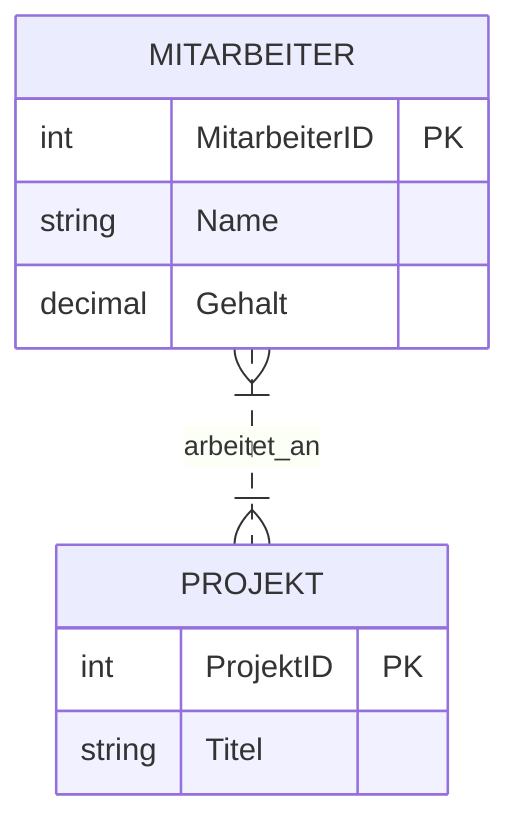
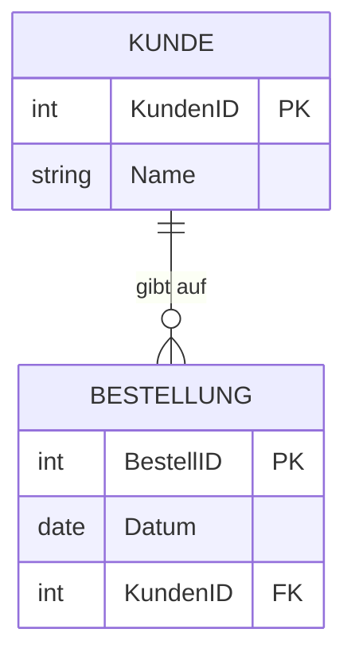

# 📅 Day_01: Datenbank-Grundlagen & Entity-Relationship-Modell (ERM)

## ℹ️ Kurs-Informationen
*   **Datum:** Montag, 03.08.2026
*   **Arbeitszeit:** 08:15 - 16:00 Uhr
*   **Dozent:** Tom S.
*   **Autor:** Tobias Boyke

---

## 🎯 Lernziele des Tages
*   Definition und Aufgaben eines Datenbankmanagementsystems (DBMS) verstehen.
*   Klassische relationale Datenbanken von NoSQL-Datenbanken abgrenzen können.
*   Grundbegriffe relationaler Datenbanken (Mengen, Tabellen, Schemata) beherrschen.
*   Datenbankentwurf mit dem Entity-Relationship-Modell (ERM) in Chen-Notation beherrschen.

---

## 📖 Theorie & Konzepte

### 1. Grundlagen Datenbanken & DBMS
Ein **Datenbanksystem (DBS)** besteht aus zwei Komponenten:
1.  **Datenbasis (DB):** Die physisch gespeicherten Daten.
2.  **Datenbankmanagementsystem (DBMS):** Die Software zur Verwaltung, Abfrage und Absicherung der Datenbasis (z. B. Microsoft SQL Server, PostgreSQL, MySQL).

#### Hauptaufgaben eines DBMS (Die 9 Codd'schen Regeln)
*   **Datenintegration:** Einheitliche Verwaltung aller Daten ohne unnötige Redundanzen.
*   **Datensicherheit & Autorisierung:** Zugriffsschutz durch Benutzerechte.
*   **Datenintegrität:** Überwachung von Konsistenzregeln (Constraints).
*   **Transaktionskontrolle:** Absicherung paralleler Zugriffe (ACID).
*   **Datenunabhängigkeit:** Trennung von physischer Speicherung und logischer Struktur.

---

### 2. Datenbankmodelle: SQL (Relational) vs. NoSQL
*   **Relationales Modell (SQL):** Daten werden in zweidimensionalen Tabellen (Relationen) mit festen Spalten (Attributen) und Zeilen (Tupeln) gespeichert. Beziehungen werden über Schlüsselwerte hergestellt.
*   **NoSQL (Not Only SQL):** Bietet flexible, schemafreie Speicherstrukturen. Eignet sich für unstrukturierte Big-Data-Anwendungen.
    *   *Dokumentenorientiert:* Speicherung in JSON/XML (z. B. MongoDB).
    *   *Key-Value:* Schnelle Schlüssel-Wert-Paare (z. B. Redis).
    *   *Spaltenorientiert:* Wide-Column Stores (z. B. Cassandra).
    *   *Graphdatenbanken:* Speicherung von Knoten und Beziehungen (z. B. Neo4j).

---

### 3. Entity-Relationship-Modell (ERM): Chen-Notation
Der Datenbankentwurf startet konzeptionell mit dem ERM (entwickelt von Peter Chen, 1976). Es beschreibt die Struktur der Daten unabhängig von der konkreten Implementierung.

#### Grundelemente der Chen-Notation
1.  **Entity (Entität - Rechteck):** Ein eindeutig identifizierbares Objekt der Realwelt (z. B. `Mitarbeiter`, `Projekt`).
2.  **Attribute (Eigenschaften - Ellipse):** Eigenschaften einer Entität (z. B. `Name`, `Gehalt`). *Primärschlüssel* werden unterstrichen dargestellt.
3.  **Relationship (Beziehung - Raute):** Die logische Verbindung zwischen Entitäten.
4.  **Kardinalitäten (1:1, 1:N, M:N):** Drücken aus, wie viele Entitäten eines Typs mit wie vielen Entitäten des anderen Typs in Beziehung stehen können.

#### Beziehungstypen im Detail
*   **1:1 (Eins-zu-Eins):** Ein Mitarbeiter besitzt genau einen Firmenwagen; ein Firmenwagen gehört genau einem Mitarbeiter.
*   **1:N (Eins-zu-Viele):** Eine Abteilung hat viele Mitarbeiter; ein Mitarbeiter gehört zu genau einer Abteilung.
*   **M:N (Viele-zu-Viele):** Ein Mitarbeiter arbeitet an mehreren Projekten; ein Projekt hat mehrere Mitarbeiter.

---

### 🎓 IHK-Prüfungsrelevanz: Grundlagen & ERM

#### Frage 1: Nennen Sie drei wesentliche Aufgaben eines DBMS (3 Punkte)
> **IHK-Musterantwort:**
> 1. Gewährleistung der Datensicherheit durch Zugriffsberechtigungen.
> 2. Einhaltung von Konsistenzbedingungen (Datenintegrität).
> 3. Mehrbenutzerbetrieb durch Transaktionssteuerung (Sperrmechanismen).

#### Frage 2: Zeichnen Sie ein ERM in Chen-Notation für einen Kunden und seine Bestellungen (6 Punkte)
*   **Sachverhalt:** Ein Kunde (KundenID [PK], Name) kann mehrere Bestellungen (BestellID [PK], Datum) aufgeben. Eine Bestellung gehört zu genau einem Kunden.
*   **IHK-Lösung (Beschreibung der Chen-Darstellung für die Prüfung):**
    *   **Kunde** als Rechteck mit Ellipsen für `<u>KundenID</u>` und `Name`.
    *   **Bestellung** als Rechteck mit Ellipsen für `<u>BestellID</u>` und `Datum`.
    *   Verbunden über eine Raute **"gibt auf"** mit Kardinalität **1** (an der Linie zu Kunde) zu **N** (an der Linie zu Bestellung).

---

## 💡 Wichtige Notizen
> [!NOTE]
> *   Die Chen-Notation nutzt zur Darstellung von Kardinalitäten feste Werte (1, N, M), während in moderneren Darstellungen (wie Crow's Foot / Krähenfuss) Min/Max-Angaben gemacht werden. In IHK-Prüfungen ist die genaue Beachtung der geforderten Notation (oft Chen oder Krähenfuss) punkterelevant!