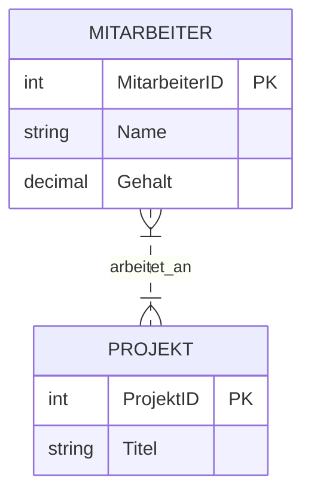
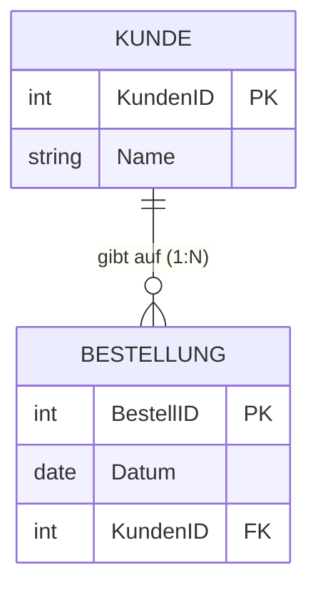

# 📅 Day_01: Datenbank-Grundlagen & Entity-Relationship-Modell (ERM)

## ℹ️ Kurs-Informationen

* **Datum:** Montag, 03.08.2026
* **Arbeitszeit:** 08:15 - 16:00 Uhr
* **Dozent:** Tom S.
* **Autor:** Tobias Boyke

---

## 🎯 Lernziele des Tages

- [x] **Definition und Aufgaben eines DBMS:** Verständnis der 9 Codd'schen Regeln für Datenbankmanagementsysteme.
- [x] **Datenbankparadigmen (SQL vs. NoSQL):** Relationale Tabellenstrukturen vs. dokumenten-, spalten- und graphbasierte NoSQL-Systeme.
- [x] **Mengenlehre in relationalen Datenbanken:** Schnittmenge, Vereinigung, Differenz und Kartesisches Produkt.
- [x] **Konzeptioneller Entwurf mit ERM (Chen-Notation):** Entitäten, Attribute, Primärschlüssel und Kardinalitäten (1:1, 1:N, M:N).
- [x] **IHK-Prüfungsrelevanz:** Zeichnen und Interpretieren von ER-Diagrammen nach IHK-Standard.

---

## 📖 Theorie & Konzepte

### 1. Grundlagen Datenbanken & DBMS

Ein **Datenbanksystem (DBS)** besteht aus zwei Komponenten:
1. **Datenbasis (DB):** Die physisch gespeicherten Nutz- und Metadaten auf Speichermedien.
2. **Datenbankmanagementsystem (DBMS):** Die Software zur Verwaltung, Abfrage und Absicherung der Datenbasis (z. B. Microsoft SQL Server, PostgreSQL, MySQL).

#### Hauptaufgaben eines DBMS (Die 9 Codd'schen Regeln)
* **Datenintegration:** Einheitliche Verwaltung aller Daten ohne unkontrollierte Redundanzen.
* **Datensicherheit & Autorisierung:** Schutz vor unberechtigtem Zugriff über Berechtigungskonzepte.
* **Datenintegrität:** Überwachung und Durchsetzung von Konsistenzbedingungen (Constraints).
* **Transaktionskontrolle:** Absicherung paralleler Zugriffe nach dem ACID-Prinzip.
* **Datenunabhängigkeit:** Trennung von physischer Speicherung (Internal Level) und logischer Sicht (Conceptual/External Level).

---

### 2. Relationales Modell vs. NoSQL-Modelle

* **Relationales Modell (SQL):** Speicherung in zweidimensionalen Relationen (Tabellen) mit festem Schema, Attributen (Spalten) und Tupeln (Zeilen). Verknüpfungen erfolgen über Fremdschlüssel.
* **NoSQL (Not Only SQL):** Schemafreie oder flexible Datenstrukturen:
  * *Dokumentenbasiert:* Speicherung strukturierter JSON-/BSON-Dokumente (z. B. MongoDB).
  * *Key-Value:* Schnelle Schlüssel-Wert-Speicher (z. B. Redis).
  * *Wide-Column:* Spaltenorientierte Speicherung für Massendaten (z. B. Apache Cassandra).
  * *Graph-Datenbanken:* Knoten- und Kantenstrukturen für Beziehungsnetzwerke (z. B. Neo4j).

---

### 3. Mengenlehre in Datenbanken

Relationale Datenbanken basieren mathematisch auf der relationalen Algebra von E. F. Codd:

* **Vereinigung (UNION):** Zusammenführen von Ergebnismengen gleicher Struktur.
* **Schnittmenge (INTERSECT):** Ermitteln gemeinsamer Datensätze zweier Mengen.
* **Differenz (EXCEPT / MINUS):** Datensätze der ersten Menge abzüglich der zweiten Menge.
* **Kartesisches Produkt (CROSS JOIN):** Jede Zeile der Tabelle A kombiniert mit jeder Zeile der Tabelle B ($n \times m$ Zeilen).

---

### 4. Entity-Relationship-Modell (ERM): Chen-Notation

Der Datenbankentwurf startet konzeptionell mit dem ERM (entwickelt von Peter Chen, 1976):

#### Grundelemente der Chen-Notation
1. **Entity (Entität - Rechteck):** Eindeutig identifizierbares Objekt der Realwelt (z. B. `Mitarbeiter`, `Projekt`).
2. **Attribute (Eigenschaften - Ellipse):** Eigenschaften einer Entität (z. B. `Name`, `Gehalt`). *Primärschlüssel* werden unterstrichen dargestellt.
3. **Relationship (Beziehung - Raute):** Die logische Verbindung zwischen Entitäten.
4. **Kardinalitäten (1:1, 1:N, M:N):** Drücken aus, wie viele Entitäten eines Typs mit wie vielen Entitäten des anderen Typs verknüpft sein dürfen/müssen.

---

## 📂 Begleitmaterialien & Dokumente

Im Ordner `assets/` stehen die begleitenden Vorlesungsunterlagen und IHK-Übungsaufgaben bereit:
* 📄 **[Datenbank Grundlagen.pdf](./assets/Datenbank%20Grundlagen.pdf):** Vorlesungsfolien zu DBMS-Architektur und Codd-Regeln.
* 📄 **[Datenbank-Entwurf.pdf](./assets/Datenbank-Entwurf.pdf):** Leitfaden zum konzeptionellen und logischen Datenbankentwurf.
* 📄 **[Aufgabe Mengenlehre - Lösungen.pdf](./assets/Aufgabe%20Mengenlehre%20-%20Lösungen.pdf):** Übungsaufgaben zu Schnittmengen und relationaler Mengenlehre.
* 📄 **[IHK ERM Übungsaufgaben](./assets/):** Reale Prüfungsaufgaben (Lieferfahrten, Messstation, Projekte, Impfprodukte, Terminverwaltung).

---

## 🎓 IHK-Prüfungsrelevanz: Grundlagen & ERM

### Frage 1: Nennen Sie drei wesentliche Aufgaben eines DBMS (3 Punkte)
> **IHK-Musterantwort:**
> 1. Gewährleistung der Datensicherheit durch differenzierte Zugriffsberechtigungen.
> 2. Einhaltung von Konsistenzbedingungen (referenzielle und semantische Integrität).
> 3. Mehrbenutzerbetrieb durch Transaktionssteuerung und Sperrmechanismen (Concurrency Control).

### Frage 2: Zeichnen Sie ein ERM in Chen-Notation für Kunden und Bestellungen (6 Punkte)
* **Sachverhalt:** Ein Kunde (`KundenID` [PK], `Name`) kann mehrere Bestellungen (`BestellID` [PK], `Datum`) aufgeben. Eine Bestellung gehört zu genau einem Kunden.

---

## 💡 Wichtige Notizen & Praxistipps

> [!NOTE]
> * In IHK-Prüfungen ist die genaue Beachtung der geforderten Notation (Chen vs. Krähenfuß/Martin) punkterelevant!
> * Primärschlüssel müssen im ERM immer eindeutig identifizierbar sein (Unterstreichung in Chen, PK-Tag in Crow's Foot).