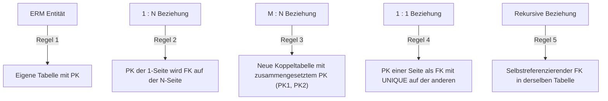

# 📅 Day_02: ERM-Besonderheiten & Das Relationale Tabellenmodell

## ℹ️ Kurs-Informationen

* **Datum:** Dienstag, 04.08.2026
* **Arbeitszeit:** 08:15 - 16:00 Uhr
* **Dozent:** Tom S.
* **Autor:** Tobias Boyke

---

## 🎯 Lernziele des Tages

- [x] **Komplexe ERM-Strukturen:** Rekursive Beziehungen (Selbstbeziehung) und ternäre (dreistellige) Beziehungen sicher modellieren.
- [x] **Relationales Mapping:** Beherrschung der Transformationsregeln vom ERM zum physischen Tabellenmodell (Relational Schema).
- [x] **Schlüsselkonzepte:** Primärschlüssel, Fremdschlüssel und zusammengesetzte Schlüssel (Composite Keys) korrekt anwenden.
- [x] **Referenzielle Integrität:** Vermeidung verwaister Datensätze durch Fremdschlüssel-Beziehungen.
- [x] **IHK-Prüfungstraining Tabellenmodell:** Bearbeitung realer IHK-Szenarien (Kassensystem, Weine, Tarifübersicht).

---

## 📖 Theorie & Konzepte

### 1. Besonderheiten im ERM (Chen-Notation)

* **Mehrere Beziehungen:** Zwischen denselben zwei Entitäten können verschiedene fachliche Beziehungen bestehen (z. B. `Mitarbeiter` *leitet* `Abteilung` vs. `Mitarbeiter` *arbeitet_in* `Abteilung`).
* **Rekursive Beziehungen (Selbstreferenz):** Eine Entität steht mit sich selbst in Beziehung (z. B. `Mitarbeiter` *ist Vorgesetzter von* `Mitarbeiter`).
* **Ternäre Beziehungen:** Verknüpfen drei Entitäten gleichzeitig (z. B. `Lieferant` *liefert* `Teil` *an* `Projekt`).

---

### 2. Transformationsregeln: Vom ERM zum Tabellenmodell

Die logische ERM-Struktur wird nach festen mathematischen Regeln in Tabellendefinitionen überführt:

#### Regel-Details im Überblick
1. **Entitäten ➔ Tabellen:** Jede Entität wird zu einer Tabelle; Attribute werden Spalten.
2. **1:N-Beziehungen:** Der Primärschlüssel (PK) der **1-Seite** wird als Fremdschlüssel (FK) in die Tabelle der **N-Seite** eingetragen (`Bestellung.KundenID -> Kunde.KundenID`).
3. **M:N-Beziehungen (Koppeltabelle):** Eine relationale Spalte darf keine Wertelisten enthalten. Es wird eine **Koppeltabelle** erzeugt, die die PKs beider Entitäten als Fremdschlüssel aufnimmt und gemeinsam als zusammengesetzten Primärschlüssel definiert (`MitarbeiterProjekt(MitarbeiterID [PK,FK], ProjektID [PK,FK])`).
4. **1:1-Beziehungen:** PK einer Seite wird FK der anderen Seite mit `UNIQUE`-Constraint.
5. **Rekursive Beziehungen:** Fremdschlüsselspalte verweist auf den Primärschlüssel derselben Tabelle (`Mitarbeiter.VorgesetzterID -> Mitarbeiter.MitarbeiterID`).

---

## 📂 Begleitmaterialien & Dokumente

Im Ordner `assets/` stehen die Vorlesungsunterlagen und IHK-Abschlussprüfungsaufgaben bereit:
* 📄 **[Datenbank-Entwurf.pdf](./assets/Datenbank-Entwurf.pdf):** Detaillierter Leitfaden zur Überführung von ER-Modellen in Tabellenmodelle.
* 📄 **[Vom ERM zum TabMod.pdf](./assets/Vom%20ERM%20zum%20TabMod%20-%20Aufgabe.pdf):** Schritt-für-Schritt-Übung zur Schema-Transformation.
* 📄 **[IHK Tabellenmodell Aufgaben](./assets/):**
  * *Kassensystem (AP 2015 W)*
  * *Weine (AP 2020 W)*
  * *Tarifübersicht (AP2 2022 S)*

---

## 🎓 IHK-Prüfungsrelevanz: Mapping-Regeln

### Frage 1: Warum erfordert eine M:N-Beziehung eine eigene Koppeltabelle? (4 Punkte)
> **IHK-Musterantwort:**
> Nach den Prinzipien des relationalen Datenmodells (1. Normalform) muss jedes Datenfeld atomar (unteilbar) sein. Eine direkte Speicherung einer M:N-Beziehung würde zu Listen in einzelnen Zellen oder unkontrollierten Datenredundanzen führen. Die Koppeltabelle löst die M:N-Beziehung in zwei 1:N-Beziehungen auf und speichert die Kombinationen als eigenständige Zeilen.

### Frage 2: Wie wird eine rekursive Beziehung im relationalen Schema umgesetzt? (4 Punkte)
> **IHK-Musterantwort:**
> In der betreffenden Tabelle wird eine zusätzliche Fremdschlüsselspalte definiert, die auf den Primärschlüssel derselben Tabelle verweist.
> * Beispiel: `Mitarbeiter (MitarbeiterID [PK], Vorname, Nachname, VorgesetzterID [FK -> Mitarbeiter.MitarbeiterID])`

---

## 💡 Wichtige Notizen
> [!IMPORTANT]
> **Referenzielle Integrität:**
> Ein Fremdschlüsselwert darf in der Kind-Tabelle nur existieren, wenn der zugehörige Primärschlüsselwert in der Eltern-Tabelle physisch vorhanden ist oder der Fremdschlüssel `NULL` enthält.