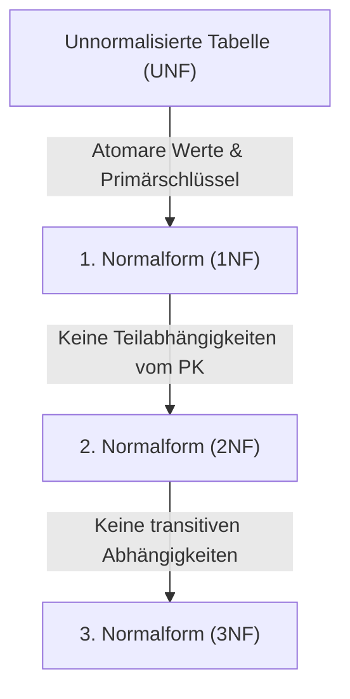

# 📅 Day_03: Normalisierung & Datenanomalien (1NF, 2NF, 3NF)

## ℹ️ Kurs-Informationen

* **Datum:** Mittwoch, 05.08.2026
* **Arbeitszeit:** 08:15 - 16:00 Uhr
* **Dozent:** Tom S.
* **Autor:** Tobias Boyke

---

## 🎯 Lernziele des Tages

- [x] **Datenbank-Anomalien:** Einfüge-, Änderungs- und Lösch-Anomalien sicher erkennen und deren Ursachen (Redundanzen) erklären.
- [x] **Die drei klassischen Normalformen (1NF, 2NF, 3NF):** Formale Kriterien und praktische Anwendung beherrschen.
- [x] **Funktionale Abhängigkeiten:** Voll funktionale vs. partielle Abhängigkeiten und transitive Abhängigkeiten identifizieren.
- [x] **Schrittweises Refactoring:** Überführung unnormalisierter Daten in ein redundanzfreies 3NF-Schema.
- [x] **IHK-Prüfungsaufgaben Normalisierung:** Bearbeitung realer Prüfungsszenarien (PC-Shop, Getränkebestellung, Fahrräder).

---

## 📖 Theorie & Konzepte

### 1. Warum Normalisierung? (Datenanomalien)

Unter **Normalisierung** versteht man die systematische Zerlegung von Relationen zur Minimierung von Datenredundanzen und Vermeidung von Inkonsistenzen:

* **Redundanz:** Mehrfache Speicherung identischer Fakten führt zu erhöhtem Speicherbedarf und Inkonsistenzrisiken.
* **Einfüge-Anomalie (Insert Anomaly):** Ein neuer Fakt kann nicht gespeichert werden, solange andere Pflichtdaten fehlen (z. B. Kurs kann nicht angelegt werden ohne Teilnehmer).
* **Änderungs-Anomalie (Update Anomaly):** Änderungen müssen an vielen Stellen parallel durchgeführt werden; wird eine Stelle vergessen, ist der Datenbestand widersprüchlich.
* **Lösch-Anomalie (Delete Anomaly):** Beim Löschen eines Eintrags gehen unbeabsichtigt andere wichtige Informationen verloren (z. B. Löschen des letzten Schülers löscht den gesamten Kurs).

---

### 2. Die drei Normalformen im Überblick

#### 1. Normalform (1NF)
> Alle Attribute enthalten **atomare** (unteilbare) Werte, und die Tabelle besitzt einen eindeutigen **Primärschlüssel**. Keine Wiederholungsgruppen oder Wertelisten in Zellen.

#### 2. Normalform (2NF)
> Die Tabelle befindet sich in der **1NF** und jedes Nicht-Schlüsselfeld ist vom **gesamten** Primärschlüssel voll funktional abhängig (keine Teilabhängigkeiten bei zusammengesetzten Schlüsseln).

#### 3. Normalform (3NF)
> Die Tabelle befindet sich in der **2NF** und enthält **keine transitiven Abhängigkeiten** (Nicht-Schlüsselfelder dürfen nicht von anderen Nicht-Schlüsselfeldern abhängen).

---

### 3. Normalisierungs-Beispiel (Verlag & Bestellwesen)

#### 1NF: Auflösen von Wertelisten
* Aus unteilbaren Zeichenfolgen wie `"Buch A, Buch B"` werden separate Datensätze erzeugt.

#### 2NF: Auslagern von Teilabhängigkeiten
* Artikeldaten (Name, Preis) hängen nur von der `ArtikelNr` ab, nicht von der zusammengesetzten `(BestellNr, ArtikelNr)` ➔ Auslagerung in Tabelle `Artikel`.

#### 3NF: Beseitigen transitiver Abhängigkeiten
* Kundenort und Bundesland hängen von der `PLZ` bzw. `KundenNr` ab ➔ Auslagerung in Tabellen `Kunde` und `Ort`.

---

## 📂 Begleitmaterialien & Dokumente

Im Ordner `assets/` stehen die Vorlesungsaufgaben und IHK-Abschlussprüfungsunterlagen bereit:
* 📄 **[Aufgabe Normalisierung Vorlesung 1-3.pdf](./assets/):** Vorlesungsübungen zur schrittweisen Normalisierung.
* 📄 **[Datenbank-Entwurf-BeispielNormalisierung Verlag.ods](./assets/Datenbank-Entwurf-BeispielNormalisierung%20Verlag.ods):** Tabellenkalkulationsmodell zur Normalisierung.
* 📄 **[IHK Prüfungsaufgaben Normalisierung](./assets/):**
  * *PC-Shop (AP 2003 S GA2 HS6)*
  * *Getränkebestellung (AP 2016 S GA1 FIAE HS4)*
  * *Fahrräder (AP 2019 W GA1 FIAE HS4)*

---

## 🎓 IHK-Prüfungsrelevanz: Normalisierung

### Frage 1: Erklären Sie den Begriff "Löschanomalie" anhand eines konkreten Beispiels (3 Punkte)
> **IHK-Musterantwort:**
> Eine Löschanomalie liegt vor, wenn beim Löschen eines Datensatzes unbeabsichtigt andere, sachlich eigenständige Informationen unwiderruflich verloren gehen. 
> *Beispiel:* In einer unnormalisierten Tabelle `KursTeilnehmer (TeilnehmerID, KursID, DozentenName)` führt das Abmelden des letzten Teilnehmers dazu, dass der gesamte Datensatz gelöscht wird – und damit auch die Information, dass der Kurs existiert und wer ihn leitet.

### Frage 2: Wann befindet sich eine Tabelle in der 3. Normalform? (3 Punkte)
> **IHK-Musterantwort:**
> Eine Tabelle ist in der 3. Normalform, wenn sie sich bereits in der 2. Normalform befindet und kein Nicht-Schlüsselattribut transitiv von einem Primärschlüssel abhängt (d. h. kein Nicht-Schlüsselfeld darf funktional von einem anderen Nicht-Schlüsselfeld abhängig sein).