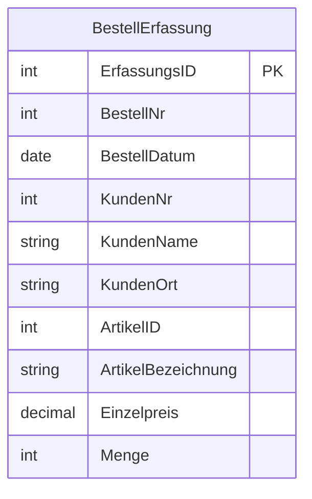
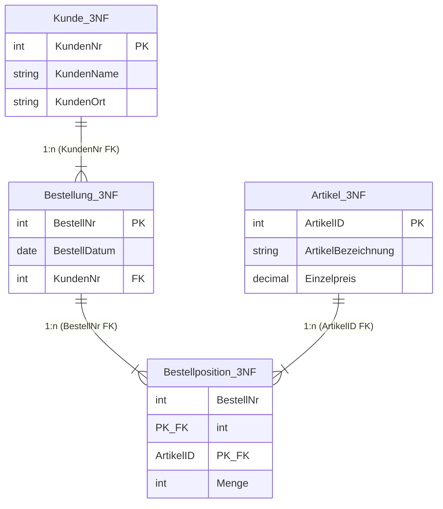

# 📅 Day_06: DDL, DML & Schema-Refactoring (Umwandlung in die 3. Normalform)

## ℹ️ Kurs-Informationen
* **Datum:** Montag, 10.08.2026
* **Arbeitszeit:** 08:15 - 16:00 Uhr (10 Unterrichtsstunden)
* **Dozent:** Tom S.
* **Autor:** Tobias Boyke

---

## 🎯 Lernziele des Tages

* **DDL (Data Definition Language) vertiefen:** Sicheres Erstellen von Datenbanken (`CREATE DATABASE`) und relationalen Tabellen (`CREATE TABLE`) mit allen Constraint-Typen (`PRIMARY KEY`, `FOREIGN KEY`, `UNIQUE`, `CHECK`, `DEFAULT`).
* **DML (Data Manipulation Language) vertiefen:** Daten gezielt einfügen (`INSERT INTO ... VALUES` und `INSERT INTO ... SELECT`).
* **Schema-Refactoring & Normalisierung (3NF):** Umwandlung unnormalisierter oder 1NF/2NF-Alttabellen in die 3. Normalform durch:
  1. Erstellung neuer normalisierter Zieltabellen (DDL).
  2. Migration/Umverteilung von Bestandskaten (DML).
  3. Strukturänderung bestehender Tabellen & Löschen redundanter Spalten (`ALTER TABLE ... DROP COLUMN`).
* **10. Aufgabe (Praktische Übungen):** Eigenständige Bearbeitung komplexer Übungsaufgaben zu DDL, DML und Tabellenmodifizierungen.

---

## 📖 Theorie & Konzepte

### 1. DDL & DML im Zusammenspiel
Während DDL das **Strukturgerüst** (Schemas, Tabellen, Spalten, Datentypen und Integritätsregeln) festlegt, dient DML der **Inhaltsverwaltung** (Einfügen, Ändern, Löschen und Selektieren von Datensätzen).

```
                      +---------------------------------------+
                      |       DDL (Data Definition Language)  |
                      |  CREATE DATABASE / CREATE TABLE       |
                      |  ALTER TABLE / DROP COLUMN            |
                      +---------------------------------------+
                                          |
                                          v
                      +---------------------------------------+
                      |    DML (Data Manipulation Language)   |
                      |  INSERT INTO ... VALUES / SELECT      |
                      |  UPDATE / DELETE                      |
                      +---------------------------------------+
```

---

### 2. Schema-Refactoring: Umwandlung in die 3. Normalform (3NF)

In der Praxis liegen Daten oft in unnormalisierten "Flachdateien" oder veralteten Systemtabellen vor, die Redundanzen und Datenanomalien aufweisen. Der Übergang zu einem sauberen 3NF-Tabellenschema erfordert ein systematisches Zusammenspiel von DDL und DML:

#### Der 4-Schritte-Refactoring-Prozess

1. **DDL – Zieltabellen erstellen (`CREATE TABLE`):**
   Für jede eigenständige Entität des neuen 3NF-Modells (z. B. `Kunde`, `Artikel`, `Bestellung`, `Bestellposition`) wird eine saubere Tabelle mit Primärschlüsseln, Datentypen und Constraints angelegt.
2. **DML – Daten migrieren (`INSERT INTO ... SELECT DISTINCT`):**
   Die Daten werden aus der Alttabelle selektiert und duplikatfrei (`DISTINCT`) in die neuen Zieltabellen verteilt.
3. **DDL & DML – Relationale Verknüpfungen herstellen (`FOREIGN KEY`):**
   Über Fremdschlüsselspalten werden die neu erstellten Tabellen miteinander in Beziehung gesetzt.
4. **DDL – Alttabelle bereinigen / Spalten löschen (`ALTER TABLE ... DROP COLUMN`):**
   Redundante Spalten (wie Kundenname oder Artikelbezeichnung) werden aus der ursprünglichen Tabelle mit `ALTER TABLE ... DROP COLUMN` entfernt, um eine doppelte Datenhaltung zu verhindern.

---

### 📊 Visualisierung: Vorher/Nachher des 3NF-Refactorings

#### Vorher (Unnormalisierte Alttabelle `BestellErfassung` - Redundanz & Anomalien)


#### Nachher (Sauberes 3NF-Tabellenmodell)


---

### 3. Syntax-Referenz: DDL & DML für Schemaänderungen

#### Spalte nachträglich hinzufügen
```sql
ALTER TABLE dbo.KundenStamm
ADD Telefon VARCHAR(30) NULL;
```

#### Spaltendefinition ändern
```sql
ALTER TABLE dbo.KundenStamm
ALTER COLUMN StatusFlag VARCHAR(20) NOT NULL;
```

#### Redundante Spalten entfernen (DDL)
```sql
ALTER TABLE dbo.BestellErfassung
DROP COLUMN KundenName, KundenOrt;
```

#### Daten duplikatfrei migrieren (DML)
```sql
INSERT INTO dbo.Kunde_3NF (KundenNr, KundenName, KundenOrt)
SELECT DISTINCT KundenNr, KundenName, KundenOrt
FROM dbo.BestellErfassung;
```

---

## 💻 Praktische Übungen

Die Quellcodes und Musterlösungen für den Tag befinden sich im Ordner `src/`:

1. **[01_ddl_dml_grundlagen.sql](./src/01_ddl_dml_grundlagen.sql):**
   * Vertiefung von DDL (`CREATE TABLE` mit `PRIMARY KEY`, `FOREIGN KEY`, `CHECK`, `UNIQUE`) und DML (`INSERT INTO`).
2. **[02_normalisierung_3nf_refactoring.sql](./src/02_normalisierung_3nf_refactoring.sql):**
   * Vollständiges Praxisszenario: Überführung einer unnormalisierten Bestelltabelle in die 3. Normalform (Erstellung von 4 Zieltabellen, Datenmigration per `INSERT INTO ... SELECT DISTINCT`, Schemaänderungen mit `ALTER TABLE ... DROP COLUMN`).
3. **[03_uebungsaufgaben_ddl_dml.sql](./src/03_uebungsaufgaben_ddl_dml.sql):**
   * **10. Aufgabe:** Ausführliche Übungsaufgaben zu DDL, DML, Datenarchivierung (`INSERT INTO ... SELECT`) und Beziehungsaufbau.

---

## 🎓 IHK-Prüfungsrelevanz

### Frage 1: Welches SQL-Kommando verwenden Sie, um eine nicht mehr benötigte Spalte aus einer bestehenden Tabelle zu entfernen? (3 Punkte)
> **IHK-Musterantwort:**
> Dazu verwendet man das DDL-Kommando `ALTER TABLE Tabellenname DROP COLUMN Spaltenname;`.

### Frage 2: Ein Entwickler möchte Daten aus einer temporären Erfassungstabelle in eine normalisierte Stammdatentabelle übertragen, ohne Duplikate zu erzeugen. Wie lautet der SQL-Ansatz? (4 Punkte)
> **IHK-Musterantwort:**
> Durch die Kombination von `INSERT INTO ZielTabelle (Spalten...)` mit einer Abfrage über `SELECT DISTINCT Spalten... FROM QuellTabelle`.

### Frage 3: Warum sollte vor dem Ausführen von `ALTER TABLE ... DROP COLUMN` in Produktionsumgebungen eine Datenmigration durchgeführt werden? (3 Punkte)
> **IHK-Musterantwort:**
> Das Löschen einer Spalte mit `DROP COLUMN` entfernt unwiderruflich alle in dieser Spalte gespeicherten Daten. Wenn die Daten nicht zuvor in eine normalisierte Zielstruktur migriert wurden, kommt es zu permanentem Datenverlust.

---

## 💡 Wichtige Notizen & Best Practices

> [!IMPORTANT]
> **Schema-Migrationen immer in Transaktionen kapseln:**
> Beim Refactoring bestehender Tabellen (Erstellen neuer Tabellen, Datenmigration und anschließendes `DROP COLUMN`) sollten alle Schritte in einem Transaktionsblock (`BEGIN TRANSACTION ... COMMIT`) ausgeführt werden. Schlägt ein Migrationsschritt fehl, schützt ein `ROLLBACK` vor unvollständigen Schemazuständen.

> [!TIP]
> **Prüfung von Abhängigkeiten vor `DROP COLUMN`:**
> Bevor Spalten gelöscht werden, muss sichergestellt werden, dass keine Sichten (`VIEWS`), gespeicherten Prozeduren (`STORED PROCEDURES`), Indizes oder Fremdschlüssel-Constraints mehr auf die zu löschende Spalte verweisen.