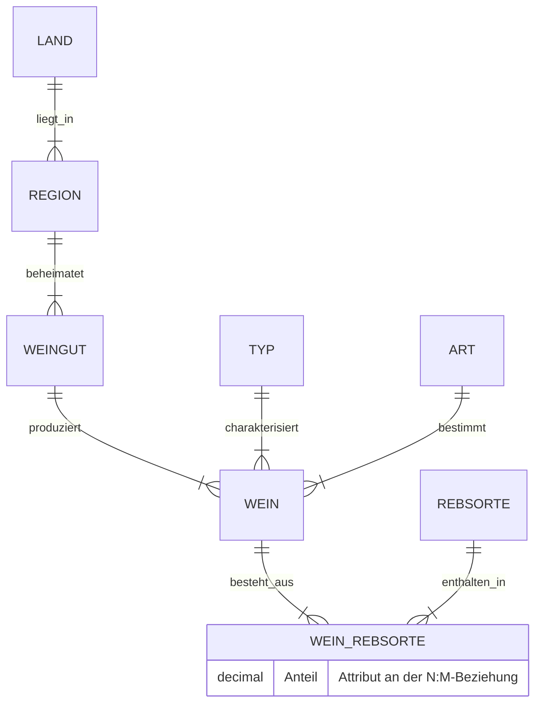
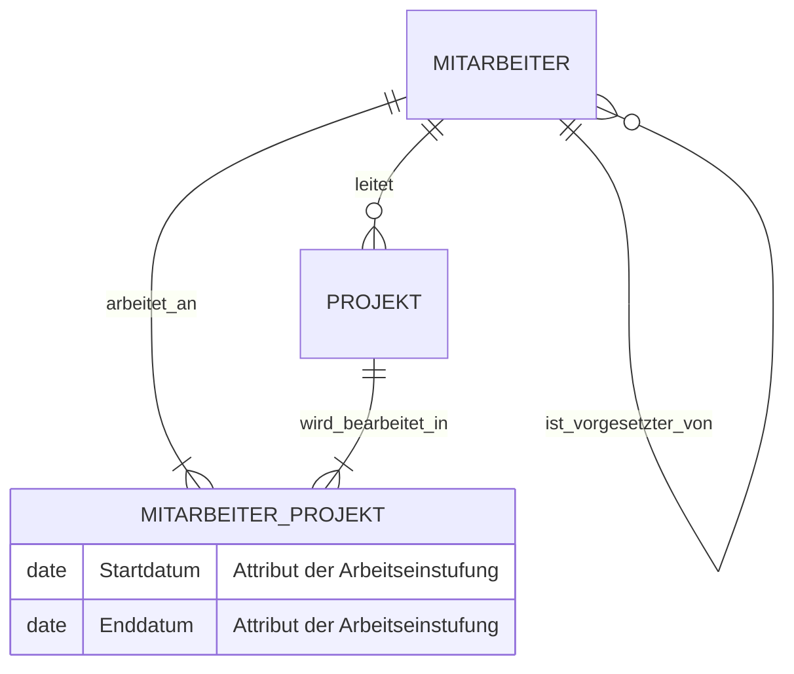
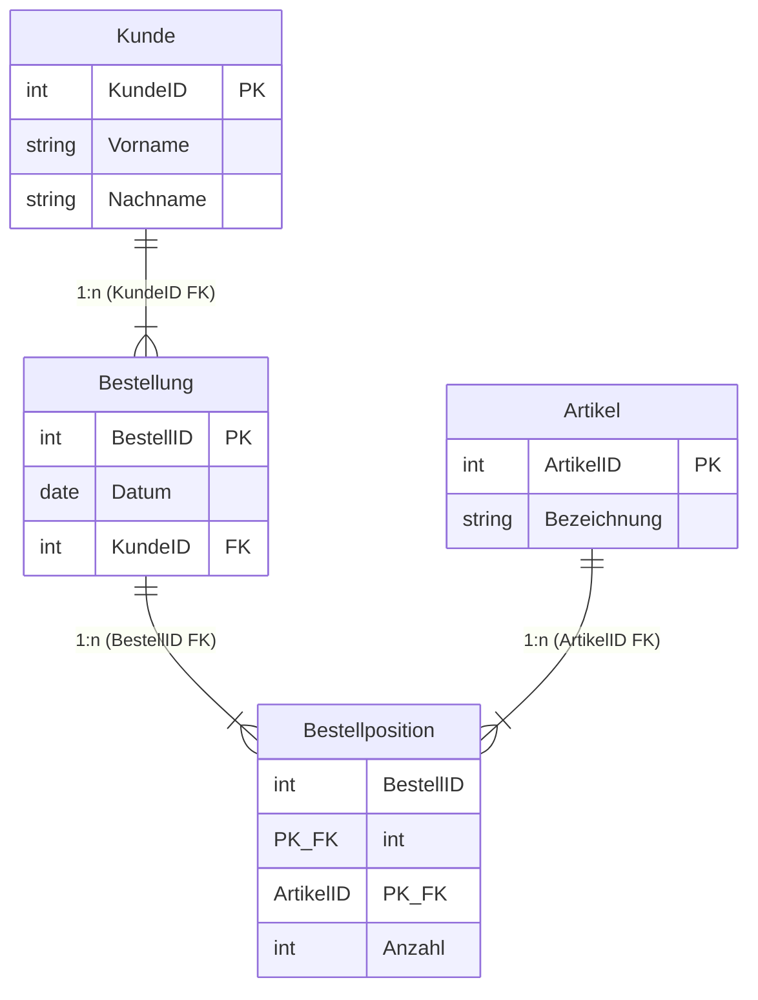

# 📅 Day_08: Probeklausur "Datenbanken und SQL – Teil 1"

> [!IMPORTANT]
> **Prüfungsvorbereitung & Musterlösung**
> Dieses Dokument enthält die vollständige, minutiöse Ausarbeitung und Musterlösung zur offiziellen **Probeklausur "Datenbanken und SQL – Teil 1"** vom **12.08.2026**. Alle Aufgaben aus der originalen Klausur-PDF ([Probe-Klausur_Datenbabken_und_SQL_Teil1_20260812.pdf](./assets/Probe-Klausur_Datenbabken_und_SQL_Teil1_20260812.pdf)) wurden Punkt für Punkt analysiert, didaktisch aufbereitet und mit Diagrammen (Mermaid), Tabellen, mathematischen/theoretischen Herleitungen sowie lauffähigem T-SQL-Code versehen.

---

## ℹ️ Kurs- & Klausur-Überblick

* **Datum der Klausur:** Mittwoch, 12.08.2026
* **Zeitvorgabe:** 90 Minuten
* **Gesamtpunktzahl:** 100 Punkte (Bestehensgrenze: 50 Punkte)
* **Dozent:** Tom Selig (BITLC)
* **Autor:** Tobias Boyke
* **Zielgruppe:** Fachinformatiker / Anwendungsentwicklung & Daten- und Prozessanalyse (IHK-Ausbildung)

### 📊 Übersicht der Prüfungsteile

| Teil | Bezeichnung | Punkte | Themengebiete | Status |
| :--- | :--- | :---: | :--- | :---: |
| **Teil 1** | **Datenbank-Grundlagen** | 20 P | Datenbankmodelle, NoSQL, Schlüssel, Normalisierung, Mengentheorie, Indizes, Locks, DDL-Befehle |  100% |
| **Teil 2** | **Entity-Relationship-Modell** | 30 P | Konzeptionelle ER-Modellierung (Wein-Händler 20P, Agentur 10P) mit Chen-Notation & Kardinalitäten |  100% |
| **Teil 3** | **Tabellenmodell & Normalisierung** | 30 P | ER-zu-3NF-Transformation, 1NF-Anomalieanalyse & Schlüsselproblematik, 2NF $\to$ 3NF Dekomposition |  100% |
| **Teil 4** | **SQL-Statements (DDL & DML)** | 20 P | T-SQL Tabellenerstellung (`IDENTITY(100,1)`, PK, FK), `INSERT`, `UPDATE`, `DELETE` mit `BETWEEN` |  100% |
| **Gesamt** | **Klausur-Ergebnis** | **100 P** | **Vollständige Abdeckung aller 4 Teile** |  **Bereit** |

---

## 📘 Teil 1: Datenbank-Grundlagen (20 Punkte)

---

### 📝 Aufgabe 1: Datenbankmodelle-Klassifizierung (4 Punkte)

**Aufgabenstellung:**
*Entscheiden Sie, ob die folgenden Datenbankmodelle den klassischen oder den NoSQL-Modellen zugerechnet werden:*

| Datenbankmodell | Klassisch | NoSQL |
| :--- | :---: | :---: |
| **Dokument-Datenbank** | $\square$ | $\blacksquare$ |
| **Relationale Datenbank** | $\blacksquare$ | $\square$ |
| **Graph-Datenbank** | $\square$ | $\blacksquare$ |
| **Hierarchische Datenbank** | $\blacksquare$ | $\square$ |

<details>
<summary>🔍 <b>Ausführliche Erklärung & Modellvergleich</b></summary>

1. **Dokument-Datenbank $\to$ NoSQL:**
   * *Charakteristik:* Speichert Daten in flexiblen, semi-strukturierten Dokumenten (z. B. JSON, BSON oder XML) statt in starren Zeilen und Spalten.
   * *Beispiele:* MongoDB, CouchDB.
2. **Relationale Datenbank $\to$ Klassisch:**
   * *Charakteristik:* Basiert auf dem von Edgar F. Codd (1970) entwickelten Relationenmodell. Daten werden in streng typisierten Tabellen mit Primär- und Fremdschlüsseln strukturiert. Abfragesprache ist SQL.
   * *Beispiele:* Microsoft SQL Server, PostgreSQL, MySQL, Oracle.
3. **Graph-Datenbank $\to$ NoSQL:**
   * *Charakteristik:* Verwendet Graphstrukturen mit Knoten (Nodes), Kanten (Edges) und Eigenschaften (Properties) zur Darstellung und Abfrage von hochgradig vernetzten Daten.
   * *Beispiele:* Neo4j, Amazon Neptune.
4. **Hierarchische Datenbank $\to$ Klassisch:**
   * *Charakteristik:* Gehört zu den historischen, klassischen Datenbankmodellen der 1960er Jahre. Daten sind in einer stammbaumartigen Baumstruktur organisiert, bei der ein Kindelement exakt ein Elternelement besitzt (1:N-Hierarchie).
   * *Beispiel:* IBM IMS (Information Management System).

> [!NOTE]
> Die vier Hauptkategorien der **NoSQL-Datenbanken** ("Not Only SQL") sind:
> 1. Key-Value Stores (z. B. Redis)
> 2. Document Stores (z. B. MongoDB)
> 3. Column-Family Stores (z. B. Apache Cassandra)
> 4. Graph Databases (z. B. Neo4j)
</details>

---

### 📝 Aufgabe 2: Begriff „NoSQL“ (2 Punkte)

**Aufgabenstellung:**
*Was fasst man unter dem Begriff „NoSQL“ zusammen?*

* $\square$ Alle Datenbankmodelle, die SQL als Abfragesprache nutzen.
* $\square$ Alle Datenbankmodelle, die nicht SQL als Abfragesprache nutzen.
* $\blacksquare$ **Moderne Datenbankmodelle, welche die etablierten Modelle ergänzen sollen.**
* $\square$ Klassische Datenbankmodelle, die vor der Einführung von SQL entstanden sind.

<details>
<summary>🔍 <b>Fachliche Begründung & Abgrenzung</b></summary>

Der Begriff **NoSQL** stand ursprünglich für *"No SQL"* (Nicht-SQL), wird aber im modernen Datenbank-Engineering einheitlich als **"Not Only SQL"** interpretiert.

* **Warum ist Option 3 richtig?** NoSQL-Datenbanken wurden entwickelt, um spezifische Einschränkungen relationaler Datenbanken (RDBMS) bei extrem großen Datenmengen (*Big Data*), hoher Schreib-/Leseleistung, unstrukturierten/variablen Datenstrukturen und horizontaler Skalierbarkeit über verteilte Systeme zu adressieren. Sie ersetzen relationale Datenbanken nicht flächendeckend, sondern **ergänzen** diese in hybriden Systemarchitekturen (*Polyglot Persistence*).
* **Warum sind die anderen Optionen falsch?**
  * *Option 1:* Falsch, da NoSQL-Systeme in der Regel nicht primär auf dem klassischen SQL-Standard beruhen (auch wenn viele heute SQL-ähnliche Dialekte wie CQL oder N1QL bieten).
  * *Option 2:* Zu eng gegriffen und historisch überholt; es geht nicht bloß um die Abfragesprache, sondern um das Architekturparadigma (z. B. Verzicht auf strikte ACID-Garantien zugunsten von BASE / Eventual Consistency).
  * *Option 4:* Falsch, da NoSQL-Systeme moderne Entwicklungen des 21. Jahrhunderts sind.

> [!TIP]
> **CAP-Theorem nach Eric Brewer:** NoSQL-Systeme lockern oft die Konsistenz (*Consistency*) im Sinne von ACID zugunsten von Verfügbarkeit (*Availability*) und Ausfallsicherheit bei Netzwerkpartitionen (*Partition Tolerance*) auf.
</details>

---

### 📝 Aufgabe 3: Schlüssel in Datenbanken (2 Punkte)

**Aufgabenstellung:**
*Welche Aussage zu Schlüsseln in einer Datenbank ist richtig?*

* $\square$ Der Primärschlüssel ermöglicht den Zugriff auf Tabellen aus einer anderen Datenbank.
* $\square$ Ein künstlicher Schlüssel ist ein Attribut, das in den Daten auf natürliche Weise vorkommt und für jeden Datensatz eindeutig ist.
* $\blacksquare$ **Der Primärschlüssel identifiziert einen Datensatz in einer Tabelle eindeutig.**
* $\square$ Der Primärschlüssel verschlüsselt die Daten einer Tabelle asymmetrisch, der Fremdschlüssel kann sie wieder entschlüsseln.

<details>
<summary>🔍 <b>Detaillierte Analyse der Antworten</b></summary>

* $\blacksquare$ **Richtig (Option 3):** Ein **Primärschlüssel (Primary Key, PK)** ist ein Attribut oder eine minimale Attributkombination, die jede Zeile (jeden Datensatz) innerhalb einer Relation/Tabelle eindeutig und unzweifelhaft identifiziert. Er unterliegt der Bedingung der Eindeutigkeit (`UNIQUE`) und darf niemals `NULL`-Werte enthalten (`NOT NULL`).
* **Analyse der falschen Optionen:**
  * *Option 1:* Der Zugriff auf Tabellen anderer Datenbanken erfolgt über *Linked Server*, *Database Cross-Queries* oder Verbindungszeichenfolgen, nicht durch einen Primärschlüssel.
  * *Option 2:* Dies beschreibt einen **natürlichen Schlüssel (Natural Key)** (z. B. die Steuer-ID oder eine IBAN). Ein **künstlicher Schlüssel (Surrogatschlüssel / Surrogate Key)** hingegen ist ein synthetisch von der Datenbank generiertes Attribut ohne fachliche Eigenbedeutung (z. B. `IDENTITY`-Spalten wie `KundenID = 101`).
  * *Option 4:* Verwechselt den Begriff *Schlüssel* aus der relationalen Datenbanktheorie mit *Schlüsseln* aus der Kryptographie (Asymmetrische Verschlüsselung mit Public/Private Key).

> [!IMPORTANT]
> **Eigenschaften eines gültigen Primärschlüssels:**
> 1. **Eindeutigkeit (Uniqueness):** Keine zwei Zeilen dürfen denselben PK-Wert besitzen.
> 2. **Minimalität:** Keine Komponente des Schlüsselattributs kann weggelassen werden, ohne die Eindeutigkeit zu verlieren.
> 3. **Non-Null-Constraint:** Ein PK darf in keiner Spalte `NULL` sein.
> 4. **Invarianz:** Der Wert eines Primärschlüssels sollte sich über die Lebensdauer des Datensatzes möglichst nie ändern.
</details>

---

### 📝 Aufgabe 4: Normalisierung & Integrität (2 Punkte)

**Aufgabenstellung:**
*Der Vorgang, bei dem Daten so organisiert werden, dass Redundanzen vermieden und die Datenintegrität verbessert wird, wird bezeichnet als:*

* $\square$ Minimalisierung
* $\square$ Serialisierung
* $\blacksquare$ **Normalisierung**
* $\square$ Summierung

<details>
<summary>🔍 <b>Hintergrundwissen zur Normalisierung</b></summary>

Die **Normalisierung** bezeichnet den schrittweisen Prozess in der relationalen Datenbankentwicklung, bei dem ein relatives Schema anhand funktionaler Abhängigkeiten in eine Reihe von Formaten – den sogenannten **Normalformen (1NF bis 5NF / BCNF)** – überführt wird.

**Ziele der Normalisierung:**
1. **Redundanzvermeidung:** Daten werden an genau einer Stelle gespeichert (*Single Source of Truth*). Speicherplatz wird minimiert.
2. **Vermeidung von Datenanomalien:** Eliminierung von Einfüge-, Änderungs- (Update-) und Lösch-Anomalien.
3. **Sicherung der Datenintegrität:** Sicherstellung konsistenter Datenzustände bei allen DML-Operationen.
</details>

---

### 📝 Aufgabe 5: Mengentheoretische Aussagen (2 Punkte)

**Aufgabenstellung:**
*Welche Aussage zu Mengen ist **falsch**?*

* $\square$ Eine Menge wird stets als Ganzes betrachtet.
* $\square$ Es gibt keine Dubletten in einer Menge.
* $\square$ Die Elemente einer Menge haben keine Reihenfolge.
* $\blacksquare$ **In einer Menge muss mindestens ein Element enthalten sein.** *(Falsche Aussage!)*

<details>
<summary>🔍 <b>Mathematische Herleitung (Cantorsche Mengenlehre)</b></summary>

In der mathematischen Mengenlehre nach Georg Cantor – worauf die Relationale Algebra und die SQL-Sprachdefinition basieren – gilt:

1. **Definition der Leeren Menge:** Es existiert exakt eine Menge, die **keine Elemente** enthält: die **leere Menge** (Symbol $\emptyset$ oder $\{\}$). Sie besitzt die Mächtigkeit (Kardinalität) $|\emptyset| = 0$. Daher ist die Behauptung, eine Menge müsse *mindestens ein Element* enthalten, **falsch**.
2. **Eigenschaften von Mengen:**
   * **Ungeordnetheit:** $\{A, B, C\} = \{C, A, B\}$. Die Reihenfolge spielt keine Rolle.
   * **Eindeutigkeit (Dublettenfreiheit):** $\{A, A, B\} = \{A, B\}$. Mehrfaches Aufführen desselben Elements ändert die Menge nicht.
   * **Ganzheitlichkeit:** Eine Menge fasst wohlunterscheidbare Objekte zu einem Ganzen zusammen.

> [!WARNING]
> **Unterschied zwischen Mengenlehre und SQL Multi-Sets (Bags):**
> In der reinen Mengenlehre gibt es keine Duplikate. Eine SQL-Tabelle ohne `UNIQUE`- oder `PRIMARY KEY`-Constraint erlaubt jedoch doppelte Zeilen (Multiset / Bag). Erst durch die Angabe von `DISTINCT` verhält sich eine SQL-Abfrage strikt mengentheoretisch!
</details>

---

### 📝 Aufgabe 6: Automatische Identitätsspalte (2 Punkte)

**Aufgabenstellung:**
*Wie nennt man eine Spalte in einer Tabelle, die automatisch numerische Werte generiert?*

* $\square$ Unique-Spalte
* $\square$ Integer-Spalte
* $\blacksquare$ **Identity-Spalte**
* $\square$ Kandidaten-Spalte

<details>
<summary>🔍 <b>Technische Details in T-SQL (MS SQL Server)</b></summary>

Im Microsoft SQL Server bezeichnet man Spalten mit automatischer Zahlenfortschreibung als **IDENTITY-Spalten**.

```sql
-- Syntax im SQL Server:
CREATE TABLE Beispiel (
    ID INT IDENTITY(1, 1) PRIMARY KEY, -- Startwert (Seed) = 1, Inkrement = 1
    Bezeichnung NVARCHAR(100)
);
```

* **Unique-Spalte:** Erzwingt Eindeutigkeit über einen `UNIQUE`-Constraint, generiert aber keine automatischen Werte.
* **Integer-Spalte:** Beschreibt nur den Datentyp (`INT`, `BIGINT`, `SMALLINT`), nicht das Verhalten der Automatenerzeugung.
* **Kandidaten-Spalte (Schlüsselkandidat):** Ein fachlicher Begriff für jedes Spaltenensemble, das als Primärschlüssel infrage käme.
</details>

---

### 📝 Aufgabe 7: Verwendungszweck von Indizes (2 Punkte)

**Aufgabenstellung:**
*Wozu werden Indizes genutzt?*

* $\blacksquare$ **Indizes beschleunigen Datenabfragen.**
* $\square$ Indizes speichern sehr große Mengen von Integer- oder String-Werten.
* $\square$ Indizes minimieren Daten-Redundanz.
* $\square$ Indizes verschlüsseln sensible Daten in einer Tabelle.

<details>
<summary>🔍 <b>Funktionsweise & Kompromisse von Indizes</b></summary>

Ein **Index** in einer relationalen Datenbank ist eine zusätzliche Datenstruktur (meist ein balancierter Baum / B-Tree), die Verweise auf die Speicherorte der Zeilen enthält.

* **Vorteil (`SELECT`):** Durch den Index muss die Datenbank bei einer Abfrage nicht die gesamte Tabelle zeilenweise durchsuchen (*Full Table Scan* / *Clustered Index Scan*), sondern kann in logarithmischer Zeit $O(\log n)$ gezielt auf die gesuchten Datensätze zugreifen (*Index Seek*).
* **Nachteil (`INSERT`, `UPDATE`, `DELETE`):** Bei jeder Schreiboperation muss nicht nur die Datenseite, sondern auch der Indexbaum gepflegt werden. Zu viele Indizes verlangsamen Schreibzugriffe!
</details>

---

### 📝 Aufgabe 8: Sperrtypen (Locks) im SQL Server (2 Punkte)

**Aufgabenstellung:**
*Welche Art von Sperre (Lock) gibt es im SQL Server **nicht**?*

* $\square$ Shared Lock
* $\square$ Exclusive Lock
* $\blacksquare$ **Priority Lock** *(Existiert NICHT!)*
* $\square$ Update Lock

<details>
<summary>🔍 <b>Die wichtigsten Lock-Arten im SQL Server</b></summary>

| Lock-Typ | Bezeichnung | Verwendungszweck |
| :--- | :--- | :--- |
| **Shared Lock (S)** | Geteilte Sperre | Wird bei Leseoperationen (`SELECT`) verwendet. Mehrere Transaktionen können gleichzeitig Shared Locks halten. |
| **Exclusive Lock (X)** | Exklusive Sperre | Wird bei Schreiboperationen (`INSERT`, `UPDATE`, `DELETE`) verwendet. Verhindert jegliche andere Zugriffe. |
| **Update Lock (U)** | Aktualisierungssperre | Wird vor dem Umwandeln in ein Exclusive Lock genutzt, um Deadlocks bei gleichzeitigen Updates zu vermeiden. |
| **Intent Lock (IS / IX)** | Absichtssperre | Signalisiert auf höherer Hierarchieebene (z. B. Tabelle), dass auf unterer Ebene (z. B. Zeile) Locks existieren. |
| **Priority Lock** | *Existiert nicht* | Ein Begriff aus der Prozess-Planung (CPU-Scheduling), nicht im Lock-Manager des SQL Servers. |
</details>

---

### 📝 Aufgabe 9: Befehl zur Datenbankerstellung (2 Punkte)

**Aufgabenstellung:**
*Mit welchem SQL-Befehl wird eine neue Datenbank erstellt?*

* $\square$ ADD DATABASE
* $\blacksquare$ **CREATE DATABASE**
* $\square$ NEW DATABASE
* $\square$ USE DATABASE

<details>
<summary>🔍 <b>SQL DDL-Syntax</b></summary>

Der ANSI-SQL Standardbefehl lautet:
```sql
CREATE DATABASE MeinShopDB;
GO
```
* `USE MeinShopDB;` wechselt den aktuellen Datenbank-Kontext.
* `ADD DATABASE` und `NEW DATABASE` sind keine gültigen SQL-Kommandos.
</details>

---

## 🎨 Teil 2: Entity-Relationship-Modell (30 Punkte)

---

### 📝 Aufgabe 1: ER-Modell „Wein-Händler“ (20 Punkte)

#### Sachverhalt & Anforderungen:
1. Jeder **Wein** kann nur von genau einem **Weingut** bestellt werden.
2. Ein **Wein** kann aus einer oder mehreren **Rebsorten** bestehen. Ebenso kann eine **Rebsorte** zur Herstellung verschiedener **Weine** verwendet werden.
3. Der prozentuale **Anteil** einer Rebsorte an einem Wein muss gespeichert werden.
4. Ein **Weingut** ist genau einer **Region** und eine Region genau einem **Land** zugeordnet.
5. Jeder **Wein** ist von einem **Typ** (z. B. Weißwein, Rotwein) und von einer bestimmten **Art** (z. B. trocken, lieblich). Typ und Art sollen jeweils als eigene Entitätstypen dargestellt werden.

#### Analyse & Modellierungs-Entscheidungen:
* **Entitätstypen:** `Land`, `Region`, `Weingut`, `Wein`, `Rebsorte`, `Typ`, `Art`.
* **Beziehungen & Kardinalitäten (Chen-Notation):**
  * `Land` (1) $\longleftrightarrow$ `Region` (N) [1:N]
  * `Region` (1) $\longleftrightarrow$ `Weingut` (N) [1:N]
  * `Weingut` (1) $\longleftrightarrow$ `Wein` (N) [1:N]
  * `Typ` (1) $\longleftrightarrow$ `Wein` (N) [1:N]
  * `Art` (1) $\longleftrightarrow$ `Wein` (N) [1:N]
  * `Wein` (N) $\longleftrightarrow$ `Rebsorte` (M) [N:M]
* **Beziehungsattribut `Anteil`:** Da eine Rebsorte in unterschiedlichen Weinen mit unterschiedlichen Prozentsätzen enthalten sein kann (z. B. 60% Merlot in Wein A, 40% Merlot in Wein B), ist `Anteil` ein **Beziehungsattribut** der N:M-Verbindung `besteht_aus` zwischen `Wein` und `Rebsorte`!

#### 📊 ER-Diagramm (Mermaid Chen- / Crow's Foot-Notation)



#### 📋 Zuordnungstabelle der Chen-Notation

| Entität / Beziehung | Partner-Entität | Kardinalität (Chen) | Kardinalität (Min..Max) | Erläuterung |
| :--- | :--- | :---: | :---: | :--- |
| **Land $\to$ Region** | Region | **1 : N** | (1,1) : (1,n) | Eine Region gehört zu genau einem Land. In einem Land liegen 1..n Regionen. |
| **Region $\to$ Weingut** | Weingut | **1 : N** | (1,1) : (0,n) | Ein Weingut liegt in genau einer Region. In einer Region können 0..n Weingüter liegen. |
| **Weingut $\to$ Wein** | Wein | **1 : N** | (1,1) : (0,n) | Ein Wein wird von genau einem Weingut bestellt/geliefert. |
| **Typ $\to$ Wein** | Wein | **1 : N** | (1,1) : (0,n) | Ein Wein hat genau einen Typ (z. B. Rotwein). |
| **Art $\to$ Wein** | Wein | **1 : N** | (1,1) : (0,n) | Ein Wein hat genau eine Art (z. B. trocken). |
| **Wein $\leftrightarrow$ Rebsorte** | Rebsorte | **N : M** | (1,n) : (1,m) | Ein Wein besteht aus 1..n Rebsorten. Eine Rebsorte wird in 1..m Weinen genutzt. |
| *Attribut: Anteil* | *besteht_aus* | - | - | **Muss direkt an die Beziehung `besteht_aus` gezeichnet werden!** |

---

### 📝 Aufgabe 2: ER-Modell „Agentur / Mitarbeiter & Projekte“ (10 Punkte)

#### Sachverhalt & Anforderungen:
1. Ein **Mitarbeiter** kann an mehreren **Projekten** arbeiten und an einem Projekt können auch mehrere Mitarbeiter arbeiten. Der Zeitraum (**Startdatum**, **Enddatum**), in dem die Mitarbeiter an dem Projekt arbeiten, soll gespeichert werden.
2. Zusätzlich wird jedes **Projekt** von genau einem **Mitarbeiter** geleitet. Ein Mitarbeiter kann aber durchaus mehrere Projekte leiten.
3. Jeder **Mitarbeiter** hat genau einen anderen Mitarbeiter als seinen **Vorgesetzten**. Ein Mitarbeiter kann aber der Vorgesetzte von mehreren anderen Mitarbeitern sein.

#### Analyse der drei Beziehungen:
1. **Verbindung `arbeitet_an` (N:M):** Zwischen `Mitarbeiter` und `Projekt`. Enthält die Attribute `Startdatum` und `Enddatum`.
2. **Verbindung `leitet` (1:N):** Eine zweite, separate Beziehung zwischen `Mitarbeiter` und `Projekt`.
3. **Verbindung `ist_vorgesetzter_von` (1:N rekursiv / reflexiv):** Eine Selbstreferenz an der Entität `Mitarbeiter` (1 Vorgesetzter leitet N Mitarbeiter; jeder Mitarbeiter hat (0,1) Vorgesetzte).

#### 📊 ER-Diagramm (Agentur)



#### 📋 Beziehungs-Details

| Beziehungsname | Beteiligte Entitäten | Typ | Kardinalität | Attribute an der Beziehung |
| :--- | :--- | :---: | :---: | :--- |
| **arbeitet_an** | Mitarbeiter $\leftrightarrow$ Projekt | N:M | $(1,n) : (1,m)$ | `Startdatum`, `Enddatum` |
| **leitet** | Mitarbeiter $\to$ Projekt | 1:N | $(0,n) : (1,1)$ | *keine* |
| **ist_vorgesetzter_von** | Mitarbeiter $\to$ Mitarbeiter | 1:N (rekursiv) | $(0,n) : (0,1)$ | *keine* |

---

## 📐 Teil 3: Tabellenmodell & Normalisierung (30 Punkte)

---

### 📝 Aufgabe 1: ER-Modell Online-Shop in 3NF Tabellenmodell umwandeln (10 Punkte)

#### Gegebenes ER-Modell aus der Aufgabenstellung:
* Entität `Kunde` (`KundeID` PK, `Vorname`, `Nachname`)
* 1:N-Beziehung `hat` zu Entität `Bestellung` (`BestellID` PK, `Datum`)
* N:M-Beziehung `hat` mit Attribut `Anzahl` zu Entität `Artikel` (`ArtikelID` PK, `Bezeichnung`)

#### Überführung in das relational-logische Tabellenmodell (3NF):
1. **Regel 1:N-Beziehung:** Der Primärschlüssel der 1-Seite (`Kunde.KundeID`) wird als Fremdschlüssel `KundeID` [FK] in die N-Tabelle `Bestellung` übernommen.
2. **Regel N:M-Beziehung:** Die N:M-Beziehung wird in eine eigenständige **Koppeltabelle** (z. B. `Bestellposition`) aufgespalten.
   * Der Primärschlüssel der Koppeltabelle setzt sich zusammen aus `BestellID` [PK, FK] und `ArtikelID` [PK, FK].
   * Das Beziehungsattribut `Anzahl` wird als normale Spalte in die Koppeltabelle aufgenommen.

#### 📋 Relationales Tabellenschema (3NF)

* **Tabelle: `Kunde`**
  * `KundeID` **[PK]**
  * `Vorname`
  * `Nachname`
* **Tabelle: `Bestellung`**
  * `BestellID` **[PK]**
  * `Datum`
  * `KundeID` **[FK]** *(verweist auf `Kunde.KundeID`)*
* **Tabelle: `Artikel`**
  * `ArtikelID` **[PK]**
  * `Bezeichnung`
* **Tabelle: `Bestellposition`** *(Koppeltabelle)*
  * `BestellID` **[PK, FK]** *(verweist auf `Bestellung.BestellID`)*
  * `ArtikelID` **[PK, FK]** *(verweist auf `Artikel.ArtikelID`)*
  * `Anzahl`



---

### 📝 Aufgabe 2: Unnormalisierte Tabelle & 1NF-Analyse (9 Punkte)

#### Gegebene Beispieltabelle:

| BestNr [PK] | KundenNr | Name | BestDatum | Position | Artikel |
| :---: | :---: | :--- | :---: | :--- | :--- |
| **1** | 123 | Hans Wurst | 11.10.2021 | 1.<br>2. | 1 x Laptop (ID 4711)<br>2 x Bildschirm (ID 8698) |
| **2** | 789 | Max Mustermann | 14.10.2021 | 1.<br>2.<br>3. | 2 x PC (ID 1234)<br>4 x Bildschirm (ID 8698)<br>2 x Tastatur (ID 11) |
| **3** | 555 | Donald Duck | 20.10.2021 | 1.<br>2. | 1 x Laptop (ID 4711)<br>1 x Bildschirm (ID 8698) |

---

#### a) Nennen Sie drei Spalten, die der 1. Normalform (1NF) widersprechen (3 Punkte):

1. **Spalte `Position`:** Enthält Aufzählungen/Wiederholungsgruppen (mehrere Werte pro Zelle).
2. **Spalte `Artikel`:** Enthält zusammengesetzte, nicht-atomare Werte (Menge, Artikelbezeichnung und Artikel-ID in einem Textfeld vereinigt).
3. **Spalte `Name`:** Enthält zusammengesetzte Daten (Vor- und Nachname stehen gemeinsam in einer Spalte).

> [!NOTE]
> **Definition der 1. Normalform (1NF):** Eine Tabelle befindet sich in der 1NF, wenn alle Attribute **atomar** (nicht weiter aufspaltbar) sind und keine Wiederholungsgruppen oder mehrwertige Attribute vorliegen.

---

#### b) Problemstellung & Lösung des Primärschlüssels bei Überführung in 1NF (6 Punkte):

* **Das Problem (3 Punkte):**
  Wenn die Mehrfachwerte/Wiederholungsgruppen in der Spalte `Artikel` atomisiert werden (d. h. für jede gekaufte Position wird eine eigene Zeile angelegt), entsteht Redundanz bei der Spalte `BestNr`. Die Spalte `BestNr` ist dann **nicht mehr eindeutig** (z. B. existiert `BestNr = 1` nun zweimal für Position 1 und 2). Sie verliert ihre Eigenschaft als Primärschlüssel!
* **Die Lösung (3 Punkte):**
  1. **Ansatz 1 (Zusammengesetzter Primärschlüssel):** Bildung eines zusammengesetzten Primärschlüssels aus `(BestNr, Position)` oder `(BestNr, ArtikelID)`.
  2. **Ansatz 2 (Dekomposition / Aufspaltung):** Trennung der Tabelle in eine Kopfdaten-Tabelle (`Bestellung` mit PK `BestNr`) und eine Positionen-Tabelle (`Bestellposition` mit PK `BestellpositionID` oder Verbundschlüssel `BestNr + Position`).

---

### 📝 Aufgabe 3: 2NF zu 3NF Überführung (11 Punkte)

#### Gegebene Tabelle (bereits in 2NF):

| BestNr [PK] | BestDatum | GesamtWert | KundenNr | KundeVorname | KundeName |
| :---: | :---: | :---: | :---: | :--- | :--- |
| **1** | 01.10.2010 | 199,90 | 1357 | Marla | Müller |
| **2** | 01.10.2010 | 87,50 | 6248 | Max | Mustermann |
| **3** | 05.11.2010 | 17,10 | 1357 | Marla | Müller |
| **4** | 06.11.2010 | 245,80 | 6248 | Max | Mustermann |
| **5** | 10.10.2010 | 810,00 | 9911 | Gundel | Gaukeley |

---

#### a) Nennen Sie die beiden Spalten, die der 3. Normalform widersprechen (2 Punkte):

1. **`KundeVorname`**
2. **`KundeName`**

---

#### b) Beschreiben Sie, warum diese Spalten der 3. Normalform widersprechen (4 Punkte):

Die 3. Normalform fordert, dass kein Nicht-Schlüsselattribut **transitiv** von einem Schlüsselattribut abhängt.
* In dieser Tabelle ist `BestNr` der Primärschlüssel.
* `KundenNr` bestimmt funktional die Werte von `KundeVorname` und `KundeName` ($KundenNr \to KundeVorname, KundeName$).
* Da `KundenNr` jedoch kein Primärschlüssel der Tabelle ist, liegt eine **transitive Abhängigkeit** vor:
  $$\text{BestNr [PK]} \longrightarrow \text{KundenNr} \longrightarrow (\text{KundeVorname, KundeName})$$
* Dies führt zu Redundanz (z. B. Marla Müller wird bei jeder Bestellung erneut gespeichert) und Änderungsanomalien.

---

#### c) Vorgehensweise zur Überführung in die 3. Normalform (5 Punkte):

1. **Auslagerung der Kundendaten:** Wir erstellen eine neue Tabelle **`Kunde`**.
   * Spalten: `KundenNr` **[PK]**, `KundeVorname`, `KundeName`.
2. **Bereinigung der Bestellungstabelle:** Die transitiven Attribute `KundeVorname` und `KundeName` werden aus der Tabelle **`Bestellung`** entfernt.
3. **Verknüpfung beibehalten:** Die Spalte `KundenNr` bleibt in der Tabelle `Bestellung` als **Fremdschlüssel [FK]** erhalten.

#### 📋 Ergebnisstruktur in 3NF:

**Tabelle `Kunde`:**
| KundenNr [PK] | KundeVorname | KundeName |
| :---: | :--- | :--- |
| 1357 | Marla | Müller |
| 6248 | Max | Mustermann |
| 9911 | Gundel | Gaukeley |

**Tabelle `Bestellung`:**
| BestNr [PK] | BestDatum | GesamtWert | KundenNr [FK] |
| :---: | :---: | :---: | :---: |
| 1 | 01.10.2010 | 199,90 | 1357 |
| 2 | 01.10.2010 | 87,50 | 6248 |
| 3 | 05.11.2010 | 17,10 | 1357 |
| 4 | 06.11.2010 | 245,80 | 6248 |
| 5 | 10.10.2010 | 810,00 | 9911 |

---

## 💻 Teil 4: SQL-Statements – DDL und DML (20 Punkte)

---

### 📝 Aufgabe 1: DDL – Erstellung der Tabelle `Kunde` (7 Punkte)

#### Gegebenes Relationales Modell aus der Klausur:

```
+------------------+             +------------------+
|      Kunde       |             |  Ansprechpartner |
+------------------+             +------------------+
| KundenNr    (PK) | 1         n | ID          (PK) |
| Vorname          |<------------| Vorname          |
| Nachname         |             | Nachname         |
| Telefon          |             | Telefon          |
| Geburtsdatum     |             | Email            |
| AP_ID       (FK) |             +------------------+
+------------------+
```

#### T-SQL DDL Codeblock:

```sql
-- Erstellung der Elterntabelle Ansprechpartner (Voraussetzung für Foreign Key)
CREATE TABLE dbo.Ansprechpartner (
    ID INT CONSTRAINT PK_Ansprechpartner PRIMARY KEY,
    Vorname NVARCHAR(50) NULL,
    Nachname NVARCHAR(50) NULL,
    Telefon VARCHAR(30) NULL,
    Email VARCHAR(100) NULL
);
GO

-- Erstellung der Zieltabelle Kunde (Aufgabe 1)
CREATE TABLE dbo.Kunde (
    KundenNr INT IDENTITY(100, 1) CONSTRAINT PK_Kunde PRIMARY KEY,
    Vorname NVARCHAR(50) NULL,
    Nachname NVARCHAR(50) NULL,
    Telefon VARCHAR(30) NULL,
    Geburtsdatum DATE NULL,
    AP_ID INT CONSTRAINT FK_Kunde_Ansprechpartner REFERENCES dbo.Ansprechpartner(ID)
);
GO
```

<details>
<summary>🔍 <b>Erklärung der Schlüsselkomponenten</b></summary>

* `IDENTITY(100, 1)`: Erfüllt die Klausuranforderung, dass `KundenNr` bei 100 beginnt (`Seed = 100`) und automatisch um 1 hochgezählt wird (`Increment = 1`).
* `CONSTRAINT PK_Kunde PRIMARY KEY`: Stellt sicher, dass `KundenNr` als Primärschlüssel dient.
* `CONSTRAINT FK_Kunde_Ansprechpartner REFERENCES dbo.Ansprechpartner(ID)`: Erstellt den Fremdschlüssel `AP_ID` mit Referenz auf die ID-Spalte der Tabelle `Ansprechpartner`.
</details>

---

### 📝 Aufgabe 2: DML – `INSERT` Maria Müller (5 Punkte)

**Anforderung:** Datensatz für die Kundin Maria Müller einfügen. Zugeordneter Ansprechpartner hat ID 42. Weitere Informationen liegen noch nicht vor.

```sql
INSERT INTO dbo.Kunde (Vorname, Nachname, AP_ID)
VALUES ('Maria', 'Müller', 42);
GO
```

> [!TIP]
> Die Spalte `KundenNr` wird aufgrund der `IDENTITY(100,1)`-Eigenschaft von der Datenbank automatisch generiert und darf im `INSERT`-Befehl nicht angegeben werden. Die Spalten `Telefon` und `Geburtsdatum` bleiben automatisch `NULL`.

---

### 📝 Aufgabe 3: DML – `UPDATE` Telefon & Geburtsdatum (4 Punkte)

**Anforderung:** Bei Frau Müller (KundenNr 1234) die Telefonnummer `0123/987654-321` und das Geburtsdatum `1. Februar 1975` ergänzen.

```sql
UPDATE dbo.Kunde
SET
    Telefon = '0123/987654-321',
    Geburtsdatum = '1975-02-01'
WHERE KundenNr = 1234;
GO
```

---

### 📝 Aufgabe 4: DML – `DELETE` Ansprechpartner 1 bis 99 (4 Punkte)

**Anforderung:** Alle Ansprechpartner löschen, die eine ID im Bereich von 1 bis 99 haben.

```sql
DELETE FROM dbo.Ansprechpartner
WHERE ID BETWEEN 1 AND 99;
GO
```

*Alternative mit Vergleichsoperatoren:*
```sql
DELETE FROM dbo.Ansprechpartner
WHERE ID >= 1 AND ID <= 99;
GO
```

---

## 🔗 Ausführbare Musterlösung

Die vollständigen, direkt ausführbaren SQL-Skripte befinden sich in der Quelldatei:
👉 **[probeklausur_loesung.sql](./src/probeklausur_loesung.sql)**

---

## 🎯 Zusammenfassung für die Klausur am Freitag (Day 10)

1. **Teil 1 (Theorie):** Begriffe wie *Identity*, *Index*, *Locks*, *NoSQL-Kategorien* und *Mengen-Eigenschaften ($\emptyset$)* präzise lernen.
2. **Teil 2 (ERM):** Bei N:M-Beziehungen genau prüfen, ob Beziehungsattribute (wie `Anteil` oder `Startdatum/Enddatum`) existieren und diese im Diagramm an die Raute zeichnen.
3. **Teil 3 (Normalisierung):**
   * 1NF: Atomarität prüfen, Wiederholungsgruppen identifizieren, Verbundschlüssel beachten.
   * 3NF: Transitive Abhängigkeiten ($PK \to FK \to Attributes$) strikt herauslösen und neue Entität anlegen.
4. **Teil 4 (SQL):** Syntax für `IDENTITY(Start, Schrittweite)` und `FOREIGN KEY` fehlerfrei beherrschen.