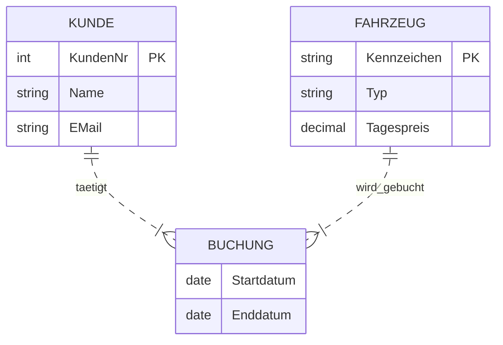

# 📅 Day_08: Probeklausur & Prüfungsvorbereitung (Klausur 1)

## ℹ️ Kurs-Informationen
*   **Datum:** Mittwoch, 12.08.2026
*   **Arbeitszeit:** 08:15 - 16:00 Uhr
*   **Dozent:** Tom S.
*   **Autor:** Tobias Boyke

---

## 🎯 Lernziele des Tages
*   Selbsteinschätzung des Wissensstands der ersten 7 Kurstage.
*   Sicherheit im Umgang mit typischen IHK-Aufgabentypen (Theorie, ERM, Mapping, SQL-DDL/DML).
*   Gezielte Vorbereitung auf die erste scharfe Klausur am Freitag (Day 10).

---

## 📝 Probeklausur: Datenbanken & SQL-Grundlagen

*   **Bearbeitungszeit:** 90 Minuten
*   **Gesamtpunktzahl:** 100 Punkte (Bestehensgrenze: 50 Punkte)
*   **Hilfsmittel:** Keine (für IHK-Bedingungen)

---

### 🔍 Teil A: Theorie & Konzepte (40 Punkte)

#### Frage 1: Physische Speicherarchitektur (6 Punkte)
SQL Server speichert Daten in sogenannten Seiten (Pages) und Blöcken (Extents).
1.  Wie groß ist eine Standard-Datenseite (Page) im SQL Server?
2.  Wie viele Seiten bilden einen Block (Extent)?
3.  Erklären Sie den Unterschied zwischen einem *Mixed Extent* und einem *Uniform Extent*.

💡 Musterlösung anzeigen

1. Eine Standard-Datenseite (Page) ist genau **8 KB** groß (8.192 Bytes).
2. Es werden **8 zusammenhängende Seiten** zu einem Block (Extent) von **64 KB** zusammengefasst.
3. **Unterschied:**
   * **Gemischter Block (Mixed Extent):** Wird von verschiedenen Objekten (z. B. mehreren Tabellen) geteilt, um Speicherplatz bei kleinen Tabellen zu sparen.
   * **Einheitlicher Block (Uniform Extent):** Gehört exakt einem einzigen Objekt (z. B. einer Tabelle oder einem Index). Zuweisungen erfolgen bei wachsenden Datenmengen.

#### Frage 2: Das ACID-Prinzip bei Transaktionen (8 Punkte)
Erklären Sie das Akronym **ACID** und beschreiben Sie kurz die Bedeutung jeder der vier Eigenschaften.

💡 Musterlösung anzeigen

Das ACID-Prinzip sichert die Konsistenz und Datenintegrität bei Datenbanktransaktionen:
*   **A - Atomicity (Atomarität / Unteilbarkeit):** Eine Transaktion wird entweder ganz oder gar nicht ausgeführt. Schlägt eine Teilaktion fehl, erfolgt ein vollständiges Rollback.
*   **C - Consistency (Konsistenz):** Eine Transaktion hinterlässt die Datenbank in einem konsistenten Zustand. Datenregeln (z. B. Constraints) werden vor dem Abschluss überprüft und erzwungen.
*   **I - Isolation (Isolation):** Gleichzeitige Transaktionen beeinflussen sich nicht gegenseitig. Zwischenzustände einer Transaktion sind für andere Prozesse unsichtbar.
*   **D - Durability (Dauerhaftigkeit):** Nach einem erfolgreichen Commit bleiben die Daten dauerhaft gespeichert (selbst bei Stromausfall oder Systemabsturz dank Transaction Logs).

#### Frage 3: Indizes (8 Punkte)
1.  Erklären Sie den Unterschied zwischen einem **gruppierten Index (Clustered Index)** und einem **ungruppierten Index (Non-Clustered Index)** bezüglich der physischen Datenspeicherung.
2.  Welchen Einfluss hat die Anzahl der Indizes auf Lese- (`SELECT`) und Schreiboperationen (`INSERT`, `UPDATE`, `DELETE`)?

💡 Musterlösung anzeigen

1.  **Physische Datenspeicherung:**
    *   **Clustered Index:** Bestimmt die physische Reihenfolge der Daten auf der Festplatte. Die Blätter des Indexbaums (Leaf Nodes) enthalten die tatsächlichen Datenzeilen. Eine Tabelle kann daher nur **einen** Clustered Index besitzen.
    *   **Non-Clustered Index:** Ist eine separate Struktur neben den Daten. Die Blätter enthalten Indexschlüssel und Zeiger (Pointer/RID/Clustered Key) auf die echten Datenzeilen. Eine Tabelle kann viele Non-Clustered Indizes besitzen.
2.  **Einfluss auf Operationen:**
    *   **Lesezugriffe (`SELECT`):** Werden beschleunigt, da Suchbereiche eingeschränkt und Scans vermieden werden.
    *   **Schreibzugriffe (`INSERT`/`UPDATE`/`DELETE`):** Werden verlangsamt, da das DBMS bei jedem Schreibvorgang nicht nur die Tabelle, sondern auch alle Indexbäume pflegen und aktualisieren muss.

#### Frage 4: Anomalien & Normalisierung (8 Punkte)
1.  Nennen und beschreiben Sie die drei Arten von **Datenanomalien**, die in unnormalisierten Tabellen auftreten können.
2.  Welche Bedingung muss eine Tabelle erfüllen, um sich in der **3. Normalform (3NF)** zu befinden?

💡 Musterlösung anzeigen

1.  **Datenanomalien:**
    *   **Einfüge-Anomalie:** Daten können nicht eingepflegt werden, weil andere Daten fehlen (z. B. kann kein Dozent angelegt werden, wenn ihm noch kein Kurs zugewiesen ist).
    *   **Änderungs-Anomalie (Update-Anomalie):** Redundante Daten werden nicht an allen Stellen gleichzeitig aktualisiert. Dies führt zu Inkonsistenz.
    *   **Lösch-Anomalie:** Beim Löschen eines Wertes gehen ungewollt andere Informationen verloren (z. B. wird der letzte Schüler gelöscht und damit verschwindet auch der Kurs).
2.  **Bedingung für 3NF:**
    *   Die Tabelle muss sich in der **2. Normalform** befinden.
    *   Es dürfen **keine transitiven Abhängigkeiten** vorliegen (kein Nicht-Schlüsselfeld darf von einem anderen Nicht-Schlüsselfeld abhängen).

#### Frage 5: DELETE vs. TRUNCATE TABLE (10 Punkte)
Nennen Sie vier wesentliche Unterschiede zwischen den SQL-Befehlen `DELETE FROM Tabelle` und `TRUNCATE TABLE Tabelle`.

💡 Musterlösung anzeigen

| Kriterium | `DELETE` | `TRUNCATE TABLE` |
| :--- | :--- | :--- |
| **Befehlsart** | DML (Datenmanipulation) | DDL (Datendefinition) |
| **Selektion (`WHERE`)** | Erlaubt zeilenweises Löschen. | Löscht immer alle Zeilen. |
| **Zähler (`IDENTITY`)** | Setzt den Auto-Inkrement-Zähler nicht zurück. | Setzt den `IDENTITY`-Zähler auf Startwert zurück. |
| **Protokollierung** | Zeilenweise im Log (langsam). | Seitenfreigabe (Extents) im Log (sehr schnell). |
| **Trigger** | Aktiviert `DELETE`-Trigger. | Ignoriert/Umgeht Trigger. |
| **Fremdschlüssel** | Erlaubt (wenn Zeilen nicht referenziert). | Blockiert bei verweisenden Foreign Keys. |

---

### 🎨 Teil B: ER-Modellierung & Mappings (30 Punkte)

#### Sachverhalt: Autovermietung "Rent-A-Car"
Die Autovermietung möchte ihre Vermietungsdatenbank planen:
*   Ein **Kunde** besitzt eine eindeutige `KundenNr` sowie `Name` und `E-Mail`.
*   Ein **Fahrzeug** wird über das `Kennzeichen` (eindeutig) identifiziert und besitzt einen `Typ` und einen `Tagespreis`.
*   Ein Kunde kann mehrere Fahrzeuge buchen. Ein Fahrzeug kann von mehreren Kunden gebucht werden (zu unterschiedlichen Zeiten).
*   Bei jeder **Buchung** wird das `Startdatum` und das `Enddatum` festgehalten.

#### Aufgaben zu Teil B
1.  **ER-Diagramm (15 Punkte):** Zeichnen Sie das konzeptionelle ER-Modell in Chen-Notation (inkl. aller Attribute, Primärschlüssel und Kardinalitäten).
2.  **Relationales Tabellenmodell (15 Punkte):** Überführen Sie das ER-Modell in ein physisches Tabellenschema. Geben Sie die Tabellennamen, Spaltennamen, Primärschlüssel `[PK]` und Fremdschlüssel `[FK]` an.

💡 Musterlösung anzeigen

#### 1. ER-Modell (Chen-Beschreibung & Mermaid)
*   **Entität: Kunde**
    *   Attribute: `<u>KundenNr</u>`, `Name`, `EMail`
*   **Entität: Fahrzeug**
    *   Attribute: `<u>Kennzeichen</u>`, `Typ`, `Tagespreis`
*   **Beziehung: bucht** (M:N-Verbindung zwischen Kunde und Fahrzeug)
    *   Attribute an der Beziehung: `Startdatum`, `Enddatum`
    *   Kardinalitäten: Kunde (1) -> bucht (N) / Fahrzeug (1) -> bucht (M)

#### 2. Relationales Tabellenmodell
Da es sich um eine M:N-Beziehung handelt, wird eine Koppeltabelle benötigt:

*   **Tabelle: Kunde**
    *   `KundenNr` [PK] (INT)
    *   `Name` (NVARCHAR(100))
    *   `EMail` (VARCHAR(150))
*   **Tabelle: Fahrzeug**
    *   `Kennzeichen` [PK] (VARCHAR(20))
    *   `Typ` (NVARCHAR(50))
    *   `Tagespreis` (DECIMAL(6,2))
*   **Tabelle: Buchung** (Koppeltabelle)
    *   `KundenNr` [PK, FK] (verweist auf `Kunde(KundenNr)`)
    *   `Kennzeichen` [PK, FK] (verweist auf `Fahrzeug(Kennzeichen)`)
    *   `Startdatum` [PK] (DATE) -- Muss Teil des PK sein, damit derselbe Kunde dasselbe Auto mehrfach buchen kann!
    *   `Enddatum` (DATE)

---

### 💻 Teil C: Praktische SQL-Aufgaben (30 Punkte)

Schreibe die SQL-Skripte für die Umsetzung der Autovermietung "Rent-A-Car" in `tempdb`.

#### Aufgaben zu Teil C
1.  **DDL-Skript (10 Punkte):** Schreibe ein Skript zur Tabellenerstellung (`Kunde`, `Fahrzeug`, `Buchung`) inklusive aller PK-, FK- und Not-Null-Constraints.
2.  **DML-Skript (10 Punkte):** Befülle die Tabellen mit mindestens 2 Kunden, 2 Fahrzeugen und 2 Buchungen.
3.  **Transaktionssicherheit (10 Punkte):** Schreibe eine Buchung innerhalb einer Transaktion mit `TRY...CATCH` und `XACT_STATE()`. Führe ein Rollback durch, falls das Enddatum vor dem Startdatum liegt.

💡 Musterlösung anzeigen

Die fertige Musterlösung für Teil C findest du als ausführbares T-SQL Skript in [probeklausur_loesung.sql](./src/probeklausur_loesung.sql).

---

## 💻 Praktische Übungen
Die SQL-Skripte im Ordner `src/` enthalten die praktische Vorbereitung:
1.  **[probeklausur_loesung.sql](./src/probeklausur_loesung.sql):** Die vollständige Musterlösung für den praktischen Teil C der Probeklausur.