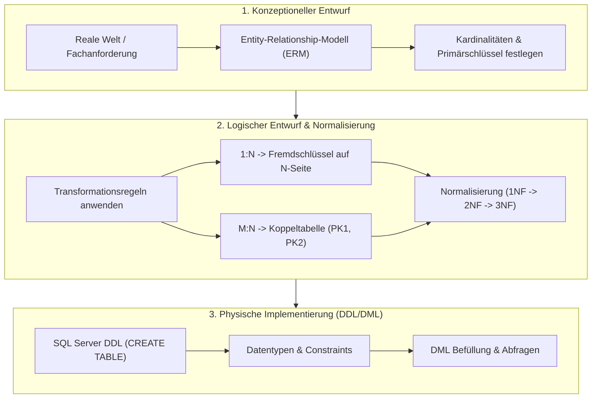
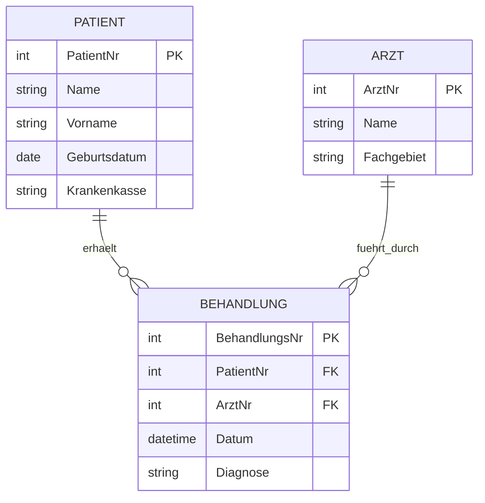

# 📅 Day_09: Intensiv-Klausurvorbereitung & IHK-Prüfungstraining

## ℹ️ Kurs-Informationen

* **Datum:** Donnerstag, 13.08.2026
* **Arbeitszeit:** 08:15 - 16:00 Uhr
* **Dozent:** Tom S.
* **Autor:** Tobias Boyke

---

## 🎯 Lernziele des Tages

- [x] **Ganzheitliche Klausurvorbereitung:** Systematische Wiederholung aller klausurrelevanten Kerngebiete der Wochen 1 und 2 für die 1. Leistungskontrolle am Folgetag (`Day_10`).
- [x] **Konzeptioneller Datenbankentwurf (ERM):**
  - Entitäten, Attribute, Primärschlüssel und Beziehungen in Chen- und Krähenfuß-Notation.
  - Sichere Bestimmung von Kardinalitäten (1:1, 1:N, M:N) und rekursiven Beziehungen.
- [x] **Relationales Mapping (Vom ERM zum Tabellenmodell):**
  - Regelbasiertes Überführen von Beziehungen in Fremdschlüssel und Koppeltabellen.
  - Vermeidung von NULL-Spalten durch korrekte 1:1- und 1:N-Strukturierung.
- [x] **Normalisierung bis zur 3. Normalform:**
  - Erkennen von Einfüge-, Änderungs- und Löschanomalien.
  - Schrittweises Überführen von unstrukturierten Daten (1NF ➡️ 2NF ➡️ 3NF).
- [x] **DDL- & DML-Sicherheit:**
  - Erstellen robuster Tabellenschemata mit Integritätsbedingungen (`NOT NULL`, `UNIQUE`, `CHECK`, `DEFAULT`, `FOREIGN KEY ON DELETE CASCADE`).
- [x] **Reale IHK-Abschlussprüfungsaufgaben:** Vertiefende Ausarbeitung von IHK-Prüfungssätzen (Sensordaten, Digitale Krankenakte, Delikte, Krankenhaus, Fußballverein, Zooverwaltung).

---

## 📖 Theorie & Konzepte: Der große Klausur-Repetitoriums-Guide



---

### 1. Die Transformationsregeln: ERM ➔ Tabellenmodell

| Beziehungstyp | Regel im Tabellenmodell | Beispiel |
| :--- | :--- | :--- |
| **1 : N** | Der Primärschlüssel der **1-Seite** wird als Fremdschlüssel (FK) in die Tabelle der **N-Seite** eingetragen. | `Abteilung (1) -> Mitarbeiter (N)`: `Mitarbeiter.abt_id` verweist auf `Abteilung.id`. |
| **M : N** | Es wird eine **neue Koppeltabelle** benötigt. Sie enthält die PKs beider Entitäten als zusammengesetzten PK und jeweils als FK. | `Mitarbeiter (M) <-> Projekt (N)`: `Arbeit (mit_id [PK,FK], pro_id [PK,FK], aufgabe, beginn)`. |
| **1 : 1** | Der PK einer Seite wird FK der anderen Seite mit `UNIQUE`-Constraint (oder Zusammenfassung in einer Tabelle). | `Mitarbeiter (1) <-> Gehalt (1)`: `Gehalt.mit_id [PK,FK]` verweist auf `Mitarbeiter.id`. |
| **Rekursiv (1:N)** | Fremdschlüsselspalte in derselben Tabelle, die auf den eigenen Primärschlüssel verweist. | `Mitarbeiter.chef_id [FK]` verweist auf `Mitarbeiter.id`. |

---

### 2. Normalisierungs-Schnellprüfung für Prüfungen

```
+------------------------------------------------------------------------------------+
| 1. Normalform (1NF): Atomare Werte (keine Listen/Kommata), Primärschlüssel vorhanden. |
+------------------------------------------------------------------------------------+
                                          |
                                          v
+------------------------------------------------------------------------------------+
| 2. Normalform (2NF): 1NF + Jedes Nicht-Schlüsselfeld hängt VOLL vom gesamten PK ab |
|                     (keine Teilabhängigkeiten bei zusammengesetzten Schlüsseln).   |
+------------------------------------------------------------------------------------+
                                          |
                                          v
+------------------------------------------------------------------------------------+
| 3. Normalform (3NF): 2NF + Keine transitiven Abhängigkeiten (Nicht-Schlüsselfelder |
|                     dürfen nicht von anderen Nicht-Schlüsselfeldern abhängen).     |
+------------------------------------------------------------------------------------+
```

---

## 🎓 IHK-Prüfungsrelevanz: Analyse klassischer Prüfungsszenarien

### 📝 Prüfungsszenario 1: Digitale Krankenakte (IHK AP2 2025)

**Aufgabenstellung:** Ein Krankenhaus verwaltet Patienten, Ärzte und Behandlungen. Ein Patient kann von mehreren Ärzten behandelt werden, ein Arzt behandelt mehrere Patienten. Jede Behandlung erfolgt an einem bestimmten Datum mit Diagnose und Medikation.



> **IHK-Punkte-Tipp:**
> Bei M:N-Beziehungen mit eigenen Attributen (wie `Datum` und `Diagnose`) wird die Beziehung im Tabellenmodell als vollwertige Entitätstabelle mit eigenem künstlichen Primärschlüssel oder kombiniertem Schlüssel realisiert.

---

### 📝 Prüfungsszenario 2: Sensordaten-Erfassung (IHK AP 2021 W)

**Aufgabenstellung:** In Industrieanlagen erfassen Messstationen über verschiedene Sensoren zyklisch Messwerte.

* **Schema:**
  * `Station (StationID [PK], Standort, IPAdresse)`
  * `Sensor (SensorID [PK], StationID [FK], Typ, Einheit, MinWert, MaxWert)`
  * `Messung (MessID [PK], SensorID [FK], Zeitstempel, Messwert, Status)`

---

## 💻 Praktische Übungen: DDL-Skripte & Tabellenmodelle

Das praktische Skript zur Umsetzung der Klausurvorbereitungs-Szenarien befindet sich im Ordner `src/`:  
👉 **[klausurvorbereitung_ddl_dml.sql](./src/klausurvorbereitung_ddl_dml.sql)**

### Auszug: DDL für das Zooverwaltungs-Schema
```sql
CREATE TABLE Gehege (
    GehegeID INT IDENTITY(1,1) PRIMARY KEY,
    Bezeichnung NVARCHAR(50) NOT NULL,
    FlaecheQuadratmeter DECIMAL(8,2) NOT NULL,
    IstAussengehege BIT NOT NULL DEFAULT 1
);

CREATE TABLE Tier (
    TierID INT IDENTITY(1,1) PRIMARY KEY,
    Name NVARCHAR(50) NOT NULL,
    Geburtsdatum DATE,
    Geschlecht CHAR(1) CHECK (Geschlecht IN ('M', 'W', 'U')),
    ArtID INT NOT NULL,
    GehegeID INT NOT NULL,
    CONSTRAINT FK_Tier_Art FOREIGN KEY (ArtID) REFERENCES Tierart(ArtID),
    CONSTRAINT FK_Tier_Gehege FOREIGN KEY (GehegeID) REFERENCES Gehege(GehegeID)
);
```

---

## 💡 Klausur-Checkliste & Tipps

> [!TIP]
> **Checkliste für die Klausur am Folgetag:**
> 1. **ERD-Notation genau lesen:** Wird Chen-Notation (1, N, M) oder Krähenfuß verlangt?
> 2. **Primär- und Fremdschlüssel immer kennzeichnen:** `[PK]` und `[FK]` niemals vergessen.
> 3. **Datentypen präzise wählen:** Geldbeträge immer `DECIMAL(p,s)`, niemals `FLOAT`!
> 4. **NULL-Sicherheit:** Fremdschlüssel mit `NOT NULL` versehen, sofern eine Pflichtbeziehung besteht.