# 📅 Day_11: DQL-Grundlagen, WHERE-Klausel & Pattern Matching (LIKE)

## ℹ️ Kurs-Informationen

* **Datum:** Montag, 17.08.2026
* **Arbeitszeit:** 08:15 - 16:00 Uhr
* **Dozent:** Tom S.
* **Autor:** Tobias Boyke

---

## 🎯 Lernziele des Tages

- [x] **ProjektDB als Datenbasis (Single Source of Truth):** Vollständige Einrichtung und Verständnis des relationalen Datenbankschemas der `ProjektDB` (Tabellen `Mitarbeiter`, `Abteilung`, `Gehalt`, `Projekt`, `Kunde`, `Arbeit`, `Umsatz`).
- [x] **DQL-Einstieg (SELECT & Berechnungen):** Ausgabe spezifischer Spalten, Alias-Vergabe (`AS`), Berechnungen/Ausdrücke und Duplikatentfernung (`DISTINCT`).
- [x] **Filterung mit der WHERE-Klausel:**
  - Vergleichsoperatoren (`=`, `<>`, `!=`, `<`, `<=`, `>`, `>=`).
  - Logische Verknüpfungen (`AND`, `OR`, `NOT`) und Beachtung der **Operator-Rangfolge** (`NOT` vor `AND` vor `OR`).
  - **Dreiwertige Logik & NULL-Falle:** Verstehen, warum Vergleiche wie `ort = NULL` scheitern und zwingend `IS NULL` bzw. `IS NOT NULL` verwendet werden müssen.
  - Bereichs- und Mengenoperatoren (`BETWEEN ... AND ...`, `IN (...)`, `NOT IN (...)`).
- [x] **Musterabgleich (Pattern Matching mit LIKE):**
  - Standard-Wildcards: `%` (beliebige Zeichenkette beliebiger Länge) und `_` (genau ein Zeichen).
  - Zeichenklassen: `[a-z]`, `[0-9]` (genau ein Zeichen aus der Menge/dem Bereich).
  - Negierte Zeichenklassen: `[^a-z]` (genau ein Zeichen, das nicht in der Menge liegt; beachte: schließt `NULL` aus).
  - **Sonderzeichen-Maskierung:** Gezieltes Suchen nach den Literalzeichen `%` und `_` mittels `[%]` und `[_]`.
- [x] **Praktische Übungen:** Vollständige Bearbeitung der Aufgabenreihen *ProjektDB 01 (WHERE-Klausel 1 & 2)* sowie *ProjektDB 02 (LIKE-Operator)* (Aufgaben 1.1 bis 1.13 und 3.1 bis 3.10).

---

## 📖 Theorie & Konzepte: Der DQL & WHERE Spickzettel

```mermaid
flowchart TD
    A["DQL Datenabfrage (SELECT)"] --> B["1. Projektion & Selektion"]
    A --> C["2. Logische Filter (WHERE)"]
    A --> D["3. Pattern Matching (LIKE)"]

    B --> B1["SELECT spalte1, spalte2"]
    B --> B2["DISTINCT (Duplikate entfernen)"]
    B --> B3["CONCAT / Berechnungen AS Alias"]

    C --> C1["Vergleiche: =, <>, <, >, <=, >="]
    C --> C2["Logik: NOT vor AND vor OR (Klammern!)"]
    C --> C3["NULL-Prüfung: IS NULL / IS NOT NULL"]
    C --> C4["Mengen: IN (...) / NOT IN (...)"]
    C --> C5["Bereiche: BETWEEN start AND ende"]

    D --> D1["% : 0 bis n beliebige Zeichen"]
    D --> D2["_ : Exakt 1 beliebiges Zeichen"]
    D --> D3["[A-Z] / [abc] : Genau 1 Zeichen aus Menge"]
    D --> D4["[^A-Z] : Genau 1 Zeichen NICHT aus Menge"]
    D --> D5["[%] / [_] : Sonderzeichen maskieren"]
```



---

### 1. Die SELECT-Klausel: Projektion, Ausdrücke & DISTINCT

Die `SELECT`-Klausel bestimmt, welche Spalten (Attribute) oder berechneten Werte in der Ergebnismenge angezeigt werden:

* **Spaltenauswahl:** `SELECT vorname, nachname FROM Mitarbeiter;`
* **Alle Spalten (`*`):** `SELECT * FROM Mitarbeiter;` (Im Produktivcode aus Performance- und Wartungsgründen vermeiden!)
* **Spalten-Aliase (`AS`):** Benennt Spalten im Ausgabeergebnis lesbar um:
  ```sql
  SELECT CONCAT(vorname, ' ', nachname) AS vollstaendiger_name,
         gehalt * 12 AS jahresgehalt
  FROM Mitarbeiter
  INNER JOIN Gehalt ON Mitarbeiter.id = Gehalt.mit_id;
  ```
* **Duplikat-Eliminierung (`DISTINCT`):** Entfernt identische Ergebniszeilen:
  ```sql
  SELECT DISTINCT ort 
  FROM Mitarbeiter;
  ```

---

### 2. Die WHERE-Klausel: Filterung & Operator-Rangfolge

Die `WHERE`-Klausel schränkt die zurückgegebenen Datensätze auf Zeilenebene ein, **bevor** Gruppierungen oder Sortierungen stattfinden.

#### Operator-Rangfolge (Operator Precedence)

SQL wertet logische Operatoren in einer festen Hierarchie aus:
1. **Arithmetische Operatoren** (`*`, `/`, `+`, `-`)
2. **Vergleichsoperatoren** (`=`, `<>`, `<`, `>`, `<=`, `>=`, `LIKE`, `IN`, `BETWEEN`)
3. **`NOT`** (höchste logische Priorität)
4. **`AND`** (mittlere logische Priorität – logisches UND bindet stärker als ODER!)
5. **`OR`** (niedrigste logische Priorität)

> [!CAUTION]
> **IHK-Klassiker: Fehlende Klammern bei AND & OR!**  
> Bei gemischten `AND`- und `OR`-Bedingungen wertet SQL immer zuerst das `AND` aus. Setze **immer explizite Klammern**, um logische Fehlinterpretationen zu verhindern:
> ```sql
> -- FALSCH (Ungewollte Logik durch implizites AND-Binden):
> WHERE pro_id = 5 AND aufgabe <> 'Sachbearbeiter' OR aufgabe IS NULL
> 
> -- RICHTIG (Eindeutige Gruppierung):
> WHERE pro_id = 5 AND (aufgabe <> 'Sachbearbeiter' OR aufgabe IS NULL);
> ```

---

### 3. Die Dreiwertige Logik & Die NULL-Falle

In relationalen Datenbanken steht `NULL` für einen **unbekannten**, **fehlenden** oder **nicht definierten** Wert (Three-Valued Logic: `TRUE`, `FALSE`, `UNKNOWN`).

```
                    +------------------------------------+
                    |        Vergleich mit NULL          |
                    |   'ort = NULL'  =>  UNKNOWN        |
                    |   'ort <> NULL' =>  UNKNOWN        |
                    +------------------------------------+
                                      |
                                      v
                    +------------------------------------+
                    |  WHERE filtert UNKNOWN-Zeilen aus! |
                    |  => Kein Treffer wird zurückgegeben |
                    +------------------------------------+
```

* **Falsche Syntax:** `WHERE ort = NULL;` *(liefert immer 0 Zeilen!)*
* **Korrekte Syntax:** `WHERE ort IS NULL;` bzw. `WHERE ort IS NOT NULL;`

> [!WARNING]
> **Negierte Bedingungen & NULL:**
> Bei Filtern wie `WHERE ort NOT IN ('München', 'Ulm')` oder `WHERE nachname LIKE '[^K-P]%'` werden Datensätze mit `ort IS NULL` oder `nachname IS NULL` **nicht** zurückgeliefert, da Vergleiche mit `NULL` zu `UNKNOWN` führen!

---

### 4. Pattern Matching: Der LIKE-Operator

Die `LIKE`-Klausel ermöglicht mächtige Musterabgleiche auf Textspalten:

| Suchmuster | Bedeutung | Beispiel | Treffer |
| :--- | :--- | :--- | :--- |
| `'K%'` | Beginnt mit `K` | `WHERE nachname LIKE 'K%'` | *Kaufmann, Krüger, Keller* |
| `'%er'` | Endet auf `er` | `WHERE nachname LIKE '%er'` | *Schäfer, Meier, Müller* |
| `'_a%'` | 2. Buchstabe ist `a` | `WHERE vorname LIKE '_a%'` | *Rainer, Martin, Sabine* |
| `'_______'` | Genau 7 Zeichen lang | `WHERE vorname LIKE '_______'` | *Sibille, Andreas* |
| `'[N-Z]%'` | Beginnt mit Buchstabe von N bis Z | `WHERE ort LIKE '[N-Z]%'` | *Stuttgart, Ulm* |
| `'[^K-P]%'` | Beginnt **nicht** mit Buchstaben K bis P | `WHERE nachname LIKE '[^K-P]%'` | *Schäfer, Wolf, Huber* |
| `'_____[^aeiou]'` | Exakt 6 Zeichen, endet **nicht** auf Vokal | `WHERE vorname LIKE '_____[^aeiou]'` | *Rainer, Martin* |
| `'%[aeiou]%[aeiou]%[aeiou]%'` | Enthält mindestens 3 Vokale | `WHERE vorname LIKE '%[aeiou]%...'` | *Brigitte, Sabine, Andreas* |
| `'%[%]%'` / `'%[_]%'` | Sucht nach Sonderzeichen `%` oder `_` | `WHERE firma LIKE '%[%]%'` | *100% Sonderzeichen AG* |

---

## 🎓 IHK-Prüfungsrelevanz: DQL & WHERE

### 📝 Typische Prüfungsfragen & Antworten

#### Frage 1: Warum liefert die Abfrage `SELECT * FROM Mitarbeiter WHERE ort = NULL;` keine Datensätze zurück? (3 Punkte)
> **IHK-Musterantwort:**
> `NULL` repräsentiert in SQL keinen konkreten Wert, sondern das Fehlen eines Wertes (Unbekannt). Vergleiche mit herkömmlichen Operatoren (`=`, `<>`) gegen `NULL` werten nach der dreiwertigen Logik stets zu `UNKNOWN` (und nicht zu `TRUE`) aus. Die `WHERE`-Klausel liefert jedoch nur Zeilen zurück, deren Bedingung zu `TRUE` auswertet. Für die Prüfung auf NULL-Werte muss der Prädikatsoperator `IS NULL` verwendet werden.

#### Frage 2: Erklären Sie den Unterschied zwischen `LIKE '_a%'` und `LIKE '%a%'`. (3 Punkte)
> **IHK-Musterantwort:**
> * `LIKE '_a%'`: Der Unterstrich `_` verlangt genau ein beliebiges Zeichen am Anfang. Das `a` muss zwingend an der **zweiten Position** stehen.
> * `LIKE '%a%'`: Das Prozentzeichen `%` steht für null oder beliebig viele Zeichen. Das `a` kann an einer **beliebigen Position** (am Anfang, in der Mitte oder am Ende) vorkommen.

#### Frage 3: Welche logische Auswertungsreihenfolge gilt bei `WHERE bedingung_A OR bedingung_B AND bedingung_C`? (3 Punkte)
> **IHK-Musterantwort:**
> Der Operator `AND` bindet stärker als `OR`. Daher wird zuerst `(bedingung_B AND bedingung_C)` ausgewertet und das Teilergebnis anschließend mit `bedingung_A` per `OR` verknüpft.

---

## 💻 Praktische Übungen: Aufgaben & Lösungen (ProjektDB)

Die vollständigen, lauffähigen SQL-Abfragen befinden sich im Skript:  
👉 **[dql_where_and_like_basics.sql](./src/dql_where_and_like_basics.sql)**

---

### 📂 Teil 1: WHERE-Klausel 1 (Aufgaben 1.1 – 1.7)

#### 📝 Aufgabe 1.1
* **Aufgabenstellung:** Finden Sie die Namen und Id aller Abteilungen, die in München ihren Sitz haben.
```sql
SELECT bezeichnung, id
FROM Abteilung
WHERE ort = 'München';
```

#### 📝 Aufgabe 1.2
* **Aufgabenstellung:** Nennen Sie die Vor- und Nachnamen aller Mitarbeiter, deren Personalnummer >= 20000 ist.
```sql
SELECT vorname, nachname
FROM Mitarbeiter
WHERE id >= 20000;
```

#### 📝 Aufgabe 1.3
* **Aufgabenstellung:** Finden Sie alle Projekte, deren Finanzmittel mehr als 129.960,01 $ betragen (Kurs: 1,083 $ = 1 €).
```sql
SELECT id, kuerzel, bezeichnung, mittel, kunde_id
FROM Projekt
WHERE mittel * 1.083 > 129960.01;
```

#### 📝 Aufgabe 1.4
* **Aufgabenstellung:** Gesucht werden Mitarbeiter-Id, Projektnummer und Aufgabe der Mitarbeiter, die im Projekt 2 Sachbearbeiter sind.
```sql
SELECT mit_id, pro_id, aufgabe
FROM Arbeit
WHERE pro_id = 2 AND aufgabe = 'Sachbearbeiter';
```

#### 📝 Aufgabe 1.5
* **Aufgabenstellung:** Finden Sie Id, Umsatz und Datum für alle Mitarbeiter, die im Jahr 2018 Umsätze von mindestens 5000 € hatten.
```sql
SELECT mit_id, umsatz, datum
FROM Umsatz
WHERE umsatz >= 5000 
  AND YEAR(datum) = 2018;
```

#### 📝 Aufgabe 1.6
* **Aufgabenstellung:** Gesucht wird einmalig die Personalnummer der Mitarbeiter, die entweder im Projekt 1 oder 5 oder in beiden arbeiten.
```sql
SELECT DISTINCT mit_id
FROM Arbeit
WHERE pro_id IN (1, 5);
```

#### 📝 Aufgabe 1.7
* **Aufgabenstellung:** Nennen Sie Personalnummer und Nachnamen der Mitarbeiter, die nicht in den Abteilungen 2, 3 und 4 arbeiten.
```sql
SELECT id, nachname
FROM Mitarbeiter
WHERE abt_id NOT IN (2, 3, 4) OR abt_id IS NULL;
```

---

### 📂 Teil 2: WHERE-Klausel 2 (Aufgaben 1.8 – 1.13)

#### 📝 Aufgabe 1.8
* **Aufgabenstellung:** Finden Sie alle Mitarbeiter, deren Personalnummer entweder 29346, 28559 oder 25348 ist.
```sql
SELECT id, nachname, vorname, abt_id, ort, chef_id
FROM Mitarbeiter
WHERE id IN (29346, 28559, 25348);
```

#### 📝 Aufgabe 1.9
* **Aufgabenstellung:** Nennen Sie alle Mitarbeiter, deren Wohnort weder München noch Ulm ist.
```sql
SELECT id, nachname, vorname, abt_id, ort, chef_id
FROM Mitarbeiter
WHERE ort NOT IN ('München', 'Ulm');
```

#### 📝 Aufgabe 1.10
* **Aufgabenstellung:** Nennen Sie Namen und Mittel aller Projekte, deren finanzielle Mittel zwischen 95.000 und 120.000 EURO liegen.
```sql
SELECT bezeichnung, mittel
FROM Projekt
WHERE mittel BETWEEN 95000 AND 120000;
```

#### 📝 Aufgabe 1.11
* **Aufgabenstellung:** Nennen Sie die Id der Mitarbeiter, die Projektleiter sind und vor oder nach 2018 in ihren Projekten eingestellt wurden.
```sql
SELECT mit_id
FROM Arbeit
WHERE aufgabe = 'Projektleiter'
  AND (einst_dat < '2018-01-01' OR einst_dat > '2018-12-31');
```

#### 📝 Aufgabe 1.12
* **Aufgabenstellung:** Finden Sie Personal- und Projektnummer aller Mitarbeiter, die in den Projekten 1 oder 5 arbeiten und deren Aufgabe noch nicht festgelegt ist (`NULL`).
```sql
SELECT mit_id, pro_id
FROM Arbeit
WHERE pro_id IN (1, 5) 
  AND aufgabe IS NULL;
```

#### 📝 Aufgabe 1.13
* **Aufgabenstellung:** Finden Sie Id und Aufgabe aller Mitarbeiter, die im Projekt 5 arbeiten, aber nicht Sachbearbeiter sind.
```sql
SELECT mit_id, aufgabe
FROM Arbeit
WHERE pro_id = 5 
  AND (aufgabe <> 'Sachbearbeiter' OR aufgabe IS NULL);
```

---

### 📂 Teil 3: LIKE-Operator & Wildcards (Aufgaben 3.1 – 3.10)

#### 📝 Aufgabe 3.1
* **Aufgabenstellung:** Finden Sie Namen und Personalnummer aller Mitarbeiter, deren Name mit dem Buchstaben "K" beginnt.
```sql
SELECT nachname, id
FROM Mitarbeiter
WHERE nachname LIKE 'K%';
```

#### 📝 Aufgabe 3.2
* **Aufgabenstellung:** Nennen Sie Namen, Vornamen und Id aller Mitarbeiter, deren Vorname als 2. Buchstaben ein "a" hat.
```sql
SELECT nachname, vorname, id
FROM Mitarbeiter
WHERE vorname LIKE '_a%';
```

#### 📝 Aufgabe 3.3
* **Aufgabenstellung:** Finden Sie Abteilungs-Id und Standort aller Abteilungen, die sich an Orten befinden, die mit einem Buchstaben zwischen "N" und "Z" beginnen.
```sql
SELECT id, ort
FROM Abteilung
WHERE ort LIKE '[N-Z]%';
```

#### 📝 Aufgabe 3.4
* **Aufgabenstellung:** Finden Sie Id, Nachnamen und Vornamen aller Mitarbeiter, deren Name nicht mit K-P beginnt und deren Vorname nicht mit U beginnt.
```sql
SELECT id, nachname, vorname
FROM Mitarbeiter
WHERE nachname LIKE '[^K-P]%' 
  AND vorname NOT LIKE 'U%';
```

#### 📝 Aufgabe 3.5
* **Aufgabenstellung:** Nennen Sie Vor- und Nachname aller Mitarbeiter, deren Name nicht mit "er" endet.
```sql
SELECT vorname, nachname
FROM Mitarbeiter
WHERE nachname NOT LIKE '%er';
```

#### 📝 Aufgabe 3.6
* **Aufgabenstellung:** Finden Sie alle Kunden, in deren Datensatz Sonderzeichen (`_` oder `%`) vorkommen.
```sql
SELECT firma, ort
FROM Kunde
WHERE firma LIKE '%[%_]%' 
   OR ort LIKE '%[%_[]%';
```

#### 📝 Aufgabe 3.7
* **Aufgabenstellung:** Nennen Sie alle Mitarbeiter, deren Vorname mindestens drei Vokale enthält.
```sql
SELECT id, vorname, nachname, abt_id, ort, chef_id
FROM Mitarbeiter
WHERE vorname LIKE '%[aeiou]%[aeiou]%[aeiou]%';
```

#### 📝 Aufgabe 3.8
* **Aufgabenstellung:** Finden Sie alle Mitarbeiter, deren Vorname aus genau sieben Buchstaben besteht.
```sql
SELECT id, vorname, nachname, abt_id, ort, chef_id
FROM Mitarbeiter
WHERE vorname LIKE '_______';
```

#### 📝 Aufgabe 3.9
* **Aufgabenstellung:** Finden Sie alle Mitarbeiter mit genau 6 Buchstaben im Vornamen, der NICHT mit einem Vokal endet.
```sql
SELECT id, vorname, nachname, abt_id, ort, chef_id
FROM Mitarbeiter
WHERE vorname LIKE '_____[^aeiou]';
```

#### 📝 Aufgabe 3.10
* **Aufgabenstellung:** Finden Sie alle Mitarbeiter, bei deren Vorname der vorletzte Buchstabe ein Vokal ist.
```sql
SELECT id, vorname, nachname, abt_id, ort, chef_id
FROM Mitarbeiter
WHERE vorname LIKE '%[aeiou]_';
```

---

## 💡 Wichtige Notizen & Praxistipps

> [!TIP]
> **SARGability (Search Argumentable Queries):**
> Vermeide Funktionsaufrufe auf Tabellenspalten im `WHERE` (z. B. `WHERE LEFT(nachname, 1) = 'K'`), da diese verhindern, dass das RDBMS vorhandene Indizes nutzen kann. Nutze stattdessen immer indexoptimierte Prädikate wie `WHERE nachname LIKE 'K%'`.

> [!IMPORTANT]
> **ProjektDB als Fundament:**
> Alle weiteren Themen des Kurses (Sortierung in `Day_12`, Wiederholungen in `Day_13`, Subqueries in `Day_14` und Joins) bauen direkt auf den Tabellenstrukturen und Datenbeziehungen der `ProjektDB` auf!