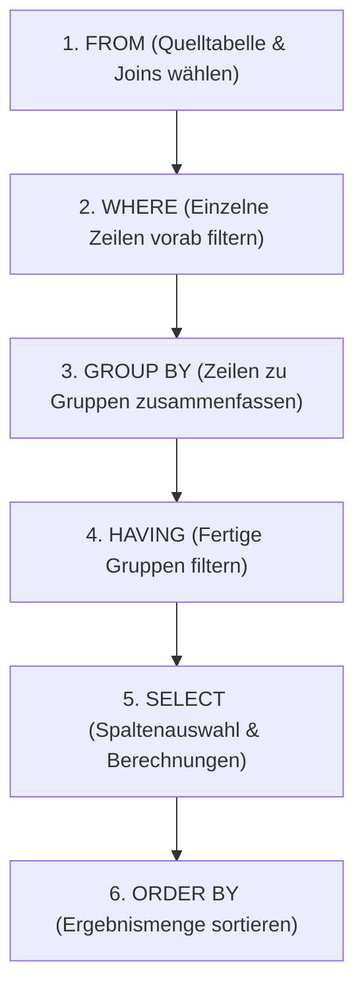

# 📅 Day_12: Sortierung (ORDER BY), Aggregatfunktionen & Gruppierung (GROUP BY / HAVING)

## ℹ️ Kurs-Informationen
*   **Datum:** Dienstag, 18.08.2026
*   **Arbeitszeit:** 08:15 - 16:00 Uhr
*   **Dozent:** Tom S.
*   **Autor:** Tobias Boyke

---

## 🎯 Lernziele des Tages
- [x] **Logische Ausführungsreihenfolge:** Verstehen, warum die Datenbank Abfragen nicht von oben nach unten abarbeitet, sondern in einer festen logischen Reihenfolge (`FROM` ➡️ `WHERE` ➡️ `GROUP BY` ➡️ `HAVING` ➡️ `SELECT` ➡️ `ORDER BY`).
- [x] **Sortieren (ORDER BY):** Beherrschen der Sortierung nach mehreren Spalten, nach Spaltenpositionen und gezieltes Handling von `NULL`-Werten.
- [x] **Ergebnisbegrenzung (TOP):** Selektion der obersten Datensätze mit `TOP (n)`, `TOP (n) PERCENT` und das Verhindern von unfairen Abschneidern bei Gleichständen mittels `WITH TIES`.
- [x] **Aggregatfunktionen:** Korrekte Anwendung von `SUM()`, `AVG()`, `MIN()`, `MAX()` und `COUNT()` und deren Verhalten bei `NULL`-Werten.
- [x] **Gruppierung (GROUP BY):** Einhalten der goldenen SQL-Regel für Spalten im `SELECT`-Bereich bei Aggregationen.
- [x] **Gruppenfilterung (HAVING):** Klare Abgrenzung zwischen `WHERE` (Filterung einzelner Zeilen vor der Aggregation) und `HAVING` (Filterung ganzer Gruppen nach der Aggregation).
- [x] **Profi-Aggregationen:** String-Verkettung innerhalb von Gruppen mittels `STRING_AGG()`.

---

## 📖 Theorie & Konzepte

### 1. Die logische Ausführungsreihenfolge einer SQL-Abfrage
Eine SQL-Abfrage wird im Hintergrund der Datenbank in einer fest definierten Reihenfolge abgearbeitet. Dies erklärt viele Syntaxregeln (z. B. warum Aliase aus dem `SELECT` nicht im `WHERE` oder `HAVING` genutzt werden dürfen, aber im `ORDER BY` erlaubt sind).



| Schritt | Klausel | Funktion | Alias verwendbar? |
| :--- | :--- | :--- | :--- |
| **1** | **FROM** | Woher kommen die Daten? (Tabellenauswahl) | Nein |
| **2** | **WHERE** | Welche Zeilen zählen? (Filterung vor Gruppierung) | Nein |
| **3** | **GROUP BY** | Wie wird zusammengefasst? (Gruppen bilden) | Nein |
| **4** | **HAVING** | Welche Gruppen fliegen raus? (Filterung nach Aggregation) | Nein |
| **5** | **SELECT** | Was wird angezeigt? (Berechnungen, Aliase vergeben) | **Hier definiert** |
| **6** | **ORDER BY** | Wie wird sortiert? (Der finale Schliff) | **Ja!** |

---

### 2. Daten sortieren mit ORDER BY
Mit `ORDER BY` wird die Ausgabe strukturiert. Standardmäßig sortiert SQL aufsteigend.

*   `ASC` (Ascending): Aufsteigend (A-Z, 1-10) - Standardwert, muss nicht angegeben werden.
*   `DESC` (Descending): Absteigend (Z-A, 10-1).
*   **Mehrfach-Sortierung:** Sortieren nach mehreren Spalten nacheinander (z. B. `ORDER BY nachname DESC, vorname ASC;`).
*   **Sortierung nach Spaltenposition:** Abkürzung im Code (z. B. `ORDER BY 3 DESC;` sortiert nach der 3. Spalte im `SELECT`-Bereich).

#### ⚠️ Sonderfall: NULL-Werte beim Sortieren
`NULL` bedeutet in SQL "unbekannt". Je nach RDBMS werden `NULL`-Werte unterschiedlich bewertet:
*   **MS SQL Server / MySQL:** `NULL` gilt als der kleinste Wert. Bei `ASC` steht er ganz oben, bei `DESC` ganz unten.
*   **PostgreSQL / Oracle:** `NULL` gilt als der größte Wert. Bei `ASC` steht er ganz unten, bei `DESC` ganz oben.

##### T-SQL-Trick zur Verbannung von NULL-Werten ans Ende
```sql
ORDER BY 
    CASE WHEN gehalt IS NULL THEN 1 ELSE 0 END ASC, 
    gehalt DESC;
```

---

### 3. Ergebnisbegrenzung mit TOP und WITH TIES
*   `TOP (n)`: Liefert die ersten `n` Datensätze zurück.
*   `TOP (n) PERCENT`: Liefert die obersten `n` Prozent der Datensätze zurück (z. B. `TOP (35.37) PERCENT`).
*   `WITH TIES`: Gibt bei einem Gleichstand im Sortierkriterium zusätzlich alle Datensätze aus, die denselben Wert wie der letzte reguläre Platz haben.

> [!IMPORTANT]
> `TOP` ohne `ORDER BY` ist in der Praxis gefährlich, da die Datenbank die Zeilen ohne Sortierung in zufälliger physikalischer Reihenfolge ausgibt. `WITH TIES` erfordert **zwingend** eine `ORDER BY`-Klausel!

---

### 4. Aggregatfunktionen & Die "Goldene Regel" der Gruppierung
Aggregatfunktionen fassen mehrere Zeilen zu einem einzelnen Wert zusammen. Die fünf Standard-Funktionen sind:
*   `COUNT()`: Zählt Datensätze. `COUNT(*)` zählt alle Zeilen inklusive `NULL`s, `COUNT(spalte)` ignoriert `NULL`-Einträge.
*   `SUM()`: Berechnet die Summe. Ignoriert `NULL`s.
*   `AVG()`: Berechnet den Durchschnitt. Ignoriert `NULL`s (wichtig: Zeilen mit `NULL` fließen auch nicht in den Nenner der Division ein!).
*   `MIN()` / `MAX()`: Ermitteln den kleinsten bzw. größten Wert. Ignoriert `NULL`s.

> [!CAUTION]
> **Die Goldene Regel der Gruppierung:**
> Jede Spalte im `SELECT`-Bereich, die **keine** Aggregatfunktion besitzt, **muss** zwingend in der `GROUP BY`-Klausel aufgeführt sein! Andernfalls verweigert der SQL-Parser die Ausführung mit einer Fehlermeldung.

---

### 5. Filterung: WHERE vs. HAVING
Der entscheidende Unterschied zwischen den beiden Filter-Klauseln liegt im Zeitpunkt ihrer Ausführung:

| Kriterium | WHERE-Klausel | HAVING-Klausel |
| :--- | :--- | :--- |
| **Arbeitsweise** | Filtert einzelne Datensätze (Zeilen). | Filtert aggregierte Gruppen von Zeilen. |
| **Ausführungszeitpunkt** | **Vor** der Gruppierung (`GROUP BY`). | **Nach** der Gruppierung (`GROUP BY`). |
| **Aggregatfunktionen** | Verboten (z. B. `WHERE SUM(umsatz) > 5000` wirft einen Fehler). | Erlaubt und primärer Einsatzzweck. |

---

### 6. STRING_AGG() zur Gruppen-Kompression
In MS SQL Server können Zeichenketten innerhalb einer Gruppe mit `STRING_AGG()` in eine kommagetrennte Liste umgewandelt werden, um alle Gruppendetails in einer einzigen Zeile anzuzeigen:
```sql
SELECT abt_id, STRING_AGG(CONCAT(vorname, ' ', nachname), ', ') AS mitarbeiter
FROM Mitarbeiter
GROUP BY abt_id;
```

---

## 🎓 IHK-Prüfungsrelevanz: Aggregation & Sortierung

### 📝 Typische Prüfungsfragen & Antworten

#### 1. Erklären Sie den Unterschied zwischen den Klauseln WHERE und HAVING in SQL. (4 Punkte)
> **IHK-Musterantwort:**
> * Die `WHERE`-Klausel wird vor der Gruppierung ausgeführt und filtert einzelne Datensätze der Tabelle. In ihr dürfen keine Aggregatfunktionen verwendet werden.
> * Die `HAVING`-Klausel wird nach der Gruppierung ausgeführt und filtert die aggregierten Gruppen. Sie wird typischerweise mit Aggregatfunktionen (z. B. `HAVING SUM(...) > 1000`) verwendet.

#### 2. Was besagt die "Goldene Regel" der GROUP BY-Klausel? Nennen Sie ein syntaktisch fehlerhaftes und ein korrektes SQL-Beispiel. (6 Punkte)
> **IHK-Musterantwort:**
> Die Regel besagt, dass alle Spalten, die in der `SELECT`-Klausel aufgeführt sind und nicht Teil einer Aggregatfunktion sind, zwingend in der `GROUP BY`-Klausel aufgeführt werden müssen.
> 
> *Fehlerhaftes Beispiel:*
> ```sql
> SELECT abt_id, ort, AVG(gehalt) FROM Mitarbeiter GROUP BY abt_id; -- Fehler: 'ort' fehlt im GROUP BY
> ```
> *Korrektes Beispiel:*
> ```sql
> SELECT abt_id, ort, AVG(gehalt) FROM Mitarbeiter GROUP BY abt_id, ort;
> ```

#### 3. Wie verhalten sich Aggregatfunktionen wie SUM() oder AVG() in SQL bei Datensätzen, die NULL-Werte enthalten? (4 Punkte)
> **IHK-Musterantwort:**
> Aggregatfunktionen ignorieren `NULL`-Werte bei der Berechnung standardmäßig. Bei `SUM()` werden nur die numerischen Werte addiert. Bei `AVG()` werden die `NULL`-Werte ignoriert und die Zeilen fließen auch nicht in den Divisor (die Anzahl der Zeilen) ein. Besteht eine Gruppe ausschließlich aus `NULL`-Werten, ist das Gesamtergebnis der Funktion ebenfalls `NULL` (Ausnahme: `COUNT()` gibt in diesem Fall `0` zurück).

---

## 💻 Praktische Übungen: Aufgaben & Lösungen

Hier sind alle Übungsaufgaben des Tages und ihre T-SQL-Lösungen im Detail aufgeführt. Die lauffähigen Skripte inklusive der Unterrichtsexperimente findest du auch direkt im SQL-Skript:
👉 **[order_by_and_aggregations.sql](file:///c:/Users/Tobia/Desktop/cSharpRepo/SQL-Fundamentals/Day_12/src/order_by_and_aggregations.sql)**

### 1. Kategorie: ORDER BY (Aufgaben 3.1 - 3.7)

#### Aufgabe 3.1
```sql
-- Aufgabe 3.1
-- Geben Sie die Firmennamen aller Kunden aus. Sortieren Sie die Ausgabe aufsteigend nach dem Firmennamen.
--
-- Erwartetes Ergebnis:
-- firma
-- 100% Sonderzeichen AG
-- Finanzamt Ulm
-- Frankreich-Reisen GmbH
-- Getränke Schneider
-- Im- und Export AG
-- Technische Produkte oHG

SELECT firma
FROM Kunde
ORDER BY firma ASC;
```

#### Aufgabe 3.2
```sql
-- Aufgabe 3.2
-- Geben Sie alle Umsätze des Jahres 2019 sortiert nach Datum aus. 
-- Bei gleichem Datum sollen die größeren Umsätze zuerst genannt werden.
--
-- Erwartetes Ergebnis:
-- id  mit_id  datum       umsatz
-- 10  10102   2019-01-01  4500,00
-- 17  25348   2019-02-01  150000,00
-- 18  25348   2019-03-01  1500,00
-- 19  25348   2019-04-01  15,00
-- 21  2581    2019-05-01  100000,00
-- 20  25348   2019-05-01  150,00

SELECT id, mit_id, datum, umsatz
FROM Umsatz
WHERE YEAR(datum) = 2019
ORDER BY datum ASC, umsatz DESC;
```

#### Aufgabe 3.3
```sql
-- Aufgabe 3.3
-- Geben Sie alle Daten der Mitarbeiter aus. Sortieren Sie die Ausgabe nach Abteilungs-Nr. aufsteigend. 
-- Innerhalb der Abteilung sollen die Mitarbeiter ohne bekannten Wohnort am Ende stehen.
--
-- Erwartetes Ergebnis:
-- id     nachname  vorname   abt_id  ort        chef_id
-- 28559  Mozer     Sibille   1       Ulm        2581
-- 18316  Müller    Gabriele  1       Rosenheim  2581
-- 29346  Probst    Andreas   2       Augsburg   2581
-- 2581   Kaufmann  Brigitte  2       NULL       NULL
-- 9031   Meier     Rainer    2       NULL       2581
-- 25348  Keller    Hans      3       München    2581
-- ... (15 Zeilen)

SELECT *
FROM Mitarbeiter
ORDER BY abt_id ASC, IIF(ort IS NULL, 1, 0) ASC, ort ASC;
```

#### Aufgabe 3.4
```sql
-- Aufgabe 3.4
-- Geben Sie die Id und die Aufgabe von allen Mitarbeitern aus, die Projektleiter sind. 
-- Sortieren Sie die Ausgabe nach der Mitarbeiter-Id.
--
-- Erwartetes Ergebnis:
-- mit_id  aufgabe
-- 2581    Projektleiter
-- 5765    Projektleiter
-- 10102   Projektleiter
-- 22222   Projektleiter

SELECT mit_id, aufgabe
FROM Arbeit
WHERE aufgabe = 'Projektleiter'
ORDER BY mit_id ASC;
```

#### Aufgabe 3.5
```sql
-- Aufgabe 3.5
-- Gesucht werden Mitarbeiter-id, Projekt-Id und Aufgabe der Mitarbeiter, 
-- die entweder im Projekt 2 arbeiten, oder aber Projektleiter in einem beliebigen Projekt sind.
-- Sortieren Sie die Ausgabe nach der Projekt-Id und dann nach der Aufgabe.
--
-- Erwartetes Ergebnis:
-- mit_id  pro_id  aufgabe
-- 10102   1       Projektleiter
-- 18316   2       NULL
-- 29346   2       NULL
-- 25348   2       Sachbearbeiter
-- 28559   2       Sachbearbeiter
-- 2581    3       Projektleiter
-- 5765    4       Projektleiter
-- 22222   5       Projektleiter

SELECT mit_id, pro_id, aufgabe
FROM Arbeit
WHERE pro_id = 2 OR aufgabe = 'Projektleiter'
ORDER BY pro_id ASC, aufgabe ASC;
```

#### Aufgabe 3.6
```sql
-- Aufgabe 3.6
-- Selektieren Sie die drei größten Umsätze, die im Jahr 2018 gemacht wurden.
--
-- Erwartetes Ergebnis:
-- id  mit_id  datum       umsatz
-- 15  25348   2018-05-02  15000,00
-- 16  25348   2018-10-11  15000,00
-- 4   10102   2018-11-01  5000,00

SELECT TOP (3) *
FROM Umsatz
WHERE YEAR(datum) = 2018
ORDER BY umsatz DESC;
```

#### Aufgabe 3.7
```sql
-- Aufgabe 3.7
-- Selektieren erneut die drei größten Umsätze aus dem Jahr 2018. 
-- Verwenden Sie diesmal zusätzlich die Klausel WITH TIES.
--
-- Erwartetes Ergebnis:
-- id  mit_id  datum       umsatz
-- 15  25348   2018-05-02  15000,00
-- 16  25348   2018-10-11  15000,00
-- 22  17000   2018-03-03  5000,00
-- ...
-- 4   10102   2018-11-01  5000,00
-- 8   10102   2018-12-23  5000,00

SELECT TOP (3) WITH TIES *
FROM Umsatz
WHERE YEAR(datum) = 2018
ORDER BY umsatz DESC;
```

---

### 2. Kategorie: Aggregatfunktionen (Aufgaben 4.3 - 4.6)

#### Aufgabe 4.3
```sql
-- Aufgabe 4.3
-- Nennen Sie die kleinste Personalnummer der Mitarbeiter.
--
-- Erwartetes Ergebnis:
-- minimum
-- 2581

SELECT MIN(id) AS minimum
FROM Mitarbeiter;
```

#### Aufgabe 4.4
```sql
-- Aufgabe 4.4
-- Berechnen Sie die Summe der finanziellen Mittel aller Projekte.
--
-- Erwartetes Ergebnis:
-- summe
-- 655000,00

SELECT SUM(mittel) AS summe
FROM Projekt;
```

#### Aufgabe 4.5
```sql
-- Aufgabe 4.5
-- Berechnen Sie den arithmetischen Mittelwert der Geldbeträge, die höher als 92336,10 Euro sind (Spalte mittel in Projekt).
--
-- Erwartetes Ergebnis:
-- durchschnitt
-- 141625,00

SELECT AVG(mittel) AS durchschnitt
FROM Projekt
WHERE mittel > 92336.1;
```

#### Aufgabe 4.6
```sql
-- Aufgabe 4.6
-- Ermitteln Sie den höchsten, einzelnen Umsatz, der bisher erzielt wurde.
--
-- Erwartetes Ergebnis:
-- umsatz
-- 150000,00

SELECT MAX(umsatz) AS umsatz
FROM Umsatz;
```

---

### 3. Kategorie: Aggregatfunktionen mit Gruppierung (Aufgaben 4.7 - 4.11)

#### Aufgabe 4.7
```sql
-- Aufgabe 4.7
-- Finden Sie heraus, wie viele verschiedene Aufgaben in jedem Projekt ausgeübt werden. 
-- Nullwerte sollen nicht gezählt werden!
--
-- Erwartetes Ergebnis:
-- pro_id  anzahl
-- 1       3
-- 2       1
-- 3       3
-- 4       3
-- 5       2

SELECT pro_id, COUNT(DISTINCT aufgabe) AS anzahl
FROM Arbeit
GROUP BY pro_id;
```

#### Aufgabe 4.8
```sql
-- Aufgabe 4.8
-- Finden Sie heraus, wieviele Mitarbeiter in jedem Projekt arbeiten.
--
-- Erwartetes Ergebnis:
-- pro_id  anzahl
-- 1       5
-- 2       4
-- 3       4
-- 4       4
-- 5       3

SELECT pro_id, COUNT(mit_id) AS anzahl
FROM Arbeit
GROUP BY pro_id;
```

#### Aufgabe 4.9
```sql
-- Aufgabe 4.9
-- Gruppieren Sie die Reihen der Tabelle "Arbeit" nach den vorhandenen Aufgaben 
-- und zählen Sie die Anzahl der Mitarbeiter abhängig von der jeweiligen Aufgabe.
--
-- Erwartetes Ergebnis:
-- aufgabe         anzahl
-- NULL            5
-- Gruppenleiter   3
-- Projektleiter   4
-- Sachbearbeiter  7

SELECT aufgabe, COUNT(*) AS anzahl
FROM Arbeit
GROUP BY aufgabe
ORDER BY aufgabe;
```

#### Aufgabe 4.10
```sql
-- Aufgabe 4.10
-- Wie viele "echte" Aufgaben nehmen die Mitarbeiter wahr, deren Id größer als 20000 ist?
--
-- Erwartetes Ergebnis:
-- mit_id  anzahl
-- 20204   1
-- 22222   1
-- 24321   0
-- 25348   1
-- 27365   1
-- 28559   1
-- 29346   1

SELECT mit_id, COUNT(aufgabe) AS anzahl
FROM Arbeit
WHERE mit_id > 20000
GROUP BY mit_id
ORDER BY mit_id;
```

#### Aufgabe 4.11
```sql
-- Aufgabe 4.11
-- Zählen Sie, wie viele Mitarbeiter in jedem Jahr für mindestens ein Projekt eingestellt wurden.
--
-- Erwartetes Ergebnis:
-- Jahr  Anzahl
-- 2017  2
-- 2018  8
-- 2019  8

SELECT YEAR(eintritt) AS Jahr, COUNT(id) AS Anzahl
FROM Mitarbeiter
WHERE id IN (SELECT DISTINCT Arbeit.mit_id FROM Arbeit)
GROUP BY YEAR(eintritt);
```

---

## 💡 Wichtige Notizen

> [!NOTE]
> *   Nutzen Sie `ISNULL(Spalte, Ersatzwert)` (oder das standardisierte `COALESCE(Spalte, Ersatzwert)`), um unschöne `NULL`-Werte in den Ausgabe-Aggregaten (z. B. Umsatzsummen) oder in den Gruppennamen zu vermeiden.
> *   Verwenden Sie im `WHERE` immer die Originalspalten für Filterungen (z. B. `WHERE nachname = 'Müller'`), da Berechnungen und Stringoperationen wie `CONCAT()` im `WHERE` den Einsatz von Indizes verhindern (Non-SARGable Queries) und zu Performance-Verlusten führen.