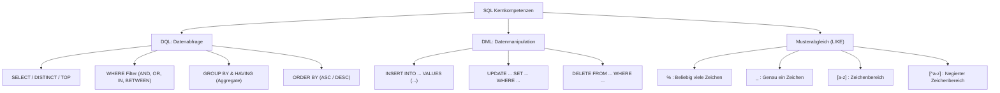
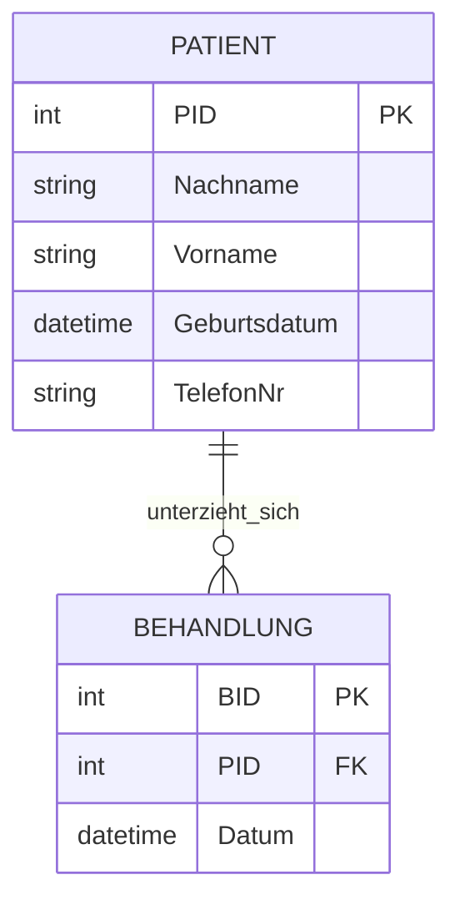
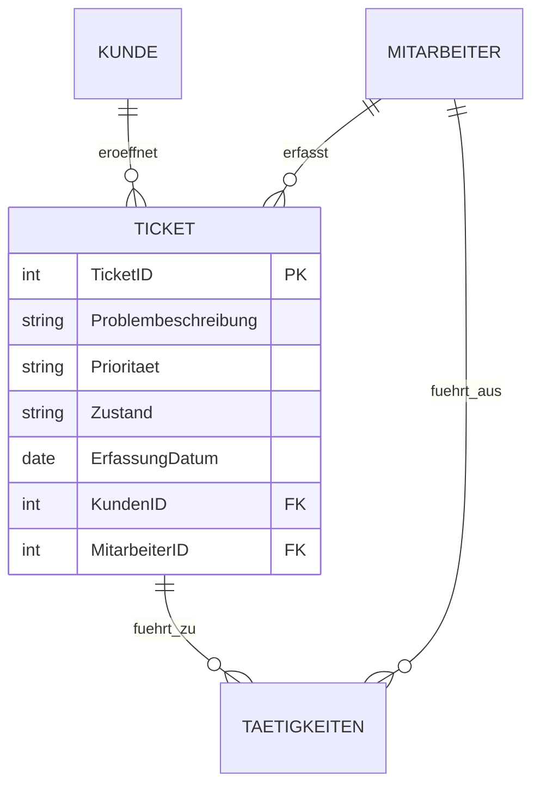

# 📅 Day_13: Große SQL-Wiederholung & IHK-Prüfungstraining

## ℹ️ Kurs-Informationen
*   **Datum:** Mittwoch, 19.08.2026
*   **Arbeitszeit:** 08:15 - 16:00 Uhr
*   **Dozent:** Tom S.
*   **Autor:** Tobias Boyke

---

## 🎯 Lernziele des Tages
- [x] **Umfassende Wiederholung:** Festigung aller bisherigen SQL-Konzepte (DQL & DML) anhand umfangreicher Aufgabenkomplexe auf der `ProjektDB`.
- [x] **Filterung & Pattern Matching:** Souveräne Anwendung von `LIKE`, Wildcards (`%`, `_`), Zeichenbereichen (`[...]`, `[^...]`) sowie das korrekte Escapen von Sonderzeichen.
- [x] **Sortierung & Aggregation:** Wiederholung von `ORDER BY`, `COUNT()`, `SUM()`, `AVG()`, `MIN()`, `MAX()` und das Vermeiden typischer `NULL`-Fallen.
- [x] **Gruppierung (GROUP BY & HAVING):** Sichere Trennung von Zeilenfilterung (`WHERE`) und Aggregatfilterung (`HAVING`) sowie Anwendung der "Goldenen Regel".
- [x] **DML-Operationen:** Präzises Einfügen (`INSERT`), Ändern (`UPDATE`) und Löschen (`DELETE`) von Daten.
- [x] **IHK-Prüfungsvorbereitung:** Bearbeitung und Analyse realer IHK-Abschlussprüfungsaufgaben aus diversen Fachinformatiker-Prüfungssätzen inklusive Fehleranalyse und ERD-Interpretation.

---

## 📖 Theorie & Konzepte: Der Wiederholungs-Spickzettel



### 1. Pattern Matching & Wildcards mit `LIKE`

In T-SQL bietet die `LIKE`-Klausel mächtige Möglichkeiten zum Mustervergleich:

| Muster | Bedeutung | Beispiel | Treffer |
| :--- | :--- | :--- | :--- |
| `'M%'` | Beginnt mit `M` | `WHERE nachname LIKE 'M%'` | *Meier, Müller, Mozer* |
| `'_u%'` | Zweiter Buchstabe ist `u` | `WHERE nachname LIKE '_u%'` | *Huber, Fuchs* |
| `'_____'` | Exakt 5 Zeichen lang | `WHERE vorname LIKE '_____'` | *Klaus, Petra* |
| `'%[aeiou]'` | Endet auf einen Vokal | `WHERE vorname LIKE '%[aeiou]'` | *Petra, Gabriele* |
| `'_____[^aeiou]'` | Exakt 6 Zeichen, endet **nicht** auf Vokal | `WHERE vorname LIKE '_____[^aeiou]'` | *Rainer, Martin* |
| `'%[^aeiou]_'` | Vorletzter Buchstabe ist **kein** Vokal | `WHERE nachname LIKE '%[^aeiou]_'` | *Albrecht, Schubert* |
| `'%[%]%'` / `'%[_]%'` | Sucht nach den Sonderzeichen `%` oder `_` | `WHERE firma LIKE '%[%]%'` | *100% Sonderzeichen AG* |

> [!TIP]
> **Sonderzeichen maskieren:** In T-SQL können Sonderzeichen wie `%` oder `_` einfach in eckige Klammern gesetzt werden (`'[%]'` oder `'[_]'`). Alternativ kann die `ESCAPE`-Klausel genutzt werden (z. B. `WHERE spalte LIKE '%\%%' ESCAPE '\'`).

---

### 2. DML-Kompaktübersicht: INSERT, UPDATE, DELETE

| Operation | Syntax | Häufige IHK-Falle |
| :--- | :--- | :--- |
| **INSERT** | `INSERT INTO Tabellenname (Spalte1, Spalte2) VALUES (Wert1, Wert2);` | Spaltenliste weggelassen oder Datentypen nicht beachtet. |
| **UPDATE** | `UPDATE Tabellenname SET Spalte = NeuerWert WHERE Bedingung;` | **Fehlendes `WHERE`:** Überschreibt die gesamte Tabelle! |
| **DELETE** | `DELETE FROM Tabellenname WHERE Bedingung;` | **Attribut leeren vs. Zeile löschen:** Soll nur ein Feld geleert werden, nutzt man `UPDATE ... SET feld = NULL`, **nicht** `DELETE`! |

---

## 🎓 IHK-Prüfungsrelevanz: Reale Prüfungsaufgaben & Lösungen

Im Folgenden sind die 6 IHK-Prüfungsszenarien aus den Kursmaterialien mit Fragestellung, Punktevergabe, typischen Fallstricken und Musterlösungen dokumentiert.

👉 **[ihk_pruefungsaufgaben.sql](./src/ihk_pruefungsaufgaben.sql)**

---

### 📝 Prüfung 1: Fahrdienst-Verwaltung (`Fahrt`)

**Relationenschema:**
`Fahrt (Fahrt_nr [PK], Datum, Fahrtstrecke_km, Ort, Anzahl_Fahrgaeste, Preis_Fahrt, Preis_Zusatzleistung)`

#### ba) Längste Fahrtstrecke ermitteln (3 Punkte)
* **Aufgabe:** Ausgabe der Länge der längsten Fahrtstrecke in km, die bei einer Fahrt zurückgelegt wurde. Es soll der Alias `km` verwendet werden.
```sql
SELECT MAX(Fahrtstrecke_km) AS km
FROM Fahrt;
```

#### bb) Fahrgäste einer Einzelfahrt (3 Punkte)
* **Aufgabe:** Ausgabe der Anzahl der Fahrgäste, die auf der Fahrt Nr. 2367 befördert wurden.
```sql
SELECT Anzahl_Fahrgaeste
FROM Fahrt
WHERE Fahrt_Nr = 2367;
```

#### bc) Tagesumsatz ohne Zusatzleistungen (4 Punkte)
* **Aufgabe:** Ausgabe der Summe aller Preise pro Fahrt ohne Zusatzleistungen der am 10.11.2017 durchgeführten Fahrten.
```sql
SELECT SUM(Preis_Fahrt)
FROM Fahrt
WHERE Datum = '2017-11-10'; -- bzw. '10.11.2017'
```

#### bd) Neuen Datensatz anlegen (4 Punkte)
* **Aufgabe:** Neuen Datensatz für Fahrt Nr. 6789 einfügen, die am 10.11.2017 in Hamburg zum Fahrtpreis von 35,50 EUR durchgeführt wurde. Weitere Daten liegen noch nicht vor.
```sql
INSERT INTO Fahrt (Fahrt_nr, Datum, Ort, Preis_Fahrt)
VALUES (6789, '2017-11-10', 'Hamburg', 35.50);
```

#### be) Preisanpassung durchführen (4 Punkte)
* **Aufgabe:** Für die Fahrt Nr. 3333 den Preis für Zusatzleistungen um 10,30 EUR erhöhen.
```sql
UPDATE Fahrt
SET Preis_Zusatzleistung = Preis_Zusatzleistung + 10.30
WHERE Fahrt_Nr = 3333;
```

---

### 📝 Prüfung 2: Mitarbeiterverwaltung Fidule GmbH (Fehleranalyse)

**Relationenschema:**
`Mitarbeiter (MitarbeiterNr [PK], Name, Vorname, Geburtsdatum, TelefonPrivat)`

**Szenario:** Es soll die private Telefonnummer von Frank Müller mit Mitarbeiter-Nr. 123 gelöscht werden. Folgende Anweisung wurde vorgelegt:
```sql
DELETE FROM Mitarbeiter WHERE Name = "Müller" AND Vorname = "Frank";
```

#### ca) Analyse des Fehlers (2 Punkte)
> **IHK-Musterantwort:**
> Die Anweisung führt nicht zum gewünschten Ergebnis, da der `DELETE`-Befehl den **gesamten Datensatz** (bzw. alle Mitarbeiter mit dem Namen Frank Müller) vollständig aus der Datenbank löscht, anstatt lediglich die private Telefonnummer zu entfernen.

#### cb) Korrekte SQL-Anweisung (2 Punkte)
```sql
UPDATE Mitarbeiter
SET TelefonPrivat = NULL
WHERE MitarbeiterNr = 123;
```

---

### 📝 Prüfung 3: Medizinisches Versorgungszentrum (`Patient` / `Behandlung`)



#### ca) Namensabfrage mit Sortierung (4 Punkte)
* **Aufgabe:** Alle Patienten (Nachname, Vorname) abfragen, deren Nachname mit einem „M“ beginnt. Aufsteigend nach Nachname sortieren.
```sql
SELECT Nachname, Vorname
FROM Patient
WHERE Nachname LIKE 'M%'
ORDER BY Nachname ASC;
```

#### cb) Telefonnummer aktualisieren (3 Punkte)
* **Aufgabe:** Die Telefonnummer des Patienten mit der PID 734 auf „0162 - 1234567“ ändern.
```sql
UPDATE Patient
SET TelefonNr = '0162 - 1234567'
WHERE PID = 734;
```

#### cc) Anzahl der Behandlungen in Zeitraum (4 Punkte)
* **Aufgabe:** Anzahl der Behandlungen ermitteln, die im Januar 2019 durchgeführt wurden.
```sql
SELECT COUNT(*)
FROM Behandlung
WHERE YEAR(Datum) = 2019 AND MONTH(Datum) = 1;

-- Zulässige Alternativen:
-- WHERE Datum BETWEEN '2019-01-01 00:00:00' AND '2019-01-31 23:59:59';
-- WHERE Datum >= '2019-01-01 00:00:00' AND Datum <= '2019-01-31 23:59:59';
```

---

### 📝 Prüfung 4: IT-Ticketsystem



#### cb) Ticketverteilung nach Priorität (2 Punkte)
* **Aufgabe:** Anzahl der Tickets pro Priorität ermitteln. Ausgabe soll Priorität und die dazugehörige Anzahl enthalten.
```sql
SELECT Prioritaet, COUNT(TicketID) AS Anzahl
FROM Ticket
GROUP BY Prioritaet;
```

#### cc) Anzahl der aktiven Kunden mit Tickets (3 Punkte)
* **Aufgabe:** Ermitteln, wie viele unterschiedliche Kunden mindestens ein Ticket in der Ticketdatenbank eröffnet haben.
```sql
SELECT COUNT(DISTINCT KundenID) AS Anzahl
FROM Ticket;
```

#### cd) SQL-Codeanalyse & Interpretation (3 Punkte)
**Vorgelegter SQL-Code:**
```sql
SELECT Problembeschreibung, Prioritaet, Zustand, ErfassungDatum 
FROM Ticket 
WHERE Month(NOW()) - Month(ErfassungDatum) > 2 AND Zustand = "offen" 
ORDER BY ErfassungDatum ASC;
```
> **IHK-Musterantwort:**
> Die Abfrage selektiert alle Tickets mit dem Zustand `"offen"`, deren Erfassungsdatum mehr als zwei Monate zurückliegt. Ausgegeben werden Problembeschreibung, Priorität, Zustand und Erfassungsdatum, aufsteigend sortiert nach dem Erfassungsdatum (älteste Tickets zuerst).

---

### 📝 Prüfung 5: KFZ-Versicherungsdatenbank

#### da) Durchschnittliche Versicherungssumme (3 Punkte)
* **Aufgabe:** Durchschnittliche Versicherungssumme über alle KFZ-Versicherungsverträge ermitteln.
```sql
SELECT AVG(Versicherung_Summe)
FROM KFZ_Versicherung;
```

#### db) Gezielte Vertragsselektion (4 Punkte)
* **Aufgabe:** Versicherungsnummern (VID) ermitteln, die im Mai 2022 abgeschlossen wurden, eine maximale Versicherungssumme von über 100.000,00 EUR aufweisen und bei denen das Fahrzeug **nicht** in einer Garage abgestellt wird.
```sql
SELECT VID
FROM KFZ_Versicherung
WHERE YEAR(Vertragsbeginn) = 2022 
  AND MONTH(Vertragsbeginn) = 5 
  AND Versicherung_Summe > 100000 
  AND Garage = 0; -- bzw. Garage = false
```

---

### 📝 Prüfung 6: Wellpappe-Produktionsdatenbank

**Relationenschema:**
`ProductionData (OrderID [PK], Width, Length, Thickness, Quantity)` *(alle Werte in Millimeter bzw. Stück)*

#### aa) Auftragsdaten anzeigen (3 Punkte)
* **Aufgabe:** Breite, Länge, Dicke und Anzahl der OrderID 736298 ausgeben. Die OrderID soll **nicht** in der Ergebnismenge enthalten sein.
```sql
SELECT Width, Length, Thickness, Quantity
FROM ProductionData
WHERE OrderID = 736298;
```

#### ab) Anzahl der Aufträge nach Dicke (4 Punkte)
* **Aufgabe:** Wie viele Produktionsaufträge mit einer Dicke von 2 mm wurden bisher in der Datenbank gespeichert?
```sql
SELECT COUNT(*)
FROM ProductionData
WHERE Thickness = 2;
```

#### ac) Gesamtstückzahl gefertigter Wellpappen (4 Punkte)
* **Aufgabe:** Gesamtzahl gefertigter Wellpappen (`Quantity`) mit Dicke 2 mm, Breite 200 mm und Länge 300 mm ermitteln.
```sql
SELECT SUM(Quantity)
FROM ProductionData
WHERE Width = 200 
  AND Length = 300 
  AND Thickness = 2;
```

---

## 💻 Praktische Übungen: Aufgaben & Lösungen (ProjektDB)

### Teil 1: Wiederholungen 1 (Aufgaben 20.1 – 20.20)
👉 **[wiederholung_grundlagen_und_filterung.sql](./src/wiederholung_grundlagen_und_filterung.sql)**

#### Aufgabe 20.1
```sql
-- Finden Sie die Namen und Id aller Abteilungen, die in Ulm ihren Sitz haben.
SELECT bezeichnung, id
FROM Abteilung
WHERE ort = 'Ulm';
```

#### Aufgabe 20.2
```sql
-- Nennen Sie die Vor- und Nachnamen aller Mitarbeiter, deren Personalnummer >= 23456 ist.
SELECT vorname, nachname
FROM Mitarbeiter
WHERE id >= 23456;
```

#### Aufgabe 20.3
```sql
-- Mitarbeiter-Id, Projektnummer und Aufgabe der Gruppenleiter in Projekten 1, 2 oder 3.
SELECT mit_id, pro_id, aufgabe
FROM Arbeit
WHERE pro_id IN (1, 2, 3) 
  AND aufgabe = 'Gruppenleiter';
```

#### Aufgabe 20.4
```sql
-- Id, Umsatz und Datum für alle Einzelumsätze < 1000 € im Jahr 2018.
SELECT mit_id, umsatz, datum
FROM Umsatz
WHERE YEAR(datum) = 2018 
  AND umsatz < 1000;
```

#### Aufgabe 20.5
```sql
-- Personalnummer und Nachname der Mitarbeiter, die NICHT in den Abteilungen 2, 3 und 4 arbeiten.
SELECT id, nachname
FROM Mitarbeiter
WHERE abt_id NOT IN (2, 3, 4);
```

#### Aufgabe 20.6
```sql
-- Alle Mitarbeiter mit Personalnummer 29346, 28559 oder 25348.
SELECT id, nachname, vorname, abt_id, ort, chef_id
FROM Mitarbeiter
WHERE id IN (29346, 28559, 25348);
```

#### Aufgabe 20.7
```sql
-- Alle Mitarbeiter, deren Wohnort weder München noch Landshut ist.
SELECT id, nachname, vorname, abt_id, ort, chef_id
FROM Mitarbeiter
WHERE ort NOT IN ('München', 'Landshut');
```

#### Aufgabe 20.8
```sql
-- Id der Mitarbeiter, die Projektleiter sind und vor oder nach 2018 eingestellt wurden.
SELECT mit_id
FROM Arbeit
WHERE aufgabe = 'Projektleiter' 
  AND (YEAR(beginn) < 2018 OR YEAR(beginn) > 2018);
```

#### Aufgabe 20.9
```sql
-- Personal- und Projektnummer aller Mitarbeiter in Projekten 1 oder 5 ohne festgelegte Aufgabe.
SELECT mit_id, pro_id
FROM Arbeit
WHERE pro_id IN (1, 5) 
  AND aufgabe IS NULL;
```

#### Aufgabe 20.10
```sql
-- Firmennamen aller Kunden aufsteigend sortiert nach Firmenname.
SELECT firma
FROM Kunde
ORDER BY firma ASC;
```

#### Aufgabe 20.11
```sql
-- Umsätze 2019 sortiert nach Mitarbeiter-Id (ASC) und Datum (DESC).
SELECT id, mit_id, datum, umsatz
FROM Umsatz
WHERE YEAR(datum) = 2019
ORDER BY mit_id ASC, datum DESC;
```

#### Aufgabe 20.12
```sql
-- Mitarbeiter im Projekt 3 ODER Gruppenleiter in beliebigem Projekt. Sortiert nach pro_id, aufgabe.
SELECT mit_id, pro_id, aufgabe
FROM Arbeit
WHERE pro_id = 3 OR aufgabe = 'Gruppenleiter'
ORDER BY pro_id ASC, aufgabe ASC;
```

#### Aufgabe 20.13
```sql
-- Nachname und Id aller Mitarbeiter, deren Name mit "M" beginnt.
SELECT nachname, id
FROM Mitarbeiter
WHERE nachname LIKE 'M%';
```

#### Aufgabe 20.14
```sql
-- Nachname, Vorname und Id aller Mitarbeiter mit "u" als 2. Buchstaben im Nachnamen.
SELECT nachname, vorname, id
FROM Mitarbeiter
WHERE nachname LIKE '_u%';
```

#### Aufgabe 20.15
```sql
-- Mitarbeiter, deren Nachname NICHT mit "er" und NICHT mit "t" endet.
SELECT vorname, nachname
FROM Mitarbeiter
WHERE nachname NOT LIKE '%er' 
  AND nachname NOT LIKE '%t';
```

#### Aufgabe 20.16
```sql
-- Suche nach Kunden mit Sonderzeichen '_' oder '%' im Namen oder Ort.
SELECT firma, ort
FROM Kunde
WHERE firma LIKE '%[%]%' 
   OR ort LIKE '%[_]%'
   OR firma LIKE '%[_]%' 
   OR ort LIKE '%[%]%';
```

#### Aufgabe 20.17
```sql
-- Mitarbeiter, deren Nachname mindestens drei Vokale enthält.
SELECT id, nachname, vorname, abt_id, ort, chef_id
FROM Mitarbeiter
WHERE nachname LIKE '%[aeiou]%[aeiou]%[aeiou]%';
```

#### Aufgabe 20.18
```sql
-- Mitarbeiter, deren Vorname aus genau fünf Buchstaben besteht.
SELECT id, nachname, vorname, abt_id, ort, chef_id
FROM Mitarbeiter
WHERE vorname LIKE '_____';
```

#### Aufgabe 20.19
```sql
-- Mitarbeiter mit genau 6 Buchstaben im Vornamen, der NICHT auf einen Vokal endet.
SELECT id, nachname, vorname, abt_id, ort, chef_id
FROM Mitarbeiter
WHERE vorname LIKE '_____[^aeiou]';
```

#### Aufgabe 20.20
```sql
-- Mitarbeiter, bei denen der vorletzte Buchstabe im Nachnamen KEIN Vokal ist.
SELECT id, nachname, vorname, abt_id, ort, chef_id
FROM Mitarbeiter
WHERE nachname LIKE '%[^aeiou]_';
```

---

### Teil 2: Wiederholungen 2 (Aufgaben 21.1 – 21.12)
👉 **[wiederholung_aggregation_und_gruppierung.sql](./src/wiederholung_aggregation_und_gruppierung.sql)**

#### Aufgabe 21.1
```sql
-- Kleinste Personalnummer der Mitarbeiter.
SELECT MIN(id) AS minimum
FROM Mitarbeiter;
```

#### Aufgabe 21.2
```sql
-- Summe aller Gehälter der Mitarbeiter.
SELECT SUM(gehalt) AS summe
FROM Gehalt;
```

#### Aufgabe 21.3
```sql
-- Arithmetischer Mittelwert der Projektmittel unter 100.000 €.
SELECT AVG(mittel) AS durchschnitt
FROM Projekt
WHERE mittel < 100000;
```

#### Aufgabe 21.4
```sql
-- Kleinster Umsatz, der je erzielt wurde.
SELECT MIN(umsatz) AS umsatz
FROM Umsatz;
```

#### Aufgabe 21.5
```sql
-- In wie vielen verschiedenen Projekten werden die einzelnen Aufgaben ausgeübt (ohne NULL)?
SELECT aufgabe, COUNT(DISTINCT pro_id) AS anzahl
FROM Arbeit
WHERE aufgabe IS NOT NULL
GROUP BY aufgabe;
```

#### Aufgabe 21.6
```sql
-- Anzahl der Mitarbeiter in jedem Projekt.
SELECT pro_id, COUNT(mit_id) AS anzahl
FROM Arbeit
GROUP BY pro_id;
```

#### Aufgabe 21.7
```sql
-- Anzahl unterschiedlicher Mitarbeiter je Aufgabe (inkl. NULL).
SELECT aufgabe, COUNT(DISTINCT mit_id) AS anzahl
FROM Arbeit
GROUP BY aufgabe;
```

#### Aufgabe 21.8
```sql
-- Anzahl "echter" Aufgaben für Mitarbeiter mit Id < 20000.
SELECT mit_id, COUNT(aufgabe) AS anzahl
FROM Arbeit
WHERE mit_id < 20000
GROUP BY mit_id;
```

#### Aufgabe 21.9
```sql
-- Alle Projekte (pro_id) mit weniger als 4 Mitarbeitern.
SELECT pro_id, COUNT(mit_id) AS mitarbeiter
FROM Arbeit
GROUP BY pro_id
HAVING COUNT(mit_id) < 4;
```

#### Aufgabe 21.10
```sql
-- Alle Mitarbeiter, die in mehr als einem Projekt arbeiten.
SELECT mit_id, COUNT(pro_id) AS projekte
FROM Arbeit
GROUP BY mit_id
HAVING COUNT(pro_id) > 1;
```

#### Aufgabe 21.11
```sql
-- Tage mit mehr als 50.000 € Gesamtumsatz.
SELECT datum, SUM(umsatz) AS umsatz
FROM Umsatz
GROUP BY datum
HAVING SUM(umsatz) > 50000;
```

#### Aufgabe 21.12
```sql
-- Gehälter, die jeweils von genau einem Mitarbeiter bezogen werden.
SELECT gehalt, COUNT(mit_id) AS mitarbeiter
FROM Gehalt
GROUP BY gehalt
HAVING COUNT(mit_id) = 1;
```

---

## 💡 Wichtige Notizen & Prüfungstipps

> [!IMPORTANT]
> **IHK-Regel: NULL-Prüfungen niemals mit Gleichheitszeichen!**
> In Prüfungen wird streng darauf geachtet: `WHERE aufgabe = NULL` ist syntaktisch falsch bzw. liefert nie Datensätze zurück (`UNKNOWN`). Immer `IS NULL` oder `IS NOT NULL` verwenden!

> [!WARNING]
> **DELETE vs. UPDATE SET NULL:**
> Bei Prüfungsfragen wie *"Löschen Sie die Telefonnummer des Kunden"* ist fast immer ein `UPDATE Tabelle SET Telefon = NULL WHERE ...` gemeint. Ein `DELETE` löscht die vollständige Zeile!

> [!TIP]
> **COUNT(*) vs. COUNT(spalte) vs. COUNT(DISTINCT spalte):**
> * `COUNT(*)`: Zählt alle Ergebniszeilen, unabhängig von `NULL`-Werten.
> * `COUNT(spalte)`: Zählt nur Zeilen, bei denen die angegebene Spalte **nicht** `NULL` ist.
> * `COUNT(DISTINCT spalte)`: Zählt nur eindeutige (verschiedene), nicht-`NULL`-Werte.