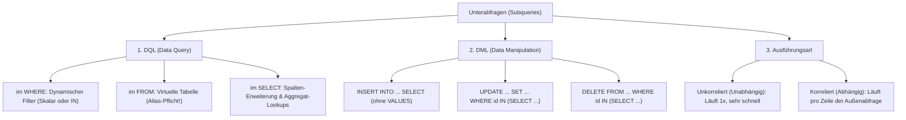

# 📅 Day_14: Unterabfragen (Subqueries & Subselects in DQL & DML)

## ℹ️ Kurs-Informationen
*   **Datum:** Donnerstag, 20.08.2026
*   **Arbeitszeit:** 08:15 - 16:00 Uhr
*   **Dozent:** Tom S.
*   **Autor:** Tobias Boyke

---

## 🎯 Lernziele des Tages
- [x] **Grundprinzip & Wirkungsweise:** Verständnis von Unterabfragen als innere Abfragen (`SELECT`), die zuerst ausgewertet und wie dynamische Parameter/Variablen an die äußere Abfrage übergeben werden.
- [x] **Die 3 Typen von Unterabfragen:**
  - *Skalar:* Liefert genau 1 Wert (1 Zeile, 1 Spalte) für Vergleiche (`=`, `<`, `>`).
  - *Listen-Unterabfrage:* Liefert 1 Spalte mit mehreren Zeilen für Mengenoperatoren (`IN`, `NOT IN`).
  - *Tabellen-Unterabfrage (Derived Table):* Liefert eine virtuelle Tabelle im `FROM` mit **T-SQL Alias-Pflicht**.
- [x] **DQL-Einsatzorte:** Souveräner Einsatz von Subqueries in der `SELECT`-, `FROM`- und `WHERE`/`HAVING`-Klausel.
- [x] **DML-Unterabfragen:** Dynamische Datenmanipulation mit `INSERT INTO ... SELECT` (ohne `VALUES`), `UPDATE` und `DELETE` über Subqueries.
- [x] **Korreliert vs. Unkorreliert:** Erkennen des Unterschieds zwischen einmaliger Ausführung (autark) und zeilenweiser Berechnung (abhängig).
- [x] **Fehlerprävention (Fehlercode 512):** Vermeiden von Skalaritäts-Fehlern durch konsequente Nutzung von `IN` statt `=`.
- [x] **Praktische Übungen:** Erfolgreiche Bearbeitung der Übungsreihen *ProjektDB 05 - Subqueries 1 & 2* (Aufgaben 5.1 bis 5.14: einfache, mehrstufig verschachtelte und korrelierte Unterabfragen).

---

## 📖 Theorie & Konzepte: Der große Subquery-Spickzettel



---

### 1. Die 3 Typen von Unterabfragen nach Rückgabewert

| Typ | Rückgabe | Operatoren / Verwendung | Typisches Beispiel |
| :--- | :--- | :--- | :--- |
| **1. Skalare Unterabfrage** | Genau **1 Wert** (1 Zeile, 1 Spalte) | `=`, `<>`, `<`, `>`, `<=`, `>=`, `+`, `-` | `WHERE gehalt > (SELECT AVG(gehalt) FROM Mitarbeiter)` |
| **2. Listen-Unterabfrage** | **1 Spalte**, mehrere Zeilen | `IN`, `NOT IN`, `ANY`, `ALL` | `WHERE abt_id IN (SELECT id FROM Abteilung WHERE ort = 'Ulm')` |
| **3. Tabellen-Unterabfrage** | Komplette Tabelle (**n Spalten, n Zeilen**) | Im `FROM` als temporäre Tabelle (*Derived Table*) | `FROM (SELECT id, nachname FROM Mitarbeiter) AS team` |

> [!IMPORTANT]
> **Die goldene Regel für Unterabfragen:**
> Die innere Abfrage steht **immer in runden Klammern `(...)`**.

---

### 2. DQL-Unterabfragen: Wo stehen sie und was tun sie?

#### A. Unterabfrage im `WHERE` (Der dynamische Filter)
Statt statischer Schwellenwerte (`WHERE gehalt > 4000`) berechnet die innere Abfrage den Grenzwert live aus der Datenbank:
```sql
-- Wer verdient weniger als der Unternehmensdurchschnitt?
SELECT vorname, nachname, gehalt
FROM Mitarbeiter
WHERE gehalt < (SELECT AVG(gehalt) FROM Mitarbeiter);
```

#### B. Unterabfrage im `FROM` (Die virtuelle Tabelle / Derived Table)
Die Unterabfrage erzeugt im Speicher eine temporäre Ergebnismenge, die sich wie eine echte Tabelle verhält.

> [!CAUTION]
> **Eiserne T-SQL-Regel: Der Alias im `FROM` ist PFLICHT!**
> Wird der Alias weggelassen, bricht der SQL Server sofort mit dem Fehler `Falsche Syntax in der Nähe von...` ab.

```sql
SELECT team.nachname, team.gehalt
FROM (
    SELECT id, nachname, gehalt, abt_id 
    FROM Mitarbeiter 
    WHERE gehalt > 3000
) AS team -- <-- PFLICHT-ALIAS!
WHERE team.abt_id = 2;
```
* **Spalten-Sichtbarkeit:** Die äußere Abfrage sieht nur Spalten, die in der inneren `SELECT`-Klausel explizit bereitgestellt wurden.
* **Präfix-Nutzung:** Bei Namensgleichheiten oder zur besseren Lesbarkeit Spalten über `team.spalte` ansprechen.

#### C. Unterabfrage im `SELECT` (Die Spalten-Erweiterung)
Wird verwendet, um für jede Zeile des Hauptberichts dynamisch einen Einzelwert (z. B. Anzahl oder Differenz) einzublenden:
```sql
-- Zeige Mitarbeiter und direkt daneben die Anzahl der Projekte
SELECT 
    m.nachname,
    (SELECT COUNT(*) FROM Arbeit AS a WHERE a.mit_id = m.id) AS anzahl_projekte
FROM Mitarbeiter AS m;
```

---

### 3. Unkorreliert vs. Korreliert

* **Unkorreliert (Unabhängig):**
  * Die innere Abfrage ist autark und benötigt keine Daten von außen.
  * Sie wird vom DBMS **genau 1 Mal** ausgeführt. Das ist extrem performant.
* **Korreliert (Abhängig):**
  * Die innere Abfrage referenziert eine Spalte der äußeren Tabelle (z. B. `WHERE a.mit_id = m.id`).
  * Das DBMS muss die innere Abfrage **für jede einzelne Zeile** der äußeren Abfrage neu ausführen.

---

### 4. DML-Unterabfragen: INSERT, UPDATE & DELETE

Subqueries ermöglichen es, Datenänderungen von komplexen Kriterien aus verknüpften Tabellen abhängig zu machen.

#### 1. `INSERT` mit Unterabfrage (Tabellenkopie / Archivierung)
* **Wichtig:** Das Schlüsselwort `VALUES` fällt komplett weg!
```sql
-- Archiviert alle Mitarbeiter der Abteilung 3
INSERT INTO Mitarbeiter_Archiv (id, nachname, vorname)
SELECT id, nachname, vorname 
FROM Mitarbeiter 
WHERE abt_id = 3;
```

#### 2. `UPDATE` mit Unterabfrage
```sql
-- 10% Gehaltserhöhung für Mitarbeiter im Projekt 'Alpha'
UPDATE Mitarbeiter
SET gehalt = gehalt * 1.10
WHERE id IN (
    SELECT mit_id 
    FROM Arbeit 
    WHERE pro_id = (SELECT id FROM Projekt WHERE bezeichnung = 'Alpha')
);
```

#### 3. `DELETE` mit Unterabfrage
```sql
-- Lösche Umsätze von Mitarbeitern der Marketing-Abteilung
DELETE FROM Umsatz
WHERE mit_id IN (
    SELECT id 
    FROM Mitarbeiter 
    WHERE abt_id = (SELECT id FROM Abteilung WHERE bezeichnung = 'Marketing')
);
```

---

### 5. Der T-SQL Stolperstein: Fehlercode 512 (Skalaritäts-Fehler)

```text
Meldung 512, Ebene 16, Status 1:
Die Unterabfrage hat mehr als einen Wert zurückgegeben. Das ist nicht zulässig, wenn die Unterabfrage auf =, !=, <, <=, >, >= folgt oder als Ausdruck verwendet wird.
```

> [!WARNING]
> **Die Daumenregel:**
> Wenn nicht zu 100 % garantiert ist, dass die Unterabfrage genau eine einzige Zeile liefert, im `WHERE` **immer `IN` statt `=`** verwenden!

---

## 💻 Praktische Übungen: Aufgaben & Lösungen (ProjektDB 05)

👉 **[unterabfragen_grundlagen.sql](./src/unterabfragen_grundlagen.sql)**

---

### 📂 Teil 1: Einfache & verschachtelte Unterabfragen (Aufgaben 5.1 – 5.8)

#### 📝 Aufgabe 5.1: Kleinste Personalnummer
* **Aufgabenstellung:** Nennen Sie Personalnummer und Name des Mitarbeiters mit der kleinsten Personalnummer. Nutzen Sie eine einfache Unterabfrage.
* **Erwartete Ausgabe:**
  ```text
  id    nachname
  2581  Kaufmann
  ```

```sql
SELECT id, nachname
FROM Mitarbeiter
WHERE id = (SELECT MIN(id) FROM Mitarbeiter);
```

---

#### 📝 Aufgabe 5.2: Abteilungsnummern der Projekt-3-Mitarbeiter
* **Aufgabenstellung:** Nennen Sie die Abteilungsnummern der Mitarbeiter, die in Projekt 3 arbeiten. Nutzen Sie eine einfache Unterabfrage.
* **Erwartete Ausgabe:**
  ```text
  abt_id
  a2
  a2
  a3
  a5
  ```

```sql
SELECT abt_id
FROM Mitarbeiter
WHERE id IN (SELECT mit_id 
             FROM Arbeit 
             WHERE pro_id = 3);
```

---

#### 📝 Aufgabe 5.3: Mitarbeiter mit überdurchschnittlichem Gehalt
* **Aufgabenstellung:** Erstellen Sie eine Liste der Ids aller Mitarbeiter, deren Gehalt über dem Durchschnitt liegt. Nutzen Sie eine einfache Unterabfrage.
* **Erwartete Ausgabe:**
  ```text
  mit_id
  5765
  9031
  17000
  22222
  28559
  29346
  ```

```sql
SELECT mit_id
FROM Gehalt
WHERE gehalt > (SELECT AVG(gehalt) FROM Gehalt);
```

---

#### 📝 Aufgabe 5.4: Projekte mit Mitarbeitern vor "Müller"
* **Aufgabenstellung:** Nennen Sie die Nummern aller Projekte, in denen Mitarbeiter arbeiten, deren Personalnummer kleiner als die Nummer des Mitarbeiters namens Müller ist. Nutzen Sie eine einfache Unterabfrage.
* **Erwartete Ausgabe:**
  ```text
  pro_id
  1
  3
  4
  5
  ```

```sql
SELECT DISTINCT pro_id
FROM Arbeit
WHERE mit_id < (SELECT id 
                FROM Mitarbeiter 
                WHERE nachname = 'Müller');
```
*💡 **Warum `DISTINCT`?** Da mehrere qualifizierte Mitarbeiter im selben Projekt arbeiten können, eliminiert `DISTINCT` doppelte Projektnummern.*

---

#### 📝 Aufgabe 5.5: Mitarbeiter in Ulmer Abteilungen
* **Aufgabenstellung:** Nennen Sie die Namen aller Mitarbeiter, die in einer Abteilung in Ulm arbeiten. Nutzen Sie eine einfache Unterabfrage.
* **Erwartete Ausgabe:**
  ```text
  nachname   vorname
  Krüger     Martin
  Schubert   Rolf
  Albrecht   Lena
  ```

```sql
SELECT nachname, vorname
FROM Mitarbeiter
WHERE abt_id IN (SELECT id 
                 FROM Abteilung 
                 WHERE ort = 'Ulm');
```

---

#### 📝 Aufgabe 5.6: Zuletzt eingestellter Projektleiter
* **Aufgabenstellung:** Finden Sie die Personalnummer des Projektleiters, der in dieser Position als letzter eingestellt wurde. Nutzen Sie eine einfache Unterabfrage.
* **Erwartete Ausgabe:**
  ```text
  mit_id
  2581
  ```

```sql
SELECT mit_id
FROM Arbeit
WHERE aufgabe = 'Projektleiter' 
  AND beginn = (SELECT MAX(beginn) 
                FROM Arbeit 
                WHERE aufgabe = 'Projektleiter');
```

---

#### 📝 Aufgabe 5.7: Mitarbeiter im Projekt "Apollo" (2-fach verschachtelt)
* **Aufgabenstellung:** Nennen Sie die Namen aller Mitarbeiter, die im Projekt "Apollo" arbeiten. Nutzen Sie zwei verschachtelte Unterabfragen.
* **Erwartete Ausgabe:**
  ```text
  nachname
  Meier
  Huber
  Krüger
  Mozer
  Probst
  ```

```sql
SELECT nachname
FROM Mitarbeiter
WHERE id IN (
    SELECT mit_id
    FROM Arbeit
    WHERE pro_id = (
        SELECT id
        FROM Projekt
        WHERE bezeichnung = 'Apollo'
    )
);
```

---

#### 📝 Aufgabe 5.8: Abteilungen im Projekt "Apollo" (3-fach verschachtelt)
* **Aufgabenstellung:** Zeigen Sie Abteilungsnummer und den Namen der Abteilungen für die Mitarbeiter an, die am Projekt "Apollo" mitarbeiten. Nutzen Sie drei verschachtelte Unterabfragen.
* **Erwartete Ausgabe:**
  ```text
  id   bezeichnung
  1    Beratung
  2    Diagnose
  3    Freigabe
  5    Verkauf
  ```

```sql
SELECT id, bezeichnung
FROM Abteilung
WHERE id IN (
    SELECT DISTINCT abt_id
    FROM Mitarbeiter
    WHERE id IN (
        SELECT mit_id
        FROM Arbeit
        WHERE pro_id = (
            SELECT id
            FROM Projekt
            WHERE bezeichnung = 'Apollo'
        )
    )
);
```

---

### 📂 Teil 2: Korrelierte Unterabfragen (Aufgaben 5.9 – 5.14)

#### 📝 Aufgabe 5.9: Projekt-Ids, Aufgaben und Mitarbeiternamen
* **Aufgabenstellung:** Geben Sie eine Liste der Projekt-Ids und Aufgaben aus und nennen Sie dazu den Namen des Mitarbeiters. Sortieren Sie die Ausgabe nach Projekt-Id und Aufgabe. Nutzen Sie eine korrelierte Unterabfrage im `SELECT`.
* **Erwartete Ausgabe:** (20 Zeilen)
  ```text
  pro_id  aufgabe         nachname
  1       NULL            Krüger
  1       NULL            Mozer
  1       Gruppenleiter   Meier
  1       Projektleiter   Huber
  1       Sachbearbeiter  Probst
  2       NULL            Probst
  ...
  ```

```sql
SELECT pro_id, 
       aufgabe,
       (SELECT nachname 
        FROM Mitarbeiter 
        WHERE id = Arbeit.mit_id) AS nachname
FROM Arbeit
ORDER BY pro_id, aufgabe;
```

---

#### 📝 Aufgabe 5.10: Erweiterung mit Projektnamen (2 Subqueries im SELECT)
* **Aufgabenstellung:** Erweitern Sie die Abfrage aus Aufgabe 5.9 und geben Sie zusätzlich auch den Projektnamen aus. Nutzen Sie zwei korrelierte Unterabfragen im `SELECT`.
* **Erwartete Ausgabe:** (20 Zeilen)
  ```text
  pro_id  bezeichnung  aufgabe         nachname
  1       Apollo       NULL            Krüger
  1       Apollo       NULL            Mozer
  1       Apollo       Gruppenleiter   Meier
  1       Apollo       Projektleiter   Huber
  1       Apollo       Sachbearbeiter  Probst
  2       Gemini       NULL            Probst
  ...
  ```

```sql
SELECT pro_id,
       (SELECT bezeichnung 
        FROM Projekt 
        WHERE id = Arbeit.pro_id) AS bezeichnung,
       aufgabe,
       (SELECT nachname 
        FROM Mitarbeiter 
        WHERE id = Arbeit.mit_id) AS nachname
FROM Arbeit
ORDER BY pro_id, aufgabe;
```

---

#### 📝 Aufgabe 5.11: Abteilungsliste mit Mitarbeiteranzahl
* **Aufgabenstellung:** Geben Sie eine Liste aller Abteilungsnamen aus. Geben Sie dazu aus, wie viele Mitarbeiter in der Abteilung arbeiten. Nutzen Sie eine korrelierte Unterabfrage im `SELECT`.
* **Erwartete Ausgabe:**
  ```text
  bezeichnung  anzahl
  Beratung     2
  Diagnose     3
  Freigabe     3
  Einkauf      4
  Verkauf      3
  ```

```sql
SELECT bezeichnung,
       (SELECT COUNT(*) 
        FROM Mitarbeiter 
        WHERE abt_id = Abteilung.id) AS anzahl
FROM Abteilung;
```

---

#### 📝 Aufgabe 5.12: Mitarbeiter-Ids mit Namen und Gehalt
* **Aufgabenstellung:** Geben Sie eine Liste aller Mitarbeiter-Ids mit Gehalt aus. Geben Sie dazu auch den Namen des Mitarbeiters aus. Nutzen Sie eine korrelierte Unterabfrage im `SELECT`.
* **Erwartete Ausgabe:** (15 Zeilen)
  ```text
  mit_id  nachname  gehalt
  2581    Kaufmann  3000,00
  5765    Schäfer   4500,00
  9031    Meier     4000,00
  9912    Wolf      3500,00
  10102   Huber     3500,00
  12121   Richter   3000,00
  ...
  ```

```sql
SELECT mit_id,
       (SELECT nachname 
        FROM Mitarbeiter 
        WHERE id = Gehalt.mit_id) AS nachname,
       gehalt
FROM Gehalt;
```

---

#### 📝 Aufgabe 5.13: Gehaltsanalyse mit Gesamtdurchschnitt & Differenz
* **Aufgabenstellung:** Erweitern Sie die Abfrage aus Aufgabe 5.12 und geben Sie zusätzlich noch das Durchschnitts-Gehalt aller Mitarbeiter aus. Zeigen Sie anschließend noch die Differenz des Mitarbeiters zum Durchschnitt an.
* **Erwartete Ausgabe:** (15 Zeilen)
  ```text
  mit_id  nachname  gehalt   durchschnitt  differenz
  2581    Kaufmann  3000,00  3633,3333     -633,3333
  5765    Schäfer   4500,00  3633,3333     866,6667
  9031    Meier     4000,00  3633,3333     366,6667
  9912    Wolf      3500,00  3633,3333     -133,3333
  10102   Huber     3500,00  3633,3333     -133,3333
  12121   Richter   3000,00  3633,3333     -633,3333
  ...
  ```

```sql
SELECT mit_id,
       (SELECT nachname 
        FROM Mitarbeiter 
        WHERE id = Gehalt.mit_id) AS nachname,
       gehalt,
       (SELECT AVG(gehalt) FROM Gehalt) AS durchschnitt,
       gehalt - (SELECT AVG(gehalt) FROM Gehalt) AS differenz
FROM Gehalt;
```

---

#### 📝 Aufgabe 5.14: Mitarbeiter & Abteilungen im Projekt "Apollo" (Kombinierte Subqueries)
* **Aufgabenstellung:** Zeigen Sie die Mitarbeiternamen und Abteilungsnamen der Mitarbeiter an, die im Projekt "Apollo" arbeiten. Nutzen Sie zwei verschachtelte Unterabfragen und eine korrelierte Unterabfrage im `SELECT`.
* **Erwartete Ausgabe:**
  ```text
  nachname  abteilung
  Meier     Diagnose
  Huber     Freigabe
  Krüger    Verkauf
  Mozer     Beratung
  Probst    Diagnose
  ```

```sql
SELECT nachname,
       (SELECT bezeichnung 
        FROM Abteilung 
        WHERE id = Mitarbeiter.abt_id) AS abteilung
FROM Mitarbeiter
WHERE id IN (
    SELECT mit_id
    FROM Arbeit
    WHERE pro_id = (
        SELECT id
        FROM Projekt
        WHERE bezeichnung = 'Apollo'
    )
);
```

---

## 💡 Wichtige Notizen & Prüfungstipps

> [!TIP]
> **Subquery vs. JOIN:**
> * **Unterabfrage mit `IN`:** Ideal, wenn nur gefiltert werden soll und keine Spalten der inneren Tabelle im Endergebnis ausgegeben werden müssen (verhindert ungewollte Zeilenvervielfachungen).
> * **JOIN:** Notwendig, wenn Attribute aus mehreren Tabellen gleichzeitig in der `SELECT`-Liste angezeigt werden sollen.

> [!WARNING]
> **Vorsicht bei `NOT IN` mit `NULL`:**
> Gibt eine Unterabfrage mit `NOT IN (SELECT ...)` mindestens einen `NULL`-Wert zurück, wird die gesamte Bedingung zu `UNKNOWN` ausgewertet und die Abfrage liefert **keine einzigen Ergebnisse**!
> **Lösung:** Immer mit `WHERE spalte IS NOT NULL` in der inneren Abfrage absichern.