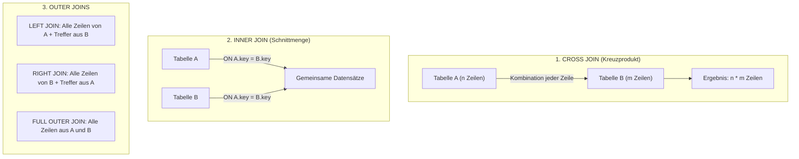

# 📅 Day_15: Tabellenverknüpfungen (JOINS in DQL)

## ℹ️ Kurs-Informationen

* **Datum:** Freitag, 21.08.2026
* **Arbeitszeit:** 08:15 - 16:00 Uhr
* **Dozent:** Tom S.
* **Autor:** Tobias Boyke

---

## 🎯 Lernziele des Tages

- [x] **Das Join-Prinzip verstehen:** Verknüpfen relationaler Tabellen über Primär- und Fremdschlüsselbeziehungen zur Vermeidung von Redundanz bei Abfragen.
- [x] **CROSS JOIN (Kartesisches Produkt / Kreuzprodukt):** Kombination aller Zeilen beider Tabellen ($n \times m$) und Abgrenzung zwischen SQL-89 (Komma-Trennung) und SQL-92 Syntax.
- [x] **INNER JOIN (Gleichheitsverbund / Schnittmenge):** Zusammenführen übereinstimmender Datensätze mit der `ON`-Klausel über 2, 3 oder mehr Tabellen (Multi-Table Joins).
- [x] **OUTER JOINS (LEFT, RIGHT, FULL OUTER JOIN):**
  - Beibehalten nicht-übereinstimmender Zeilen mit automatischer `NULL`-Auffüllung.
  - **Anti-Joins:** Gezieltes Identifizieren verwaister Datensätze (`WHERE spalte IS NULL`).
- [x] **SELF JOIN (Selbstreferenzielle Verknüpfung):** Abbilden hierarchischer Beziehungen (z. B. Mitarbeiter ➔ Vorgesetzter via `chef_id`) innerhalb derselben Tabelle.
- [x] **Join-Logik vs. Zeilenfilter (`ON` vs. `WHERE`):** Verstehen, wie sich Filterkriterien im `ON` und im `WHERE` bei Outer Joins fundamental unterscheiden.
- [x] **Profi-Aggregationen mit Joins:** Gruppierung verknüpfter Tabellen und String-Kompression mittels `STRING_AGG()`.

---

## 📖 Theorie & Konzepte: Der große JOIN-Spickzettel



---

### 1. Die Evolution der Join-Syntax: SQL-89 vs. SQL-92

In SQL existieren zwei syntaktische Schreibweisen für Tabellenverknüpfungen:

| Kriterium | SQL-89 (Veraltet / Implizit) | SQL-92 (ANSI-Standard / Explizit) |
| :--- | :--- | :--- |
| **Schreibweise** | Tabellen im `FROM` mit Komma getrennt, Verknüpfung im `WHERE` | Explizites Schlüsselwort `[INNER/LEFT/CROSS] JOIN` mit `ON`-Klausel |
| **Beispiel** | `SELECT * FROM Mitarbeiter m, Abteilung a WHERE m.abt_id = a.id;` | `SELECT * FROM Mitarbeiter m INNER JOIN Abteilung a ON m.abt_id = a.id;` |
| **Fehleranfälligkeit** | **Extrem hoch!** Wird das `WHERE` vergessen, entsteht unbemerkt ein gigantisches Kartesisches Produkt. | **Sicher!** Der SQL-Parser verlangt zwingend die `ON`-Bedingung. |
| **Trennung der Logik** | Vermischt Verknüpfungslogik und Datenfilterung im selben `WHERE`-Block. | Saubere Trennung: `ON` verbindet Tabellen, `WHERE` filtert Zeilen. |
| **Outer Joins** | Nicht standardisiert (proprietäre Zeichen wie `*=`, `=*` oder `(+)`). | Standardisiert über `LEFT OUTER JOIN`, `RIGHT OUTER JOIN`, `FULL OUTER JOIN`. |

> [!IMPORTANT]
> **Industriestandard:**
> Im professionellen Datenbankumfeld und in IHK-Prüfungen ist die **SQL-92 Syntax mit expliziten JOINs und ON-Klauseln** verbindlicher Standard!

---

### 2. Die JOIN-Typen im Detail

#### A. CROSS JOIN (Kartesisches Produkt / Kreuzprodukt / "Orgien-JOIN")
Kombiniert jede einzelne Zeile der linken Tabelle mit jeder Zeile der rechten Tabelle.

* **Zeilenanzahl:** $\text{Zeilen}(A) \times \text{Zeilen}(B)$ (z. B. $15 \text{ Mitarbeiter} \times 5 \text{ Abteilungen} = 75 \text{ Zeilen}$).
* **Syntax:**
  ```sql
  SELECT m.nachname, a.bezeichnung
  FROM Mitarbeiter AS m
  CROSS JOIN Abteilung AS a;
  ```
* **Praxisnutzen:** Erzeugen von Planungsmatrizen, Kalendertabellen, Schichtplänen oder Dimensionskombinationen.

---

#### B. INNER JOIN (Gleichheitsverbund / Schnittmenge)
Gibt nur die Zeilen zurück, bei denen der Verknüpfungsschlüssel in **beiden** Tabellen übereinstimmt:

```sql
SELECT m.nachname, a.bezeichnung AS abteilung
FROM Mitarbeiter AS m
INNER JOIN Abteilung AS a ON m.abt_id = a.id;
```

---

#### C. LEFT OUTER JOIN & RIGHT OUTER JOIN
Behält alle Zeilen der Quelltabelle (links bzw. rechts), selbst wenn in der verknüpften Zieltabelle **kein Partnerdatensatz** existiert (die fehlenden Werte werden mit `NULL` aufgefüllt):

* **LEFT JOIN:** Behält alle Mitarbeiter (auch ohne Abteilung).
* **RIGHT JOIN:** Behält alle Abteilungen (auch ohne Mitarbeiter).

```sql
-- Alle Mitarbeiter anzeigen (auch wenn keine Abteilung zugeordnet ist):
SELECT m.nachname, a.bezeichnung AS abteilung
FROM Mitarbeiter AS m
LEFT OUTER JOIN Abteilung AS a ON m.abt_id = a.id;
```

---

#### D. Anti-Join: Verwaiste Datensätze finden
Kombiniert man einen `LEFT JOIN` mit einer `WHERE ... IS NULL`-Prüfung auf den Primärschlüssel der rechten Tabelle, erhält man exakt die Datensätze, die **keine Beziehung** besitzen:

```sql
-- Finde alle Abteilungen, in denen KEIN Mitarbeiter arbeitet:
SELECT a.id, a.bezeichnung
FROM Abteilung AS a
LEFT JOIN Mitarbeiter AS m ON a.id = m.abt_id
WHERE m.id IS NULL;
```

---

#### E. SELF JOIN (Selbstreferenz / Rekursive Verknüpfung)
Verknüpft eine Tabelle mit sich selbst über zwei verschiedene Aliase. Typischer Anwendungsfall: Mitarbeiter und ihr Vorgesetzter (`chef_id` ➔ `id`).

```sql
SELECT m.nachname AS mitarbeiter,
       ISNULL(c.nachname, '-> Geschäftsführung') AS vorgesetzter
FROM Mitarbeiter AS m
LEFT JOIN Mitarbeiter AS c ON m.chef_id = c.id;
```

---

### 3. Der kritische Unterschied: `ON` vs. `WHERE` bei Outer Joins

> [!CAUTION]
> **Häufige Fehlerquelle bei LEFT JOINS:**
> * Kriterien im **`ON`** steuern, welche Zeilen der rechten Tabelle verknüpft werden. Die linke Tabelle bleibt **vollständig erhalten**!
> * Kriterien im **`WHERE`** filtern das Gesamtergebnis **nach** dem Join. Ein Filter wie `WHERE a.ort = 'Ulm'` filtert alle Zeilen mit `NULL` heraus und macht den `LEFT JOIN` unbemerkt zu einem gewöhnlichen `INNER JOIN`!

---

## 🎓 IHK-Prüfungsrelevanz: Joins

### 📝 Typische Prüfungsfragen & Antworten

#### Frage 1: Erklären Sie den Unterschied zwischen einem INNER JOIN und einem LEFT OUTER JOIN. (4 Punkte)
> **IHK-Musterantwort:**
> * Ein `INNER JOIN` gibt nur die Datensätze zurück, bei denen in beiden Tabellen übereinstimmende Schlüsselwerte vorhanden sind (Schnittmenge). Datensätze ohne Partner in der anderen Tabelle werden verworfen.
> * Ein `LEFT OUTER JOIN` gibt **alle** Datensätze der linken Tabelle zurück. Existiert für einen Datensatz kein passender Partner in der rechten Tabelle, werden die Spalten der rechten Tabelle mit `NULL` aufgefüllt.

#### Frage 2: Was versteht man unter einem Kartesischen Produkt in SQL und wie entsteht es versehentlich? (4 Punkte)
> **IHK-Musterantwort:**
> Ein Kartesisches Produkt entsteht, wenn zwei Tabellen ohne Verknüpfungsbedingung miteinander verknüpft werden. Dabei wird jede Zeile der ersten Tabelle mit jeder Zeile der zweiten Tabelle kombiniert ($n \times m$ Ergebniszeilen). In veralteter SQL-89-Syntax entsteht dies versehentlich, wenn die `WHERE`-Klausel vergessen wird (`SELECT * FROM A, B;`).

---

## 💻 Praktische Übungen: Aufgaben & Lösungen (ProjektDB 06 - INNER JOIN 1)

Die lauffähigen SQL-Skripte befinden sich in:  
👉 **[joins_grundlagen_und_praxis.sql](./src/joins_grundlagen_und_praxis.sql)**

---

### 📂 Aufgabe 6.1: Mitarbeiter der Abteilung Einkauf
* **Aufgabenstellung:** Schreiben Sie eine Abfrage, die alle Mitarbeiter aus der Abteilung 4 ausgibt. Geben Sie die Felder `vorname`, `nachname` und `bezeichnung` (Abteilungsname) aus.
* **Erwartete Ausgabe:**
  ```text
  vorname  nachname  bezeichnung
  Klaus    Wolf      Einkauf
  Ursula   Richter   Einkauf
  Dirk     Fuchs     Einkauf
  Anke     Vogel     Einkauf
  ```

```sql
SELECT m.vorname, 
       m.nachname, 
       a.bezeichnung
FROM Mitarbeiter AS m
INNER JOIN Abteilung AS a ON m.abt_id = a.id
WHERE a.id = 4;
```

---

### 📂 Aufgabe 6.2: Projekte mit Projektleitern (ID und Einstelldatum)
* **Aufgabenstellung:** Schreiben Sie eine Abfrage, die alle Projekte mit den zugehörigen Projektleitern ausgibt. Geben Sie alle Daten aus der `Projekt`-Tabelle und zusätzlich `mit_id` und `einst_dat` aus der `Arbeit`-Tabelle aus. Sortieren Sie das Ergebnis nach der Projekt-ID.
* **Erwartete Ausgabe:**
  ```text
  id  kuerzel  bezeichnung  mittel     kunde_id  mit_id  einst_dat
  1   AP       Apollo       120000,00  3         10102   2018-10-01
  3   MK       Merkur       186500,00  1         2581    2019-10-15
  4   PL       Pluto        88500,00   4         5765    2018-07-20
  5   AR       Ariane       165000,00  2         22222   2019-01-01
  ```

```sql
SELECT p.id, 
       p.kuerzel, 
       p.bezeichnung, 
       p.mittel, 
       p.kunde_id, 
       a.mit_id, 
       a.einst_dat
FROM Projekt AS p
INNER JOIN Arbeit AS a ON p.id = a.pro_id
WHERE a.aufgabe = 'Projektleiter'
ORDER BY p.id ASC;
```

---

### 📂 Aufgabe 6.3: Projekte mit Nachname des Projektleiters (3-Table Join)
* **Aufgabenstellung:** Verändern Sie die Abfrage aus Aufgabe 6.2, indem Sie statt der Mitarbeiter-Id den Nachnamen des Mitarbeiters in das Ergebnis einbauen.
* **Erwartete Ausgabe:**
  ```text
  id  kuerzel  bezeichnung  mittel     kunde_id  nachname  einst_dat
  1   AP       Apollo       120000,00  3         Huber     2018-10-01
  3   MK       Merkur       186500,00  1         Kaufmann  2019-10-15
  4   PL       Pluto        88500,00   4         Schäfer   2018-07-20
  5   AR       Ariane       165000,00  2         Vogel     2019-01-01
  ```

```sql
SELECT p.id, 
       p.kuerzel, 
       p.bezeichnung, 
       p.mittel, 
       p.kunde_id, 
       m.nachname, 
       a.einst_dat
FROM Projekt AS p
INNER JOIN Arbeit AS a ON p.id = a.pro_id
INNER JOIN Mitarbeiter AS m ON a.mit_id = m.id
WHERE a.aufgabe = 'Projektleiter'
ORDER BY p.id ASC;
```

---

### 📂 Aufgabe 6.4: Projekte mit Projektleiter und dessen Abteilung (4-Table Join)
* **Aufgabenstellung:** Erweitern Sie die Abfrage aus Aufgabe 6.3, indem Sie zusätzlich die Bezeichnung der Abteilung in das Ergebnis einbauen.
* **Erwartete Ausgabe:**
  ```text
  id  kuerzel  bezeichnung  mittel     kunde_id  nachname  einst_dat   bezeichnung
  1   AP       Apollo       120000,00  3         Huber     2018-10-01  Freigabe
  3   MK       Merkur       186500,00  1         Kaufmann  2019-10-15  Diagnose
  4   PL       Pluto        88500,00   4         Schäfer   2018-07-20  Freigabe
  5   AR       Ariane       165000,00  2         Vogel     2019-01-01  Einkauf
  ```

```sql
SELECT p.id, 
       p.kuerzel, 
       p.bezeichnung AS pro_bezeichnung, 
       p.mittel, 
       p.kunde_id, 
       m.nachname, 
       a.einst_dat, 
       abt.bezeichnung AS abt_bezeichnung
FROM Projekt AS p
INNER JOIN Arbeit AS a ON p.id = a.pro_id
INNER JOIN Mitarbeiter AS m ON a.mit_id = m.id
INNER JOIN Abteilung AS abt ON m.abt_id = abt.id
WHERE a.aufgabe = 'Projektleiter'
ORDER BY p.id ASC;
```

---

### 📂 Aufgabe 6.5: Vollständige Mitarbeiter-Gesamtübersicht (Multi-Table Join)
* **Aufgabenstellung:** Erstellen Sie eine Abfrage, die die Mitarbeiter mit allen zusätzlichen Informationen zu Abteilung, Gehalt, Arbeit und Projekt ausgibt. Geben Sie dabei keine Spalten doppelt im Ergebnis aus.
* **Erwartete Ausgabe:** 20 Zeilen mit allen Detaildaten.

```sql
SELECT m.id, 
       m.nachname, 
       m.vorname, 
       m.abt_id, 
       m.ort, 
       m.chef_id,
       abt.kuerzel, 
       abt.bezeichnung AS abt_bezeichnung, 
       abt.ort AS abt_ort,
       g.gehalt,
       arb.aufgabe, 
       arb.einst_dat,
       p.id AS pro_id, 
       p.bezeichnung AS pro_bezeichnung, 
       p.kunde_id
FROM Mitarbeiter AS m
INNER JOIN Abteilung AS abt ON m.abt_id = abt.id
INNER JOIN Gehalt AS g ON m.id = g.mit_id
INNER JOIN Arbeit AS arb ON m.id = arb.mit_id
INNER JOIN Projekt AS p ON arb.pro_id = p.id;
```

---

### 📂 Aufgabe 6.6: Projekte mit "A" und deren Kunden
* **Aufgabenstellung:** Geben Sie für die Projekte, die mit "A" beginnen, Projektnamen, Kundenfirmennamen, Mitarbeiter-Id und Aufgabe aus. Sortieren Sie nach Projektname aufsteigend und Mitarbeiter-Id absteigend.
* **Erwartete Ausgabe:**
  ```text
  bezeichnung  firma                    mit_id  aufgabe
  Apollo       Frankreich-Reisen GmbH   29346   Sachbearbeiter
  Apollo       Frankreich-Reisen GmbH   28559   NULL
  Apollo       Frankreich-Reisen GmbH   17000   NULL
  Apollo       Frankreich-Reisen GmbH   10102   Projektleiter
  Apollo       Frankreich-Reisen GmbH   9031    Gruppenleiter
  Ariane       Technische Produkte oHG  22222   Projektleiter
  Ariane       Technische Produkte oHG  17000   NULL
  Ariane       Technische Produkte oHG  9912    Sachbearbeiter
  ```

```sql
SELECT p.bezeichnung, 
       k.firma, 
       arb.mit_id, 
       arb.aufgabe
FROM Projekt AS p
INNER JOIN Kunde AS k ON p.kunde_id = k.id
INNER JOIN Arbeit AS arb ON p.id = arb.pro_id
WHERE p.bezeichnung LIKE 'A%'
ORDER BY p.bezeichnung ASC, arb.mit_id DESC;
```

---

### 📂 Aufgabe 6.7: Mitarbeiter im Projekt Merkur
* **Aufgabenstellung:** Finden Sie Namen und Vornamen aller Mitarbeiter, die im Projekt 'Merkur' arbeiten.
* **Erwartete Ausgabe:**
  ```text
  nachname  vorname
  Kaufmann  Brigitte
  Meier     Rainer
  Huber     Petra
  Schubert  Rolf
  ```

```sql
SELECT m.nachname, 
       m.vorname
FROM Mitarbeiter AS m
INNER JOIN Arbeit AS arb ON m.id = arb.mit_id
INNER JOIN Projekt AS p ON arb.pro_id = p.id
WHERE p.bezeichnung = 'Merkur';
```

---

### 📂 Aufgabe 6.8: Projektleiter aus Münchner Abteilungen
* **Aufgabenstellung:** Nennen Sie Namen und Vornamen aller Projektleiter, deren Abteilung den Standort München hat.
* **Erwartete Ausgabe:**
  ```text
  nachname  vorname
  Kaufmann  Brigitte
  Vogel     Anke
  ```

```sql
SELECT m.nachname, 
       m.vorname
FROM Mitarbeiter AS m
INNER JOIN Arbeit AS arb ON m.id = arb.mit_id
INNER JOIN Abteilung AS abt ON m.abt_id = abt.id
WHERE arb.aufgabe = 'Projektleiter' 
  AND abt.ort = 'München';
```

---

### 📂 Vertiefende Praxisaufgaben

#### Praxis 1: Gesamtumsatz pro Abteilung
```sql
SELECT a.bezeichnung AS abteilung,
       SUM(u.umsatz) AS gesamtumsatz
FROM Abteilung AS a
INNER JOIN Mitarbeiter AS m ON a.id = m.abt_id
INNER JOIN Umsatz AS u ON m.id = u.mit_id
GROUP BY a.bezeichnung
ORDER BY gesamtumsatz DESC;
```

#### Praxis 2: Gehaltsvergleich Mitarbeiter vs. Chef (Self Join)
```sql
SELECT m.nachname AS mitarbeiter,
       gm.gehalt AS gehalt_mitarbeiter,
       c.nachname AS vorgesetzter,
       gc.gehalt AS gehalt_chef
FROM Mitarbeiter AS m
INNER JOIN Gehalt AS gm ON m.id = gm.mit_id
INNER JOIN Mitarbeiter AS c ON m.chef_id = c.id
INNER JOIN Gehalt AS gc ON c.id = gc.mit_id
WHERE gm.gehalt > gc.gehalt;
```

---

## 💡 Wichtige Notizen & Performance-Tipps

> [!TIP]
> **Indizes auf Fremdschlüsseln:**
> Tabellenverknüpfungen über `JOIN ... ON Fremdschlüssel = Primärschlüssel` profitieren massiv von Non-Clustered Indizes auf den Fremdschlüsselspalten (z. B. auf `Mitarbeiter.abt_id` oder `Arbeit.pro_id`), da das DBMS dadurch schnelle *Index Seeks* statt teurer *Scans* durchführen kann.

> [!NOTE]
> **Join-Operatoren des SQL Servers:**
> Der SQL Server Query Optimizer wählt je nach Datenmenge und Indizierung automatisch den besten physischen Operator:
> 1. **Nested Loops:** Optimal für kleine Datenmengen mit Index Seek.
> 2. **Merge Join:** Extrem schnell, wenn beide Tabellen bereits nach dem Join-Schlüssel sortiert vorliegen (z. B. über Clustered Index).
> 3. **Hash Match:** Für große, unsortierte Mengen ohne passende Indizes.