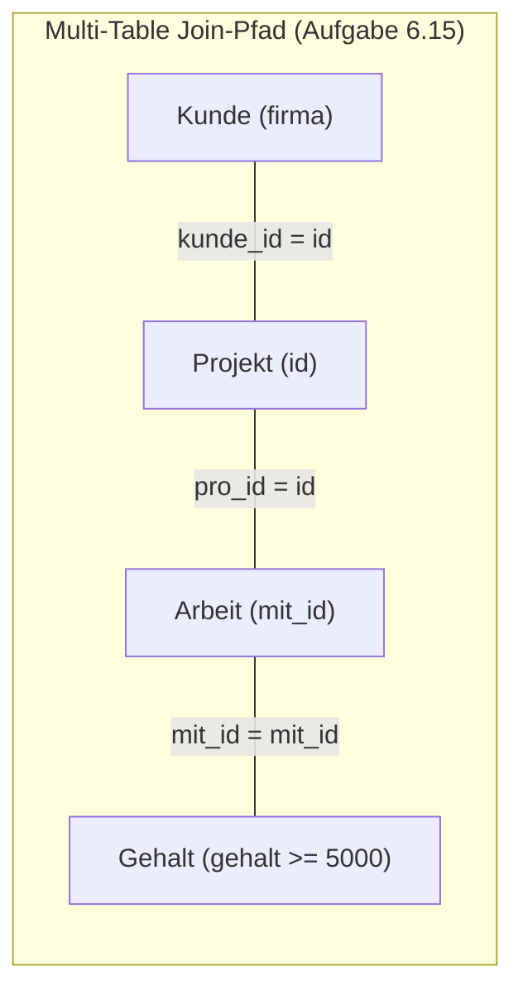

# 📅 Day_16: Fortgeschrittene Joins (INNER JOIN 2) & Vertiefung

## ℹ️ Kurs-Informationen

* **Datum:** Montag, 24.08.2026
* **Arbeitszeit:** 08:15 - 16:00 Uhr
* **Dozent:** Tom S.
* **Autor:** Tobias Boyke

---

## 🎯 Lernziele des Tages

- [x] **Vertiefung Multi-Table INNER JOINs:** Komplexe Verknüpfungen über 3 bis 4 Tabellen (`Kunde` ➔ `Projekt` ➔ `Arbeit` ➔ `Gehalt` / `Mitarbeiter` ➔ `Abteilung`).
- [x] **Kartesisches Produkt & Differenzmengen:** Praktischer Einsatz von `CROSS JOIN` zur Ermittlung des Gesamtraums ($n \times m$) und Filterung auf Nicht-Zuordnungen (`m.abt_id <> a.id`).
- [x] **Filterung auf Datums- & Rollenkriterien:** Gezielte Einschränkungen auf Einstellungsdaten (`einst_dat = '2019-01-01'`) und Funktionsbezeichnungen (`aufgabe = 'Projektleiter'`).
- [x] **Aggregation & Gruppierung über Join-Pfade:** Ermittlung von Mitarbeiteranzahlen pro Kunde unter Gehalts-Bedingungen (`COUNT(DISTINCT arb.mit_id)`, `GROUP BY`).
- [x] **Single Source of Truth (SoT):** Durchgängige Umsetzung der Aufgaben anhand des `ProjektDB`-Schemas.

---

## 📖 Theorie & Vertiefung: Komplexe Join-Architekturen



### 1. Das Kartesische Produkt & Non-Matching-Analysen

* **CROSS JOIN:** Bildet alle mathematisch möglichen Kombinationen ($n \times m$). Bei 15 Mitarbeitern und 5 Abteilungen entstehen exakt **75 Zeilen**.
* **Theta-Filterung / Anti-Matches:** Durch Bedingung `WHERE m.abt_id <> a.id` werden alle Kombinationen gefiltert, bei denen der Mitarbeiter **nicht** der jeweiligen Abteilung angehört ($75 - 15 = \mathbf{60 \text{ Zeilen}}$).

```sql
-- Alle Kombinationen von Mitarbeitern und fremden Abteilungen
SELECT m.id, m.nachname, a.bezeichnung AS fremde_abteilung
FROM Mitarbeiter AS m
CROSS JOIN Abteilung AS a
WHERE m.abt_id <> a.id;
```

---

### 2. Aggregationen über Verknüpfungspfade

Werden Daten über $\text{1:n}$- oder $\text{n:m}$-Tabellen hinweg aggregiert (z. B. Anzahl beteiligter Mitarbeiter pro Kunde), muss darauf geachtet werden:
1. **`COUNT(DISTINCT ...)`** verhindert Doppelzählungen, wenn Mitarbeiter in mehreren Projekten desselben Kunden aktiv sind.
2. **`GROUP BY`** fasst die Zeilen auf der gewünschten Dimensionsebene zusammen (z. B. `kunde.firma`).

---

## 💻 Praktische Übungen & Aufgaben

Die Übungen zu Teil 2 der INNER JOINs befinden sich im Ordner [`assets/`](./assets):

| Datei | Beschreibung |
| :--- | :--- |
| [ProjektDB 06 - INNER JOIN 2 - Aufgaben.sql](./assets/ProjektDB%2006%20-%20INNER%20JOIN%202%20-%20Aufgaben.sql) | Originale Aufgabenstellungen 6.9 bis 6.15 |
| [ProjektDB 06 - INNER JOIN 2 - Lösungen.sql](./assets/ProjektDB%2006%20-%20INNER%20JOIN%202%20-%20Lösungen.sql) | Vollständige, kommentierte Musterlösungen nach SoT |

### Übersicht der gelösten Aufgaben

* **Aufgabe 6.9:** Einmalige Projektnamen von Mitarbeitern mit Gehalt $\ge$ 5.000 € (`DISTINCT`, `Projekt` $\bowtie$ `Arbeit` $\bowtie$ `Gehalt`).
* **Aufgabe 6.10:** Kartesisches Produkt über `Mitarbeiter` und `Abteilung` (75 Zeilen).
* **Aufgabe 6.11:** Mitarbeiter und Abteilungen, in denen sie **nicht** arbeiten (60 Zeilen).
* **Aufgabe 6.12:** Abteilungsnamen der am 01.01.2019 eingestellten Mitarbeiter.
* **Aufgabe 6.13:** Namen und Vornamen aller Projektleiter mit Abteilungsstandort Stuttgart.
* **Aufgabe 6.14:** Einmalige Projektnamen mit Mitarbeitern aus der Abteilung Beratung.
* **Aufgabe 6.15:** Kunden mit Mitarbeitern $\ge$ 5.000 € Gehalt inkl. Mitarbeiteranzahl (`GROUP BY`, `COUNT(DISTINCT)`).

---

## 💡 Wichtige Notizen & Erkenntnisse

> [!TIP]
> **Explizite Join-Syntax (SQL-92):**
> Bei Mehrfachtabellenverknüpfungen stets `INNER JOIN ... ON ...` verwenden. Dies trennt die Verknüpfungslogik sauber von Filterbedingungen im `WHERE` und verhindert versehentliche Kreuzprodukte.

> [!NOTE]
> Weitere Themen des Tages (z. B. fortgeschrittenes SQL / Folgethemen) werden nach dem Unterrichtsverlauf hier fortlaufend dokumentiert.