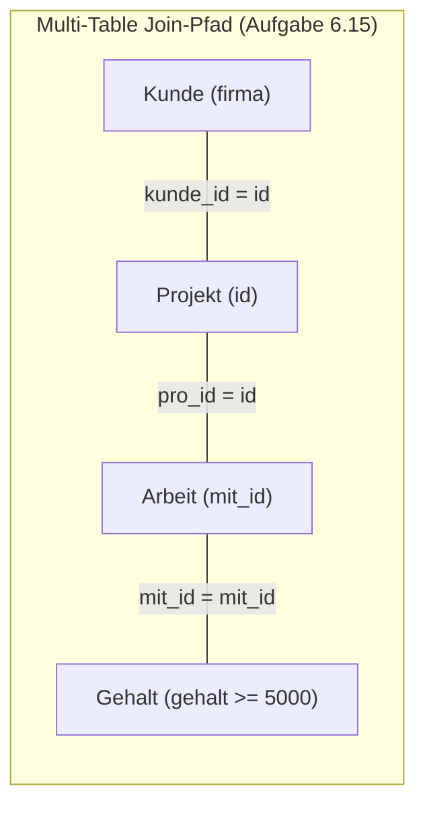

# 📅 Day_16: Fortgeschrittene Joins (INNER JOIN 2) & Vertiefung

## ℹ️ Kurs-Informationen

* **Datum:** Montag, 24.08.2026
* **Arbeitszeit:** 08:15 - 16:00 Uhr
* **Dozent:** Tom S.
* **Autor:** Tobias Boyke

---

## 🎯 Lernziele des Tages

- [x] **Vertiefung Multi-Table INNER JOINs:** Komplexe Verknüpfungen über 3 bis 4 Tabellen (`Kunde` ➔ `Projekt` ➔ `Arbeit` ➔ `Gehalt` / `Mitarbeiter` ➔ `Abteilung`).
- [x] **Kartesisches Produkt & Differenzmengen:** Praktischer Einsatz von `CROSS JOIN` zur Ermittlung des Gesamtraums ($n \times m$) und Filterung auf Nicht-Zuordnungen (`m.abt_id <> a.id`).
- [x] **Filterung auf Datums- & Rollenkriterien:** Gezielte Einschränkungen auf Einstellungsdaten (`einst_dat = '2019-01-01'`) und Funktionsbezeichnungen (`aufgabe = 'Projektleiter'`).
- [x] **Aggregation & Gruppierung über Join-Pfade:** Ermittlung von Mitarbeiteranzahlen pro Kunde unter Gehalts-Bedingungen (`COUNT(DISTINCT arb.mit_id)`, `GROUP BY`).
- [x] **Single Source of Truth (SoT):** Durchgängige Umsetzung der Aufgaben anhand des kanonischen `ProjektDB`-Schemas.

---

## 📖 Theorie & Vertiefung: Komplexe Join-Architekturen



### 1. Das Kartesische Produkt & Non-Matching-Analysen

* **CROSS JOIN:** Bildet alle mathematisch möglichen Kombinationen ($n \times m$). Bei 15 Mitarbeitern und 5 Abteilungen entstehen exakt **75 Zeilen**.
* **Theta-Filterung / Anti-Matches:** Durch die Bedingung `WHERE m.abt_id <> a.id` werden alle Kombinationen gefiltert, bei denen der Mitarbeiter **nicht** der jeweiligen Abteilung angehört ($75 - 15 = \mathbf{60 \text{ Zeilen}}$).

```sql
-- Alle Kombinationen von Mitarbeitern und fremden Abteilungen
SELECT m.id, m.nachname, a.bezeichnung AS fremde_abteilung
FROM Mitarbeiter AS m
CROSS JOIN Abteilung AS a
WHERE m.abt_id <> a.id;
```

---

### 2. Aggregationen über Verknüpfungspfade

Werden Daten über $\text{1:n}$- oder $\text{n:m}$-Tabellen hinweg aggregiert (z. B. Anzahl beteiligter Mitarbeiter pro Kunde), gilt:
1. **`COUNT(DISTINCT ...)`** verhindert Doppelzählungen, wenn Mitarbeiter in mehreren Projekten desselben Kunden aktiv sind.
2. **`GROUP BY`** fasst die Zeilen auf der gewünschten Dimensionsebene zusammen (z. B. `kunde.firma`).

---

## 💻 Praktische Übungen & Aufgaben (ProjektDB 06 - INNER JOIN 2)

Die Skripte befinden sich im Ordner [`assets/`](./assets):
* [ProjektDB 06 - INNER JOIN 2 - Aufgaben.sql](./assets/ProjektDB%2006%20-%20INNER%20JOIN%202%20-%20Aufgaben.sql)
* [ProjektDB 06 - INNER JOIN 2 - Lösungen.sql](./assets/ProjektDB%2006%20-%20INNER%20JOIN%202%20-%20Lösungen.sql)

---

### 📂 Aufgabe 6.9: Projektnamen bei Gehalt $\ge$ 5.000 €
* **Aufgabenstellung:** Nennen Sie einmalig die Namen der Projekte, in denen die Mitarbeiter arbeiten, die ein Gehalt von mindestens 5.000 € beziehen.
* **Erwartete Ausgabe:**
  ```text
  bezeichnung
  Apollo
  Ariane
  Gemini
  ```

```sql
SELECT DISTINCT p.bezeichnung
FROM Projekt AS p
INNER JOIN Arbeit AS arb ON p.id = arb.pro_id
INNER JOIN Gehalt AS g ON arb.mit_id = g.mit_id
WHERE g.gehalt >= 5000;
```

---

### 📂 Aufgabe 6.10: Kartesisches Produkt (`Mitarbeiter` $\times$ `Abteilung`)
* **Aufgabenstellung:** Erstellen Sie das Kartesische Produkt auf Mitarbeiter- und Abteilungs-Tabelle.
* **Erwartete Ausgabe (Auszug - 75 Zeilen):**
  ```text
  id     nachname  vorname   abt_id  ort         chef_id  id  kuerzel  bezeichnung  ort
  2581   Kaufmann  Brigitte  2       NULL        NULL     1   BE       Beratung     München
  5765   Schäfer   Sabine    3       Landshut    2581     1   BE       Beratung     München
  9031   Meier     Rainer    2       NULL        2581     1   BE       Beratung     München
  9912   Wolf      Klaus     4       Heidenheim  22222    1   BE       Beratung     München
  10102  Huber     Petra     3       Landshut    2581     1   BE       Beratung     München
  12121  Richter   Ursula    4       München     22222    1   BE       Beratung     München
  ...
  (75 Zeilen)
  ```

```sql
SELECT m.id, m.nachname, m.vorname, m.abt_id, m.ort, m.chef_id,
       a.id AS abt_id, a.kuerzel, a.bezeichnung, a.ort AS abt_ort
FROM Mitarbeiter AS m
CROSS JOIN Abteilung AS a;
```

---

### 📂 Aufgabe 6.11: Mitarbeiter und fremde Abteilungen (Anti-Zuordnung)
* **Aufgabenstellung:** Finden Sie alle Mitarbeiter und dazu alle Abteilungen, in denen diese Mitarbeiter NICHT arbeiten.
* **Erwartete Ausgabe (Auszug - 60 Zeilen):**
  ```text
  id     nachname  vorname   abt_id  ort         chef_id  id  kuerzel  bezeichnung  ort
  2581   Kaufmann  Brigitte  2       NULL        NULL     1   BE       Beratung     München
  5765   Schäfer   Sabine    3       Landshut    2581     1   BE       Beratung     München
  9031   Meier     Rainer    2       NULL        2581     1   BE       Beratung     München
  9912   Wolf      Klaus     4       Heidenheim  22222    1   BE       Beratung     München
  10102  Huber     Petra     3       Landshut    2581     1   BE       Beratung     München
  12121  Richter   Ursula    4       München     22222    1   BE       Beratung     München
  ...
  (60 Zeilen)
  ```

```sql
SELECT m.id, m.nachname, m.vorname, m.abt_id, m.ort, m.chef_id,
       a.id AS abt_id, a.kuerzel, a.bezeichnung, a.ort AS abt_ort
FROM Mitarbeiter AS m
CROSS JOIN Abteilung AS a
WHERE m.abt_id <> a.id;
```

---

### 📂 Aufgabe 6.12: Abteilungen nach Einstellungsdatum 01.01.2019
* **Aufgabenstellung:** Nennen Sie die Abteilungsnamen der Mitarbeiter, die am 01.01.2019 eingestellt wurden.
* **Erwartete Ausgabe:**
  ```text
  bezeichnung
  Freigabe
  Einkauf
  ```

```sql
SELECT DISTINCT a.bezeichnung
FROM Abteilung AS a
INNER JOIN Mitarbeiter AS m ON a.id = m.abt_id
INNER JOIN Arbeit AS arb ON m.id = arb.mit_id
WHERE arb.einst_dat = '2019-01-01';
```

---

### 📂 Aufgabe 6.13: Projektleiter aus Abteilungen mit Standort Stuttgart
* **Aufgabenstellung:** Nennen Sie Namen und Vornamen aller Projektleiter, deren Abteilung den Standort Stuttgart hat.
* **Erwartete Ausgabe:**
  ```text
  nachname  vorname
  Schäfer   Sabine
  Huber     Petra
  ```

```sql
SELECT DISTINCT m.nachname, m.vorname
FROM Mitarbeiter AS m
INNER JOIN Abteilung AS a ON m.abt_id = a.id
INNER JOIN Arbeit AS arb ON m.id = arb.mit_id
WHERE arb.aufgabe = 'Projektleiter'
  AND a.ort = 'Stuttgart';
```

---

### 📂 Aufgabe 6.14: Projekte mit Mitarbeitern aus Abteilung Beratung
* **Aufgabenstellung:** Nennen Sie einmalig die Namen der Projekte, in denen Mitarbeiter arbeiten, die zur Abteilung Beratung gehören.
* **Erwartete Ausgabe:**
  ```text
  bezeichnung
  Apollo
  Gemini
  ```

```sql
SELECT DISTINCT p.bezeichnung
FROM Projekt AS p
INNER JOIN Arbeit AS arb ON p.id = arb.pro_id
INNER JOIN Mitarbeiter AS m ON arb.mit_id = m.id
INNER JOIN Abteilung AS a ON m.abt_id = a.id
WHERE a.bezeichnung = 'Beratung';
```

---

### 📂 Aufgabe 6.15: Kunden mit Spitzenverdienern ($\ge$ 5.000 €) & Mitarbeiteranzahl
* **Aufgabenstellung:** Nennen Sie die Kunden, an deren Projekten Mitarbeiter arbeiten, die mindestens 5.000 € Gehalt bekommen. Nennen Sie zu den Kunden auch die Anzahl dieser Mitarbeiter.
* **Erwartete Ausgabe:**
  ```text
  firma                    mitarbeiter
  Finanzamt Ulm            2
  Frankreich-Reisen GmbH   2
  Technische Produkte oHG  1
  ```

```sql
SELECT k.firma,
       COUNT(DISTINCT arb.mit_id) AS mitarbeiter
FROM Kunde AS k
INNER JOIN Projekt AS p ON k.id = p.kunde_id
INNER JOIN Arbeit AS arb ON p.id = arb.pro_id
INNER JOIN Gehalt AS g ON arb.mit_id = g.mit_id
WHERE g.gehalt >= 5000
GROUP BY k.firma
ORDER BY k.firma ASC;
```

---

## 💡 Wichtige Notizen & Erkenntnisse

> [!TIP]
> **Performance bei Multi-Table Joins:**
> Werden mehrere Tabellen über Schlüssel verknüpft, filtert der SQL Server über das `WHERE` bereits vor oder während des Joins durch sogenannte *Predicate Pushes*. Eine saubere Trennung von `ON` (Verknüpfungskriterien) und `WHERE` (Filterkriterien) optimiert die Lesbarkeit und Ausführungspläne.

> [!IMPORTANT]
> **Single Source of Truth (ProjektDB):**
> Die Felder `einst_dat` (in der Tabelle `Arbeit`), `gehalt` (in `Gehalt`) und `bezeichnung` (in `Abteilung`/`Projekt`) entsprechen exakt dem kanonischen DB-Schema.