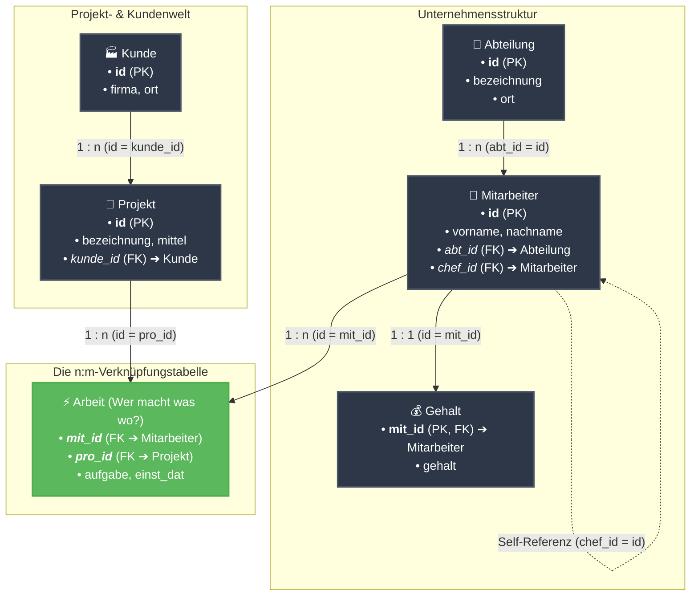
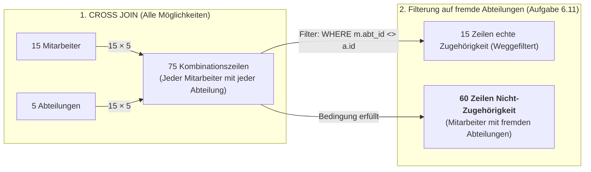
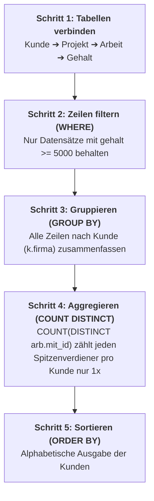
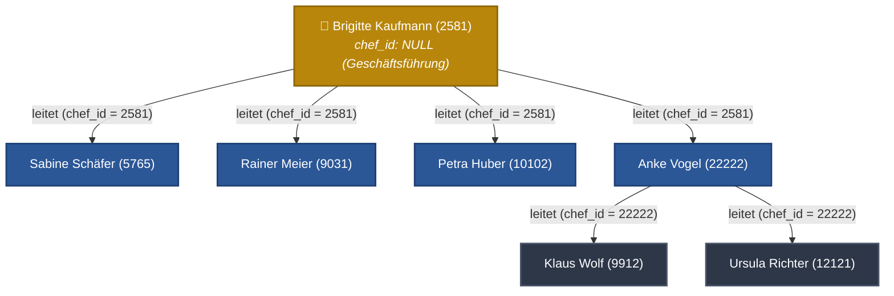

# 📅 Day_16: Fortgeschrittene Joins (INNER JOIN 2) & SELF JOINs

## ℹ️ Kurs-Informationen

* **Datum:** Montag, 24.08.2026
* **Arbeitszeit:** 08:15 - 16:00 Uhr
* **Dozent:** Tom S.
* **Autor:** Tobias Boyke

---

## 🎯 Lernziele des Tages

- [x] **Tabellenbeziehungen visualisieren:** Verstehen, wie Primärschlüssel (PK) und Fremdschlüssel (FK) einen Verknüpfungspfad über mehrere Tabellen bilden.
- [x] **Multi-Table INNER JOINs meistern:** Daten aus 3 bis 4 Tabellen (`Kunde` ➔ `Projekt` ➔ `Arbeit` ➔ `Gehalt` / `Mitarbeiter` ➔ `Abteilung`) logisch zusammenführen.
- [x] **CROSS JOIN vs. Anti-Zuordnung:** Das Kartesische Produkt ($n \times m$) verstehen und mittels Nicht-Gleichheitsoperator (`m.abt_id <> a.id`) Differenzmengen ermitteln.
- [x] **Aggregation & Duplikatsvermeidung:** Aggregatfunktionen (`COUNT(DISTINCT ...)`) bei verknüpften $\text{1:n}$- und $\text{n:m}$-Tabellen fehlerfrei einsetzen.
- [x] **SELF JOIN (Selbstverknüpfung):**
  - Hierarchische Beziehungen (Mitarbeiter $\leftrightarrow$ Vorgesetzter via `chef_id`) mittels `INNER` und `LEFT SELF JOIN` abbilden.
  - Horizontale Beziehungen (Standortübereinstimmungen, Fahrgemeinschaften, gleiche Aufgaben im selben Projekt) ermitteln.
  - Duplikate und Spiegelpaare gezielt über Ungleichheitsoperatoren (`<>`, `>`, `<`) steuern.
- [x] **Single Source of Truth (SoT):** Konsequente Einhaltung des kanonischen `ProjektDB`-Schemas.

---

## 🗺️ Der relationale Kompass: Wie hängen die Tabellen zusammen?

Um Joins über mehrere Tabellen zu verstehen, hilft die Vorstellung einer **Brücke**: Man kann nur von Tabelle A zu Tabelle C springen, wenn man die Zwischentabelle B als Brücke nutzt.



> [!TIP]
> **Die goldene Join-Regel für Einsteiger:**
> Möchtest du Informationen über **Kunde** und **Mitarbeiter** kombinieren? 
> Schau auf die Pfeile: `Kunde` $\rightarrow$ `Projekt` $\rightarrow$ `Arbeit` $\rightarrow$ `Mitarbeiter`. Du benötigst also **3 INNER JOINs**, um die 4 Tabellen miteinander zu verbinden!

---

## 📖 Theorie & Konzepte einfach erklärt

### 1. Das Kartesische Produkt (`CROSS JOIN`) vs. Anti-Matches (`<>`)

Wenn zwei Tabellen **ohne** Bedingung miteinander multipliziert werden, entsteht das sogenannte **Kartesische Produkt** (Kreuzprodukt). Jede Zeile der ersten Tabelle wird mit jeder Zeile der zweiten Tabelle kombiniert.



#### Warum ergibt `WHERE m.abt_id <> a.id` genau 60 Zeilen?
1. **Gesamtmenge:** $15 \text{ Mitarbeiter} \times 5 \text{ Abteilungen} = 75 \text{ Zeilen}$.
2. **Echte Zugehörigkeiten:** Jeder der 15 Mitarbeiter arbeitet in genau **1** Abteilung $\rightarrow 15 \text{ Zeilen}$ erfüllen $m.abt\_id = a.id$.
3. **Differenz (Anti-Matches):** $75 - 15 = \mathbf{60 \text{ Zeilen}}$, in denen der Mitarbeiter **nicht** zu dieser Abteilung gehört.

---

### 2. Multi-Table Joins mit Aggregation Schritt für Schritt (Aufgabe 6.15)

Wie arbeitet das Datenbank-Managementsystem (DBMS), wenn wir Kunden, Projekte, Mitarbeiter und Gehälter abfragen und zählen wollen?



---

## 👥 Vertiefungsthema: SELF JOIN (Selbstverknüpfung)

Ein **SELF JOIN** ist kein eigener SQL-Befehl, sondern ein **INNER JOIN** oder **LEFT JOIN**, bei dem eine Tabelle **mit sich selbst** verknüpft wird.

### 🏢 Die Vorgesetzten-Hierarchie in der `ProjektDB`

In der Tabelle `Mitarbeiter` verweist der Fremdschlüssel `chef_id` rekursiv auf den Primärschlüssel `id` desselben oder eines anderen Mitarbeiters.



### 🔑 Die 4 goldenen Regeln für Self-Joins

1. **Aliasse sind zwingend erforderlich:** Das DBMS muss unterscheiden können, welche Instanz der Tabelle welche Rolle einnimmt (z. B. `AS m` für Mitarbeiter und `AS c` für Chef).
2. **`INNER JOIN` vs. `LEFT JOIN` bei Hierarchien:**
   * `INNER JOIN Mitarbeiter c ON m.chef_id = c.id` $\rightarrow$ Schließt die oberste Führungskraft (`chef_id IS NULL`) aus!
   * `LEFT JOIN Mitarbeiter c ON m.chef_id = c.id` $\rightarrow$ Behält alle Mitarbeiter inklusive der Geschäftsführung (`Chef = NULL`).
3. **Horizontale Vergleiche (z. B. gleicher Ort / gleiche Abteilung):**
   * Verhindere Selbstpaarungen (`id <> id`) und Spiegelpaare (`A-B` und `B-A`) mit dem Operator `>` bzw. `<`:
   * `ON a1.ort = a2.ort AND a1.id > a2.id`
4. **Praxisskript im Repository:**
   * Ausführliche Praxisfälle befinden sich unter [`src/01_self_joins_hierarchien_praxis.sql`](./src/01_self_joins_hierarchien_praxis.sql).

---

## 💻 Praktische Übungen: Teil 1 (ProjektDB 06 - INNER JOIN 2)

* [ProjektDB 06 - INNER JOIN 2 - Aufgaben.sql](./assets/ProjektDB%2006%20-%20INNER%20JOIN%202%20-%20Aufgaben.sql)
* [ProjektDB 06 - INNER JOIN 2 - Lösungen.sql](./assets/ProjektDB%2006%20-%20INNER%20JOIN%202%20-%20Lösungen.sql)

---

### 📂 Aufgabe 6.9: Projektnamen bei Gehalt $\ge$ 5.000 €

* **Aufgabenstellung:** Nennen Sie einmalig die Namen der Projekte, in denen die Mitarbeiter arbeiten, die ein Gehalt von mindestens 5.000 € beziehen.
* **Join-Pfad:** `Projekt (p)` $\rightarrow$ `Arbeit (arb)` $\rightarrow$ `Gehalt (g)`
* **Erwartete Ausgabe:**
  ```text
  bezeichnung
  Apollo
  Ariane
  Gemini
  ```

```sql
SELECT DISTINCT p.bezeichnung
FROM Projekt AS p
INNER JOIN Arbeit AS arb ON p.id = arb.pro_id
INNER JOIN Gehalt AS g ON arb.mit_id = g.mit_id
WHERE g.gehalt >= 5000;
```

> [!NOTE]
> **Erklärung:** 
> Mehrere Mitarbeiter mit $\ge 5.000\text{ €}$ arbeiten am Projekt *Apollo* (z. B. Mitarbeiter 28559 und 29346). Das Schlüsselwort `DISTINCT` sorgt dafür, dass jeder Projektname im Endergebnis nur **genau einmal** erscheint.

> [!TIP]
> **💡 Warum wird die Tabelle `Mitarbeiter` hier nicht gejoint?**
> * **Identischer Verknüpfungsschlüssel:** Sowohl `Arbeit` als auch `Gehalt` besitzen die Spalte `mit_id` (Personalnummer). Sie lassen sich direkt über `arb.mit_id = g.mit_id` verbinden.
> * **Keine Attribute benötigt:** Für `SELECT` (`p.bezeichnung`) und `WHERE` (`g.gehalt`) wird kein Feld aus `Mitarbeiter` gebraucht (weder Vorname, Nachname noch Wohnort).
> * **Performance & Clean SQL:** Ein zusätzlicher Join auf `Mitarbeiter` (`... INNER JOIN Mitarbeiter m ON arb.mit_id = m.id ...`) wäre ein **redundanter Join** (Overhead), der das DBMS unnötig belastet, ohne neue Informationen zu liefern.

---

### 📂 Aufgabe 6.10: Kartesisches Produkt (`Mitarbeiter` $\times$ `Abteilung`)

* **Aufgabenstellung:** Erstellen Sie das Kartesische Produkt auf Mitarbeiter- und Abteilungs-Tabelle.
* **Join-Typ:** `CROSS JOIN` (Alle 15 Mitarbeiter mit allen 5 Abteilungen kombiniert)
* **Erwartete Ausgabe (Auszug - 75 Zeilen):**
  ```text
  id     nachname  vorname   abt_id  ort         chef_id  id  kuerzel  bezeichnung  ort
  2581   Kaufmann  Brigitte  2       NULL        NULL     1   BE       Beratung     München
  5765   Schäfer   Sabine    3       Landshut    2581     1   BE       Beratung     München
  9031   Meier     Rainer    2       NULL        2581     1   BE       Beratung     München
  9912   Wolf      Klaus     4       Heidenheim  22222    1   BE       Beratung     München
  10102  Huber     Petra     3       Landshut    2581     1   BE       Beratung     München
  12121  Richter   Ursula    4       München     22222    1   BE       Beratung     München
  ...
  (75 Zeilen)
  ```

```sql
SELECT m.id, m.nachname, m.vorname, m.abt_id, m.ort, m.chef_id,
       a.id AS abt_id, a.kuerzel, a.bezeichnung, a.ort AS abt_ort
FROM Mitarbeiter AS m
CROSS JOIN Abteilung AS a;
```

---

### 📂 Aufgabe 6.11: Mitarbeiter und fremde Abteilungen (Anti-Zuordnung)

* **Aufgabenstellung:** Finden Sie alle Mitarbeiter und dazu alle Abteilungen, in denen diese Mitarbeiter NICHT arbeiten.
* **Erwartete Ausgabe (Auszug - 60 Zeilen):**
  ```text
  id     nachname  vorname   abt_id  ort         chef_id  id  kuerzel  bezeichnung  ort
  2581   Kaufmann  Brigitte  2       NULL        NULL     1   BE       Beratung     München
  5765   Schäfer   Sabine    3       Landshut    2581     1   BE       Beratung     München
  9031   Meier     Rainer    2       NULL        2581     1   BE       Beratung     München
  9912   Wolf      Klaus     4       Heidenheim  22222    1   BE       Beratung     München
  10102  Huber     Petra     3       Landshut    2581     1   BE       Beratung     München
  12121  Richter   Ursula    4       München     22222    1   BE       Beratung     München
  ...
  (60 Zeilen)
  ```

#### 🔹 Variante 1: SQL-92 mit `CROSS JOIN` + `WHERE` (⭐ Best Practice)
```sql
SELECT m.id, m.nachname, m.vorname, m.abt_id, m.ort, m.chef_id,
       a.id AS abt_id, a.kuerzel, a.bezeichnung, a.ort AS abt_ort
FROM Mitarbeiter AS m
CROSS JOIN Abteilung AS a
WHERE m.abt_id <> a.id;
```

#### 🔹 Variante 2: SQL-92 mit `INNER JOIN` (Theta-Join über `<>`)
```sql
SELECT m.id, m.nachname, m.vorname, m.abt_id, m.ort, m.chef_id,
       a.id AS abt_id, a.kuerzel, a.bezeichnung, a.ort AS abt_ort
FROM Mitarbeiter AS m
INNER JOIN Abteilung AS a ON m.abt_id <> a.id;
```

#### 🔹 Variante 3: SQL-89 Syntax (Veraltete Komma-Trennung)
```sql
SELECT m.id, m.nachname, m.vorname, m.abt_id, m.ort, m.chef_id,
       a.id AS abt_id, a.kuerzel, a.bezeichnung, a.ort AS abt_ort
FROM Mitarbeiter AS m, Abteilung AS a
WHERE m.abt_id <> a.id;
```

---

#### ⚖️ Vergleich & Analyse: Was, Warum und Wie ist am besten?

| Kriterium | Variante 1: `CROSS JOIN` + `WHERE` | Variante 2: `INNER JOIN ON <>` | Variante 3: SQL-89 (`FROM A, B`) |
| :--- | :--- | :--- | :--- |
| **Standard** | SQL-92 (Modern) | SQL-92 (Modern) | SQL-89 (Veraltet) |
| **Lesbarkeit** | ⭐⭐⭐⭐⭐ **Exzellent** | ⭐⭐⭐ **Gewöhnungsbedürftig** | ⭐ **Schlecht** |
| **Fehleranfälligkeit** | **Sehr gering** (Klare Absicht) | **Gering** | **Sehr hoch** (Gefahr unbemerkter Kreuzprodukte) |
| **Ausführungsplan (DBMS)** | Identisch (Nested Loops / Filter) | Identisch (Nested Loops / Filter) | Identisch (Nested Loops / Filter) |

> [!TIP]
> **🏆 Warum ist Variante 1 (`CROSS JOIN` + `WHERE`) am besten?**
> 1. **Semantische Klarheit:** Das Problem ist eine zweistufige Mengenoperation: Erst *alle* Möglichkeiten aufspannen ($15 \times 5 = 75$), dann die $15$ tatsächlichen Matches abziehen ($75 - 15 = 60$). `CROSS JOIN` gefolgt von `WHERE <>` drückt diese Absicht exakt so aus, wie ein Entwickler denkt.
> 2. **Keine Verwirrung bei `INNER JOIN`:** Entwickler erwarten bei einem `INNER JOIN` zu 99% einen Gleichheitsabgleich (`ON A.id = B.id`). Ein Nicht-Gleichheits-Join (`ON A.id <> B.id`) ist zwar syntaktisch als Theta-Join erlaubt, führt beim Code-Review aber häufig zu Missverständnissen ("Wollte der Autor hier wirklich `<>` oder ist das ein Tippfehler?").
> 3. **SQL-89 ist veraltet:** Die Komma-Syntax vermischt Tabellenverknüpfung und Filterkriterien in einem unübersichtlichen `WHERE`-Block und wird in modernen Datenbankprojekten vermieden.

---

### 📂 Aufgabe 6.12: Abteilungen nach Einstellungsdatum 01.01.2019

* **Aufgabenstellung:** Nennen Sie die Abteilungsnamen der Mitarbeiter, die am 01.01.2019 eingestellt wurden.
* **Join-Pfad:** `Abteilung (a)` $\rightarrow$ `Mitarbeiter (m)` $\rightarrow$ `Arbeit (arb)`
* **Erwartete Ausgabe:**
  ```text
  bezeichnung
  Freigabe
  Einkauf
  ```

```sql
SELECT DISTINCT a.bezeichnung
FROM Abteilung AS a
INNER JOIN Mitarbeiter AS m ON a.id = m.abt_id
INNER JOIN Arbeit AS arb ON m.id = arb.mit_id
WHERE arb.einst_dat = '2019-01-01';
```

> [!CAUTION]
> **🚫 Warum ist Text-Hardcoding mit `CHAR(13)+CHAR(10)` falsch?**
> Ein Versuch wie:
> ```sql
> -- ❌ FALSCH: Erzeugt nur einen einzigen unstrukturierten String!
> SELECT 'bezeichnung' + CHAR(13) + CHAR(10) + 'Freigabe' + CHAR(13) + CHAR(10) + 'Einkauf';
> ```
> ist aus relationaler Sicht fundamental fehlerhaft:
> 1. **Kein relationales Resultset:** SQL-Clients erwarten eine Tabelle mit 1 Spalte (`bezeichnung`) und 2 Zeilen (Datensätzen). Das String-Kleben erzeugt **1 Zeile mit einem einzigen Textklumpen**.
> 2. **Kein DB-Zugriff:** Ändern sich Datensätze in der Datenbank, bleibt die Ausgabe statisch und falsch.
> 3. **Inkompatibel mit C# / APIs:** Ein `SqlDataReader` in C# iteriert zeilenweise mit `reader.Read()` und liest Spalten mit `reader["bezeichnung"]`. Bei einem Textklumpen schlägt jede strukturierte Verarbeitung fehl.

---

### 📂 Aufgabe 6.13: Projektleiter aus Abteilungen mit Standort Stuttgart

* **Aufgabenstellung:** Nennen Sie Namen und Vornamen aller Projektleiter, deren Abteilung den Standort Stuttgart hat.
* **Join-Pfad:** `Mitarbeiter (m)` $\rightarrow$ `Abteilung (a)` und `Mitarbeiter (m)` $\rightarrow$ `Arbeit (arb)`
* **Erwartete Ausgabe:**
  ```text
  nachname  vorname
  Schäfer   Sabine
  Huber     Petra
  ```

```sql
SELECT DISTINCT m.nachname, m.vorname
FROM Mitarbeiter AS m
INNER JOIN Abteilung AS a ON m.abt_id = a.id
INNER JOIN Arbeit AS arb ON m.id = arb.mit_id
WHERE arb.aufgabe = 'Projektleiter'
  AND a.ort = 'Stuttgart';
```

---

### 📂 Aufgabe 6.14: Projekte mit Mitarbeitern aus Abteilung Beratung

* **Aufgabenstellung:** Nennen Sie einmalig die Namen der Projekte, in denen Mitarbeiter arbeiten, die zur Abteilung Beratung gehören.
* **Join-Pfad:** `Projekt (p)` $\rightarrow$ `Arbeit (arb)` $\rightarrow$ `Mitarbeiter (m)` $\rightarrow$ `Abteilung (a)`
* **Erwartete Ausgabe:**
  ```text
  bezeichnung
  Apollo
  Gemini
  ```

```sql
SELECT DISTINCT p.bezeichnung
FROM Projekt AS p
INNER JOIN Arbeit AS arb ON p.id = arb.pro_id
INNER JOIN Mitarbeiter AS m ON arb.mit_id = m.id
INNER JOIN Abteilung AS a ON m.abt_id = a.id
WHERE a.bezeichnung = 'Beratung';
```

---

### 📂 Aufgabe 6.15: Kunden mit Spitzenverdienern ($\ge$ 5.000 €) & Mitarbeiteranzahl

* **Aufgabenstellung:** Nennen Sie die Kunden, an deren Projekten Mitarbeiter arbeiten, die mindestens 5.000 € Gehalt bekommen. Nennen Sie zu den Kunden auch die Anzahl dieser Mitarbeiter.
* **Join-Pfad:** `Kunde (k)` $\rightarrow$ `Projekt (p)` $\rightarrow$ `Arbeit (arb)` $\rightarrow$ `Gehalt (g)`
* **Erwartete Ausgabe:**
  ```text
  firma                    mitarbeiter
  Finanzamt Ulm            2
  Frankreich-Reisen GmbH   2
  Technische Produkte oHG  1
  ```

```sql
SELECT k.firma,
       COUNT(DISTINCT arb.mit_id) AS mitarbeiter
FROM Kunde AS k
INNER JOIN Projekt AS p ON k.id = p.kunde_id
INNER JOIN Arbeit AS arb ON p.id = arb.pro_id
INNER JOIN Gehalt AS g ON arb.mit_id = g.mit_id
WHERE g.gehalt >= 5000
GROUP BY k.firma
ORDER BY k.firma ASC;
```

> [!WARNING]
> **🚨 Deep-Dive: Kann man `DISTINCT` bei `COUNT(DISTINCT arb.mit_id)` weglassen?**
> **Nein!** Auch wenn im aktuellen Demo-Datenbestand `COUNT(*)` zufällig dieselben Zahlen liefert, ist das Weglassen von `DISTINCT` fachlich ein schwerer Fehler:
> 
> * **Das Problem:** Ein Mitarbeiter kann für denselben Kunden an **zwei verschiedenen Projekten** arbeiten.
> * **Beispiel:** Mitarbeiter `28559` arbeitet für *Frankreich-Reisen GmbH* an Projekt 1 **und** Projekt 2.
>
> | Zähl-Methode | Was wird gezählt? | Ergebnis bei 2 Projekten desselben Mitarbeiters | Bewertung |
> | :--- | :--- | :---: | :--- |
> | `COUNT(*)` oder `COUNT(arb.mit_id)` | Alle verknüpften **Einsatzzeilen** | **2** | ❌ Falsch: Zählt denselben Mitarbeiter 2-mal! |
> | **`COUNT(DISTINCT arb.mit_id)`** | Eindeutige **Personen (Köpfe)** | **1** | ✅ Richtig: Genau 1 Mitarbeiter mit Gehalt $\ge 5.000\text{ €}$! |

---

## 💻 Praktische Übungen: Teil 2 (ProjektDB 07 - SELF JOIN)

* [ProjektDB 07 - SELF JOIN - Aufgaben.sql](./assets/ProjektDB%2007%20-%20SELF%20JOIN%20-%20Aufgaben.sql)
* [ProjektDB 07 - SELF JOIN - Lösungen.sql](./assets/ProjektDB%2007%20-%20SELF%20JOIN%20-%20Lösungen.sql)

---

### 📂 Aufgabe 7.1: Abteilungen an gleichen Standorten (Alle Paare inkl. Selbstpaarung)
* **Aufgabenstellung:** Finden Sie alle Abteilungen, an deren Standorten sich weitere Abteilungen befinden. Geben Sie jeweils die Ids, Namen und Städte der Abteilungen aus.
* **Erwartete Ausgabe (Auszug - 11 Zeilen):**
  ```text
  id  bezeichnung  ort      id  bezeichnung  ort
  1   Beratung     München  1   Beratung     München
  2   Diagnose     München  1   Beratung     München
  4   Einkauf      München  1   Beratung     München
  1   Beratung     München  2   Diagnose     München
  2   Diagnose     München  2   Diagnose     München
  4   Einkauf      München  2   Diagnose     München
  ...
  (11 Zeilen: München 3x3=9, Stuttgart 1x1=1, Ulm 1x1=1)
  ```

```sql
SELECT a1.id, a1.bezeichnung, a1.ort,
       a2.id AS abt2_id, a2.bezeichnung AS abt2_bezeichnung, a2.ort AS abt2_ort
FROM Abteilung AS a1
INNER JOIN Abteilung AS a2 ON a1.ort = a2.ort;
```

---

### 📂 Aufgabe 7.2: Abteilungen an gleichen Standorten (Ohne Selbstpaarung)
* **Aufgabenstellung:** Überarbeiten Sie die Abfrage aus Aufgabe 7.1. Diesmal sollen nur Zeilen ins Ergebnis übernommen werden, bei denen die Abteilungen sich unterscheiden.
* **Erwartete Ausgabe:**
  ```text
  id  bezeichnung  ort      id  bezeichnung  ort
  1   Beratung     München  2   Diagnose     München
  1   Beratung     München  4   Einkauf      München
  2   Diagnose     München  1   Beratung     München
  2   Diagnose     München  4   Einkauf      München
  4   Einkauf      München  1   Beratung     München
  4   Einkauf      München  2   Diagnose     München
  ```

```sql
SELECT a1.id, a1.bezeichnung, a1.ort,
       a2.id AS abt2_id, a2.bezeichnung AS abt2_bezeichnung, a2.ort AS abt2_ort
FROM Abteilung AS a1
INNER JOIN Abteilung AS a2 ON a1.ort = a2.ort
WHERE a1.id <> a2.id;
```

---

### 📂 Aufgabe 7.3: Eindeutige Standortpaare (Ohne Spiegelpaare A-B / B-A)
* **Aufgabenstellung:** Überarbeiten Sie die Abfrage aus Aufgabe 7.2. Diesmal soll jede Kombination nur einmal angezeigt werden. D.h. A-B ist das gleiche wie B-A.
* **Erwartete Ausgabe:**
  ```text
  id  bezeichnung  ort      id  bezeichnung  ort
  2   Diagnose     München  1   Beratung     München
  4   Einkauf      München  1   Beratung     München
  4   Einkauf      München  2   Diagnose     München
  ```

```sql
SELECT a1.id, a1.bezeichnung, a1.ort,
       a2.id AS abt2_id, a2.bezeichnung AS abt2_bezeichnung, a2.ort AS abt2_ort
FROM Abteilung AS a1
INNER JOIN Abteilung AS a2 ON a1.ort = a2.ort 
                          AND a1.id > a2.id;
```

> [!NOTE]
> **Erklärung zum Operator `>`:**
> Durch `a1.id > a2.id` wird erzwungen, dass die linke ID immer größer ist als die rechte. Dadurch fällt sowohl die Selbstpaarung ($id = id$) als auch die gespiegelte Variante ($1-2$ neben $2-1$) automatisch weg!

---

### 📂 Aufgabe 7.4: Fahrgemeinschaften (Gleiche Abteilung & gleicher Wohnort)
* **Aufgabenstellung:** Finden Sie heraus, ob es Mitarbeiter gibt, die einen Kollegen oder eine Kollegin aus derselben Abteilung in ihrem Wohnort haben.
* **Erwartete Ausgabe:**
  ```text
  id     abt_id  nachname  ort
  5765   3       Schäfer   Landshut
  10102  3       Huber     Landshut
  12121  4       Richter   München
  22222  4       Vogel     München
  ```

```sql
SELECT DISTINCT m1.id, m1.abt_id, m1.nachname, m1.ort
FROM Mitarbeiter AS m1
INNER JOIN Mitarbeiter AS m2 ON m1.abt_id = m2.abt_id
                            AND m1.ort = m2.ort
                            AND m1.id <> m2.id
WHERE m1.ort IS NOT NULL
ORDER BY m1.id ASC;
```

---

### 📂 Aufgabe 7.5: Gleiche Aufgabe im gleichen Projekt
* **Aufgabenstellung:** Geben Sie die Mitarbeiter-Id, die Projektnummer und die Aufgabe der Mitarbeiter aus, die im gleichen Projekt die gleiche Aufgabe ausführen.
* **Erwartete Ausgabe:**
  ```text
  mit_id  pro_id  aufgabe
  25348   2       Sachbearbeiter
  28559   2       Sachbearbeiter
  20204   4       Sachbearbeiter
  27365   4       Sachbearbeiter
  ```

```sql
SELECT DISTINCT a1.mit_id, a1.pro_id, a1.aufgabe
FROM Arbeit AS a1
INNER JOIN Arbeit AS a2 ON a1.pro_id = a2.pro_id
                       AND a1.aufgabe = a2.aufgabe
                       AND a1.mit_id <> a2.mit_id
WHERE a1.aufgabe IS NOT NULL
ORDER BY a1.pro_id ASC, a1.mit_id ASC;
```

---

### 📂 Aufgabe 7.6: Mitarbeiter und deren Vorgesetzte
* **Aufgabenstellung:** Ermitteln Sie die Mitarbeiter mit Id, Vorname, Nachname und dem Nachnamen des Vorgesetzten.
* **Erwartete Ausgabe (Auszug - 15 Zeilen):**
  ```text
  id     vorname   nachname  chef
  5765   Sabine    Schäfer   Kaufmann
  9031   Rainer    Meier     Kaufmann
  9912   Klaus     Wolf      Vogel
  10102  Petra     Huber     Kaufmann
  12121  Ursula    Richter   Vogel
  ...
  (15 Zeilen)
  ```

```sql
SELECT m.id, m.vorname, m.nachname, c.nachname AS chef
FROM Mitarbeiter AS m
LEFT JOIN Mitarbeiter AS c ON m.chef_id = c.id
ORDER BY m.id ASC;
```

> [!NOTE]
> **Warum `LEFT JOIN`?**
> Brigitte Kaufmann hat `chef_id = NULL`. Bei einem `INNER JOIN` würde sie herausfallen (nur 14 Zeilen). Um alle 15 Mitarbeiter im Ergebnis zu behalten, ist ein `LEFT JOIN` nötig.

---

### 📂 Aufgabe 7.7: Abteilungen der beiden Vorgesetzten
* **Aufgabenstellung:** Finden Sie die Abteilungen, in denen die beiden Vorgesetzten arbeiten.
* **Erwartete Ausgabe:**
  ```text
  id  kuerzel  bezeichnung  ort
  2   DI       Diagnose     München
  4   EK       Einkauf      München
  ```

```sql
SELECT DISTINCT a.id, a.kuerzel, a.bezeichnung, a.ort
FROM Abteilung AS a
INNER JOIN Mitarbeiter AS chef ON a.id = chef.abt_id
INNER JOIN Mitarbeiter AS mit ON mit.chef_id = chef.id
ORDER BY a.id ASC;
```

---

### 📂 Aufgabe 7.8: Mitarbeiter im gleichen Wohnort wie ihr Chef
* **Aufgabenstellung:** Ermitteln Sie, welche Mitarbeiter in der gleichen Stadt wohnen wie ihre Vorgesetzten.
* **Erwartete Ausgabe:**
  ```text
  vorname  nachname  ort      chef_ort
  Ursula   Richter   München  München
  Rolf     Schubert  München  München
  ```

```sql
SELECT m.vorname, m.nachname, m.ort, c.ort AS chef_ort
FROM Mitarbeiter AS m
INNER JOIN Mitarbeiter AS c ON m.chef_id = c.id
WHERE m.ort = c.ort
  AND m.ort IS NOT NULL;
```

---

### 📂 Aufgabe 7.9: Mitarbeiter im gleichen Projekt wie ihr Chef
* **Aufgabenstellung:** Ermitteln Sie, welche Mitarbeiter im gleichen Projekt arbeiten wie ihre Vorgesetzten.
* **Erwartete Ausgabe:**
  ```text
  nachname  pro_id  chef_name  chef_pro_id
  Huber     3       Kaufmann   3
  Meier     3       Kaufmann   3
  Krüger    5       Vogel      5
  Wolf      5       Vogel      5
  ```

```sql
SELECT m.nachname,
       am.pro_id,
       c.nachname AS chef_name,
       ac.pro_id AS chef_pro_id
FROM Mitarbeiter AS m
INNER JOIN Mitarbeiter AS c ON m.chef_id = c.id
INNER JOIN Arbeit AS am ON m.id = am.mit_id
INNER JOIN Arbeit AS ac ON c.id = ac.mit_id 
                       AND am.pro_id = ac.pro_id
ORDER BY c.nachname ASC, m.nachname ASC;
```

---

## 💡 Wichtige Best Practices & Profi-Tipps

> [!TIP]
> **Wie baue ich einen Multi-Table Join strukturiert auf?**
> 1. **Welche Felder brauche ich im `SELECT`?** $\rightarrow$ Bestimmt die Quell- und Zieltabelle.
> 2. **Welche Felder brauche ich im `WHERE`?** $\rightarrow$ Bestimmt eventuell weitere Filtertabellen.
> 3. **Welche Tabellen verbinden diese?** $\rightarrow$ Zeichne die Join-Kette (PK ➔ FK).
> 4. **Brauche ich `DISTINCT` oder `GROUP BY`?** $\rightarrow$ Sobald eine $\text{1:n}$- oder $\text{n:m}$-Tabelle im Spiel ist, entstehen Duplikate, die abgefangen werden müssen.

> [!IMPORTANT]
> **Single Source of Truth (ProjektDB):**
> Achte immer auf die exakten Feldnamen der `ProjektDB`:
> * `einst_dat` (Datum in `Arbeit`)
> * `gehalt` (Monatsbetrag in `Gehalt`)
> * `mittel` (Projektbudget in `Projekt`)
> * `bezeichnung` (Name in `Abteilung` und `Projekt`)
> * `chef_id` (Vorgesetzten-ID in `Mitarbeiter`)