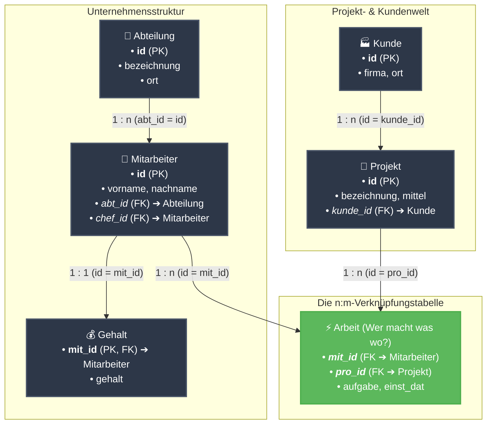
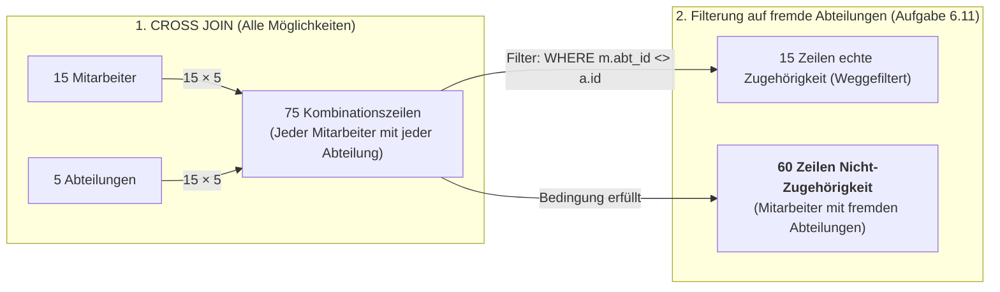
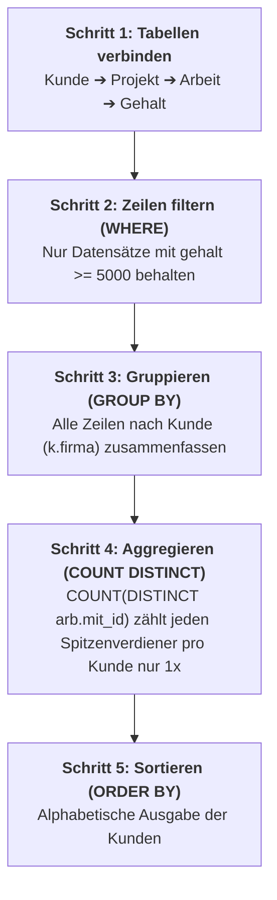

# 📅 Day_16: Fortgeschrittene Joins (INNER JOIN 2) & Vertiefung

## ℹ️ Kurs-Informationen

* **Datum:** Montag, 24.08.2026
* **Arbeitszeit:** 08:15 - 16:00 Uhr
* **Dozent:** Tom S.
* **Autor:** Tobias Boyke

---

## 🎯 Lernziele des Tages

- [x] **Tabellenbeziehungen visualisieren:** Verstehen, wie Primärschlüssel (PK) und Fremdschlüssel (FK) einen Verknüpfungspfad über mehrere Tabellen bilden.
- [x] **Multi-Table INNER JOINs meistern:** Daten aus 3 bis 4 Tabellen (`Kunde` ➔ `Projekt` ➔ `Arbeit` ➔ `Gehalt` / `Mitarbeiter` ➔ `Abteilung`) logisch zusammenführen.
- [x] **CROSS JOIN vs. Anti-Zuordnung:** Das Kartesische Produkt ($n \times m$) verstehen und mittels Nicht-Gleichheitsoperator (`m.abt_id <> a.id`) Differenzmengen ermitteln.
- [x] **Filterung auf Datum & Rollen:** Datumsfilter (`einst_dat = '2019-01-01'`) und textuelle Rollenfilter (`aufgabe = 'Projektleiter'`) im `WHERE`-Block präzise anwenden.
- [x] **Aggregation & Duplikatsvermeidung:** Aggregatfunktionen (`COUNT(DISTINCT ...)`) bei verknüpften $\text{1:n}$- und $\text{n:m}$-Tabellen fehlerfrei einsetzen.
- [x] **Single Source of Truth (SoT):** Konsequente Einhaltung des kanonischen `ProjektDB`-Schemas.

---

## 🗺️ Der relationale Kompass: Wie hängen die Tabellen zusammen?

Um Joins über mehrere Tabellen zu verstehen, hilft die Vorstellung einer **Brücke**: Man kann nur von Tabelle A zu Tabelle C springen, wenn man die Zwischentabelle B als Brücke nutzt.



> [!TIP]
> **Die goldene Join-Regel für Einsteiger:**
> Möchtest du Informationen über **Kunde** und **Mitarbeiter** kombinieren? 
> Schau auf die Pfeile: `Kunde` $\rightarrow$ `Projekt` $\rightarrow$ `Arbeit` $\rightarrow$ `Mitarbeiter`. Du benötigst also **3 INNER JOINs**, um die 4 Tabellen miteinander zu verbinden!

---

## 📖 Theorie & Konzepte einfach erklärt

### 1. Das Kartesische Produkt (`CROSS JOIN`) vs. Anti-Matches (`<>`)

Wenn zwei Tabellen **ohne** Bedingung miteinander multipliziert werden, entsteht das sogenannte **Kartesische Produkt** (Kreuzprodukt). Jede Zeile der ersten Tabelle wird mit jeder Zeile der zweiten Tabelle kombiniert.



#### Warum ergibt `WHERE m.abt_id <> a.id` genau 60 Zeilen?
1. **Gesamtmenge:** $15 \text{ Mitarbeiter} \times 5 \text{ Abteilungen} = 75 \text{ Zeilen}$.
2. **Echte Zugehörigkeiten:** Jeder der 15 Mitarbeiter arbeitet in genau **1** Abteilung $\rightarrow 15 \text{ Zeilen}$ erfüllen $m.abt\_id = a.id$.
3. **Differenz (Anti-Matches):** $75 - 15 = \mathbf{60 \text{ Zeilen}}$, in denen der Mitarbeiter **nicht** zu dieser Abteilung gehört.

```sql
-- Erzeugt alle 60 Kombinationen von Mitarbeitern mit Abteilungen, in denen sie NICHT arbeiten
SELECT m.id, m.nachname, a.bezeichnung AS fremde_abteilung
FROM Mitarbeiter AS m
CROSS JOIN Abteilung AS a
WHERE m.abt_id <> a.id;
```

---

### 2. Multi-Table Joins mit Aggregation Schritt für Schritt (Aufgabe 6.15)

Wie arbeitet das Datenbank-Managementsystem (DBMS), wenn wir Kunden, Projekte, Mitarbeiter und Gehälter abfragen und zählen wollen?



> [!WARNING]
> **Achtung Stolperfalle: `COUNT(*)` vs. `COUNT(DISTINCT arb.mit_id)`:**
> Wenn Mitarbeiter `28559` an **zwei verschiedenen Projekten** desselben Kunden arbeitet, taucht er im Zwischenergebnis zweimal auf. 
> * `COUNT(*)` würde fälschlicherweise **2** zählen.
> * `COUNT(DISTINCT arb.mit_id)` zählt die Personalnummer eindeutig und liefert das korrekte Ergebnis **1** (ein Mitarbeiter).

---

## 💻 Praktische Übungen & Aufgaben (ProjektDB 06 - INNER JOIN 2)

Die Originaldateien im Repository:
* [ProjektDB 06 - INNER JOIN 2 - Aufgaben.sql](./assets/ProjektDB%2006%20-%20INNER%20JOIN%202%20-%20Aufgaben.sql)
* [ProjektDB 06 - INNER JOIN 2 - Lösungen.sql](./assets/ProjektDB%2006%20-%20INNER%20JOIN%202%20-%20Lösungen.sql)

---

### 📂 Aufgabe 6.9: Projektnamen bei Gehalt $\ge$ 5.000 €

* **Aufgabenstellung:** Nennen Sie einmalig die Namen der Projekte, in denen die Mitarbeiter arbeiten, die ein Gehalt von mindestens 5.000 € beziehen.
* **Join-Pfad:** `Projekt (p)` $\rightarrow$ `Arbeit (arb)` $\rightarrow$ `Gehalt (g)`
* **Erwartete Ausgabe:**
  ```text
  bezeichnung
  Apollo
  Ariane
  Gemini
  ```

```sql
SELECT DISTINCT p.bezeichnung
FROM Projekt AS p
INNER JOIN Arbeit AS arb ON p.id = arb.pro_id
INNER JOIN Gehalt AS g ON arb.mit_id = g.mit_id
WHERE g.gehalt >= 5000;
```

> [!NOTE]
> **Erklärung:** 
> Mehrere Mitarbeiter mit $\ge 5.000\text{ €}$ arbeiten am Projekt *Apollo* (z. B. Mitarbeiter 28559 und 29346). Das Schlüsselwort `DISTINCT` sorgt dafür, dass jeder Projektname im Endergebnis nur **genau einmal** erscheint.

> [!TIP]
> **💡 Warum wird die Tabelle `Mitarbeiter` hier nicht gejoint?**
> * **Identischer Verknüpfungsschlüssel:** Sowohl `Arbeit` als auch `Gehalt` besitzen die Spalte `mit_id` (Personalnummer). Sie lassen sich direkt über `arb.mit_id = g.mit_id` verbinden.
> * **Keine Attribute benötigt:** Für `SELECT` (`p.bezeichnung`) und `WHERE` (`g.gehalt`) wird kein Feld aus `Mitarbeiter` gebraucht (weder Vorname, Nachname noch Wohnort).
> * **Performance & Clean SQL:** Ein zusätzlicher Join auf `Mitarbeiter` (`... INNER JOIN Mitarbeiter m ON arb.mit_id = m.id ...`) wäre ein **redundanter Join** (Overhead), der das DBMS unnötig belastet, ohne neue Informationen zu liefern.

---

### 📂 Aufgabe 6.10: Kartesisches Produkt (`Mitarbeiter` $\times$ `Abteilung`)

* **Aufgabenstellung:** Erstellen Sie das Kartesische Produkt auf Mitarbeiter- und Abteilungs-Tabelle.
* **Join-Typ:** `CROSS JOIN` (Alle 15 Mitarbeiter mit allen 5 Abteilungen kombiniert)
* **Erwartete Ausgabe (Auszug - 75 Zeilen):**
  ```text
  id     nachname  vorname   abt_id  ort         chef_id  id  kuerzel  bezeichnung  ort
  2581   Kaufmann  Brigitte  2       NULL        NULL     1   BE       Beratung     München
  5765   Schäfer   Sabine    3       Landshut    2581     1   BE       Beratung     München
  9031   Meier     Rainer    2       NULL        2581     1   BE       Beratung     München
  9912   Wolf      Klaus     4       Heidenheim  22222    1   BE       Beratung     München
  10102  Huber     Petra     3       Landshut    2581     1   BE       Beratung     München
  12121  Richter   Ursula    4       München     22222    1   BE       Beratung     München
  ...
  (75 Zeilen)
  ```

```sql
SELECT m.id, m.nachname, m.vorname, m.abt_id, m.ort, m.chef_id,
       a.id AS abt_id, a.kuerzel, a.bezeichnung, a.ort AS abt_ort
FROM Mitarbeiter AS m
CROSS JOIN Abteilung AS a;
```

> [!NOTE]
> **Erklärung:**
> Beim `CROSS JOIN` gibt es keine `ON`-Klausel, da keine Übereinstimmung gesucht wird, sondern schlicht jede Zeile der linken Tabelle mit jeder Zeile der rechten Tabelle gepaart wird ($15 \times 5 = 75$).

---

### 📂 Aufgabe 6.11: Mitarbeiter und fremde Abteilungen (Anti-Zuordnung)

* **Aufgabenstellung:** Finden Sie alle Mitarbeiter und dazu alle Abteilungen, in denen diese Mitarbeiter NICHT arbeiten.
* **Join-Typ:** `CROSS JOIN` mit Filter auf Ungleichheit (`WHERE m.abt_id <> a.id`)
* **Erwartete Ausgabe (Auszug - 60 Zeilen):**
  ```text
  id     nachname  vorname   abt_id  ort         chef_id  id  kuerzel  bezeichnung  ort
  2581   Kaufmann  Brigitte  2       NULL        NULL     1   BE       Beratung     München
  5765   Schäfer   Sabine    3       Landshut    2581     1   BE       Beratung     München
  9031   Meier     Rainer    2       NULL        2581     1   BE       Beratung     München
  9912   Wolf      Klaus     4       Heidenheim  22222    1   BE       Beratung     München
  10102  Huber     Petra     3       Landshut    2581     1   BE       Beratung     München
  12121  Richter   Ursula    4       München     22222    1   BE       Beratung     München
  ...
  (60 Zeilen)
  ```

```sql
SELECT m.id, m.nachname, m.vorname, m.abt_id, m.ort, m.chef_id,
       a.id AS abt_id, a.kuerzel, a.bezeichnung, a.ort AS abt_ort
FROM Mitarbeiter AS m
CROSS JOIN Abteilung AS a
WHERE m.abt_id <> a.id;
```

> [!NOTE]
> **Erklärung:**
> Der Operator `<>` (entspricht `!=`) schließt genau die 15 Kombinationen aus, bei denen die Fremdschlüssel-ID des Mitarbeiters mit der Primärschlüssel-ID der Abteilung übereinstimmt. Es bleiben exakt die 60 Nicht-Zuordnungen übrig.

---

### 📂 Aufgabe 6.12: Abteilungen nach Einstellungsdatum 01.01.2019

* **Aufgabenstellung:** Nennen Sie die Abteilungsnamen der Mitarbeiter, die am 01.01.2019 eingestellt wurden.
* **Join-Pfad:** `Abteilung (a)` $\rightarrow$ `Mitarbeiter (m)` $\rightarrow$ `Arbeit (arb)`
* **Erwartete Ausgabe:**
  ```text
  bezeichnung
  Freigabe
  Einkauf
  ```

```sql
SELECT DISTINCT a.bezeichnung
FROM Abteilung AS a
INNER JOIN Mitarbeiter AS m ON a.id = m.abt_id
INNER JOIN Arbeit AS arb ON m.id = arb.mit_id
WHERE arb.einst_dat = '2019-01-01';
```

> [!NOTE]
> **Erklärung:**
> Das Einstellungsdatum (`einst_dat`) liegt in der Tabelle `Arbeit`, der Name der Abteilung (`bezeichnung`) in der Tabelle `Abteilung`. Wir nutzen `Mitarbeiter` als Bindeglied zwischen beiden Tabellen.

---

### 📂 Aufgabe 6.13: Projektleiter aus Abteilungen mit Standort Stuttgart

* **Aufgabenstellung:** Nennen Sie Namen und Vornamen aller Projektleiter, deren Abteilung den Standort Stuttgart hat.
* **Join-Pfad:** `Mitarbeiter (m)` $\rightarrow$ `Abteilung (a)` und `Mitarbeiter (m)` $\rightarrow$ `Arbeit (arb)`
* **Erwartete Ausgabe:**
  ```text
  nachname  vorname
  Schäfer   Sabine
  Huber     Petra
  ```

```sql
SELECT DISTINCT m.nachname, m.vorname
FROM Mitarbeiter AS m
INNER JOIN Abteilung AS a ON m.abt_id = a.id
INNER JOIN Arbeit AS arb ON m.id = arb.mit_id
WHERE arb.aufgabe = 'Projektleiter'
  AND a.ort = 'Stuttgart';
```

> [!NOTE]
> **Erklärung:**
> Hier filtern wir mit `WHERE` über zwei verschiedene Tabellen gleichzeitig: Die Rolle `aufgabe = 'Projektleiter'` aus der Tabelle `Arbeit` und den Abteilungsstandort `ort = 'Stuttgart'` aus der Tabelle `Abteilung`.

---

### 📂 Aufgabe 6.14: Projekte mit Mitarbeitern aus Abteilung Beratung

* **Aufgabenstellung:** Nennen Sie einmalig die Namen der Projekte, in denen Mitarbeiter arbeiten, die zur Abteilung Beratung gehören.
* **Join-Pfad:** `Projekt (p)` $\rightarrow$ `Arbeit (arb)` $\rightarrow$ `Mitarbeiter (m)` $\rightarrow$ `Abteilung (a)`
* **Erwartete Ausgabe:**
  ```text
  bezeichnung
  Apollo
  Gemini
  ```

```sql
SELECT DISTINCT p.bezeichnung
FROM Projekt AS p
INNER JOIN Arbeit AS arb ON p.id = arb.pro_id
INNER JOIN Mitarbeiter AS m ON arb.mit_id = m.id
INNER JOIN Abteilung AS a ON m.abt_id = a.id
WHERE a.bezeichnung = 'Beratung';
```

> [!NOTE]
> **Erklärung:**
> Eine 4-Tabellen-Kette: Von `Projekt` über die Zuweisung `Arbeit` zum `Mitarbeiter` und schließlich zu dessen `Abteilung`.

---

### 📂 Aufgabe 6.15: Kunden mit Spitzenverdienern ($\ge$ 5.000 €) & Mitarbeiteranzahl

* **Aufgabenstellung:** Nennen Sie die Kunden, an deren Projekten Mitarbeiter arbeiten, die mindestens 5.000 € Gehalt bekommen. Nennen Sie zu den Kunden auch die Anzahl dieser Mitarbeiter.
* **Join-Pfad:** `Kunde (k)` $\rightarrow$ `Projekt (p)` $\rightarrow$ `Arbeit (arb)` $\rightarrow$ `Gehalt (g)`
* **Erwartete Ausgabe:**
  ```text
  firma                    mitarbeiter
  Finanzamt Ulm            2
  Frankreich-Reisen GmbH   2
  Technische Produkte oHG  1
  ```

```sql
SELECT k.firma,
       COUNT(DISTINCT arb.mit_id) AS mitarbeiter
FROM Kunde AS k
INNER JOIN Projekt AS p ON k.id = p.kunde_id
INNER JOIN Arbeit AS arb ON p.id = arb.pro_id
INNER JOIN Gehalt AS g ON arb.mit_id = g.mit_id
WHERE g.gehalt >= 5000
GROUP BY k.firma
ORDER BY k.firma ASC;
```

> [!NOTE]
> **Erklärung:**
> 1. `INNER JOIN` verknüpft Kunden über ihre Projekte mit den tätigen Mitarbeitern und deren Gehältern.
> 2. `WHERE g.gehalt >= 5000` filtert alle Mitarbeiter heraus, die weniger als 5.000 € verdienen.
> 3. `GROUP BY k.firma` fasst alle verbliebenen Zeilen pro Kunde zusammen.
> 4. `COUNT(DISTINCT arb.mit_id)` zählt die eindeutigen Mitarbeiter-IDs, damit ein Mitarbeiter, der in zwei Projekten derselben Firma arbeitet, nicht doppelt gezählt wird.

---

## 💡 Wichtige Best Practices & Profi-Tipps

> [!TIP]
> **Wie baue ich einen Multi-Table Join strukturiert auf?**
> 1. **Welche Felder brauche ich im `SELECT`?** $\rightarrow$ Bestimmt die Quell- und Zieltabelle.
> 2. **Welche Felder brauche ich im `WHERE`?** $\rightarrow$ Bestimmt eventuell weitere Filtertabellen.
> 3. **Welche Tabellen verbinden diese?** $\rightarrow$ Zeichne die Join-Kette (PK ➔ FK).
> 4. **Brauche ich `DISTINCT` oder `GROUP BY`?** $\rightarrow$ Sobald eine $\text{1:n}$- oder $\text{n:m}$-Tabelle im Spiel ist, entstehen Duplikate, die abgefangen werden müssen.

> [!IMPORTANT]
> **Single Source of Truth (ProjektDB):**
> Achte immer auf die exakten Feldnamen der `ProjektDB`:
> * `einst_dat` (Datum in `Arbeit`)
> * `gehalt` (Monatsbetrag in `Gehalt`)
> * `mittel` (Projektbudget in `Projekt`)
> * `bezeichnung` (Name in `Abteilung` und `Projekt`)