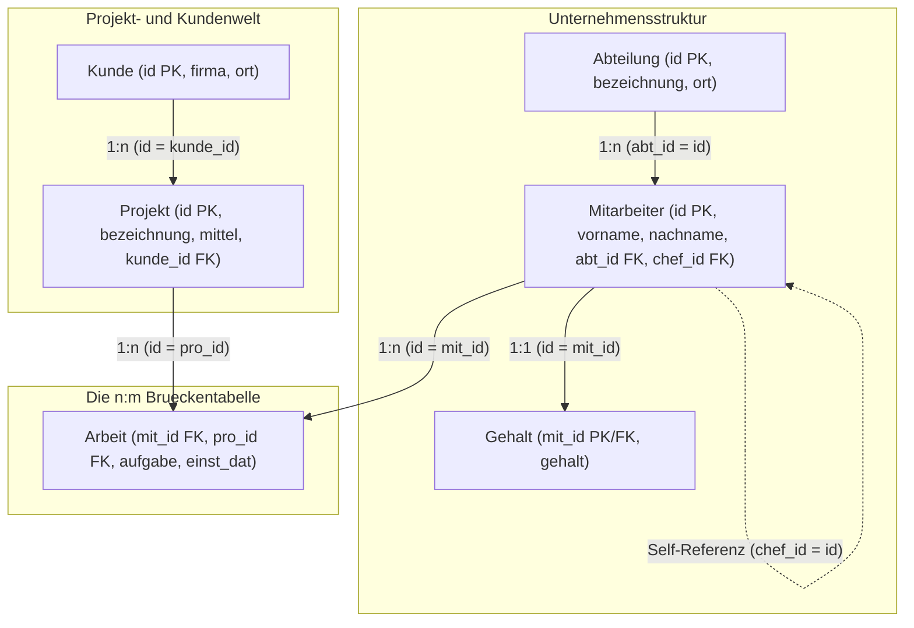
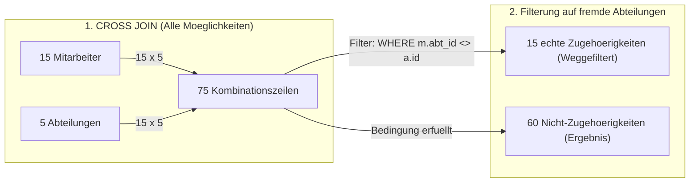
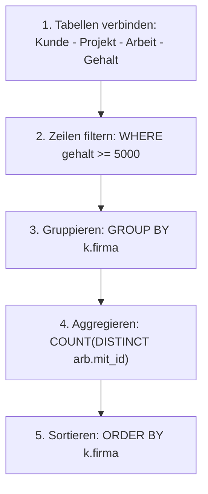
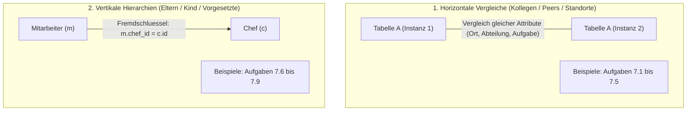
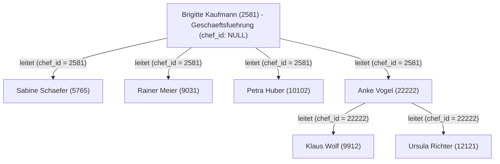
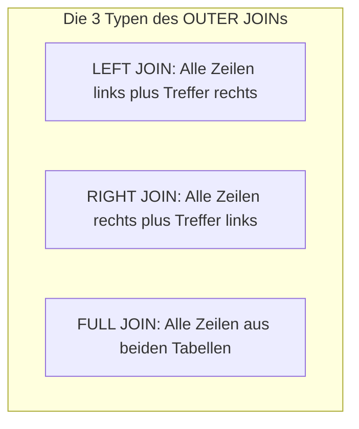
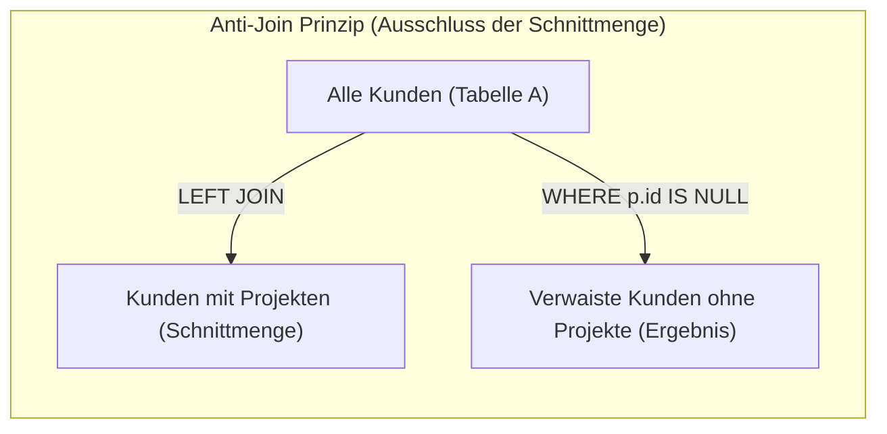
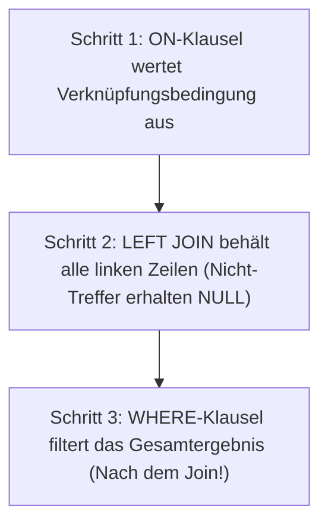

# 📅 Day_16: Fortgeschrittene Joins (INNER JOIN 2) & SELF JOINs

## ℹ️ Kurs-Informationen

* **Datum:** Montag, 24.08.2026
* **Arbeitszeit:** 08:15 - 16:00 Uhr
* **Dozent:** Tom S.
* **Autor:** Tobias Boyke

---

## 🎯 Lernziele des Tages

- [x] **Tabellenbeziehungen visualisieren:** Verstehen, wie Primärschlüssel (PK) und Fremdschlüssel (FK) einen Verknüpfungspfad über mehrere Tabellen bilden.
- [x] **Multi-Table INNER JOINs meistern:** Daten aus 3 bis 4 Tabellen (`Kunde` ➔ `Projekt` ➔ `Arbeit` ➔ `Gehalt` / `Mitarbeiter` ➔ `Abteilung`) logisch zusammenführen.
- [x] **CROSS JOIN vs. Anti-Zuordnung:** Das Kartesische Produkt ($n \times m$) verstehen und mittels Nicht-Gleichheitsoperator (`m.abt_id <> a.id`) Differenzmengen ermitteln.
- [x] **Aggregation & Duplikatsvermeidung:** Aggregatfunktionen (`COUNT(DISTINCT ...)`) bei verknüpften $\text{1:n}$- und $\text{n:m}$-Tabellen fehlerfrei einsetzen.
- [x] **SELF JOIN (Selbstverknüpfung):**
  - Hierarchische Beziehungen (Mitarbeiter $\leftrightarrow$ Vorgesetzter via `chef_id`) mittels `INNER` und `LEFT SELF JOIN` abbilden.
  - Horizontale Beziehungen (Standortübereinstimmungen, Fahrgemeinschaften, gleiche Aufgaben im selben Projekt) ermitteln.
  - Duplikate und Spiegelpaare gezielt über relationale Operatoren (`<>`, `>`, `<`) steuern.
- [x] **OUTER JOINs (LEFT, RIGHT, FULL OUTER JOIN):**
  - Beibehalten unvollständiger Datensätze mit automatischer `NULL`-Auffüllung.
  - **Anti-Joins:** Gezieltes Finden verwaister Datensätze mittels `WHERE B.id IS NULL`.
  - **Die fundamentale Unterscheidung:** Filterbedingungen in der `ON`-Klausel vs. Filterbedingungen in der `WHERE`-Klausel beim `LEFT JOIN`.
- [x] **Single Source of Truth (SoT):** Konsequente Einhaltung des kanonischen `ProjektDB`-Schemas.

---

## 🗺️ Der relationale Kompass: Wie hängen die Tabellen zusammen?

Um Joins über mehrere Tabellen zu verstehen, hilft die Vorstellung einer **Brücke**: Man kann nur von Tabelle A zu Tabelle C springen, wenn man die Zwischentabelle B als Brücke nutzt.



> [!TIP]
> **Die goldene Join-Regel für Einsteiger:**
> Möchtest du Informationen über **Kunde** und **Mitarbeiter** kombinieren? 
> Schau auf die Pfeile: `Kunde` $\rightarrow$ `Projekt` $\rightarrow$ `Arbeit` $\rightarrow$ `Mitarbeiter`. Du benötigst also **3 INNER JOINs**, um die 4 Tabellen miteinander zu verbinden!

---

## 📖 Theorie & Konzepte einfach erklärt

### 1. Das Kartesische Produkt (`CROSS JOIN`) vs. Anti-Matches (`<>`)

Wenn zwei Tabellen **ohne** Bedingung miteinander multipliziert werden, entsteht das sogenannte **Kartesische Produkt** (Kreuzprodukt). Jede Zeile der ersten Tabelle wird mit jeder Zeile der zweiten Tabelle kombiniert.



#### Warum ergibt `WHERE m.abt_id <> a.id` genau 60 Zeilen?
1. **Gesamtmenge:** $15 \text{ Mitarbeiter} \times 5 \text{ Abteilungen} = 75 \text{ Zeilen}$.
2. **Echte Zugehörigkeiten:** Jeder der 15 Mitarbeiter arbeitet in genau **1** Abteilung $\rightarrow 15 \text{ Zeilen}$ erfüllen $m.abt\_id = a.id$.
3. **Differenz (Anti-Matches):** $75 - 15 = \mathbf{60 \text{ Zeilen}}$, in denen der Mitarbeiter **nicht** zu dieser Abteilung gehört.

---

### 2. Multi-Table Joins mit Aggregation Schritt für Schritt (Aufgabe 6.15)

Wie arbeitet das Datenbank-Managementsystem (DBMS), wenn wir Kunden, Projekte, Mitarbeiter und Gehälter abfragen und zählen wollen?



---

## 👥 Vertiefungsthema: SELF JOIN (Selbstverknüpfung)

Ein **SELF JOIN** ist kein eigener SQL-Befehl, sondern ein regulärer **INNER JOIN** oder **LEFT JOIN**, bei dem eine Tabelle **mit sich selbst** verknüpft wird.

### 🧭 Die 2 Grundmuster von Self-Joins



---

### 🏢 Die Vorgesetzten-Hierarchie in der `ProjektDB`

In der Tabelle `Mitarbeiter` verweist der Fremdschlüssel `chef_id` rekursiv auf den Primärschlüssel `id` desselben oder eines anderen Mitarbeiters.



---

### 🔑 Die 4 goldenen Regeln & Operatoren für Self-Joins

| Operator / Syntax | Einsatzzweck | Effekt |
| :---: | :--- | :--- |
| **`AS alias1, AS alias2`** | **Pflicht bei jedem Self-Join** | Das DBMS muss Instanz 1 (z. B. `m` für Mitarbeiter) von Instanz 2 (`c` für Chef) unterscheiden können. |
| **`=`** | Equi-Join | Verbindet Chef mit Mitarbeiter (`m.chef_id = c.id`) oder sucht identische Merkmale (`a1.ort = a2.ort`). |
| **`<>` bzw. `!=`** | Anti-Selbstpaarung | Verhindert, dass ein Datensatz mit sich selbst gepaart wird ($id \neq id$). |
| **`>` oder `<`** | Eindeutige Paarung | Verhindert Selbstpaarung **und** Spiegelpaare ($A-B$ und $B-A$) in einem einzigen Schritt. |

---

## 🌐 Vertiefungsthema: OUTER JOINs (LEFT, RIGHT, FULL OUTER JOIN)

Während ein `INNER JOIN` ausschließlich die **Schnittmenge** übereinstimmender Datensätze liefert, sorgen **OUTER JOINs** dafür, dass auch Datensätze erhalten bleiben, die **kein Gegenstück** in der verknüpften Tabelle besitzen. Fehlende Werte werden automatisch mit `NULL` aufgefüllt.



---

### 1. Die 3 Varianten im Detail

```mermaid
flowchart LR
    subgraph LJ["LEFT OUTER JOIN (Tabelle A ist dominant)"]
        A_L["Tabelle A (Alle Datensaetze)"] -->|"Ergaenzung"| B_L["Tabelle B (Nur Treffer, sonst NULL)"]
    end

    subgraph RJ["RIGHT OUTER JOIN (Tabelle B ist dominant)"]
        A_R["Tabelle A (Nur Treffer, sonst NULL)"] <--|"Ergaenzung"| B_R["Tabelle B (Alle Datensaetze)"]
    end

    subgraph FJ["FULL OUTER JOIN (Vollstaendige Vereinigung)"]
        A_F["Tabelle A (Alle)"] ---|"Verbindung"| B_F["Tabelle B (Alle)"]
    end
```

* **LEFT OUTER JOIN:** Behält **alle** Zeilen der linken Tabelle. Gibt es in der rechten Tabelle keinen Treffer, werden deren Spalten mit `NULL` befüllt.
  * *Praxisbeispiel:* Alle Kunden ausgeben – auch Kunden wie *100% Sonderzeichen AG*, die noch kein Projekt beauftragt haben.
* **RIGHT OUTER JOIN:** Behält **alle** Zeilen der rechten Tabelle. Syntaktisch ist `A RIGHT JOIN B` identisch mit `B LEFT JOIN A`.
* **FULL OUTER JOIN:** Behält **alle** Zeilen beider Tabellen. Zeilen ohne Treffer auf der Gegenseite werden jeweils mit `NULL` aufgefüllt.

---

### 2. Anti-Joins: Gezielte Suche nach verwaisten Datensätzen

Ein **Anti-Join** ist ein `LEFT JOIN`, der mit einem `WHERE ... IS NULL`-Filter kombiniert wird, um Datensätze zu finden, die **keine Beziehung** zur Zieltabelle besitzen.



```sql
-- Finde alle Kunden, die bisher KEIN EINZIGES Projekt beauftragt haben
SELECT k.id, k.firma, k.ort
FROM Kunde AS k
LEFT JOIN Projekt AS p ON k.id = p.kunde_id
WHERE p.id IS NULL;
```

---

### 3. 🚨 DER GROSSE KLASSIKER: `ON` vs. `WHERE` beim LEFT JOIN

Dies ist eine der **wichtigsten und häufigsten Prüfungs- und Praxisfragen** in SQL!



#### Der entscheidende Unterschied

1. **Bedingung im `ON` (Verknüpfungsfilter):**
   * Entscheidet: *„Welche Zeilen der rechten Tabelle werden an die linke Tabelle angehängt?“*
   * Ist die Bedingung für eine rechte Zeile falsch, bleibt die linke Zeile **trotzdem im Ergebnis** (die rechten Spalten werden einfach `NULL`).
2. **Bedingung im `WHERE` (Ergebnisfilter):**
   * Entscheidet: *„Welche Zeilen aus dem gesamten Zwischenergebnis werden an den Benutzer ausgegeben?“*
   * Wird nach dem Join ausgeführt. Steht im `WHERE` ein Filter auf eine Spalte der rechten Tabelle (z. B. `WHERE p.mittel >= 100000`), fliegt jede Zeile raus, bei der diese Spalte `NULL` ist (da `NULL >= 100000` nicht wahr ist).
   * ⚠️ **Konsequenz:** Ein Filter auf die rechte Tabelle im `WHERE` macht den `LEFT JOIN` unbemerkt zu einem `INNER JOIN`!

---

#### ⚖️ Praxis-Vergleich an der `ProjektDB`

> **Szenario:** Wir möchten eine Liste **aller Kunden** und dazu ihre Großprojekte mit Budget $\ge 100.000\text{ €}$ sehen. Kunden mit kleineren Projekten oder ohne Projekte sollen **trotzdem** aufgeführt werden.

| Variante | SQL-Statement | Verhalten & Ergebnis | Bewertung |
| :--- | :--- | :--- | :--- |
| **Bedingung im `ON`** | `FROM Kunde k`<br/>`LEFT JOIN Projekt p ON k.id = p.kunde_id`<br/>`AND p.mittel >= 100000;` | **Alle 6 Kunden** bleiben in der Liste. Kunden ohne Großprojekt erhalten `NULL`. | ✅ **Richtig:** Echter LEFT JOIN |
| **Bedingung im `WHERE`** | `FROM Kunde k`<br/>`LEFT JOIN Projekt p ON k.id = p.kunde_id`<br/>`WHERE p.mittel >= 100000;` | **Nur noch 3 Kunden** im Ergebnis. Alle Kunden ohne Großprojekt fliegen raus! | ❌ **Logikfehler:** Heimlicher INNER JOIN |

*Praxisskripte befinden sich in [`src/02_outer_joins_praxis.sql`](./src/02_outer_joins_praxis.sql).*

---

## 💻 Praktische Übungen: Teil 1 (ProjektDB 06 - INNER JOIN 2)

* [ProjektDB 06 - INNER JOIN 2 - Aufgaben.sql](./assets/ProjektDB%2006%20-%20INNER%20JOIN%202%20-%20Aufgaben.sql)
* [ProjektDB 06 - INNER JOIN 2 - Lösungen.sql](./assets/ProjektDB%2006%20-%20INNER%20JOIN%202%20-%20Lösungen.sql)

---

### 📂 Aufgabe 6.9: Projektnamen bei Gehalt $\ge$ 5.000 €

* **Aufgabenstellung:** Nennen Sie einmalig die Namen der Projekte, in denen die Mitarbeiter arbeiten, die ein Gehalt von mindestens 5.000 € beziehen.
* **Join-Pfad:** `Projekt (p)` $\rightarrow$ `Arbeit (arb)` $\rightarrow$ `Gehalt (g)`
* **Erwartete Ausgabe:**
  ```text
  bezeichnung
  Apollo
  Ariane
  Gemini
  ```

```sql
SELECT DISTINCT p.bezeichnung
FROM Projekt AS p
INNER JOIN Arbeit AS arb ON p.id = arb.pro_id
INNER JOIN Gehalt AS g ON arb.mit_id = g.mit_id
WHERE g.gehalt >= 5000;
```

> [!NOTE]
> **Erklärung:** 
> Mehrere Mitarbeiter mit $\ge 5.000\text{ €}$ arbeiten am Projekt *Apollo* (z. B. Mitarbeiter 28559 und 29346). Das Schlüsselwort `DISTINCT` sorgt dafür, dass jeder Projektname im Endergebnis nur **genau einmal** erscheint.

> [!TIP]
> **💡 Warum wird die Tabelle `Mitarbeiter` hier nicht gejoint?**
> * **Identischer Verknüpfungsschlüssel:** Sowohl `Arbeit` als auch `Gehalt` besitzen die Spalte `mit_id` (Personalnummer). Sie lassen sich direkt über `arb.mit_id = g.mit_id` verbinden.
> * **Keine Attribute benötigt:** Für `SELECT` (`p.bezeichnung`) und `WHERE` (`g.gehalt`) wird kein Feld aus `Mitarbeiter` gebraucht (weder Vorname, Nachname noch Wohnort).
> * **Performance & Clean SQL:** Ein zusätzlicher Join auf `Mitarbeiter` (`... INNER JOIN Mitarbeiter m ON arb.mit_id = m.id ...`) wäre ein **redundanter Join** (Overhead), der das DBMS unnötig belastet, ohne neue Informationen zu liefern.

---

### 📂 Aufgabe 6.10: Kartesisches Produkt (`Mitarbeiter` $\times$ `Abteilung`)

* **Aufgabenstellung:** Erstellen Sie das Kartesische Produkt auf Mitarbeiter- und Abteilungs-Tabelle.
* **Join-Typ:** `CROSS JOIN` (Alle 15 Mitarbeiter mit allen 5 Abteilungen kombiniert)
* **Erwartete Ausgabe (Auszug - 75 Zeilen):**
  ```text
  id     nachname  vorname   abt_id  ort         chef_id  id  kuerzel  bezeichnung  ort
  2581   Kaufmann  Brigitte  2       NULL        NULL     1   BE       Beratung     München
  5765   Schäfer   Sabine    3       Landshut    2581     1   BE       Beratung     München
  9031   Meier     Rainer    2       NULL        2581     1   BE       Beratung     München
  9912   Wolf      Klaus     4       Heidenheim  22222    1   BE       Beratung     München
  10102  Huber     Petra     3       Landshut    2581     1   BE       Beratung     München
  12121  Richter   Ursula    4       München     22222    1   BE       Beratung     München
  ...
  (75 Zeilen)
  ```

```sql
SELECT m.id, m.nachname, m.vorname, m.abt_id, m.ort, m.chef_id,
       a.id AS abt_id, a.kuerzel, a.bezeichnung, a.ort AS abt_ort
FROM Mitarbeiter AS m
CROSS JOIN Abteilung AS a;
```

---

### 📂 Aufgabe 6.11: Mitarbeiter und fremde Abteilungen (Anti-Zuordnung)

* **Aufgabenstellung:** Finden Sie alle Mitarbeiter und dazu alle Abteilungen, in denen diese Mitarbeiter NICHT arbeiten.
* **Erwartete Ausgabe (Auszug - 60 Zeilen):**
  ```text
  id     nachname  vorname   abt_id  ort         chef_id  id  kuerzel  bezeichnung  ort
  2581   Kaufmann  Brigitte  2       NULL        NULL     1   BE       Beratung     München
  5765   Schäfer   Sabine    3       Landshut    2581     1   BE       Beratung     München
  9031   Meier     Rainer    2       NULL        2581     1   BE       Beratung     München
  9912   Wolf      Klaus     4       Heidenheim  22222    1   BE       Beratung     München
  10102  Huber     Petra     3       Landshut    2581     1   BE       Beratung     München
  12121  Richter   Ursula    4       München     22222    1   BE       Beratung     München
  ...
  (60 Zeilen)
  ```

#### 🔹 Variante 1: SQL-92 mit `CROSS JOIN` + `WHERE` (⭐ Best Practice)
```sql
SELECT m.id, m.nachname, m.vorname, m.abt_id, m.ort, m.chef_id,
       a.id AS abt_id, a.kuerzel, a.bezeichnung, a.ort AS abt_ort
FROM Mitarbeiter AS m
CROSS JOIN Abteilung AS a
WHERE m.abt_id <> a.id;
```

#### 🔹 Variante 2: SQL-92 mit `INNER JOIN` (Theta-Join über `<>`)
```sql
SELECT m.id, m.nachname, m.vorname, m.abt_id, m.ort, m.chef_id,
       a.id AS abt_id, a.kuerzel, a.bezeichnung, a.ort AS abt_ort
FROM Mitarbeiter AS m
INNER JOIN Abteilung AS a ON m.abt_id <> a.id;
```

#### 🔹 Variante 3: SQL-89 Syntax (Veraltete Komma-Trennung)
```sql
SELECT m.id, m.nachname, m.vorname, m.abt_id, m.ort, m.chef_id,
       a.id AS abt_id, a.kuerzel, a.bezeichnung, a.ort AS abt_ort
FROM Mitarbeiter AS m, Abteilung AS a
WHERE m.abt_id <> a.id;
```

---

#### ⚖️ Vergleich & Analyse: Was, Warum und Wie ist am besten?

| Kriterium | Variante 1: `CROSS JOIN` + `WHERE` | Variante 2: `INNER JOIN ON <>` | Variante 3: SQL-89 (`FROM A, B`) |
| :--- | :--- | :--- | :--- |
| **Standard** | SQL-92 (Modern) | SQL-92 (Modern) | SQL-89 (Veraltet) |
| **Lesbarkeit** | ⭐⭐⭐⭐⭐ **Exzellent** | ⭐⭐⭐ **Gewöhnungsbedürftig** | ⭐ **Schlecht** |
| **Fehleranfälligkeit** | **Sehr gering** (Klare Absicht) | **Gering** | **Sehr hoch** (Gefahr unbemerkter Kreuzprodukte) |
| **Ausführungsplan (DBMS)** | Identisch (Nested Loops / Filter) | Identisch (Nested Loops / Filter) | Identisch (Nested Loops / Filter) |

> [!TIP]
> **🏆 Warum ist Variante 1 (`CROSS JOIN` + `WHERE`) am besten?**
> 1. **Semantische Klarheit:** Das Problem ist eine zweistufige Mengenoperation: Erst *alle* Möglichkeiten aufspannen ($15 \times 5 = 75$), dann die $15$ tatsächlichen Matches abziehen ($75 - 15 = 60$). `CROSS JOIN` gefolgt von `WHERE <>` drückt diese Absicht exakt so aus, wie ein Entwickler denkt.
> 2. **Keine Verwirrung bei `INNER JOIN`:** Entwickler erwarten bei einem `INNER JOIN` zu 99% einen Gleichheitsabgleich (`ON A.id = B.id`). Ein Nicht-Gleichheits-Join (`ON A.id <> B.id`) ist zwar syntaktisch als Theta-Join erlaubt, führt beim Code-Review aber häufig zu Missverständnissen ("Wollte der Autor hier wirklich `<>` oder ist das ein Tippfehler?").
> 3. **SQL-89 ist veraltet:** Die Komma-Syntax vermischt Tabellenverknüpfung und Filterkriterien in einem unübersichtlichen `WHERE`-Block und wird in modernen Datenbankprojekten vermieden.

---

### 📂 Aufgabe 6.12: Abteilungen nach Einstellungsdatum 01.01.2019

* **Aufgabenstellung:** Nennen Sie die Abteilungsnamen der Mitarbeiter, die am 01.01.2019 eingestellt wurden.
* **Join-Pfad:** `Abteilung (a)` $\rightarrow$ `Mitarbeiter (m)` $\rightarrow$ `Arbeit (arb)`
* **Erwartete Ausgabe:**
  ```text
  bezeichnung
  Freigabe
  Einkauf
  ```

```sql
SELECT DISTINCT a.bezeichnung
FROM Abteilung AS a
INNER JOIN Mitarbeiter AS m ON a.id = m.abt_id
INNER JOIN Arbeit AS arb ON m.id = arb.mit_id
WHERE arb.einst_dat = '2019-01-01';
```

> [!CAUTION]
> **🚫 Warum ist Text-Hardcoding mit `CHAR(13)+CHAR(10)` falsch?**
> Ein Versuch wie:
> ```sql
> -- ❌ FALSCH: Erzeugt nur einen einzigen unstrukturierten String!
> SELECT 'bezeichnung' + CHAR(13) + CHAR(10) + 'Freigabe' + CHAR(13) + CHAR(10) + 'Einkauf';
> ```
> ist aus relationaler Sicht fundamental fehlerhaft:
> 1. **Kein relationales Resultset:** SQL-Clients erwarten eine Tabelle mit 1 Spalte (`bezeichnung`) und 2 Zeilen (Datensätzen). Das String-Kleben erzeugt **1 Zeile mit einem einzigen Textklumpen**.
> 2. **Kein DB-Zugriff:** Ändern sich Datensätze in der Datenbank, bleibt die Ausgabe statisch und falsch.
> 3. **Inkompatibel mit C# / APIs:** Ein `SqlDataReader` in C# iteriert zeilenweise mit `reader.Read()` und liest Spalten mit `reader["bezeichnung"]`. Bei einem Textklumpen schlägt jede strukturierte Verarbeitung fehl.

---

### 📂 Aufgabe 6.13: Projektleiter aus Abteilungen mit Standort Stuttgart

* **Aufgabenstellung:** Nennen Sie Namen und Vornamen aller Projektleiter, deren Abteilung den Standort Stuttgart hat.
* **Join-Pfad:** `Mitarbeiter (m)` $\rightarrow$ `Abteilung (a)` und `Mitarbeiter (m)` $\rightarrow$ `Arbeit (arb)`
* **Erwartete Ausgabe:**
  ```text
  nachname  vorname
  Schäfer   Sabine
  Huber     Petra
  ```

```sql
SELECT DISTINCT m.nachname, m.vorname
FROM Mitarbeiter AS m
INNER JOIN Abteilung AS a ON m.abt_id = a.id
INNER JOIN Arbeit AS arb ON m.id = arb.mit_id
WHERE arb.aufgabe = 'Projektleiter'
  AND a.ort = 'Stuttgart';
```

---

### 📂 Aufgabe 6.14: Projekte mit Mitarbeitern aus Abteilung Beratung

* **Aufgabenstellung:** Nennen Sie einmalig die Namen der Projekte, in denen Mitarbeiter arbeiten, die zur Abteilung Beratung gehören.
* **Join-Pfad:** `Projekt (p)` $\rightarrow$ `Arbeit (arb)` $\rightarrow$ `Mitarbeiter (m)` $\rightarrow$ `Abteilung (a)`
* **Erwartete Ausgabe:**
  ```text
  bezeichnung
  Apollo
  Gemini
  ```

```sql
SELECT DISTINCT p.bezeichnung
FROM Projekt AS p
INNER JOIN Arbeit AS arb ON p.id = arb.pro_id
INNER JOIN Mitarbeiter AS m ON arb.mit_id = m.id
INNER JOIN Abteilung AS a ON m.abt_id = a.id
WHERE a.bezeichnung = 'Beratung';
```

---

### 📂 Aufgabe 6.15: Kunden mit Spitzenverdienern ($\ge$ 5.000 €) & Mitarbeiteranzahl

* **Aufgabenstellung:** Nennen Sie die Kunden, an deren Projekten Mitarbeiter arbeiten, die mindestens 5.000 € Gehalt bekommen. Nennen Sie zu den Kunden auch die Anzahl dieser Mitarbeiter.
* **Join-Pfad:** `Kunde (k)` $\rightarrow$ `Projekt (p)` $\rightarrow$ `Arbeit (arb)` $\rightarrow$ `Gehalt (g)`
* **Erwartete Ausgabe:**
  ```text
  firma                    mitarbeiter
  Finanzamt Ulm            2
  Frankreich-Reisen GmbH   2
  Technische Produkte oHG  1
  ```

```sql
SELECT k.firma,
       COUNT(DISTINCT arb.mit_id) AS mitarbeiter
FROM Kunde AS k
INNER JOIN Projekt AS p ON k.id = p.kunde_id
INNER JOIN Arbeit AS arb ON p.id = arb.pro_id
INNER JOIN Gehalt AS g ON arb.mit_id = g.mit_id
WHERE g.gehalt >= 5000
GROUP BY k.firma
ORDER BY k.firma ASC;
```

> [!WARNING]
> **🚨 Deep-Dive: Kann man `DISTINCT` bei `COUNT(DISTINCT arb.mit_id)` weglassen?**
> **Nein!** Auch wenn im aktuellen Demo-Datenbestand `COUNT(*)` zufällig dieselben Zahlen liefert, ist das Weglassen von `DISTINCT` fachlich ein schwerer Fehler:
> 
> * **Das Problem:** Ein Mitarbeiter kann für denselben Kunden an **zwei verschiedenen Projekten** arbeiten.
> * **Beispiel:** Mitarbeiter `28559` arbeitet für *Frankreich-Reisen GmbH* an Projekt 1 **und** Projekt 2.
>
> | Zähl-Methode | Was wird gezählt? | Ergebnis bei 2 Projekten desselben Mitarbeiters | Bewertung |
> | :--- | :--- | :---: | :--- |
> | `COUNT(*)` oder `COUNT(arb.mit_id)` | Alle verknüpften **Einsatzzeilen** | **2** | ❌ Falsch: Zählt denselben Mitarbeiter 2-mal! |
> | **`COUNT(DISTINCT arb.mit_id)`** | Eindeutige **Personen (Köpfe)** | **1** | ✅ Richtig: Genau 1 Mitarbeiter mit Gehalt $\ge 5.000\text{ €}$! |

---

## 💻 Praktische Übungen: Teil 2 (ProjektDB 07 - SELF JOIN)

* [ProjektDB 07 - SELF JOIN - Aufgaben.sql](./assets/ProjektDB%2007%20-%20SELF%20JOIN%20-%20Aufgaben.sql)
* [ProjektDB 07 - SELF JOIN - Lösungen.sql](./assets/ProjektDB%2007%20-%20SELF%20JOIN%20-%20Lösungen.sql)

---

### 📂 Aufgabe 7.1: Abteilungen an gleichen Standorten (Alle Paare inkl. Selbstpaarung)

* **Was:** Finde alle Abteilungen, die den gleichen Standort haben wie eine andere (oder dieselbe) Abteilung.
* **Wo:** Tabelle `Abteilung a1` und `Abteilung a2`, verknüpft über die Spalte `ort`.
* **Erwartete Ausgabe (Auszug - 11 Zeilen):**
  ```text
  id  bezeichnung  ort      id  bezeichnung  ort
  1   Beratung     München  1   Beratung     München
  2   Diagnose     München  1   Beratung     München
  4   Einkauf      München  1   Beratung     München
  1   Beratung     München  2   Diagnose     München
  2   Diagnose     München  2   Diagnose     München
  4   Einkauf      München  2   Diagnose     München
  ...
  (11 Zeilen: München 3x3=9, Stuttgart 1x1=1, Ulm 1x1=1)
  ```

```sql
SELECT a1.id, a1.bezeichnung, a1.ort,
       a2.id AS abt2_id, a2.bezeichnung AS abt2_bezeichnung, a2.ort AS abt2_ort
FROM Abteilung AS a1
INNER JOIN Abteilung AS a2 ON a1.ort = a2.ort;
```

> [!NOTE]
> **💡 Warum genau 11 Zeilen? (Die Anfänger-Falle):**
> * **München (3 Abteilungen: 1, 2, 4):** Jede der 3 wird mit jeder der 3 kombiniert $\rightarrow 3 \times 3 = \mathbf{9 \text{ Zeilen}}$.
> * **Stuttgart (1 Abteilung: 3):** Wird mit sich selbst gepaart $\rightarrow 1 \times 1 = \mathbf{1 \text{ Zeile}}$.
> * **Ulm (1 Abteilung: 5):** Wird mit sich selbst gepaart $\rightarrow 1 \times 1 = \mathbf{1 \text{ Zeile}}$.
> * **Summe:** $9 + 1 + 1 = \mathbf{11 \text{ Zeilen}}$.
> 
> **Falle:** Stuttgart und Ulm tauchen auf, obwohl sie alleine am Standort sind, weil die Bedingung `'Stuttgart' = 'Stuttgart'` für die Zeile mit sich selbst wahr ist!

---

### 📂 Aufgabe 7.2: Abteilungen an gleichen Standorten (Ohne Selbstpaarung)

* **Was:** Nur Standorte mit *echten Nachbarn* (verschiedene Abteilungen am selben Ort).
* **Wo:** `Abteilung a1` und `Abteilung a2`, Filter `a1.id <> a2.id`.
* **Erwartete Ausgabe:**
  ```text
  id  bezeichnung  ort      id  bezeichnung  ort
  1   Beratung     München  2   Diagnose     München
  1   Beratung     München  4   Einkauf      München
  2   Diagnose     München  1   Beratung     München
  2   Diagnose     München  4   Einkauf      München
  4   Einkauf      München  1   Beratung     München
  4   Einkauf      München  2   Diagnose     München
  ```

```sql
SELECT a1.id, a1.bezeichnung, a1.ort,
       a2.id AS abt2_id, a2.bezeichnung AS abt2_bezeichnung, a2.ort AS abt2_ort
FROM Abteilung AS a1
INNER JOIN Abteilung AS a2 ON a1.ort = a2.ort
WHERE a1.id <> a2.id;
```

> [!NOTE]
> **💡 Warum genau 6 Zeilen?**
> Durch `a1.id <> a2.id` (oder `!=`) fliegen alle Selbstpaarungen ($1-1, 2-2, 3-3, 4-4, 5-5$) heraus. Stuttgart und Ulm haben keine Nachbarn und fallen komplett weg. In München bleiben von den 9 Kombinationen genau $9 - 3 = \mathbf{6 \text{ Zeilen}}$ übrig.
> 
> **Die neue Besonderheit (Spiegelpaare):** Wir haben jetzt `1-2` (Beratung/Diagnose) **und** `2-1` (Diagnose/Beratung) im Ergebnis.

---

### 📂 Aufgabe 7.3: Eindeutige Standortpaare (Ohne Spiegelpaare A-B / B-A)

* **Was:** Jedes Paar darf nur genau **einmal** erscheinen ($A-B$ ist identisch mit $B-A$).
* **Wo:** `Abteilung a1` und `Abteilung a2`, Bedingung `a1.id > a2.id`.
* **Erwartete Ausgabe:**
  ```text
  id  bezeichnung  ort      id  bezeichnung  ort
  2   Diagnose     München  1   Beratung     München
  4   Einkauf      München  1   Beratung     München
  4   Einkauf      München  2   Diagnose     München
  ```

```sql
SELECT a1.id, a1.bezeichnung, a1.ort,
       a2.id AS abt2_id, a2.bezeichnung AS abt2_bezeichnung, a2.ort AS abt2_ort
FROM Abteilung AS a1
INNER JOIN Abteilung AS a2 ON a1.ort = a2.ort 
                          AND a1.id > a2.id;
```

> [!TIP]
> **💡 Der mathematische Trick mit `>`:**
> * Bei zwei unterschiedlichen Zahlen ist **immer genau eine größer** als die andere ($x > y$).
> * Beim Vergleich von ID 1 und ID 2 ist $2 > 1$ wahr (`TRUE`), aber $1 > 2$ falsch (`FALSE`).
> * Dadurch wird **sowohl die Selbstpaarung ($id = id$) als auch das gespiegelte Duplikat** in einer einzigen Bedingung eliminiert!
> * Aus 6 Zeilen werden exakt $6 / 2 = \mathbf{3 \text{ Zeilen}}$.
> 
> *(Hinweis: `a1.id < a2.id` funktioniert genauso gut und liefert dieselben 3 Paare mit vertauschten Spalten: 1-2, 1-4, 2-4).*

---

### 📂 Aufgabe 7.4: Fahrgemeinschaften (Gleiche Abteilung & Wohnort)

* **Was:** Finde Mitarbeiter, die mindestens einen Kollegen aus derselben Abteilung im selben Wohnort haben.
* **Wo:** `Mitarbeiter m1` und `Mitarbeiter m2` über `m1.abt_id = m2.abt_id AND m1.ort = m2.ort`.
* **Erwartete Ausgabe:**
  ```text
  id     abt_id  nachname  ort
  5765   3       Schäfer   Landshut
  10102  3       Huber     Landshut
  12121  4       Richter   München
  22222  4       Vogel     München
  ```

```sql
SELECT DISTINCT m1.id, m1.abt_id, m1.nachname, m1.ort
FROM Mitarbeiter AS m1
INNER JOIN Mitarbeiter AS m2 ON m1.abt_id = m2.abt_id
                            AND m1.ort = m2.ort
                            AND m1.id <> m2.id
WHERE m1.ort IS NOT NULL
ORDER BY m1.id ASC;
```

> [!WARNING]
> **⚠️ Fallen & Besonderheiten bei Aufgabe 7.4:**
> 1. **Die `NULL`-Falle:** Brigitte Kaufmann (2581) und Rainer Meier (9031) haben `ort = NULL`. In SQL ergibt `NULL = NULL` in der dreiwertigen Logik **UNKNOWN (False)**. Sie werden richtigerweise nicht fälschlich als Fahrgemeinschaft gewertet!
> 2. **Warum `DISTINCT`?** Wenn in einer Abteilung 3 Personen am selben Ort wohnen (A, B, C), wird A mit B und mit C gematcht. Ohne `DISTINCT` würde Person A zweimal im Resultset auftauchen.

> [!NOTE]
> **🔄 Alternativer Lösungsweg mit `EXISTS` (Subquery):**
> ```sql
> SELECT m1.id, m1.abt_id, m1.nachname, m1.ort
> FROM Mitarbeiter AS m1
> WHERE m1.ort IS NOT NULL
>   AND EXISTS (
>       SELECT 1 FROM Mitarbeiter AS m2
>       WHERE m1.abt_id = m2.abt_id 
>         AND m1.ort = m2.ort 
>         AND m1.id <> m2.id
>   );
> ```

---

### 📂 Aufgabe 7.5: Gleiche Aufgabe im gleichen Projekt

* **Was:** Mitarbeiter finden, die im selben Projekt dieselbe Rolle ausüben (z. B. zwei Sachbearbeiter in Projekt 2).
* **Wo:** `Arbeit a1` und `Arbeit a2` über `pro_id` und `aufgabe`.
* **Erwartete Ausgabe:**
  ```text
  mit_id  pro_id  aufgabe
  25348   2       Sachbearbeiter
  28559   2       Sachbearbeiter
  20204   4       Sachbearbeiter
  27365   4       Sachbearbeiter
  ```

```sql
SELECT DISTINCT a1.mit_id, a1.pro_id, a1.aufgabe
FROM Arbeit AS a1
INNER JOIN Arbeit AS a2 ON a1.pro_id = a2.pro_id
                       AND a1.aufgabe = a2.aufgabe
                       AND a1.mit_id <> a2.mit_id
WHERE a1.aufgabe IS NOT NULL
ORDER BY a1.pro_id ASC, a1.mit_id ASC;
```

> [!NOTE]
> **💡 Falle:** Lässt man `a1.mit_id <> a2.mit_id` weg, matcht jeder Mitarbeiter sich selbst und man erhält **jede einzelne Zeile** der gesamten `Arbeit`-Tabelle zurück!

---

### 📂 Aufgabe 7.6: Mitarbeiter und deren Vorgesetzte

* **Was:** Liste aller Mitarbeiter mit dem Nachnamen ihres Chefs.
* **Wo:** `Mitarbeiter m` (Mitarbeiter) und `Mitarbeiter c` (Chef) über `m.chef_id = c.id`.
* **Erwartete Ausgabe (Auszug - 15 Zeilen):**
  ```text
  id     vorname   nachname  chef
  5765   Sabine    Schäfer   Kaufmann
  9031   Rainer    Meier     Kaufmann
  9912   Klaus     Wolf      Vogel
  10102  Petra     Huber     Kaufmann
  12121  Ursula    Richter   Vogel
  ...
  (15 Zeilen)
  ```

```sql
SELECT m.id, m.vorname, m.nachname, c.nachname AS chef
FROM Mitarbeiter AS m
LEFT JOIN Mitarbeiter AS c ON m.chef_id = c.id
ORDER BY m.id ASC;
```

> [!IMPORTANT]
> **⚠️ Die 14 vs. 15 Zeilen-Falle:**
> * **`INNER JOIN`:** Brigitte Kaufmann hat `chef_id = NULL` (sie ist die Chefin an der Spitze). Ein `INNER JOIN` filtert `NULL`-Fremdschlüssel weg $\rightarrow$ liefert **nur 14 Zeilen**.
> * **`LEFT JOIN`:** Behält Brigitte Kaufmann im Ergebnis (mit `chef = NULL`) $\rightarrow$ liefert alle **15 Zeilen**.
> * **Praxisregel:** Bei Vorgesetzten-Hierarchien immer `LEFT JOIN` nutzen, damit die oberste Führungskraft nicht "verschwindet".

---

### 📂 Aufgabe 7.7: Abteilungen der beiden Vorgesetzten

* **Was:** Finde die Abteilungen, in denen Führungskräfte arbeiten.
* **Wo:** `Abteilung a`, `Mitarbeiter chef`, `Mitarbeiter mit`.
* **Erwartete Ausgabe:**
  ```text
  id  kuerzel  bezeichnung  ort
  2   DI       Diagnose     München
  4   EK       Einkauf      München
  ```

#### 🔹 Lösung über SELF JOIN (Standard in Join-Modulen)
```sql
SELECT DISTINCT a.id, a.kuerzel, a.bezeichnung, a.ort
FROM Abteilung AS a
INNER JOIN Mitarbeiter AS chef ON a.id = chef.abt_id
INNER JOIN Mitarbeiter AS mit ON mit.chef_id = chef.id
ORDER BY a.id ASC;
```

#### 🔄 Alternative Lösung über Subquery (`WHERE IN`)
```sql
SELECT a.id, a.kuerzel, a.bezeichnung, a.ort
FROM Abteilung AS a
INNER JOIN Mitarbeiter AS m ON a.id = m.abt_id
WHERE m.id IN (SELECT DISTINCT chef_id FROM Mitarbeiter WHERE chef_id IS NOT NULL)
ORDER BY a.id ASC;
```

> [!NOTE]
> **Erklärung:** Ein Mitarbeiter ist genau dann Chef, wenn seine `id` in der Spalte `chef_id` mindestens eines anderen Mitarbeiters auftaucht. Ohne `DISTINCT` würde Abteilung 2 mehrfach auftauchen, da Brigitte Kaufmann mehrere Mitarbeiter leitet.

---

### 📂 Aufgabe 7.8: Mitarbeiter im gleichen Wohnort wie ihr Chef

* **Was:** Welche Mitarbeiter wohnen in derselben Stadt wie ihr Vorgesetzter?
* **Wo:** `Mitarbeiter m` und `Mitarbeiter c` über `m.chef_id = c.id` mit Filter `m.ort = c.ort`.
* **Erwartete Ausgabe:**
  ```text
  vorname  nachname  ort      chef_ort
  Ursula   Richter   München  München
  Rolf     Schubert  München  München
  ```

```sql
SELECT m.vorname, m.nachname, m.ort, c.ort AS chef_ort
FROM Mitarbeiter AS m
INNER JOIN Mitarbeiter AS c ON m.chef_id = c.id
WHERE m.ort = c.ort
  AND m.ort IS NOT NULL;
```

> [!NOTE]
> **Erkenntnis:** Anke Vogel (Chef-ID 22222) wohnt in München. Ihre Mitarbeiterinnen Ursula Richter und Rolf Schubert wohnen ebenfalls in München $\rightarrow$ Treffer!

---

### 📂 Aufgabe 7.9: Mitarbeiter im gleichen Projekt wie ihr Chef (Der doppelte Self-Join)

* **Was:** Mitarbeiter ermitteln, die am selben Projekt arbeiten wie ihr Chef.
* **Wo:** 4 Tabelleninstanzen:
  1. `Mitarbeiter m` (Mitarbeiter)
  2. `Mitarbeiter c` (Chef)
  3. `Arbeit am` (Projekt des Mitarbeiters)
  4. `Arbeit ac` (Projekt des Chefs)
* **Erwartete Ausgabe:**
  ```text
  nachname  pro_id  chef_name  chef_pro_id
  Huber     3       Kaufmann   3
  Meier     3       Kaufmann   3
  Krüger    5       Vogel      5
  Wolf      5       Vogel      5
  ```

```sql
SELECT m.nachname,
       am.pro_id,
       c.nachname AS chef_name,
       ac.pro_id AS chef_pro_id
FROM Mitarbeiter AS m
INNER JOIN Mitarbeiter AS c ON m.chef_id = c.id
INNER JOIN Arbeit AS am ON m.id = am.mit_id
INNER JOIN Arbeit AS ac ON c.id = ac.mit_id 
                       AND am.pro_id = ac.pro_id
ORDER BY c.nachname ASC, m.nachname ASC;
```

> [!WARNING]
> **⚠️ Die Königsdisziplin-Falle:**
> Wenn man die Bedingung `AND am.pro_id = ac.pro_id` vergisst, joint man alle Projekte des Mitarbeiters mit allen Projekten des Chefs. Das Ergebnis wäre ein falsches Kreuzprodukt aller Projekteinsätze!

## 💻 Praktische Übungen: Teil 3 (ProjektDB 08 - OUTER JOIN 1)

* [ProjektDB 08 - OUTER JOIN 1 - Aufgaben.sql](./assets/ProjektDB%2008%20-%20OUTER%20JOIN%201%20-%20Aufgaben.sql)
* [ProjektDB 08 - OUTER JOIN 1 - Lösungen.sql](./assets/ProjektDB%2008%20-%20OUTER%20JOIN%201%20-%20Lösungen.sql)

---

### 📂 Aufgabe 8.1: Kunden und Abteilungen am selben Standort (LEFT JOIN)

* **Was:** Zeige alle Kunden und dazu alle Abteilungen, die ihren Sitz am selben Ort haben.
* **Wo:** `Kunde (k)` $\rightarrow$ `Abteilung (a)` verknüpft über die Spalte `ort`.
* **Erwartete Ausgabe:**
  ```text
  id  firma                    ort          bezeichnung
  1   Im- und Export AG        München      Beratung
  1   Im- und Export AG        München      Diagnose
  1   Im- und Export AG        München      Einkauf
  2   Technische Produkte oHG  Ulm          Verkauf
  3   Frankreich-Reisen GmbH   Saarlouis    NULL
  4   Getränke Schneider       Heidenheim   NULL
  5   Finanzamt Ulm            Fürth        NULL
  6   100% Sonderzeichen AG    Baden_Baden  NULL
  ```

```sql
SELECT k.id, k.firma, k.ort, a.bezeichnung
FROM Kunde AS k
LEFT JOIN Abteilung AS a ON k.ort = a.ort;
```

> [!NOTE]
> **💡 Warum genau 8 Zeilen?**
> * **München (3 Abteilungen):** Kunde 1 wird mit allen 3 Münchner Abteilungen verknüpft $\rightarrow \mathbf{3 \text{ Zeilen}}$.
> * **Ulm (1 Abteilung):** Kunde 2 wird mit der Abteilung Verkauf verknüpft $\rightarrow \mathbf{1 \text{ Zeile}}$.
> * **Saarlouis, Heidenheim, Fürth, Baden_Baden (0 Abteilungen):** Da kein Partner existiert, füllt der `LEFT JOIN` die Spalte `bezeichnung` mit `NULL` auf $\rightarrow \mathbf{4 \text{ Zeilen}}$.
> * **Summe:** $3 + 1 + 4 = \mathbf{8 \text{ Zeilen}}$.

---

### 📂 Aufgabe 8.2: Abteilungen und Kunden am selben Standort (RIGHT JOIN)

* **Was:** Kehre die Perspektive um: Alle Abteilungen sollen angezeigt werden und dazu eventuell vorhandene Kunden am selben Ort.
* **Wo:** `Kunde (k)` RIGHT JOIN `Abteilung (a)` über `k.ort = a.ort`.
* **Erwartete Ausgabe:**
  ```text
  id    firma                    ort      bezeichnung
  1     Im- und Export AG        München  Beratung
  1     Im- und Export AG        München  Diagnose
  NULL  NULL                     NULL     Freigabe
  1     Im- und Export AG        München  Einkauf
  2     Technische Produkte oHG  Ulm      Verkauf
  ```

```sql
SELECT k.id, k.firma, k.ort, a.bezeichnung
FROM Kunde AS k
RIGHT JOIN Abteilung AS a ON k.ort = a.ort;
```

> [!NOTE]
> **💡 Warum steht bei Freigabe `NULL` für die Kundendaten?**
> Die Abteilung *Freigabe* sitzt in Stuttgart. In der Tabelle `Kunde` gibt es keinen Kunden mit Firmensitz in Stuttgart. Der `RIGHT JOIN` sorgt dafür, dass die Abteilung trotzdem gelistet wird, während die Kundenspalten mit `NULL` aufgefüllt werden.

---

### 📂 Aufgabe 8.3: NULL-Werte ersetzen (`ISNULL` / `COALESCE`)

* **Was:** Statt des technischen Wertes `NULL` soll in der Spalte für die Abteilung der lesbare Text `'- k. A. -'` ausgegeben werden.
* **Erwartete Ausgabe:**
  ```text
  id  firma                    ort          bezeichnung
  1   Im- und Export AG        München      Beratung
  1   Im- und Export AG        München      Diagnose
  1   Im- und Export AG        München      Einkauf
  2   Technische Produkte oHG  Ulm          Verkauf
  3   Frankreich-Reisen GmbH   Saarlouis    - k. A. -
  4   Getränke Schneider       Heidenheim   - k. A. -
  5   Finanzamt Ulm            Fürth        - k. A. -
  6   100% Sonderzeichen AG    Baden_Baden  - k. A. -
  ```

```sql
SELECT k.id, k.firma, k.ort,
       ISNULL(a.bezeichnung, '- k. A. -') AS bezeichnung
FROM Kunde AS k
LEFT JOIN Abteilung AS a ON k.ort = a.ort;
```

> [!TIP]
> **`ISNULL(spalte, ersatzwert)` vs. `COALESCE(spalte1, spalte2, ..., ersatzwert)`:**
> * `ISNULL()` ist eine T-SQL-spezifische Funktion von Microsoft SQL Server für genau zwei Argumente.
> * `COALESCE()` ist der ANSI-SQL-Standard und kann beliebig viele Parameter nacheinander prüfen. Beide eignen sich perfekt zur Nullwert-Behandlung.

---

### 📂 Aufgabe 8.4: Kunden und ihre Projekte

* **Was:** Eine Liste aller Kunden und deren Projekte ausgeben (sofern vorhanden).
* **Wo:** `Kunde (k)` LEFT JOIN `Projekt (p)` über `k.id = p.kunde_id`.
* **Erwartete Ausgabe:**
  ```text
  firma                    ort          bezeichnung
  Im- und Export AG        München      Merkur
  Technische Produkte oHG  Ulm          Ariane
  Frankreich-Reisen GmbH   Saarlouis    Apollo
  Getränke Schneider       Heidenheim   Pluto
  Finanzamt Ulm            Fürth        Gemini
  100% Sonderzeichen AG    Baden_Baden  NULL
  ```

```sql
SELECT k.firma, k.ort, p.bezeichnung
FROM Kunde AS k
LEFT JOIN Projekt AS p ON k.id = p.kunde_id;
```

---

### 📂 Aufgabe 8.5: Kunden ohne Projekte (Der klassische Anti-Join)

* **Was:** Gib ausschließlich die Kunden aus, die bisher noch kein einziges Projekt beauftragt haben.
* **Wo:** `Kunde (k)` LEFT JOIN `Projekt (p)` über `k.id = p.kunde_id` mit Filter `WHERE p.id IS NULL`.
* **Erwartete Ausgabe:**
  ```text
  firma                  ort          bezeichnung
  100% Sonderzeichen AG  Baden_Baden  NULL
  ```

```sql
SELECT k.firma, k.ort, p.bezeichnung
FROM Kunde AS k
LEFT JOIN Projekt AS p ON k.id = p.kunde_id
WHERE p.id IS NULL;
```

> [!IMPORTANT]
> **Das Anti-Join-Muster verstehen:**
> 1. `LEFT JOIN` verknüpft alle Kunden mit ihren Projekten.
> 2. `WHERE p.id IS NULL` filtert gezielt alle Kunden heraus, bei denen die Verknüpfung ins Leere lief.

---

### 📂 Aufgabe 8.6: Kunden und Mitarbeiter am selben Wohnort

* **Was:** Liste aller Kunden und der Mitarbeiter, die in derselben Stadt wohnen.
* **Wo:** `Kunde (k)` LEFT JOIN `Mitarbeiter (m)` über `k.ort = m.ort`.
* **Erwartete Ausgabe (10 Zeilen):**
  ```text
  firma                   ort         nachname
  Im- und Export AG       München     Richter
  Im- und Export AG       München     Vogel
  Im- und Export AG       München     Schubert
  Im- und Export AG       München     Keller
  Frankreich-Reisen GmbH  Saarlouis   NULL
  Getränke Schneider      Heidenheim  Wolf
  Finanzamt Ulm           Fürth       Fuchs
  100% Sonderzeichen AG   Baden_Baden NULL
  Technische Produkte oHG Ulm         Krüger
  Technische Produkte oHG Ulm         Mozer
  ```

```sql
SELECT k.firma, k.ort, m.nachname
FROM Kunde AS k
LEFT JOIN Mitarbeiter AS m ON k.ort = m.ort;
```

---

### 📂 Aufgabe 8.7: Anzahl Mitarbeiter pro Kunden-Standort

* **Was:** Liste aller Kunden mit der genauen Anzahl der am selben Ort wohnenden Mitarbeiter.
* **Wo:** `Kunde (k)` LEFT JOIN `Mitarbeiter (m)` über `k.ort = m.ort` gruppiert nach `k.firma, k.ort`.
* **Erwartete Ausgabe:**
  ```text
  firma                    ort          mitarbeiter
  100% Sonderzeichen AG    Baden_Baden  0
  Finanzamt Ulm            Fürth        1
  Getränke Schneider       Heidenheim   1
  Im- und Export AG        München      4
  Frankreich-Reisen GmbH   Saarlouis    0
  Technische Produkte oHG  Ulm          2
  ```

```sql
SELECT k.firma, k.ort,
       COUNT(m.id) AS mitarbeiter
FROM Kunde AS k
LEFT JOIN Mitarbeiter AS m ON k.ort = m.ort
GROUP BY k.firma, k.ort;
```

> [!CAUTION]
> **🚨 DIE GROSSE AGGREGATIONS-FALLE: `COUNT(*)` vs. `COUNT(m.id)` beim LEFT JOIN!**
> 
> * **`COUNT(*)` (FALSCH):** Zählt physische Zeilen im Resultset! Für *100% Sonderzeichen AG* existiert eine Zeile (mit `NULL`), daher würde `COUNT(*)` fälschlicherweise **`1`** Mitarbeiter ausgeben!
> * **`COUNT(m.id)` (RICHTIG):** Zählt nur Werte, die **nicht NULL** sind. Da für *100% Sonderzeichen AG* kein Mitarbeiter existiert (`m.id IS NULL`), wird korrekt **`0`** ausgegeben!

---

### 📂 Aufgabe 8.8: Multi-Left-Join mit Mehrfachaggregation (Mitarbeiter & Abteilungen)

* **Was:** Liste aller Kunden mit der Anzahl der ansässigen Mitarbeiter **und** der Anzahl der Abteilungen am Standort.
* **Erwartete Ausgabe:**
  ```text
  firma                    stadt        mitarbeiter  abteilungen
  100% Sonderzeichen AG    Baden_Baden  0            0
  Finanzamt Ulm            Fürth        1            0
  Getränke Schneider       Heidenheim   1            0
  Im- und Export AG        München      4            3
  Frankreich-Reisen GmbH   Saarlouis    0            0
  Technische Produkte oHG  Ulm          2            1
  ```

#### 🔹 Variante 1: Standard mit `COUNT(DISTINCT ...)` (Empfohlen)
```sql
SELECT k.firma,
       k.ort AS stadt,
       COUNT(DISTINCT m.id) AS mitarbeiter,
       COUNT(DISTINCT a.id) AS abteilungen
FROM Kunde AS k
LEFT JOIN Mitarbeiter AS m ON k.ort = m.ort
LEFT JOIN Abteilung AS a ON k.ort = a.ort
GROUP BY k.firma, k.ort;
```

#### 🔄 Variante 2: Alternative mit korrelierten Unterabfragen (Subqueries)
```sql
SELECT k.firma,
       k.ort AS stadt,
       (SELECT COUNT(*) FROM Mitarbeiter WHERE ort = k.ort) AS mitarbeiter,
       (SELECT COUNT(*) FROM Abteilung WHERE ort = k.ort) AS abteilungen
FROM Kunde AS k;
```

> [!WARNING]
> **⚠️ Die Multi-Join Kreuzprodukt-Falle bei Aufgabe 8.8:**
> * In München wohnen **4 Mitarbeiter** und es gibt **3 Abteilungen**.
> * Durch die beiden `LEFT JOIN`s entsteht für München ein kartesisches Zwischenprodukt von $4 \times 3 = \mathbf{12 \text{ Zeilen}}$!
> * Ein einfaches `COUNT(m.id)` würde fälschlicherweise **12** Mitarbeiter und `COUNT(a.id)` ebenfalls **12** Abteilungen zählen!
> * Durch **`COUNT(DISTINCT m.id)`** und **`COUNT(DISTINCT a.id)`** werden die Duplikate ignoriert und die korrekten Zahlen (4 und 3) ermittelt.

---

## 💡 Wichtige Best Practices & Profi-Tipps

> [!TIP]
> **Wie baue ich einen Multi-Table Join strukturiert auf?**
> 1. **Welche Felder brauche ich im `SELECT`?** $\rightarrow$ Bestimmt die Quell- und Zieltabelle.
> 2. **Welche Felder brauche ich im `WHERE`?** $\rightarrow$ Bestimmt eventuell weitere Filtertabellen.
> 3. **Welche Tabellen verbinden diese?** $\rightarrow$ Zeichne die Join-Kette (PK ➔ FK).
> 4. **Brauche ich `DISTINCT` oder `GROUP BY`?** $\rightarrow$ Sobald eine $\text{1:n}$- oder $\text{n:m}$-Tabelle im Spiel ist, entstehen Duplikate, die abgefangen werden müssen.

> [!IMPORTANT]
> **Single Source of Truth (ProjektDB):**
> Achte immer auf die exakten Feldnamen der `ProjektDB`:
> * `einst_dat` (Datum in `Arbeit`)
> * `gehalt` (Monatsbetrag in `Gehalt`)
> * `mittel` (Projektbudget in `Projekt`)
> * `bezeichnung` (Name in `Abteilung` und `Projekt`)
> * `chef_id` (Vorgesetzten-ID in `Mitarbeiter`)