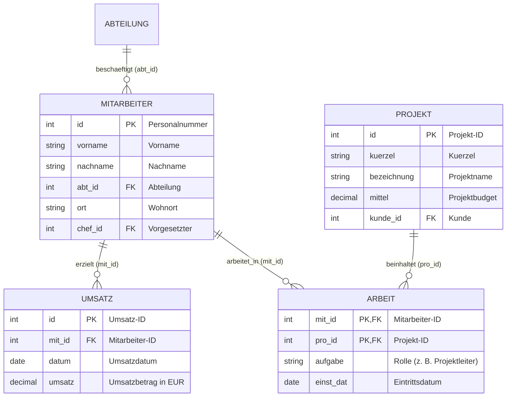
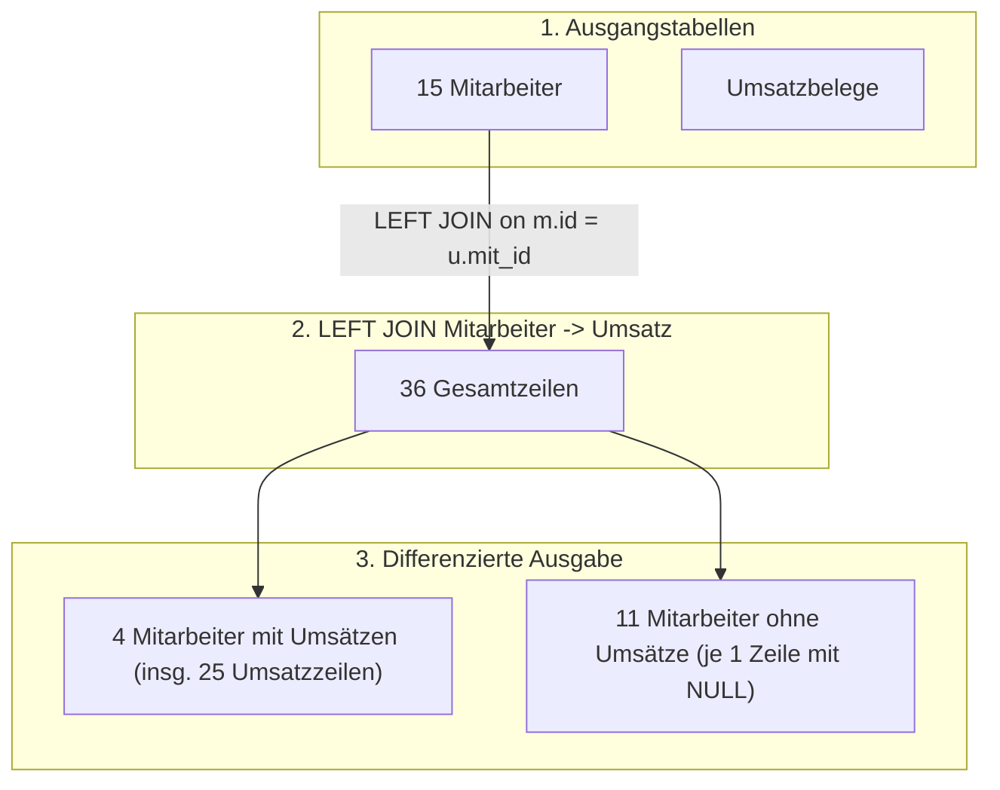
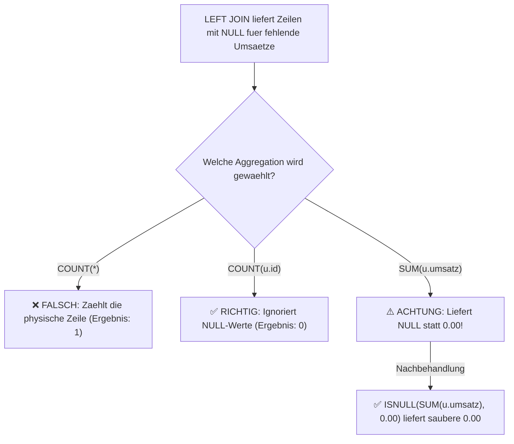
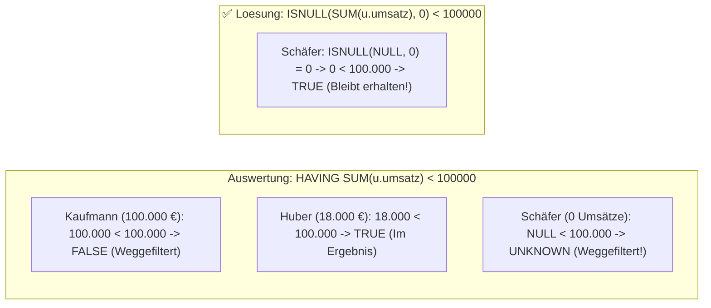
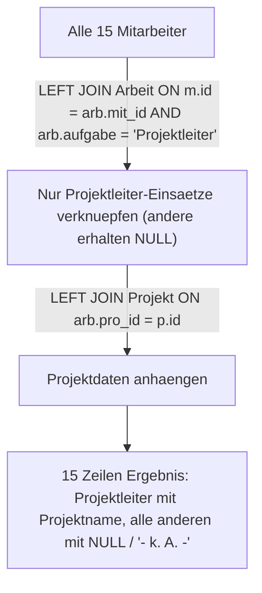
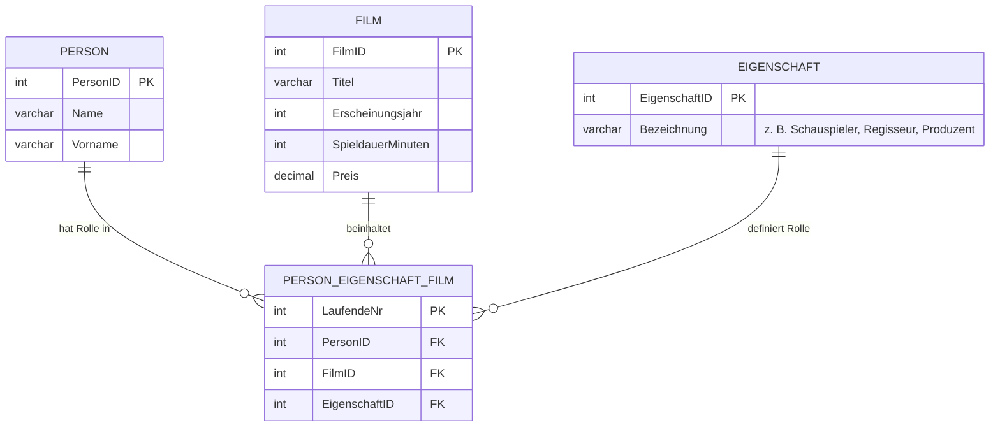
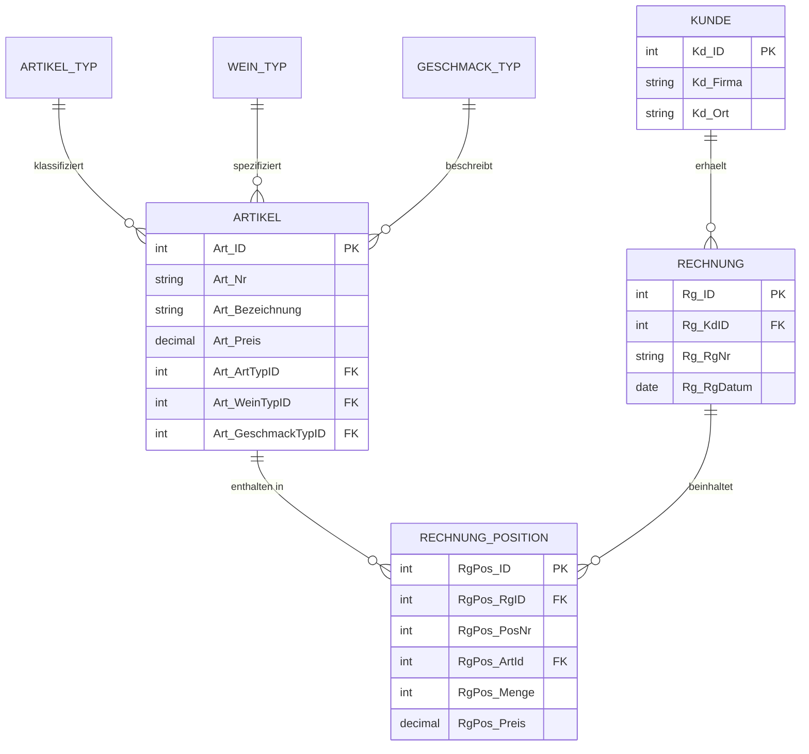
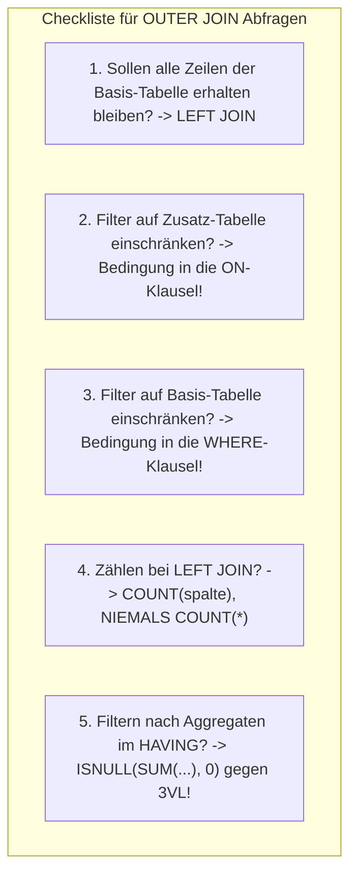

# 📅 Day_17: Fortgeschrittene OUTER JOINs, Aggregationen & Nullwert-Handling

## ℹ️ Kurs-Informationen

* **Datum:** Dienstag, 25.08.2026
* **Arbeitszeit:** 08:15 - 16:00 Uhr
* **Dozent:** Tom S.
* **Autor:** Tobias Boyke

---

## 🎯 Lernziele des Tages

- [x] **OUTER JOINs mit Aggregationen beherrschen:** Das Zusammenspiel von `LEFT JOIN` mit Aggregatfunktionen (`SUM`, `COUNT`, `MIN`, `MAX`, `AVG`) verstehen und fehlerfrei einsetzen.
- [x] **Nullwert-Substitution meistern:** Fehlende Werte (`NULL`) aus unvollständigen Beziehungen via `ISNULL()`, `COALESCE()` und `CASE WHEN` kontrolliert in Standardwerte (`0.00`, `'- k. A. -'`) umwandeln.
- [x] **Die Dreiwertige Logik (3VL) im `HAVING` beherrschen:** Erkennen, warum `NULL < 100000` in SQL `UNKNOWN` ergibt, und Aggregatfilter im `HAVING` gegen Datenverlust absichern.
- [x] **Anti-Joins für Geschäftsberichte einsetzen:** Verwaiste Entitäten (z. B. Mitarbeiter ohne jegliche Umsätze) via `LEFT JOIN ... WHERE B.id IS NULL` isolieren.
- [x] **Multi-Table OUTER JOINs mit Rollenfiltern strukturieren:** Präzise Steuerung von Bedingungen in der `ON`-Klausel (z. B. `AND arb.aufgabe = 'Projektleiter'`), um alle Basisdatensätze zu erhalten.
- [x] **Filterplatzierung verinnerlichen:** Filter auf die *linke Basistabelle* (`WHERE m.abt_id = 2`) sauber von Verknüpfungsfiltern auf die *rechte Tabelle* (`ON`) abgrenzen.
- [x] **IHK-Abschlussprüfungen meistern:** Reale 25-Punkte-Handlungsschritte zu DDL, DML, Multi-Table Joins, Datumsfiltern und Aggregationen lösen.
- [x] **Single Source of Truth (SoT):** Konsequente Einhaltung des relationalen `ProjektDB`-Schemas.

---

## 🗺️ Der relationale Kompass: Wie hängen die Tabellen zusammen?

Am heutigen Tag stehen insbesondere die Beziehungen zwischen **Mitarbeiter**, **Umsatz**, **Arbeit** und **Projekt** im Mittelpunkt:



---

## 📖 Theorie & Kernkonzepte im Detail

### 1. Die 1:n Multiplikation beim `LEFT JOIN`

Wird eine Basistabelle (`Mitarbeiter`, 15 Datensätze) per `LEFT JOIN` mit einer Detailtabelle (`Umsatz`) verknüpft, entstehen zwei Effekte:

1. **Mitarbeiter mit Umsätzen (z. B. Petra Huber):** Für jeden einzelnen Umsatzbeleg wird eine neue Ergebniszeile generiert (Zeilenvervielfachung).
2. **Mitarbeiter ohne Umsätze (z. B. Rainer Meier):** Der Mitarbeiter bleibt mit genau **1 Ergebniszeile** erhalten, wobei alle Spalten aus `Umsatz` mit `NULL` befüllt werden.



---

### 2. 🚨 Die `SUM(NULL)`- und `COUNT(*)`-Falle bei Outer Joins

Werden Daten nach einem `LEFT JOIN` aggregiert, verhalten sich SQL-Aggregatfunktionen fundamental unterschiedlich bei `NULL`-Werten:



| Aggregatfunktion | Verhalten bei `NULL`-Einträgen | Ergebnis bei Mitarbeitern ohne Umsatz | Korrekter Best-Practice-Code |
| :--- | :--- | :---: | :--- |
| **`COUNT(*)`** | Zählt alle Zeilen (ignoriert `NULL` nicht) | **`1`** (❌ Falsch!) | `COUNT(u.id)` $\rightarrow$ liefert **`0`** |
| **`COUNT(u.id)`** | Zählt nur Werte $\neq \text{NULL}$ | **`0`** (✅ Richtig) | `COUNT(u.id)` |
| **`SUM(u.umsatz)`** | Ignoriert `NULL`, liefert bei nur `NULL` jedoch `NULL` | **`NULL`** (⚠️ Unschön) | **`ISNULL(SUM(u.umsatz), 0.00)`** |
| **`MIN(u.datum)`** | Sucht kleinstes Datum $\neq \text{NULL}$ | **`NULL`** (✅ Erwünscht) | `MIN(u.datum)` |
| **`MAX(u.datum)`** | Sucht größtes Datum $\neq \text{NULL}$ | **`NULL`** (✅ Erwünscht) | `MAX(u.datum)` |

---

### 3. 🧠 Die Dreiwertige Logik (3VL) in der `HAVING`-Klausel

Dies ist eine der gefährlichsten Fehlerquellen in SQL-Abfragen:

> **Szenario:** Wir gruppieren Mitarbeiter und suchen alle Personen mit $\text{Gesamtumsatz} < 100.000\text{ €}$.  
> Mitarbeiter ohne Umsätze haben als Aggregatergebnis `SUM(u.umsatz) = NULL`.

```sql
-- ❌ LOGIKFEHLER:
HAVING SUM(u.umsatz) < 100000
```

#### Warum liefert dies nur 2 statt 13 Zeilen?
1. In SQL führt jeder Vergleich mit `NULL` zu **`UNKNOWN`** (weder `TRUE` noch `FALSE`).
2. Die Auswertung `NULL < 100000` ergibt `UNKNOWN`.
3. Sowohl `WHERE` als auch `HAVING` filtern alle Zeilen heraus, deren Bedingung **nicht explizit `TRUE`** ist.
4. Folglich fliegen alle 11 Mitarbeiter mit 0 Umsätzen unbemerkt aus dem Ergebnis!



---

### 4. 🔗 Multi-Table OUTER JOIN mit Rollenbedingungen (`ON` vs. `WHERE`)

Sollen alle Mitarbeiter mit ihrem geleiteten Projekt aufgeführt werden (Aufgabe 8.15), benötigen wir zwei Joins:
1. `Mitarbeiter` $\rightarrow$ `Arbeit` (Einsätze filtern auf Rolle *'Projektleiter'*)
2. `Arbeit` $\rightarrow$ `Projekt` (Projektnamen holen)



> [!WARNING]
> **🚨 Warum darf `arb.aufgabe = 'Projektleiter'` NICHT ins `WHERE`?**
> * Steht die Bedingung im `WHERE`, wird sie **nach** dem Join auf das Gesamtergebnis angewendet.
> * Für jeden Nicht-Projektleiter ist `arb.aufgabe` jedoch `NULL`.
> * Da `NULL = 'Projektleiter'` `UNKNOWN` ergibt, werden alle normalen Mitarbeiter eliminiert. Der `LEFT JOIN` verkommt zu einem `INNER JOIN` mit nur 3 Datensätzen!

---

### 5. 🛠️ Nullwert-Funktionen im Vergleich

| Funktion | Standard | Argumente | Verhalten | Typ-Bindung |
| :--- | :---: | :---: | :--- | :--- |
| **`ISNULL(check_expr, repl_expr)`** | T-SQL (MS SQL) | Genau 2 | Gibt `repl_expr` zurück, wenn `check_expr IS NULL`. | Bindet fest an den Datentyp des 1. Arguments. |
| **`COALESCE(e1, e2, ..., eN)`** | ANSI-SQL (Portabel) | $\ge 2$ | Liefert den **ersten Nicht-NULL-Wert** in der Kette. | Wählt den Datentyp mit der höchsten Precedence. |
| **`CASE WHEN ... THEN ... ELSE`** | ANSI-SQL | Beliebig | Volle Kontrollstruktur mit komplexen Bedingungen. | Explizit und hochgradig flexibel. |

---

## 💻 Praktische Übungen: ProjektDB 08 (OUTER JOIN 2)

* **Aufgaben-Skript:** [`assets/ProjektDB 08 - OUTER JOIN 2 - Aufgaben.sql`](./assets/ProjektDB%2008%20-%20OUTER%20JOIN%202%20-%20Aufgaben.sql)
* **Lösungs-Skript:** [`assets/ProjektDB 08 - OUTER JOIN 2 - Lösungen.sql`](./assets/ProjektDB%2008%20-%20OUTER%20JOIN%202%20-%20Lösungen.sql)
* **Praxis-Skripte:** [`src/01_outer_joins_aggregationen_praxis.sql`](./src/01_outer_joins_aggregationen_praxis.sql)

---

### 📂 Aufgabe 8.9: Mitarbeiter und Einzelumsätze (inkl. 0-Ersatz)

* **Aufgabenstellung:** Zeigen Sie alle Mitarbeiter mit Id und Nachname an und geben Sie dazu die vom Mitarbeiter getätigten Umsätze aus. Hat der Mitarbeiter noch keine Umsätze getätigt, soll in der Spalte Umsatz 0 angezeigt werden.
* **Join-Pfad:** `Mitarbeiter (m)` $\rightarrow$ `Umsatz (u)` über `m.id = u.mit_id`
* **Erwartete Ausgabe (Auszug - 36 Zeilen):**
  ```text
  id     nachname  umsatz
  2581   Kaufmann  100000,00
  5765   Schäfer   0,00
  9031   Meier     0,00
  9912   Wolf      0,00
  10102  Huber     500,00
  10102  Huber     500,00
  ...
  (36 Zeilen)
  ```

```sql
SELECT m.id,
       m.nachname,
       ISNULL(u.umsatz, 0.00) AS umsatz
FROM Mitarbeiter AS m
LEFT JOIN Umsatz AS u ON m.id = u.mit_id;
```

> [!NOTE]
> **💡 Detail-Erklärung:**
> * Durch den `LEFT JOIN` bleiben alle 15 Mitarbeiter erhalten.
> * Mitarbeiter mit mehreren Belegen (z. B. Petra Huber mit 11 Buchungen) erzeugen entsprechend viele Zeilen.
> * Mitarbeiter ohne Buchungen erhalten durch `ISNULL(u.umsatz, 0.00)` den Betrag `0,00` statt `NULL`.

---

### 📂 Aufgabe 8.10: Mitarbeiter ohne Umsätze (Anti-Join)

* **Aufgabenstellung:** Überarbeiten Sie die Abfrage aus Aufgabe 8.9. Zeigen Sie diesmal nur die Mitarbeiter an, die noch keine Umsätze getätigt haben.
* **Join-Pfad:** `Mitarbeiter (m)` $\rightarrow$ `Umsatz (u)` mit Filter `WHERE u.id IS NULL`
* **Erwartete Ausgabe (11 Zeilen):**
  ```text
  id     nachname  umsatz
  5765   Schäfer   0,00
  9031   Meier     0,00
  9912   Wolf      0,00
  12121  Richter   0,00
  18316  Müller    0,00
  20204  Fuchs     0,00
  ...
  (11 Zeilen)
  ```

```sql
SELECT m.id,
       m.nachname,
       ISNULL(u.umsatz, 0.00) AS umsatz
FROM Mitarbeiter AS m
LEFT JOIN Umsatz AS u ON m.id = u.mit_id
WHERE u.id IS NULL;
```

> [!TIP]
> **Anti-Join Best Practice:**
> Bei einem Anti-Join filtert man im `WHERE` stets auf den **Primärschlüssel der rechten Tabelle** (`WHERE u.id IS NULL`). Da ein PK niemals originär `NULL` sein darf, ist garantiert, dass das `NULL` ausschließlich durch das Fehlen einer Verknüpfung im `LEFT JOIN` erzeugt wurde.

---

### 📂 Aufgabe 8.11: Gesamtumsatz pro Mitarbeiter (Gruppierung & `SUM`)

* **Aufgabenstellung:** Überarbeiten Sie die Abfrage aus Aufgabe 8.9. Gruppieren Sie über die Mitarbeiter und geben Sie statt der einzelnen Umsätze die Summe der Umsätze für jeden Mitarbeiter aus. Fehlende Umsätze sollen weiterhin mit 0 angezeigt werden.
* **Join-Pfad:** `Mitarbeiter (m)` $\rightarrow$ `Umsatz (u)` gruppiert nach `m.id, m.nachname`
* **Erwartete Ausgabe (15 Zeilen):**
  ```text
  id     nachname  umsatz
  2581   Kaufmann  100000,00
  5765   Schäfer   0,00
  9031   Meier     0,00
  9912   Wolf      0,00
  10102  Huber     18000,00
  12121  Richter   0,00
  ...
  (15 Zeilen)
  ```

```sql
SELECT m.id,
       m.nachname,
       ISNULL(SUM(u.umsatz), 0.00) AS umsatz
FROM Mitarbeiter AS m
LEFT JOIN Umsatz AS u ON m.id = u.mit_id
GROUP BY m.id, m.nachname;
```

> [!IMPORTANT]
> **Warum `ISNULL(SUM(...))` statt `SUM(ISNULL(...))`?**
> * Beide Varianten liefern das korrekte Ergebnis `0.00`.
> * **Performance-Unterschied:** `ISNULL(SUM(u.umsatz), 0.00)` führt `ISNULL` genau **einmal pro Mitarbeiter** (15 Aufrufe) aus. `SUM(ISNULL(u.umsatz, 0.00))` muss `ISNULL` für **jede einzelne Zeile vor der Summierung** aufrufen (36 Aufrufe).

---

### 📂 Aufgabe 8.12: Mitarbeiter mit Umsatz < 100.000 € (3VL im `HAVING`)

* **Aufgabenstellung:** Überarbeiten Sie die Abfrage aus Aufgabe 8.11. Zeigen Sie nur die Mitarbeiter an, die weniger als 100.000 Umsatz erreicht haben.
* **Erwartete Ausgabe (13 Zeilen):**
  ```text
  id     nachname  umsatz
  5765   Schäfer   0,00
  9031   Meier     0,00
  9912   Wolf      0,00
  10102  Huber     18000,00
  12121  Richter   0,00
  17000  Krüger    20000,00
  ...
  (13 Zeilen)
  ```

#### 🔹 Variante 1: Mit `ISNULL` im `HAVING` (⭐ Best Practice)
```sql
SELECT m.id,
       m.nachname,
       ISNULL(SUM(u.umsatz), 0.00) AS umsatz
FROM Mitarbeiter AS m
LEFT JOIN Umsatz AS u ON m.id = u.mit_id
GROUP BY m.id, m.nachname
HAVING ISNULL(SUM(u.umsatz), 0.00) < 100000;
```

#### 🔄 Variante 2: Mit expliziter `OR IS NULL`-Bedingung
```sql
SELECT m.id,
       m.nachname,
       ISNULL(SUM(u.umsatz), 0.00) AS umsatz
FROM Mitarbeiter AS m
LEFT JOIN Umsatz AS u ON m.id = u.mit_id
GROUP BY m.id, m.nachname
HAVING SUM(u.umsatz) < 100000 
    OR SUM(u.umsatz) IS NULL;
```

> [!CAUTION]
> **Die 2 vs. 13 Zeilen-Falle:**
> Wer nur `HAVING SUM(u.umsatz) < 100000` schreibt, verliert alle 11 Mitarbeiter ohne Umsätze, weil `NULL < 100000` zu `UNKNOWN` evaluiert. Im Ergebnis verbleiben dann fälschlicherweise nur Huber (18.000 €) und Krüger (20.000 €).

---

### 📂 Aufgabe 8.13: Mitarbeiter der Abteilung 2 und deren Umsätze

* **Aufgabenstellung:** Zeigen Sie alle Mitarbeiter der Abteilung 2 mit Id und Nachname an und geben Sie dazu die vom Mitarbeiter getätigten Umsätze aus. Hat der Mitarbeiter noch keine Umsätze getätigt, soll in der Spalte Umsatz eine 0 angezeigt werden.
* **Erwartete Ausgabe:**
  ```text
  id     nachname  umsatz
  2581   Kaufmann  100000,00
  9031   Meier     0,00
  29346  Probst    0,00
  ```

```sql
SELECT m.id,
       m.nachname,
       ISNULL(u.umsatz, 0.00) AS umsatz
FROM Mitarbeiter AS m
LEFT JOIN Umsatz AS u ON m.id = u.mit_id
WHERE m.abt_id = 2;
```

> [!NOTE]
> **Warum gehört `m.abt_id = 2` ins `WHERE`?**
> `m.abt_id` ist eine Spalte der **linken Tabelle** (`Mitarbeiter`). Wir wollen das Ausgangs-Set der Mitarbeiter strikt auf Abteilung 2 einschränken. Filter auf die linke Tabelle gehören immer in die `WHERE`-Klausel.

---

### 📂 Aufgabe 8.14: Erster und letzter Umsatz pro Mitarbeiter

* **Aufgabenstellung:** Zeigen Sie alle Mitarbeiter mit Id und Nachname an und geben Sie dazu aus, an welchem Tag der Mitarbeiter zum ersten Mal einen Umsatz erzielt hat und wann er zum letzten Mal einen Umsatz erzielt hat.
* **Erwartete Ausgabe (Auszug - 15 Zeilen):**
  ```text
  id     nachname  erster      letzter
  2581   Kaufmann  2019-05-01  2019-05-01
  5765   Schäfer   NULL        NULL
  9031   Meier     NULL        NULL
  9912   Wolf      NULL        NULL
  10102  Huber     2018-10-01  2019-01-01
  12121  Richter   NULL        NULL
  ...
  (15 Zeilen)
  ```

```sql
SELECT m.id,
       m.nachname,
       MIN(u.datum) AS erster,
       MAX(u.datum) AS letzter
FROM Mitarbeiter AS m
LEFT JOIN Umsatz AS u ON m.id = u.mit_id
GROUP BY m.id, m.nachname;
```

> [!TIP]
> **Datums-Aggregation & NULL:**
> `MIN()` und `MAX()` ignorieren `NULL`-Werte. Wenn für einen Mitarbeiter keine Umsätze vorliegen, liefern beide Funktionen automatisch `NULL`. Hier ist kein `ISNULL` erforderlich, da `NULL` fachlich korrekt ausdrückt, dass bisher kein Umsatzdatum existiert.

---

### 📂 Aufgabe 8.15: Mitarbeiter und deren Projektleiter-Projekte

* **Aufgabenstellung:** Listen Sie alle Mitarbeiter mit `id` und `nachname` auf. Zusätzlich soll das Projekt genannt werden, in dem der Mitarbeiter Projektleiter ist. Sollte es kein passendes Projekt geben, soll `'- k. A. -'` statt des Projektnamens angezeigt werden.
* **Join-Pfad:** `Mitarbeiter (m)` $\rightarrow$ `Arbeit (arb)` mit Bedingung `arb.aufgabe = 'Projektleiter'` $\rightarrow$ `Projekt (p)`
* **Erwartete Ausgabe (15 Zeilen):**
  ```text
  id     nachname  projekt
  2581   Kaufmann  Merkur
  5765   Schäfer   Pluto
  9031   Meier     - k. A. -
  9912   Wolf      - k. A. -
  10102  Huber     Apollo
  12121  Richter   - k. A. -
  ...
  (15 Zeilen)
  ```

```sql
SELECT m.id,
       m.nachname,
       ISNULL(p.bezeichnung, '- k. A. -') AS projekt
FROM Mitarbeiter AS m
LEFT JOIN Arbeit AS arb ON m.id = arb.mit_id 
                       AND arb.aufgabe = 'Projektleiter'
LEFT JOIN Projekt AS p ON arb.pro_id = p.id;
```

> [!WARNING]
> **🚨 Die Königsdisziplin: Filterung in der `ON`-Klausel beim Ketten-Join:**
> 1. `AND arb.aufgabe = 'Projektleiter'` in der ersten `ON`-Klausel stellt sicher, dass **nur** Einsätze als Projektleiter gejoint werden. Sachbearbeiter-Einsätze werden ignoriert und führen zu `NULL`.
> 2. Der zweite Join `LEFT JOIN Projekt` knüpft an die `pro_id` an. War der erste Join `NULL`, bleibt auch das Projekt `NULL`.
> 3. `ISNULL(p.bezeichnung, '- k. A. -')` fängt alle `NULL`-Ergebnisse sauber ab.
> 4. Würde `arb.aufgabe = 'Projektleiter'` im `WHERE` stehen, würden alle Nicht-Projektleiter sofort gelöscht und es blieben nur 3 Zeilen übrig!

---

## 🎓 Prüfungs-Spezial: IHK-Abschlussprüfungen (25-Punkte-Handlungsschritte)

---

### 🎬 Teil 1: IHK-Prüfung SteamQueen GmbH (Filmverwaltung & Filmarchiv)

* **Prüfungsdokument (PDF):** [`assets/sqljoins_20260825-1118.pdf`](./assets/sqljoins_20260825-1118.pdf)
* **Lösungsskript:** [`src/02_ihk_abschlusspruefung_filmarchiv_loesung.sql`](./src/02_ihk_abschlusspruefung_filmarchiv_loesung.sql)



#### 📂 Teilaufgabe 1.a) DDL: Tabelle `Filmarchiv` anlegen (4 Punkte)

```sql
CREATE TABLE Filmarchiv (
    FilmID INT PRIMARY KEY,
    Titel VARCHAR(255) NOT NULL,
    Erscheinungsjahr INT,
    SpieldauerMinuten INT
);
```

#### 📂 Teilaufgabe 1.b) DML: Datenübertrag ins Archiv (4 Punkte)

```sql
INSERT INTO Filmarchiv (FilmID, Titel, Erscheinungsjahr, SpieldauerMinuten)
SELECT FilmID,
       Titel,
       Erscheinungsjahr,
       SpieldauerMinuten
FROM Film
WHERE Erscheinungsjahr < 1950;
```

#### 📂 Teilaufgabe 1.c) DML: Übertragene Filme löschen (4 Punkte)

```sql
DELETE FROM Film
WHERE FilmID IN (SELECT FilmID FROM Filmarchiv);
```

#### 📂 Teilaufgabe 1.d) DQL: Schauspieler und Film-Anzahl (6 Punkte)

```sql
SELECT p.PersonID,
       p.Name,
       p.Vorname,
       COUNT(pef.FilmID) AS AnzahlFilme
FROM Person AS p
INNER JOIN Person_Eigenschaft_Film AS pef ON p.PersonID = pef.PersonID
INNER JOIN Eigenschaft AS e ON pef.EigenschaftID = e.EigenschaftID
WHERE e.Bezeichnung = 'Schauspieler'
GROUP BY p.PersonID, p.Name, p.Vorname;
```

#### 📂 Teilaufgabe 1.e) DQL: Filme von Grace Kelly vor 1960 (7 Punkte)

```sql
SELECT DISTINCT f.Titel,
       f.Erscheinungsjahr
FROM Film AS f
INNER JOIN Person_Eigenschaft_Film AS pef ON f.FilmID = pef.FilmID
INNER JOIN Person AS p ON pef.PersonID = p.PersonID
WHERE p.Name = 'Kelly'
  AND p.Vorname = 'Grace'
  AND f.Erscheinungsjahr < 1960
ORDER BY f.Erscheinungsjahr DESC;
```

---

### 🍷 Teil 2: IHK-Prüfung Fakturierungsdatenbank (Weinhandel & Fakturierung)

* **Prüfungsdokument (PDF):** [`assets/joins_20260825-1404.pdf`](./assets/joins_20260825-1404.pdf)
* **Lösungsskript:** [`src/03_ihk_abschlusspruefung_fakturierung_loesung.sql`](./src/03_ihk_abschlusspruefung_fakturierung_loesung.sql)



#### 📂 Teilaufgabe 2.a) DML: Artikelpreise um 15 % erhöhen (3 Punkte)

* **Aufgabenstellung:** Erstellen Sie eine SQL-Anweisung, mit der Sie alle Artikelpreise um 15 % erhöhen.

```sql
UPDATE ARTIKEL
SET Art_Preis = Art_Preis * 1.15;
```

> [!NOTE]
> **IHK-Korrekturpunkte (3 Punkte):**
> * `UPDATE ARTIKEL` korrekt formuliert (1 Punkt).
> * `SET Art_Preis = Art_Preis * 1.15` (oder `Art_Preis + (Art_Preis * 0.15)`) (2 Punkte).

---

#### 📂 Teilaufgabe 2.b) DML: Artikel zwischen 10 und 15 EUR löschen (2 Punkte)

* **Aufgabenstellung:** Erstellen Sie eine SQL-Anweisung, mit der Sie alle Artikel löschen, die einen Artikelpreis besitzen, der zwischen 10 EUR und 15 EUR liegt.

```sql
DELETE FROM ARTIKEL
WHERE Art_Preis BETWEEN 10.00 AND 15.00;
```

> [!TIP]
> **IHK-Korrekturpunkte (2 Punkte):**
> * `DELETE FROM ARTIKEL` (1 Punkt).
> * `WHERE Art_Preis BETWEEN 10.00 AND 15.00` (oder `>= 10.00 AND <= 15.00`) (1 Punkt).

---

#### 📂 Teilaufgabe 2.c) DQL: Alle Kunden und Gesamtumsatz (5 Punkte)

* **Aufgabenstellung:** Erstellen Sie eine SQL-Abfrage, mit der Sie für alle Kunden den Firmennamen sowie den Gesamtumsatz erhalten. Die Ergebniszeilen sollen aufsteigend nach Umsatz sortiert sein.
* **Erwartete Ausgabe:**
  ```text
  Kd_Firma               Umsatz
  Weinfabrik Sumpp       NULL
  Weinhandel Peters      17,94 EUR
  Weinschnecke           88,56 EUR
  Weingut am Weinberg    153,36 EUR
  Weinhandel Predisto    766,37 EUR
  ```

```sql
SELECT k.Kd_Firma,
       SUM(rp.RgPos_Menge * rp.RgPos_Preis) AS Umsatz
FROM KUNDE AS k
LEFT JOIN RECHNUNG AS rg ON k.Kd_ID = rg.Rg_KdID
LEFT JOIN RECHNUNG_POSITION AS rp ON rg.Rg_ID = rp.RgPos_RgID
GROUP BY k.Kd_ID, k.Kd_Firma
ORDER BY Umsatz ASC;
```

> [!IMPORTANT]
> **IHK-Korrekturpunkte (5 Punkte):**
> * `LEFT JOIN` über `KUNDE` $\rightarrow$ `RECHNUNG` $\rightarrow$ `RECHNUNG_POSITION`, damit auch Kunden ohne Rechnungen (*Weinfabrik Sumpp* mit `NULL`) erhalten bleiben (2 Punkte).
> * Berechnung `SUM(rp.RgPos_Menge * rp.RgPos_Preis)` (1 Punkt).
> * `GROUP BY` nach Kunden-Identifikatoren (1 Punkt).
> * `ORDER BY Umsatz ASC` (1 Punkt).

---

#### 📂 Teilaufgabe 2.d) DQL: Artikelumsatz März 2020 für spezifische Weine (10 Punkte)

* **Aufgabenstellung:** Erstellen Sie eine SQL-Abfrage, mit der Sie für alle Artikel die Artikelnummer und die Artikelbezeichnung sowie den Umsatz für den März 2020 erhalten. Es sollen alle Weine ausgegeben werden, die mit dem Artikel-Typ *„Wein“*, dem Geschmackstyp *„Trocken“* oder *„Halbtrocken“* und mit Weintyp *„Weißwein“* gekennzeichnet sind.
* **Erwartete Ausgabe:**
  ```text
  Art_Nr  Art_Bezeichnung  ArtikelUmsatz
  00102   Voliar           206,64 EUR
  00112   Mendazie         120,00 EUR
  00115   Tinto Templa     60,00 EUR
  ```

```sql
SELECT a.Art_Nr,
       a.Art_Bezeichnung,
       SUM(rp.RgPos_Menge * rp.RgPos_Preis) AS ArtikelUmsatz
FROM ARTIKEL AS a
INNER JOIN ARTIKEL_TYP AS at ON a.Art_ArtTypID = at.ArtTyp_ID
INNER JOIN GESCHMACK_TYP AS gt ON a.Art_GeschmackTypID = gt.Geschmack_ID
INNER JOIN WEIN_TYP AS wt ON a.Art_WeinTypID = wt.WeinTyp_ID
INNER JOIN RECHNUNG_POSITION AS rp ON a.Art_ID = rp.RgPos_ArtId
INNER JOIN RECHNUNG AS rg ON rp.RgPos_RgID = rg.Rg_ID
WHERE at.ArtTyp_Bezeichnung = 'Wein'
  AND gt.Geschmack_Name IN ('Trocken', 'Halbtrocken')
  AND wt.WeinTyp_Bezeichnung = 'Weißwein'
  AND rg.Rg_RgDatum BETWEEN '2020-03-01' AND '2020-03-31'
GROUP BY a.Art_ID, a.Art_Nr, a.Art_Bezeichnung;
```

> [!NOTE]
> **IHK-Korrekturpunkte (10 Punkte):**
> * 5 INNER JOINs zur vollständigen Verbindung aller 6 Tabellen (4 Punkte).
> * Filterung auf Artikeltyp, Geschmackstyp und Weintyp (3 Punkte).
> * Datumsfilter auf März 2020 (`BETWEEN '2020-03-01' AND '2020-03-31'`) (1 Punkt).
> * Aggregation mit `SUM(Menge * Preis)` und vollständiges `GROUP BY` (2 Punkte).

---

#### 📂 Teilaufgabe 2.e) DQL: Alle Artikel mit durchschnittlichem Verkaufspreis (5 Punkte)

* **Aufgabenstellung:** Erstellen Sie eine SQL-Abfrage, mit der Sie alle Artikel mit dem durchschnittlichen Verkaufspreis anzeigen.
* **Erwartete Ausgabe:**
  ```text
  Art_ID  Art_Nr  Art_Bezeichnung  Art_Preis  Durchschnitt
  1       00102   Voliar           7,38       7,38 EUR
  2       00105   Piladar          5,98       5,98 EUR
  3       00106   Dos Pantas       7,95       7,95 EUR
  4       00112   Mendazie         24,95      20,00 EUR
  5       00115   Tinto Templa     22,90      20,00 EUR
  6       00128   La Grandala      15,37      15,37 EUR
  7       00131   Lay Blanco       16,38      15,69 EUR
  8       00132   Mese Rosade      17,37      17,37 EUR
  9       00133   Rosato Ron       12,99      NULL
  ```

```sql
SELECT a.Art_ID,
       a.Art_Nr,
       a.Art_Bezeichnung,
       a.Art_Preis,
       AVG(rp.RgPos_Preis) AS Durchschnitt
FROM ARTIKEL AS a
LEFT JOIN RECHNUNG_POSITION AS rp ON a.Art_ID = rp.RgPos_ArtId
GROUP BY a.Art_ID, a.Art_Nr, a.Art_Bezeichnung, a.Art_Preis
ORDER BY a.Art_ID ASC;
```

> [!WARNING]
> **IHK-Korrekturpunkte & Stolperfalle (5 Punkte):**
> * **`LEFT JOIN` ist zwingend erforderlich:** Artikel 9 (*Rosato Ron*) wurde noch nie verkauft. Ein `INNER JOIN` würde Artikel 9 abschneiden! Durch `LEFT JOIN` erhält der Durchschnitt korrekt den Wert `NULL` (2 Punkte).
> * `AVG(rp.RgPos_Preis)` zur Durchschnittspreis-Berechnung (1 Punkt).
> * Vollständige Spalten im `SELECT` und `GROUP BY` (1 Punkt).
> * Sortierung `ORDER BY a.Art_ID ASC` (1 Punkt).

---

## 🧭 Zusammenfassung & Best-Practice-Leitfaden



### 📋 Schnellübersicht der Tagesbefehle

| Anforderung | SQL-Muster |
| :--- | :--- |
| **Nullwert ersetzen (T-SQL)** | `ISNULL(spalte, ersatzwert)` |
| **Nullwert ersetzen (ANSI-SQL)** | `COALESCE(spalte1, spalte2, ersatzwert)` |
| **Anti-Join (Verwaiste Datensätze)** | `FROM A LEFT JOIN B ON A.id = B.a_id WHERE B.id IS NULL` |
| **Sichere Aggregation bei Outer Join** | `ISNULL(SUM(b.betrag), 0.00)` |
| **Sicheres HAVING bei Outer Join** | `HAVING ISNULL(SUM(b.betrag), 0.00) < 1000` |
| **Bedingter Multi-Table Left Join** | `FROM M LEFT JOIN A ON M.id = A.m_id AND A.typ = 'Chef' LEFT JOIN P ON A.p_id = P.id` |
| **Preise prozentual anpassen (DML)** | `UPDATE Tabelle SET Preis = Preis * 1.15` |
| **Bereichslöschung (DML)** | `DELETE FROM Tabelle WHERE Preis BETWEEN 10 AND 15` |
| **Datenübertrag (DML)** | `INSERT INTO Archiv SELECT ... FROM Quelle WHERE ...` |
| **Gezieltes Löschen nach Übertrag (DML)** | `DELETE FROM Quelle WHERE ID IN (SELECT ID FROM Archiv)` |