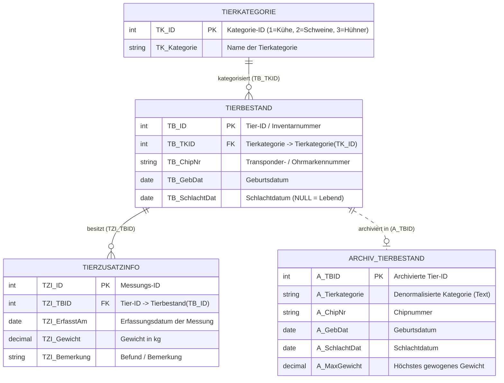
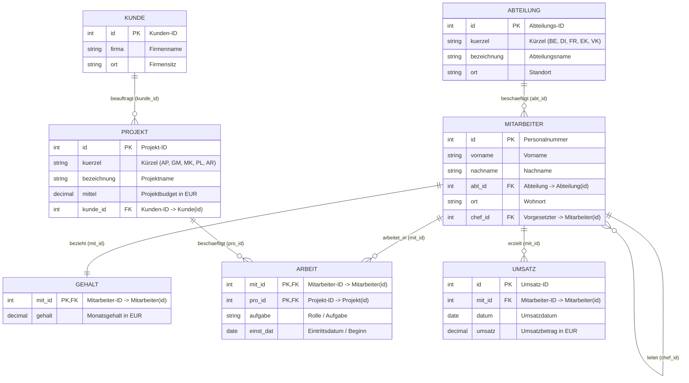
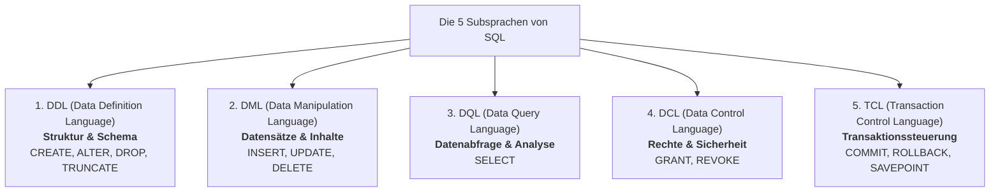
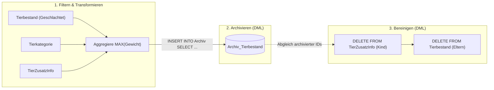
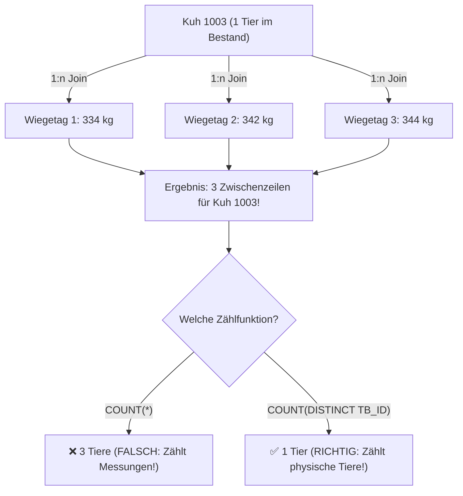
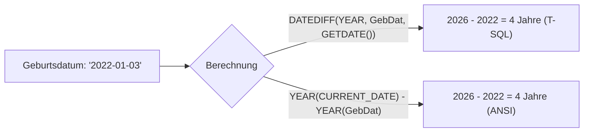
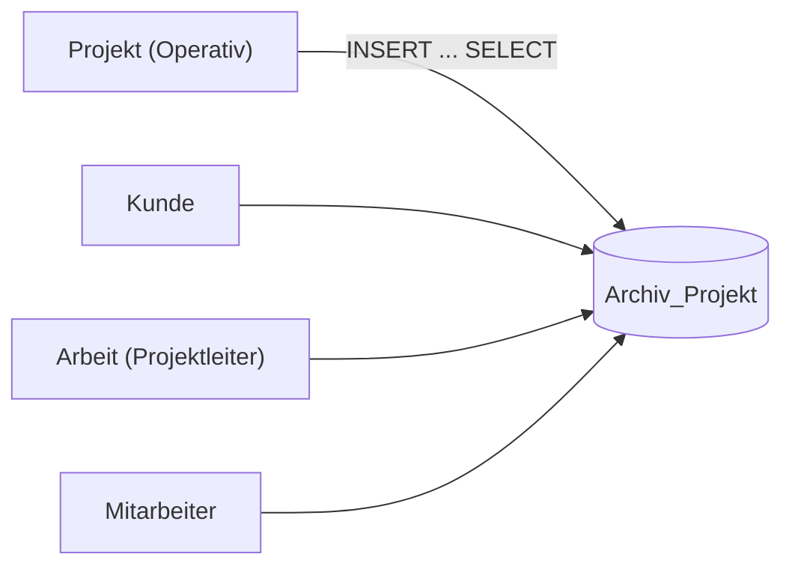
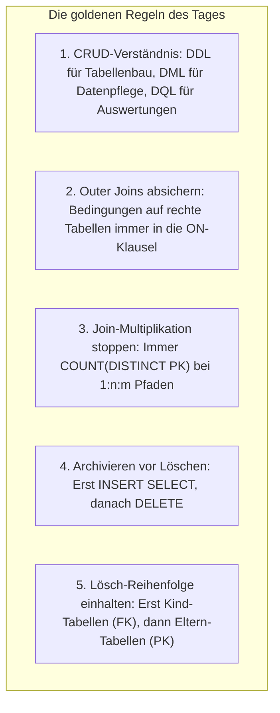

# 📅 Day_18: Vertiefungstag & IHK-Prüfungstraining (CRUD, Aggregationen & Archivierung)

## ℹ️ Kurs-Informationen

* **Datum:** Mittwoch, 26.08.2026
* **Arbeitszeit:** 08:15 - 16:00 Uhr
* **Dozent:** Tom S.
* **Autor:** Tobias Boyke

---

## 🎯 Lernziele des Tages

- [x] **CRUD-Matrix & SQL-Subsprachen beherrschen:** Die 4 CRUD-Operationen (*Create, Read, Update, Delete*) den entsprechenden SQL-Kategorien (**DDL**, **DML**, **DQL**, **DCL**, **TCL**) zuordnen.
- [x] **Multi-Table OUTER JOINs mit Aggregationen vertiefen:** Komplexe Abfragen über 3 verknüpfte Tabellen mit Aggregatfunktionen (`COUNT(DISTINCT)`, `MAX`, `AVG`, `MIN`) fehlerfrei konstruieren.
- [x] **Die Join-Multiplikationsfalle verstehen & vermeiden:** Erkennen, warum 1:n-Joins zu Detailtabellen vor der Aggregation Duplikate erzeugen, und warum `COUNT(DISTINCT spalte)` Pflicht ist.
- [x] **Filterplatzierung bei Outer Joins:** Bedingungen auf die rechte Tabelle (`tb.TB_SchlachtDat IS NULL`) in die `ON`-Klausel setzen, um unvollständige Basis-Kategorien (z. B. Hühner mit 0 Tieren) nicht zu verlieren.
- [x] **Datums- & Altersberechnungen in SQL:** Alter aus Geburtsdaten dynamisch mit `DATEDIFF(YEAR, GebDat, GETDATE())` bzw. `YEAR()` berechnen.
- [x] **Datenarchivierungs-Pipelines strukturieren (ETL-Muster):** Historische Datensätze aggregiert und transformiert mittels `INSERT INTO ... SELECT ... GROUP BY` in Archivtabellen überführen.
- [x] **Referentielle Integrität bei Löschoperationen:** Abhängige Kind-Tabellen (`TierZusatzInfo`) vor den Eltern-Tabellen (`Tierbestand`) bereinigen, um Fremdschlüssel-Konflikte zu vermeiden.
- [x] **IHK-Abschlussprüfung (25 Punkte) meistern:** Die vollständige Originalprüfung zur Nutztierdatenbank und Archivierung lösen.
- [x] **Single Source of Truth (SoT):** Transfer der Archivierungs- und Aggregationsmuster auf das kanonische Schema der `ProjektDB`.

---

## 🗺️ Relationale Kompasse: Wie hängen die Tabellen zusammen?

### 1. Das relationale Schema der IHK-Abschlussprüfung (Nutztierverwaltung)



---

### 2. Das kanonische Single Source of Truth (SoT) Schema: `ProjektDB`

Für alle Abfragen im Unternehmenskontext gilt das etablierte `ProjektDB`-Schema:



---

## 📖 Theorie & Kernkonzepte im Detail

### 1. Die CRUD-Matrix & die 5 SQL-Subsprachen

In der Softwareentwicklung und Datenbankadministration beschreibt **CRUD** die vier fundamentalen Operationen für persistente Daten. SQL unterteilt seine Befehle je nach Einsatzzweck in verschiedene Subsprachen:



#### 📊 Die vollständige CRUD-Befehlszuordnung

| CRUD-Operation | Fachliche Bedeutung | DDL (Struktur) | DML (Datensätze) | DQL (Abfragen) |
| :--- | :--- | :--- | :--- | :--- |
| **C** *(Create)* | Anlegen / Erstellen | `CREATE TABLE`, `CREATE INDEX` | `INSERT INTO ... VALUES` | *X (Keine DQL)* |
| **R** *(Read)* | Lesen / Abfragen | *X (Keine DDL)* | *X (Keine DML)* | `SELECT ... FROM` |
| **U** *(Update)* | Aktualisieren / Anpassen | `ALTER TABLE`, `ALTER COLUMN` | `UPDATE ... SET ...` | *X (Keine DQL)* |
| **D** *(Delete)* | Löschen / Entfernen | `DROP TABLE`, `TRUNCATE TABLE` | `DELETE FROM ... WHERE` | *X (Keine DQL)* |

> [!NOTE]
> **💡 DDL vs. DML vs. DQL im Prüfungsfokus:**
> * **DDL operiert auf Objekten:** Ein `CREATE` erzeugt eine Tabelle/View, ein `ALTER` fügt eine neue Spalte hinzu, ein `DROP` vernichtet die gesamte Tabellenstruktur.
> * **DML operiert auf Zeilen:** `INSERT` fügt Zeilen ein, `UPDATE` ändert Feldinhalte, `DELETE` entfernt Zeilen (die Tabellenstruktur bleibt erhalten).
> * **DQL ist zustandslos:** `SELECT` liest Daten, verändert jedoch weder Schema noch Tabelleninhalte.

---

### 2. Datenarchivierungs-Pipelines (ETL-Muster im Datenbankbetrieb)

In operativen Datenbanken (OLTP) führen Millionen historischer Datensätze zu Performanceverlusten bei Indizes, Backups und täglichen Abfragen. Die Lösung ist eine **Archivierungs-Pipeline**:



#### ⚖️ Warum Denormalisierung im Archiv?
In der Zieltabelle `Archiv_Tierbestand` wird das Feld `A_Tierkategorie` als reiner Text (`VARCHAR`) statt als Fremdschlüssel gespeichert.  
* **Gründe:**
  1. **Autarkie:** Das Archiv bleibt auch dann konsistent und lesbar, wenn Kategorien in der operativen Tabelle umbenannt oder gelöscht werden.
  2. **Historischer Snapshot:** Es wird der Zustand zum Zeitpunkt der Schlachtung/Archivierung konserviert.
  3. **Performance:** Historische Reports benötigen keine Joins mehr auf Stammdaten-Tabellen.

---

### 3. Die Join-Multiplikationsfalle (`COUNT(DISTINCT)`)

Wird eine Tabelle (`Tierbestand`) über einen $1:n$-Join mit einer Detailtabelle (`TierZusatzInfo`) verknüpft, vervielfachen sich die Zeilen für jedes Tier, das mehrfach gewogen wurde:



| Zählmethode | Auswertung | Ergebnis bei Kuh 1003 (3 Wiegungen) | Fachliche Bewertung |
| :--- | :--- | :---: | :--- |
| `COUNT(*)` | Zählt physische Ergebniszeilen | **3** | ❌ **Falsch:** Zählt Wiegevorgänge statt Tiere! |
| `COUNT(tb.TB_ID)` | Zählt Primärschlüssel-Einträge | **3** | ❌ **Falsch:** Primärschlüssel taucht 3-mal im Join auf! |
| **`COUNT(DISTINCT tb.TB_ID)`** | Zählt eindeutige Tier-IDs | **1** | ✅ **Richtig:** Exakte Tieranzahl im Bestand! |

---

### 4. Datums- & Altersberechnung in SQL

Um das Alter eines Tieres in Jahren zu berechnen, stehen verschiedene Funktionen zur Verfügung:



```sql
-- T-SQL (Microsoft SQL Server):
DATEDIFF(YEAR, tb.TB_GebDat, GETDATE())

-- ANSI-SQL / Plattformunabhängig:
YEAR(CURRENT_DATE) - YEAR(tb.TB_GebDat)
```

---

## 🎓 Prüfungs-Spezial: IHK-Abschlussprüfung (Handlungsschritt 4: Tierbestandsverwaltung)

* **Prüfungsdokument (PDF):** [`assets/irgendwasmitsql_20260826-0836.pdf`](./assets/irgendwasmitsql_20260826-0836.pdf)
* **Lösungsskript:** [`src/01_ihk_abschlusspruefung_tierbestand_loesung.sql`](./src/01_ihk_abschlusspruefung_tierbestand_loesung.sql)
* **Gesamtpunktzahl:** 25 Punkte

---

### 📂 Aufgabe 4.a) CRUD-Operationen & SQL-Befehle (3 Punkte)

* **Aufgabenstellung:** Stellen Sie den Zusammenhang zwischen den SQL-Befehlen mit den grundlegenden Datenbankoperationen (CRUD) her. Ergänzen Sie die zugehörigen Befehle (weiße Felder).

#### 📋 Vollständige IHK-Lösungsmatrix

| Grundlegende Datenoperationen | Bedeutung | DDL Data Definition Language | DML Data Manipulation Language | DQL Data Query Language |
| :--- | :--- | :---: | :---: | :---: |
| **C (reate)** | Anlegen, Erstellen | **`CREATE`** | **`INSERT`** | `X` |
| **R (ead)** | Lesen | `X` | `X` | **`SELECT`** |
| **U (pdate)** | Aktualisieren | **`ALTER`** | **`UPDATE`** | `X` |
| **D (elete)** | Löschen | **`DROP`** *(oder TRUNCATE)* | **`DELETE`** | `X` |

> [!NOTE]
> **IHK-Korrekturschlüssel (3 Punkte):**
> * DDL Spalte: `CREATE`, `ALTER`, `DROP` korrekt eingetragen (1 Punkt).
> * DML Spalte: `INSERT`, `UPDATE`, `DELETE` korrekt eingetragen (1 Punkt).
> * DQL Spalte: `SELECT` für Read zugeordnet (1 Punkt).

---

### 📂 Aufgabe 4.b) DQL: Auflistung aller Tierkategorien der lebenden Tiere (8 Punkte)

* **Aufgabenstellung:** Erstellen Sie eine SQL-Abfrage, mit der Sie eine Auflistung **aller Tier-Kategorien** mit den nachfolgenden Informationen je Tier-Kategorie über die **lebenden Tiere** erhalten:
  - Anzahl des Tierbestandes
  - Gewicht des schwersten Tieres
  - Alter des ältesten Tieres
  - Durchschnittliches Alter
* **Erwartete Ausgabe:**
  ```text
  TK_Kategorie  AnzahlTiere  SchwerstesTier  ÄltestesTier  DurchschnittAlter
  Hühner        0            NULL            NULL          NULL
  Kühe          3            344             4             4
  Schweine      3            655             1             2
  ```

#### 🔹 Musterlösung (T-SQL / ANSI-SQL)

```sql
SELECT tk.TK_Kategorie,
       COUNT(DISTINCT tb.TB_ID) AS AnzahlTiere,
       MAX(tzi.TZI_Gewicht) AS SchwerstesTier,
       MAX(DATEDIFF(YEAR, tb.TB_GebDat, GETDATE())) AS ÄltestesTier,
       AVG(DATEDIFF(YEAR, tb.TB_GebDat, GETDATE())) AS DurchschnittAlter
FROM Tierkategorie AS tk
LEFT JOIN Tierbestand AS tb ON tk.TK_ID = tb.TB_TKID 
                            AND tb.TB_SchlachtDat IS NULL
LEFT JOIN TierZusatzInfo AS tzi ON tb.TB_ID = tzi.TZI_TBID
GROUP BY tk.TK_ID, tk.TK_Kategorie
ORDER BY tk.TK_Kategorie ASC;
```

#### 🔄 Alternative Berechnung mit ANSI-SQL Datumsfunktionen
```sql
SELECT tk.TK_Kategorie,
       COUNT(DISTINCT tb.TB_ID) AS AnzahlTiere,
       MAX(tzi.TZI_Gewicht) AS SchwerstesTier,
       MAX(YEAR(CURRENT_DATE) - YEAR(tb.TB_GebDat)) AS ÄltestesTier,
       AVG(YEAR(CURRENT_DATE) - YEAR(tb.TB_GebDat)) AS DurchschnittAlter
FROM Tierkategorie AS tk
LEFT JOIN Tierbestand AS tb ON tk.TK_ID = tb.TB_TKID 
                            AND tb.TB_SchlachtDat IS NULL
LEFT JOIN TierZusatzInfo AS tzi ON tb.TB_ID = tzi.TZI_TBID
GROUP BY tk.TK_ID, tk.TK_Kategorie
ORDER BY tk.TK_Kategorie ASC;
```

> [!WARNING]
> **🚨 Die 3 klassischen IHK-Stolperfallen bei Aufgabe 4.b:**
> 1. **Warum `LEFT JOIN`?**  
>    Die Aufgabe verlangt eine Liste **aller** Tierkategorien. Da für *Hühner* aktuell keine Tiere existieren, würde ein `INNER JOIN` Hühner komplett aus dem Ergebnis tilgen!
> 2. **Warum gehört `tb.TB_SchlachtDat IS NULL` in die `ON`-Klausel?**  
>    Wird der Filter ins `WHERE` geschrieben, filtert er Zeilen aus, bei denen `tb.TB_SchlachtDat` nicht `NULL` ist. Für Hühner sind alle rechten Spalten `NULL` (was zwar zufällig `IS NULL` ist), aber jede Kategorie mit ausschließlich geschlachteten Tieren würde durch einen `WHERE`-Filter unbemerkt verschwinden. Filter auf rechte Tabellen im Outer Join gehören immer ins `ON`!
> 3. **Warum `COUNT(DISTINCT tb.TB_ID)`?**  
>    Kuh 1003 hat 3 Einträge in `TierZusatzInfo`. Ein einfaches `COUNT(tb.TB_ID)` oder `COUNT(*)` würde die Kuh 3-mal zählen und eine falsche Bestandszahl von 5 statt 3 Kühen liefern!

> [!TIP]
> **IHK-Korrekturschlüssel (8 Punkte):**
> * `SELECT tk.TK_Kategorie` (1 Punkt).
> * `COUNT(DISTINCT tb.TB_ID)` für Tieranzahl (2 Punkte).
> * `MAX(tzi.TZI_Gewicht)` für Höchstgewicht (1 Punkt).
> * `MAX(DATEDIFF(...))` und `AVG(DATEDIFF(...))` für Alter & Durchschnitt (2 Punkte).
> * 2 `LEFT JOIN`s mit Bedingung `TB_SchlachtDat IS NULL` (1 Punkt).
> * `GROUP BY tk.TK_ID, tk.TK_Kategorie` (1 Punkt).

---

### 📂 Aufgabe 4.ca) DML: Geschlachtete Tiere archivieren (10 Punkte)

* **Aufgabenstellung:** Um die Tabelle `Tierbestand` nicht unnötig mit nicht mehr benötigten Daten zu belasten, wurde eine Archivtabelle erstellt, welche zusätzlich zur Tierbestandtabelle zwei weitere Attribute für die Tierkategorie als Textfeld und für das höchste Gewicht beinhaltet.  
Erstellen Sie eine SQL-Anweisung, mit der alle Daten der geschlachteten Tiere, der Tierkategorie und dem höchsten gewogenen Gewicht in die Tabelle `Archiv_Tierbestand` über einen Befehl archiviert werden.

#### 🔹 Musterlösung

```sql
INSERT INTO Archiv_Tierbestand (A_TBID, A_Tierkategorie, A_ChipNr, A_GebDat, A_SchlachtDat, A_MaxGewicht)
SELECT tb.TB_ID,
       tk.TK_Kategorie,
       tb.TB_ChipNr,
       tb.TB_GebDat,
       tb.TB_SchlachtDat,
       MAX(tzi.TZI_Gewicht) AS A_MaxGewicht
FROM Tierbestand AS tb
INNER JOIN Tierkategorie AS tk ON tb.TB_TKID = tk.TK_ID
LEFT JOIN TierZusatzInfo AS tzi ON tb.TB_ID = tzi.TZI_TBID
WHERE tb.TB_SchlachtDat IS NOT NULL
GROUP BY tb.TB_ID, tk.TK_Kategorie, tb.TB_ChipNr, tb.TB_GebDat, tb.TB_SchlachtDat;
```

> [!IMPORTANT]
> **IHK-Korrekturschlüssel (10 Punkte):**
> * `INSERT INTO Archiv_Tierbestand (Spaltenliste)` (2 Punkte).
> * `SELECT` mit korrekter Spaltenzuordnung (2 Punkte).
> * `JOIN` zwischen `Tierbestand`, `Tierkategorie` und `TierZusatzInfo` (2 Punkte).
> * Filterung auf geschlachtete Tiere: `WHERE tb.TB_SchlachtDat IS NOT NULL` (2 Punkte).
> * Aggregation mit `MAX(tzi.TZI_Gewicht)` und vollständiges `GROUP BY` über alle Nicht-Aggregatspalten (2 Punkte).

---

### 📂 Aufgabe 4.cb) DML: Archivierte Datensätze aus Tabellen löschen (4 Punkte)

* **Aufgabenstellung:** Danach sollen alle zugehörigen Daten der archivierten Datensätze aus den Tabellen entfernt werden.

#### 🔹 Musterlösung (Unter Beachtung der referentiellen Integrität)

```sql
-- Schritt 1: Detail-Daten der archivierten Tiere löschen (Child Table zuerst!)
DELETE FROM TierZusatzInfo
WHERE TZI_TBID IN (SELECT A_TBID FROM Archiv_Tierbestand);

-- Schritt 2: Haupt-Datensätze der archivierten Tiere löschen (Parent Table danach!)
DELETE FROM Tierbestand
WHERE TB_ID IN (SELECT A_TBID FROM Archiv_Tierbestand);
```

#### 🔄 Alternative Variante mit direktem Datumsfilter
```sql
-- Schritt 1: Zusatzinfos aller geschlachteten Tiere löschen
DELETE FROM TierZusatzInfo
WHERE TZI_TBID IN (
    SELECT TB_ID 
    FROM Tierbestand 
    WHERE TB_SchlachtDat IS NOT NULL
);

-- Schritt 2: Geschlachtete Tiere aus Tierbestand löschen
DELETE FROM Tierbestand
WHERE TB_SchlachtDat IS NOT NULL;
```

> [!CAUTION]
> **🚨 Die Foreign Key Trap (Referentielle Integrität):**
> Würde man versuchen, zuerst `DELETE FROM Tierbestand` auszuführen, wirft das DBMS sofort einen Fehler:  
> `The DELETE statement conflicted with the REFERENCE constraint "FK_TierZusatzInfo_Tierbestand"...`  
> In SQL-Prüfungen gibt es für die **korrekte Reihenfolge (Kind-Tabelle vor Eltern-Tabelle)** explizite Bewertungspunkte!

---

## 🏢 Transfer auf die Single Source of Truth (`ProjektDB`)

Wie lässt sich das heute erlernte Archivierungs- und Aggregationsmuster auf unsere Unternehmensdatenbank (`ProjektDB`) übertragen?

### Praxisbeispiel: Archivierung abgeschlossener Projekte mit Projektleiter & Gesamtbudget

> **Szenario:** Projekte, die abgeschlossen sind (z. B. Budget komplett ausgeschöpft oder historisches Datum), sollen in eine Tabelle `Archiv_Projekt` überführt und anschließend aus dem operativen System entfernt werden.



#### 1. DDL: Archivtabelle für Projekte erstellen
```sql
CREATE TABLE Archiv_Projekt (
    A_ProID INT PRIMARY KEY,
    A_Bezeichnung VARCHAR(100) NOT NULL,
    A_KundeFirma VARCHAR(100) NOT NULL,
    A_Projektleiter VARCHAR(100) NULL,
    A_Mittel DECIMAL(12, 2) NOT NULL,
    A_ArchiviertAm DATE NOT NULL
);
```

#### 2. DML: Archivierung durchführen (INSERT SELECT mit Joins)
```sql
INSERT INTO Archiv_Projekt (A_ProID, A_Bezeichnung, A_KundeFirma, A_Projektleiter, A_Mittel, A_ArchiviertAm)
SELECT p.id,
       p.bezeichnung,
       k.firma,
       CONCAT(m.vorname, ' ', m.nachname) AS projektleiter,
       p.mittel,
       CAST(GETDATE() AS DATE)
FROM Projekt AS p
INNER JOIN Kunde AS k ON p.kunde_id = k.id
LEFT JOIN Arbeit AS arb ON p.id = arb.pro_id AND arb.aufgabe = 'Projektleiter'
LEFT JOIN Mitarbeiter AS m ON arb.mit_id = m.id
WHERE p.mittel < 100000; -- Beispielkriterium für abgeschlossene/kleine Projekte
```

#### 3. DML: Bereinigung in richtiger Fremdschlüssel-Reihenfolge
```sql
-- 1. Zuerst Einsätze aus der Brückentabelle 'Arbeit' entfernen (Kind)
DELETE FROM Arbeit
WHERE pro_id IN (SELECT A_ProID FROM Archiv_Projekt);

-- 2. Danach das Projekt aus der Tabelle 'Projekt' entfernen (Eltern)
DELETE FROM Projekt
WHERE id IN (SELECT A_ProID FROM Archiv_Projekt);
```

---

## 🧭 Zusammenfassung & Best-Practice-Leitfaden



### 📋 Schnellübersicht der SQL-Befehle

| Anforderung | SQL-Muster |
| :--- | :--- |
| **Tabellen erstellen (DDL)** | `CREATE TABLE Name (Spalte Datentyp Constraints);` |
| **Spalten anpassen (DDL)** | `ALTER TABLE Name ADD Spalte Datentyp;` |
| **Tabelle vernichten (DDL)** | `DROP TABLE Name;` |
| **Zeilen einfügen (DML)** | `INSERT INTO Tabelle (Spalten) VALUES (...);` |
| **Massenübertrag / Archiv (DML)** | `INSERT INTO Ziel (Spalten) SELECT ... FROM Quelle WHERE ... GROUP BY ...;` |
| **Zeilen ändern (DML)** | `UPDATE Tabelle SET Spalte = NeuerWert WHERE Bedingung;` |
| **Zeilen löschen (DML)** | `DELETE FROM Tabelle WHERE ID IN (SELECT ID FROM Archiv);` |
| **Duplikatsfreie Zählung (DQL)** | `COUNT(DISTINCT t.ID)` |
| **Alter in Jahren berechnen (T-SQL)** | `DATEDIFF(YEAR, Geburtsdatum, GETDATE())` |
| **Alter in Jahren berechnen (ANSI)** | `YEAR(CURRENT_DATE) - YEAR(Geburtsdatum)` |

---

## 💻 Praktische Skripte im Projekt

* 📜 **IHK-Lösungsskript:** [`src/01_ihk_abschlusspruefung_tierbestand_loesung.sql`](./src/01_ihk_abschlusspruefung_tierbestand_loesung.sql)
* 📄 **Prüfungsunterlage (PDF):** [`assets/irgendwasmitsql_20260826-0836.pdf`](./assets/irgendwasmitsql_20260826-0836.pdf)