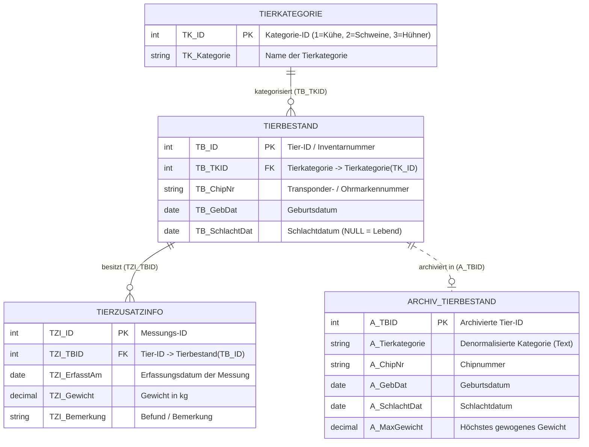
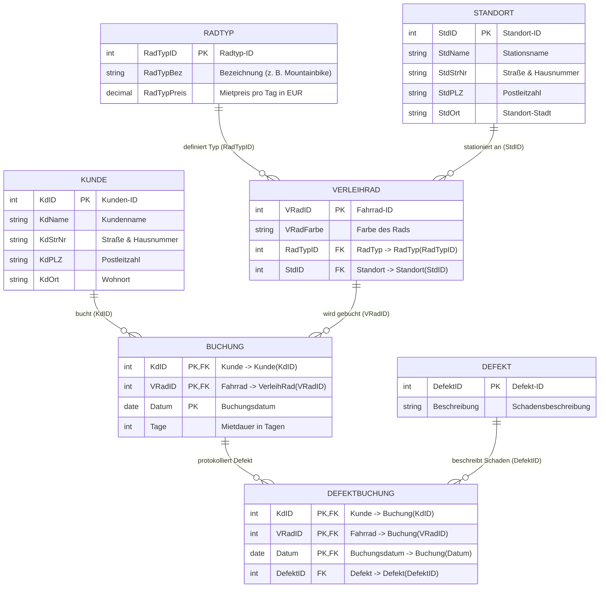
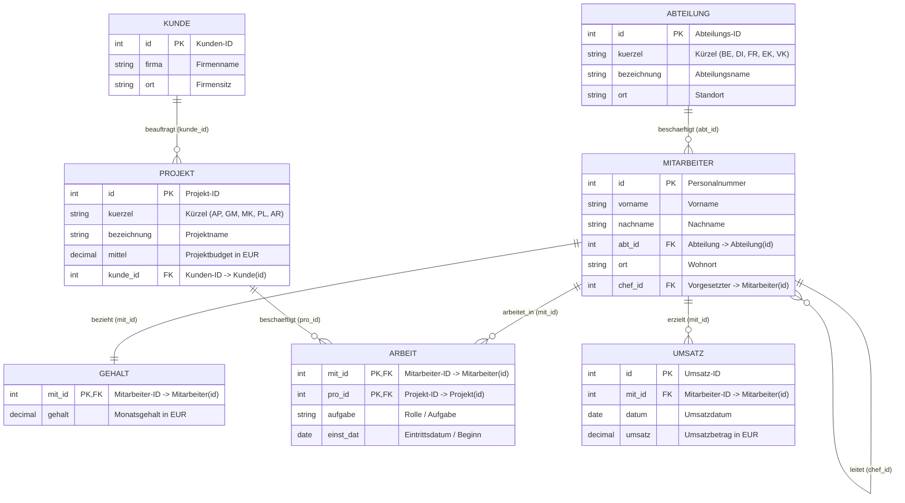
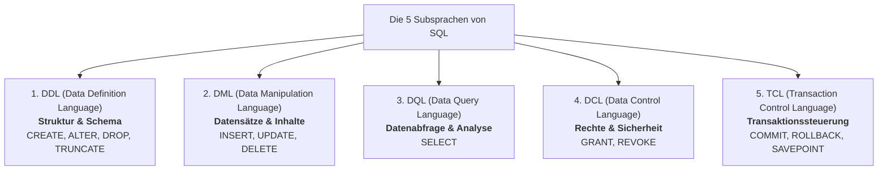
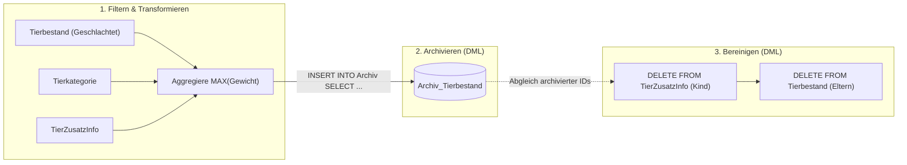
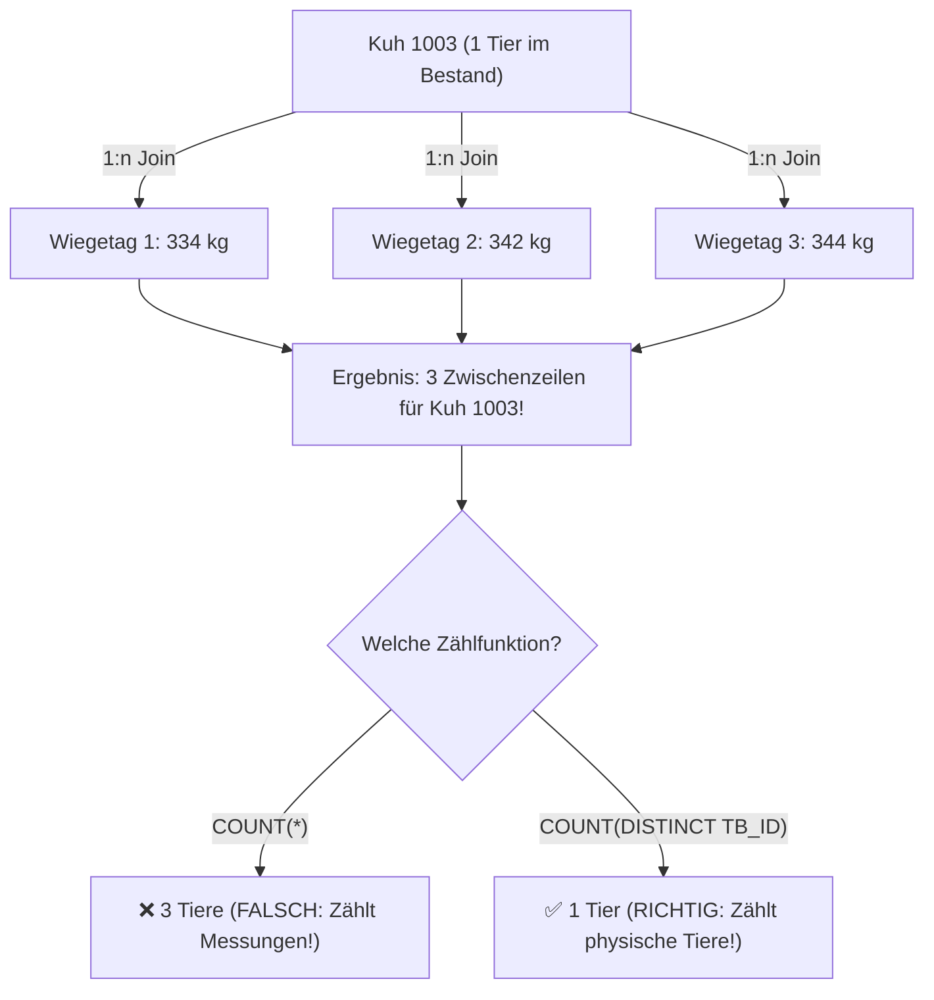
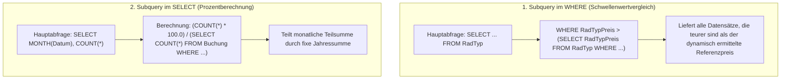
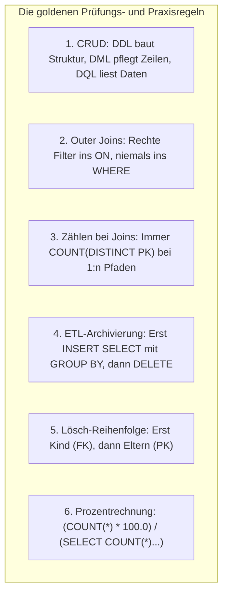

# 📅 Day_18: Vertiefungstag & IHK-Prüfungstraining (CRUD, Aggregationen & Archivierung)

## ℹ️ Kurs-Informationen

* **Datum:** Mittwoch, 26.08.2026
* **Arbeitszeit:** 08:15 - 16:00 Uhr
* **Dozent:** Tom S.
* **Autor:** Tobias Boyke

---

## 🎯 Lernziele des Tages

- [x] **CRUD-Matrix & SQL-Subsprachen beherrschen:** Die 4 CRUD-Operationen (*Create, Read, Update, Delete*) den entsprechenden SQL-Kategorien (**DDL**, **DML**, **DQL**, **DCL**, **TCL**) zuordnen.
- [x] **Multi-Table OUTER JOINs mit Aggregationen vertiefen:** Komplexe Abfragen über 3 verknüpfte Tabellen mit Aggregatfunktionen (`COUNT(DISTINCT)`, `MAX`, `AVG`, `MIN`, `SUM`) fehlerfrei konstruieren.
- [x] **Die Join-Multiplikationsfalle verstehen & vermeiden:** Erkennen, warum 1:n-Joins zu Detailtabellen vor der Aggregation Duplikate erzeugen, und warum `COUNT(DISTINCT spalte)` Pflicht ist.
- [x] **Filterplatzierung bei Outer Joins:** Bedingungen auf die rechte Tabelle (`tb.TB_SchlachtDat IS NULL`) in die `ON`-Klausel setzen, um unvollständige Basis-Kategorien (z. B. Hühner mit 0 Tieren) nicht zu verlieren.
- [x] **Datums- & Altersberechnungen in SQL:** Alter aus Geburtsdaten dynamisch mit `DATEDIFF(YEAR, GebDat, GETDATE())` bzw. `YEAR()` berechnen.
- [x] **Datenarchivierungs-Pipelines strukturieren (ETL-Muster):** Historische Datensätze aggregiert und transformiert mittels `INSERT INTO ... SELECT ... GROUP BY` in Archivtabellen überführen.
- [x] **Referentielle Integrität bei DML-Löschoperationen:** Abhängige Kind-Tabellen vor den Eltern-Tabellen bereinigen, um Fremdschlüssel-Konflikte zu vermeiden.
- [x] **DDL-Strukturierung & Zusammengesetzte Schlüssel:** Neue Tabellen mit Fremdschlüssel-Beziehungen und mehrteiligen Primärschlüsseln (`PRIMARY KEY (KdID, VRadID, Datum)`) definieren.
- [x] **Skalare Subqueries & Prozentanteile:** Subqueries für dynamische Preisvergleiche (`WHERE Preis > (SELECT ...)`) und Verhältnisberechnungen im `SELECT` einsetzen.
- [x] **Zwei vollständige 25-Punkte IHK-Abschlussprüfungen meistern:**
  1. *Handlungsschritt 4:* Nutztierdatenbank & Datenarchivierung (ZPA FIA II).
  2. *Handlungsschritt 5:* Fahrradverleih „Die Speiche GmbH“ (ZPA FI Ganz I Anw).
- [x] **Single Source of Truth (SoT):** Transfer der Archivierungs- und Aggregationsmuster auf das kanonische Schema der `ProjektDB`.

---

## 🗺️ Relationale Kompasse: Wie hängen die Tabellen zusammen?

### 1. Das relationale Schema der IHK-Prüfung 1 (Nutztierverwaltung & Archivierung)



---

### 2. Das relationale Schema der IHK-Prüfung 2 (Fahrradverleih „Die Speiche GmbH“)



---

### 3. Das kanonische Single Source of Truth (SoT) Schema: `ProjektDB`



---

## 📖 Theorie & Kernkonzepte im Detail

### 1. Die CRUD-Matrix & die 5 SQL-Subsprachen

In der Softwareentwicklung und Datenbankadministration beschreibt **CRUD** die vier fundamentalen Operationen für persistente Daten. SQL unterteilt seine Befehle je nach Einsatzzweck in verschiedene Subsprachen:



#### 📊 Die vollständige CRUD-Befehlszuordnung

| CRUD-Operation | Fachliche Bedeutung | DDL (Struktur) | DML (Datensätze) | DQL (Abfragen) |
| :--- | :--- | :--- | :--- | :--- |
| **C** *(Create)* | Anlegen / Erstellen | `CREATE TABLE`, `CREATE INDEX` | `INSERT INTO ... VALUES` | *X (Keine DQL)* |
| **R** *(Read)* | Lesen / Abfragen | *X (Keine DDL)* | *X (Keine DML)* | `SELECT ... FROM` |
| **U** *(Update)* | Aktualisieren / Anpassen | `ALTER TABLE`, `ALTER COLUMN` | `UPDATE ... SET ...` | *X (Keine DQL)* |
| **D** *(Delete)* | Löschen / Entfernen | `DROP TABLE`, `TRUNCATE TABLE` | `DELETE FROM ... WHERE` | *X (Keine DQL)* |

> [!NOTE]
> **💡 DDL vs. DML vs. DQL im Prüfungsfokus:**
> * **DDL operiert auf Objekten:** Ein `CREATE` erzeugt eine Tabelle/View, ein `ALTER` fügt eine neue Spalte hinzu, ein `DROP` vernichtet die gesamte Tabellenstruktur.
> * **DML operiert auf Zeilen:** `INSERT` fügt Zeilen ein, `UPDATE` ändert Feldinhalte, `DELETE` entfernt Zeilen (die Tabellenstruktur bleibt erhalten).
> * **DQL ist zustandslos:** `SELECT` liest Daten, verändert jedoch weder Schema noch Tabelleninhalte.

---

### 2. Datenarchivierungs-Pipelines (ETL-Muster im Datenbankbetrieb)

In operativen Datenbanken (OLTP) führen Millionen historischer Datensätze zu Performanceverlusten bei Indizes, Backups und täglichen Abfragen. Die Lösung ist eine **Archivierungs-Pipeline**:



#### ⚖️ Warum Denormalisierung im Archiv?
In der Zieltabelle `Archiv_Tierbestand` wird das Feld `A_Tierkategorie` als reiner Text (`VARCHAR`) statt als Fremdschlüssel gespeichert.  
* **Gründe:**
  1. **Autarkie:** Das Archiv bleibt auch dann konsistent und lesbar, wenn Kategorien in der operativen Tabelle umbenannt oder gelöscht werden.
  2. **Historischer Snapshot:** Es wird der Zustand zum Zeitpunkt der Schlachtung/Archivierung konserviert.
  3. **Performance:** Historische Reports benötigen keine Joins mehr auf Stammdaten-Tabellen.

---

### 3. Die Join-Multiplikationsfalle (`COUNT(DISTINCT)`)

Wird eine Tabelle (`Tierbestand`) über einen $1:n$-Join mit einer Detailtabelle (`TierZusatzInfo`) verknüpft, vervielfachen sich die Zeilen für jedes Tier, das mehrfach gewogen wurde:



| Zählmethode | Auswertung | Ergebnis bei Kuh 1003 (3 Wiegungen) | Fachliche Bewertung |
| :--- | :--- | :---: | :--- |
| `COUNT(*)` | Zählt physische Ergebniszeilen | **3** | ❌ **Falsch:** Zählt Wiegevorgänge statt Tiere! |
| `COUNT(tb.TB_ID)` | Zählt Primärschlüssel-Einträge | **3** | ❌ **Falsch:** Primärschlüssel taucht 3-mal im Join auf! |
| **`COUNT(DISTINCT tb.TB_ID)`** | Zählt eindeutige Tier-IDs | **1** | ✅ **Richtig:** Exakte Tieranzahl im Bestand! |

---

### 4. Skalare Subqueries & Prozentberechnungen

In SQL-Prüfungen werden häufig zwei Arten von Unterabfragen (Subqueries) gefordert:



> [!TIP]
> **💡 Wichtig bei Prozentrechnung in SQL Server / T-SQL:**
> Eine Division zweier Ganzzahlen (`COUNT(*) / COUNT(*)`) führt zu einer **Integer-Division** (z. B. $5 / 100 = 0$).  
> Durch die Multiplikation mit `100.0` (Dezimalzahl) wird das Zwischenergebnis implizit in einen Gleitkommatyp konvertiert $\rightarrow$ das Ergebnis liefert korrekte Prozentwerte (z. B. `5.25%`).

---

## 🎓 Prüfungs-Spezial 1: IHK-Abschlussprüfung (Handlungsschritt 4: Tierbestandsverwaltung)

* **Prüfungsdokument (PDF):** [`assets/irgendwasmitsql_20260826-0836.pdf`](./assets/irgendwasmitsql_20260826-0836.pdf)
* **Lösungsskript:** [`src/01_ihk_abschlusspruefung_tierbestand_loesung.sql`](./src/01_ihk_abschlusspruefung_tierbestand_loesung.sql)
* **Gesamtpunktzahl:** 25 Punkte

---

### 📂 Aufgabe 4.a) CRUD-Operationen & SQL-Befehle (3 Punkte)

* **Aufgabenstellung:** Stellen Sie den Zusammenhang zwischen den SQL-Befehlen mit den grundlegenden Datenbankoperationen (CRUD) her. Ergänzen Sie die zugehörigen Befehle (weiße Felder).

#### 📋 Vollständige IHK-Lösungsmatrix

| Grundlegende Datenoperationen | Bedeutung | DDL Data Definition Language | DML Data Manipulation Language | DQL Data Query Language |
| :--- | :--- | :---: | :---: | :---: |
| **C (reate)** | Anlegen, Erstellen | **`CREATE`** | **`INSERT`** | `X` |
| **R (ead)** | Lesen | `X` | `X` | **`SELECT`** |
| **U (pdate)** | Aktualisieren | **`ALTER`** | **`UPDATE`** | `X` |
| **D (elete)** | Löschen | **`DROP`** *(oder TRUNCATE)* | **`DELETE`** | `X` |

> [!NOTE]
> **IHK-Korrekturschlüssel (3 Punkte):**
> * DDL Spalte: `CREATE`, `ALTER`, `DROP` korrekt eingetragen (1 Punkt).
> * DML Spalte: `INSERT`, `UPDATE`, `DELETE` korrekt eingetragen (1 Punkt).
> * DQL Spalte: `SELECT` für Read zugeordnet (1 Punkt).

---

### 📂 Aufgabe 4.b) DQL: Auflistung aller Tierkategorien der lebenden Tiere (8 Punkte)

* **Aufgabenstellung:** Erstellen Sie eine SQL-Abfrage, mit der Sie eine Auflistung **aller Tier-Kategorien** mit den nachfolgenden Informationen je Tier-Kategorie über die **lebenden Tiere** erhalten:
  - Anzahl des Tierbestandes
  - Gewicht des schwersten Tieres
  - Alter des ältesten Tieres
  - Durchschnittliches Alter
* **Erwartete Ausgabe:**
  ```text
  TK_Kategorie  AnzahlTiere  SchwerstesTier  ÄltestesTier  DurchschnittAlter
  Hühner        0            NULL            NULL          NULL
  Kühe          3            344             4             4
  Schweine      3            655             1             2
  ```

#### 🔹 Musterlösung (T-SQL / ANSI-SQL)

```sql
SELECT tk.TK_Kategorie,
       COUNT(DISTINCT tb.TB_ID) AS AnzahlTiere,
       MAX(tzi.TZI_Gewicht) AS SchwerstesTier,
       MAX(DATEDIFF(YEAR, tb.TB_GebDat, GETDATE())) AS ÄltestesTier,
       AVG(DATEDIFF(YEAR, tb.TB_GebDat, GETDATE())) AS DurchschnittAlter
FROM Tierkategorie AS tk
LEFT JOIN Tierbestand AS tb ON tk.TK_ID = tb.TB_TKID 
                            AND tb.TB_SchlachtDat IS NULL
LEFT JOIN TierZusatzInfo AS tzi ON tb.TB_ID = tzi.TZI_TBID
GROUP BY tk.TK_ID, tk.TK_Kategorie
ORDER BY tk.TK_Kategorie ASC;
```

> [!WARNING]
> **🚨 Die 3 klassischen IHK-Stolperfallen bei Aufgabe 4.b:**
> 1. **Warum `LEFT JOIN`?**  
>    Die Aufgabe verlangt eine Liste **aller** Tierkategorien. Da für *Hühner* aktuell keine Tiere existieren, würde ein `INNER JOIN` Hühner komplett aus dem Ergebnis tilgen!
> 2. **Warum gehört `tb.TB_SchlachtDat IS NULL` in die `ON`-Klausel?**  
>    Wird der Filter ins `WHERE` geschrieben, filtert er Zeilen aus, bei denen `tb.TB_SchlachtDat` nicht `NULL` ist. Für Hühner sind alle rechten Spalten `NULL` (was zwar zufällig `IS NULL` ist), aber jede Kategorie mit ausschließlich geschlachteten Tieren würde durch einen `WHERE`-Filter unbemerkt verschwinden. Filter auf rechte Tabellen im Outer Join gehören immer ins `ON`!
> 3. **Warum `COUNT(DISTINCT tb.TB_ID)`?**  
>    Kuh 1003 hat 3 Einträge in `TierZusatzInfo`. Ein einfaches `COUNT(tb.TB_ID)` oder `COUNT(*)` würde die Kuh 3-mal zählen und eine falsche Bestandszahl von 5 statt 3 Kühen liefern!

---

### 📂 Aufgabe 4.ca) DML: Geschlachtete Tiere archivieren (10 Punkte)

* **Aufgabenstellung:** Um die Tabelle `Tierbestand` nicht unnötig mit nicht mehr benötigten Daten zu belasten, wurde eine Archivtabelle erstellt, welche zusätzlich zur Tierbestandtabelle zwei weitere Attribute für die Tierkategorie als Textfeld und für das höchste Gewicht beinhaltet.  
Erstellen Sie eine SQL-Anweisung, mit der alle Daten der geschlachteten Tiere, der Tierkategorie und dem höchsten gewogenen Gewicht in die Tabelle `Archiv_Tierbestand` über einen Befehl archiviert werden.

#### 🔹 Musterlösung

```sql
INSERT INTO Archiv_Tierbestand (A_TBID, A_Tierkategorie, A_ChipNr, A_GebDat, A_SchlachtDat, A_MaxGewicht)
SELECT tb.TB_ID,
       tk.TK_Kategorie,
       tb.TB_ChipNr,
       tb.TB_GebDat,
       tb.TB_SchlachtDat,
       MAX(tzi.TZI_Gewicht) AS A_MaxGewicht
FROM Tierbestand AS tb
INNER JOIN Tierkategorie AS tk ON tb.TB_TKID = tk.TK_ID
LEFT JOIN TierZusatzInfo AS tzi ON tb.TB_ID = tzi.TZI_TBID
WHERE tb.TB_SchlachtDat IS NOT NULL
GROUP BY tb.TB_ID, tk.TK_Kategorie, tb.TB_ChipNr, tb.TB_GebDat, tb.TB_SchlachtDat;
```

---

### 📂 Aufgabe 4.cb) DML: Archivierte Datensätze aus Tabellen löschen (4 Punkte)

* **Aufgabenstellung:** Danach sollen alle zugehörigen Daten der archivierten Datensätze aus den Tabellen entfernt werden.

#### 🔹 Musterlösung (Unter Beachtung der referentiellen Integrität)

```sql
-- Schritt 1: Detail-Daten der archivierten Tiere löschen (Child Table zuerst!)
DELETE FROM TierZusatzInfo
WHERE TZI_TBID IN (SELECT A_TBID FROM Archiv_Tierbestand);

-- Schritt 2: Haupt-Datensätze der archivierten Tiere löschen (Parent Table danach!)
DELETE FROM Tierbestand
WHERE TB_ID IN (SELECT A_TBID FROM Archiv_Tierbestand);
```

> [!CAUTION]
> **🚨 Die Foreign Key Trap (Referentielle Integrität):**
> Würde man versuchen, zuerst `DELETE FROM Tierbestand` auszuführen, wirft das DBMS sofort einen Fehler:  
> `The DELETE statement conflicted with the REFERENCE constraint "FK_TierZusatzInfo_Tierbestand"...`  
> In SQL-Prüfungen gibt es für die **korrekte Reihenfolge (Kind-Tabelle vor Eltern-Tabelle)** explizite Bewertungspunkte!

---

## 🎓 Prüfungs-Spezial 2: IHK-Abschlussprüfung (Handlungsschritt 5: Die Speiche GmbH)

* **Prüfungsdokument (PDF):** [`assets/Gescannt_20260826-1034.pdf`](./assets/Gescannt_20260826-1034.pdf)
* **Lösungsskript:** [`src/02_ihk_abschlusspruefung_fahrradverleih_loesung.sql`](./src/02_ihk_abschlusspruefung_fahrradverleih_loesung.sql)
* **Gesamtpunktzahl:** 25 Punkte

---

### 📂 Aufgabe 5.aa) DDL: Tabelle `Defekt` erstellen (2 Punkte)

* **Aufgabenstellung:** Erstellen Sie die Tabelle `Defekt`, welche als Attribut eine `DefektID` und eine `Beschreibung` enthält.

```sql
CREATE TABLE Defekt (
    DefektID INT PRIMARY KEY,
    Beschreibung VARCHAR(255) NOT NULL
);
```

> [!NOTE]
> **IHK-Korrekturschlüssel (2 Punkte):**
> * `CREATE TABLE Defekt` (1 Punkt).
> * Attribute `DefektID` (Primärschlüssel) und `Beschreibung` korrekt deklariert (1 Punkt).

---

### 📂 Aufgabe 5.ab) DDL: Tabelle `DefektBuchung` erstellen (3 Punkte)

* **Aufgabenstellung:** Erstellen Sie die Tabelle `DefektBuchung`, welche bis auf das Attribut `Tage` alle Attribute der Tabelle `Buchung` und eine `DefektID` aus der Tabelle `Defekt` enthält.

```sql
CREATE TABLE DefektBuchung (
    KdID INT NOT NULL,
    VRadID INT NOT NULL,
    Datum DATE NOT NULL,
    DefektID INT NOT NULL,
    PRIMARY KEY (KdID, VRadID, Datum),
    FOREIGN KEY (KdID) REFERENCES Kunde(KdID),
    FOREIGN KEY (VRadID) REFERENCES VerleihRad(VRadID),
    FOREIGN KEY (DefektID) REFERENCES Defekt(DefektID)
);
```

> [!IMPORTANT]
> **IHK-Korrekturschlüssel (3 Punkte):**
> * Tabellenname und korrekte Spaltenauswahl (`KdID`, `VRadID`, `Datum`, `DefektID` ohne `Tage`) (1 Punkt).
> * Primärschlüssel (zusammengesetzter PK aus `KdID, VRadID, Datum`) (1 Punkt).
> * Fremdschlüssel-Beziehungen zu `Kunde`, `VerleihRad` und `Defekt` (1 Punkt).

---

### 📂 Aufgabe 5.b) DQL: Buchungen pro RadTyp mit Mindestanzahl (5 Punkte)

* **Aufgabenstellung:** Erstellen Sie eine Liste aller Buchungen pro RadTyp für alle Radtypen, zu denen mindestens zehn Buchungen vorliegen.
* **Erwartete Ausgabe:**
  ```text
  RadTypID  Anzahl
  1000      23
  1001      12
  ```

#### 🔹 Musterlösung

```sql
SELECT vr.RadTypID,
       COUNT(*) AS Anzahl
FROM VerleihRad AS vr
INNER JOIN Buchung AS b ON vr.VRadID = b.VRadID
GROUP BY vr.RadTypID
HAVING COUNT(*) >= 10;
```

#### 🔄 Alternative Variante mit Join auf `RadTyp`
```sql
SELECT rt.RadTypID,
       COUNT(b.KdID) AS Anzahl
FROM RadTyp AS rt
INNER JOIN VerleihRad AS vr ON rt.RadTypID = vr.RadTypID
INNER JOIN Buchung AS b ON vr.VRadID = b.VRadID
GROUP BY rt.RadTypID
HAVING COUNT(b.KdID) >= 10;
```

> [!TIP]
> **IHK-Korrekturschlüssel (5 Punkte):**
> * `SELECT RadTypID, COUNT(...)` (1 Punkt).
> * `JOIN` zwischen `VerleihRad` und `Buchung` (2 Punkte).
> * `GROUP BY RadTypID` (1 Punkt).
> * `HAVING COUNT(*) >= 10` (1 Punkt).

---

### 📂 Aufgabe 5.c) DQL: Gesamtumsatz pro Kunde (5 Punkte)

* **Aufgabenstellung:** Erstellen Sie eine Liste, in der für jeden Kunden der Gesamtumsatz seiner Buchungen (jeweils `Tage * RadTypPreis`) aufgelistet ist. Die Liste soll die Datensätze absteigend sortiert nach dem Umsatz enthalten.
* **Erwartete Ausgabe:**
  ```text
  KdID  Umsatz
  2002  1400.00
  2001  800.00
  ```

#### 🔹 Musterlösung

```sql
SELECT b.KdID,
       SUM(b.Tage * rt.RadTypPreis) AS Umsatz
FROM Buchung AS b
INNER JOIN VerleihRad AS vr ON b.VRadID = vr.VRadID
INNER JOIN RadTyp AS rt ON vr.RadTypID = rt.RadTypID
GROUP BY b.KdID
ORDER BY Umsatz DESC;
```

> [!NOTE]
> **IHK-Korrekturschlüssel (5 Punkte):**
> * `SELECT b.KdID` (1 Punkt).
> * Formel `SUM(b.Tage * rt.RadTypPreis)` (1 Punkt).
> * Vollständige Joins (`Buchung` $\rightarrow$ `VerleihRad` $\rightarrow$ `RadTyp`) (1 Punkt).
> * `GROUP BY b.KdID` (1 Punkt).
> * `ORDER BY Umsatz DESC` (1 Punkt).

---

### 📂 Aufgabe 5.d) DQL: Subquery - Räder teurer als Mountainbike (5 Punkte)

* **Aufgabenstellung:** Geben Sie alle Radtyp-IDs, deren Radtypbezeichnung und Preis an, die einen höheren Preis als der Radtyp *‚Mountainbike‘* haben (`RadTypID = 1001`).
* **Erwartete Ausgabe:**
  ```text
  RadTypID  RadTypBez   RadTypPreis
  1002      Tandem 500  30.00
  1003      E-Bike      35.00
  ```

#### 🔹 Musterlösung mit Subquery

```sql
SELECT RadTypID,
       RadTypBez,
       RadTypPreis
FROM RadTyp
WHERE RadTypPreis > (
    SELECT RadTypPreis 
    FROM RadTyp 
    WHERE RadTypBez = 'Mountainbike' 
       OR RadTypID = 1001
);
```

> [!TIP]
> **IHK-Korrekturschlüssel (5 Punkte):**
> * Hauptabfrage `SELECT RadTypID, RadTypBez, RadTypPreis FROM RadTyp` (2 Punkte).
> * Vergleichsoperator `>` (1 Punkt).
> * Subquery `(SELECT RadTypPreis FROM RadTyp WHERE ...)` (2 Punkte).

---

### 📂 Aufgabe 5.e) DQL: Prozentualer Buchungsanteil pro Monat im Jahr 2019 (5 Punkte)

* **Aufgabenstellung:** Geben Sie für jeden Monat den prozentualen Anteil der Anzahl der Buchungen an der Gesamtanzahl der Buchungen für das Jahr 2019 an.
* **Erwartete Ausgabe:**
  ```text
  Monat  Anteil
  1      5
  2      7
  ...
  ```

#### 🔹 Musterlösung

```sql
SELECT MONTH(Datum) AS Monat,
       ROUND((COUNT(*) * 100.0) / (SELECT COUNT(*) FROM Buchung WHERE YEAR(Datum) = 2019), 0) AS Anteil
FROM Buchung
WHERE YEAR(Datum) = 2019
GROUP BY MONTH(Datum)
ORDER BY Monat ASC;
```

> [!IMPORTANT]
> **IHK-Korrekturschlüssel (5 Punkte):**
> * Extraktion des Monats: `MONTH(Datum)` (1 Punkt).
> * Zählung und Prozentberechnung: `(COUNT(*) * 100.0) / (SELECT ...)` (2 Punkte).
> * Filter auf Jahr 2019: `WHERE YEAR(Datum) = 2019` in Haupt- und Subquery (1 Punkt).
> * `GROUP BY MONTH(Datum)` und Sortierung (1 Punkt).

---

## 🏢 Transfer auf die Single Source of Truth (`ProjektDB`)

Wie lassen sich die Prüfungsmuster (Archivierung, zusammengesetzte Schlüssel, prozentuale Subqueries) auf die `ProjektDB` anwenden?

### 1. Praxis-Transfer: Prozentualer Umsatzanteil pro Quartal 2019
```sql
SELECT DATEPART(QUARTER, datum) AS Quartal,
       ROUND((SUM(umsatz) * 100.0) / (SELECT SUM(umsatz) FROM Umsatz WHERE YEAR(datum) = 2019), 2) AS ProzentAnteil
FROM Umsatz
WHERE YEAR(datum) = 2019
GROUP BY DATEPART(QUARTER, datum)
ORDER BY Quartal ASC;
```

### 2. Praxis-Transfer: Mitarbeiter mit höherem Gehalt als Durchschnitt ihrer Abteilung
```sql
SELECT m.id, m.vorname, m.nachname, g.gehalt, m.abt_id
FROM Mitarbeiter AS m
INNER JOIN Gehalt AS g ON m.id = g.mit_id
WHERE g.gehalt > (
    SELECT AVG(g2.gehalt)
    FROM Mitarbeiter AS m2
    INNER JOIN Gehalt AS g2 ON m2.id = g2.mit_id
    WHERE m2.abt_id = m.abt_id
);
```

---

## 🧭 Zusammenfassung & Best-Practice-Leitfaden



### 📋 Schnellübersicht der SQL-Befehle

| Anforderung | SQL-Muster |
| :--- | :--- |
| **Tabellen erstellen (DDL)** | `CREATE TABLE Name (Spalte Datentyp, PRIMARY KEY (Spalte1, Spalte2));` |
| **Tabelle mit Fremdschlüssel (DDL)** | `FOREIGN KEY (FK_Spalte) REFERENCES ZielTabelle(PK_Spalte)` |
| **Archivierung per Abfrage (DML)** | `INSERT INTO Archiv SELECT ... FROM Quelle GROUP BY ...;` |
| **Referenzsicheres Löschen (DML)** | `DELETE FROM Kind WHERE ID IN (SELECT ID FROM Archiv);` |
| **Gruppierungsfilter (DQL)** | `GROUP BY spalte HAVING COUNT(*) >= 10;` |
| **Dynamischer Schwellenwert (DQL)** | `WHERE preis > (SELECT preis FROM ... WHERE bez = 'X')` |
| **Prozentualer Anteil (DQL)** | `(COUNT(*) * 100.0) / (SELECT COUNT(*) FROM ...)` |
| **Monat & Jahr extrahieren** | `MONTH(datum)`, `YEAR(datum)`, `DATEPART(QUARTER, datum)` |

---

## 💻 Praktische Skripte im Projekt

* 📜 **IHK 1 Lösungsskript (Tierbestand):** [`src/01_ihk_abschlusspruefung_tierbestand_loesung.sql`](./src/01_ihk_abschlusspruefung_tierbestand_loesung.sql)
* 📄 **IHK 1 Prüfungsunterlage (PDF):** [`assets/irgendwasmitsql_20260826-0836.pdf`](./assets/irgendwasmitsql_20260826-0836.pdf)
* 📜 **IHK 2 Lösungsskript (Die Speiche GmbH):** [`src/02_ihk_abschlusspruefung_fahrradverleih_loesung.sql`](./src/02_ihk_abschlusspruefung_fahrradverleih_loesung.sql)
* 📄 **IHK 2 Prüfungsunterlage (PDF):** [`assets/Gescannt_20260826-1034.pdf`](./assets/Gescannt_20260826-1034.pdf)