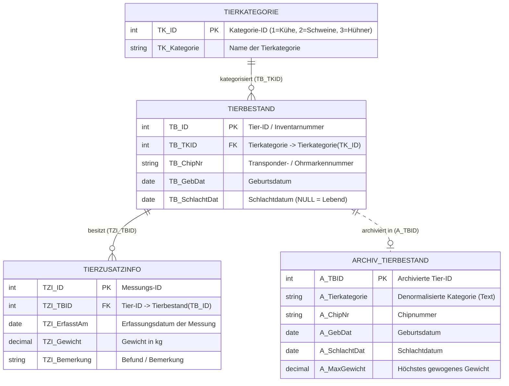
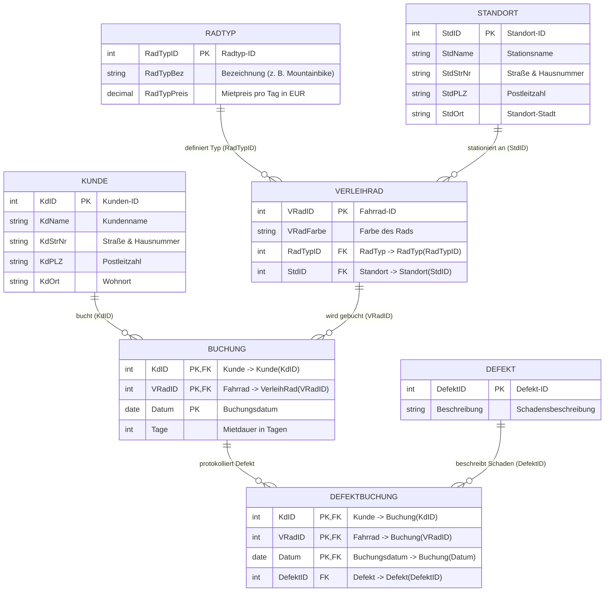
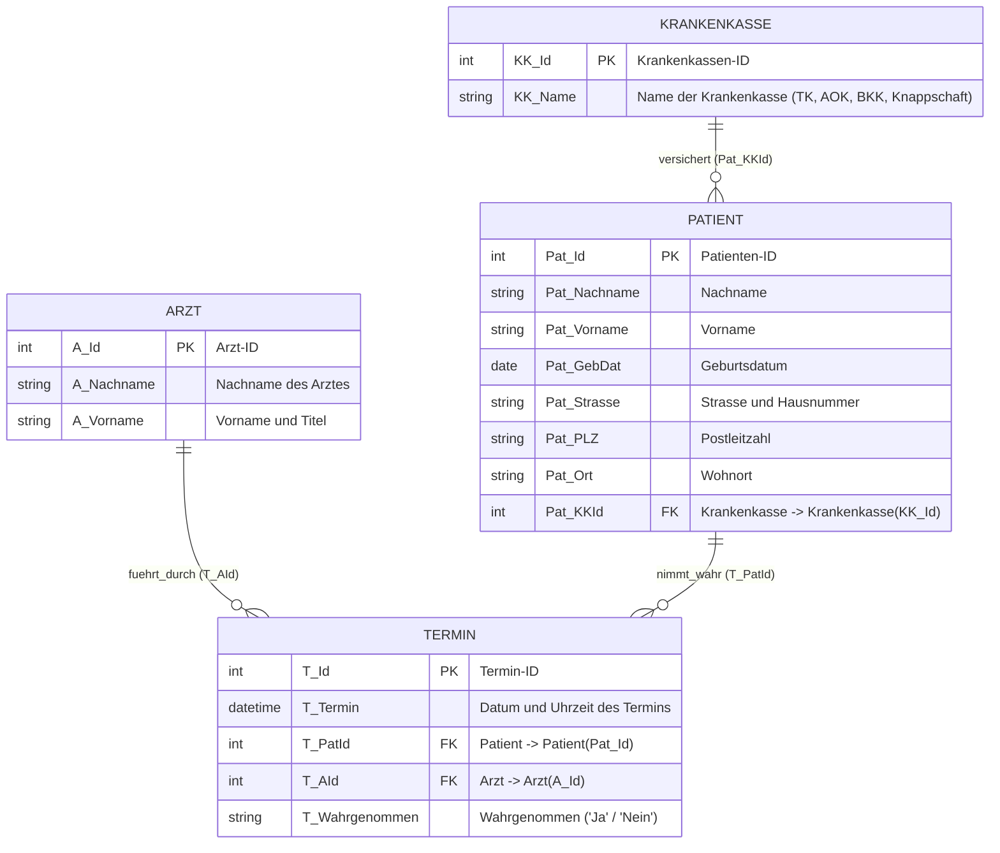
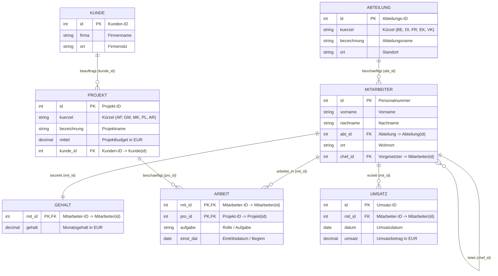
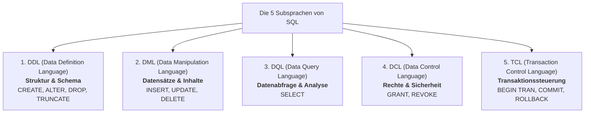
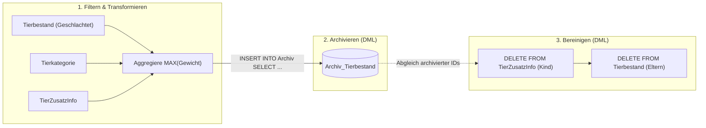
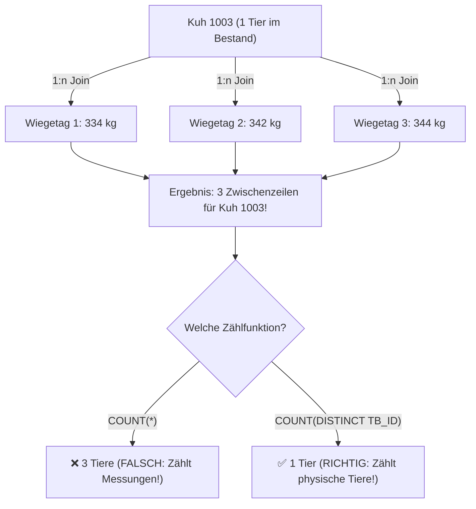
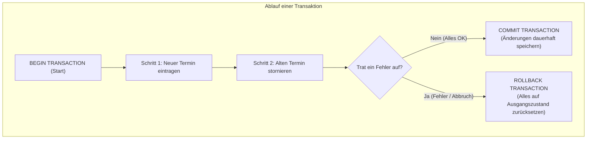
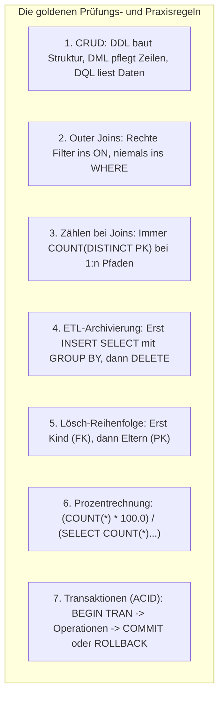

# 📅 Day_18: Vertiefungstag & IHK-Prüfungstraining (CRUD, Aggregationen, Archivierung & Transaktionen)

## ℹ️ Kurs-Informationen

* **Datum:** Mittwoch, 26.08.2026 / Update Donnerstag, 27.08.2026
* **Arbeitszeit:** 08:15 - 16:00 Uhr
* **Dozent:** Tom S.
* **Autor:** Tobias Boyke

---

## 🎯 Lernziele des Tages

- [x] **CRUD-Matrix & SQL-Subsprachen beherrschen:** Die 4 CRUD-Operationen (*Create, Read, Update, Delete*) den entsprechenden SQL-Kategorien (**DDL**, **DML**, **DQL**, **DCL**, **TCL**) zuordnen.
- [x] **Multi-Table OUTER JOINs mit Aggregationen vertiefen:** Komplexe Abfragen über 3 und mehr verknüpfte Tabellen mit Aggregatfunktionen (`COUNT(DISTINCT)`, `MAX`, `AVG`, `MIN`, `SUM`) fehlerfrei konstruieren.
- [x] **Die Join-Multiplikationsfalle verstehen & vermeiden:** Erkennen, warum 1:n-Joins zu Detailtabellen vor der Aggregation Zeilen duplizieren, und warum `COUNT(DISTINCT spalte)` Pflicht ist.
- [x] **Filterplatzierung bei Outer Joins:** Bedingungen auf rechte Tabellen (`tb.TB_SchlachtDat IS NULL`, `t.T_Wahrgenommen = 'Ja'`) in die `ON`-Klausel setzen, um Basiskategorien mit 0 Treffern (z. B. Hühner oder Kassen ohne Termine) nicht zu verlieren.
- [x] **Datums- & Altersberechnungen in SQL:** Alter aus Geburtsdaten dynamisch mit `DATEDIFF(YEAR, GebDat, GETDATE())` bzw. `YEAR()` berechnen.
- [x] **Datenarchivierungs-Pipelines strukturieren (ETL-Muster):** Historische Datensätze aggregiert und transformiert mittels `INSERT INTO ... SELECT ... GROUP BY` in Archivtabellen überführen.
- [x] **Referentielle Integrität bei DML-Löschoperationen:** Abhängige Kind-Tabellen vor den Eltern-Tabellen bereinigen, um Fremdschlüssel-Konflikte zu vermeiden.
- [x] **DDL-Strukturierung & Zusammengesetzte Schlüssel:** Neue Tabellen mit Fremdschlüssel-Beziehungen und mehrteiligen Primärschlüsseln (`PRIMARY KEY (KdID, VRadID, Datum)`) definieren.
- [x] **Skalare Subqueries & Prozentanteile:** Subqueries für dynamische Preisvergleiche (`WHERE Preis > (SELECT ...)`) und Verhältnisberechnungen im `SELECT` einsetzen.
- [x] **Transaktionsmanagement & ACID-Prinzip (TCL):** Begriff Transaktion, ACID-Kriterien sowie die Steuerung mit `BEGIN TRANSACTION`, `COMMIT` und `ROLLBACK` inklusive strukturierter Fehlerbehandlung (`TRY...CATCH`) beherrschen.
- [x] **Drei vollständige 25-Punkte IHK-Abschlussprüfungen meistern:**
  1. *Handlungsschritt 4 (AP2 2026 S FIAE2 A4):* Nutztierdatenbank, CRUD-Matrix & Datenarchivierung.
  2. *Handlungsschritt 5 (AP 2019 W GA1 HS5):* Fahrradverleih „Die Speiche GmbH“ (DDL, Subqueries, Anteilsrechnung).
  3. *Handlungsschritt 5 (AP 2022 S GA1 HS5):* Arztpraxis Terminverwaltung, Abrechnung & Transaktionen.
- [x] **Single Source of Truth (SoT):** Transfer aller Prüfungs- und Transaktionsmuster auf das kanonische Schema der `ProjektDB`.

---

## 🗺️ Relationale Kompasse: Wie hängen die Tabellen zusammen?

### 1. Das relationale Schema der IHK-Prüfung 1 (Nutztierverwaltung & Archivierung)



---

### 2. Das relationale Schema der IHK-Prüfung 2 (Fahrradverleih „Die Speiche GmbH“)



---

### 3. Das relationale Schema der IHK-Prüfung 3 (Arztpraxis Termin- & Abrechnungssystem)



---

### 4. Das kanonische Single Source of Truth (SoT) Schema: `ProjektDB`



---

## 📖 Theorie & Kernkonzepte im Detail

### 1. Die CRUD-Matrix & die 5 SQL-Subsprachen

In der Softwareentwicklung und Datenbankadministration beschreibt **CRUD** die vier fundamentalen Operationen für persistente Daten. SQL unterteilt seine Befehle je nach Einsatzzweck in verschiedene Subsprachen:



#### 📊 Die vollständige CRUD-Befehlszuordnung

| CRUD-Operation | Fachliche Bedeutung | DDL (Struktur) | DML (Datensätze) | DQL (Abfragen) | TCL (Transaktion) |
| :--- | :--- | :--- | :--- | :--- | :--- |
| **C** *(Create)* | Anlegen / Erstellen | `CREATE TABLE`, `CREATE INDEX` | `INSERT INTO ... VALUES` | *X (Keine DQL)* | *X* |
| **R** *(Read)* | Lesen / Abfragen | *X (Keine DDL)* | *X (Keine DML)* | `SELECT ... FROM` | *X* |
| **U** *(Update)* | Aktualisieren / Anpassen | `ALTER TABLE`, `ALTER COLUMN` | `UPDATE ... SET ...` | *X (Keine DQL)* | *X* |
| **D** *(Delete)* | Löschen / Entfernen | `DROP TABLE`, `TRUNCATE TABLE` | `DELETE FROM ... WHERE` | *X (Keine DQL)* | *X* |
| **T** *(Transaction)* | Steuern / Absichern | *X* | *X* | *X* | `BEGIN TRAN`, `COMMIT`, `ROLLBACK` |

> [!NOTE]
> **💡 DDL vs. DML vs. DQL vs. TCL im Prüfungsfokus:**
> * **DDL operiert auf Objekten:** Ein `CREATE` erzeugt eine Tabelle/View, ein `ALTER` modifiziert Spalten, ein `DROP` vernichtet Tabellen.
> * **DML operiert auf Zeilen:** `INSERT` fügt Zeilen ein, `UPDATE` ändert Feldinhalte, `DELETE` entfernt Zeilen (die Struktur bleibt bestehen).
> * **DQL ist zustandslos:** `SELECT` liest Daten, ohne das Schema oder die Datensätze zu verändern.
> * **TCL steuert logische Einheiten:** Fasst mehrere DML-/DDL-Befehle zu einer unteilbaren Einheit zusammen.

---

### 2. Datenarchivierungs-Pipelines (ETL-Muster im Datenbankbetrieb)

In operativen Datenbanken (OLTP) führen Millionen historischer Datensätze zu Performanceverlusten bei Indizes, Backups und täglichen Abfragen. Die Lösung ist eine **Archivierungs-Pipeline**:



#### ⚖️ Warum Denormalisierung im Archiv?
In der Zieltabelle `Archiv_Tierbestand` wird das Feld `A_Tierkategorie` als Text (`VARCHAR`) statt als Fremdschlüssel gespeichert.  
* **Gründe:**
  1. **Autarkie:** Das Archiv bleibt konsistent und lesbar, selbst wenn Kategorien in der operativen Tabelle umbenannt oder gelöscht werden.
  2. **Historischer Snapshot:** Es wird der exakte Zustand zum Zeitpunkt der Archivierung fixiert.
  3. **Performance:** Historische Reports benötigen keine Joins mehr auf Stammdaten-Tabellen.

---

### 3. Die Join-Multiplikationsfalle (`COUNT(DISTINCT)`)

Wird eine Tabelle (`Tierbestand`) über einen $1:n$-Join mit einer Detailtabelle (`TierZusatzInfo`) verknüpft, vervielfachen sich die Zeilen für jedes Tier mit mehreren Messungen:



---

### 4. Transaktionsmanagement & das ACID-Prinzip (TCL)

In relationalen Datenbanken ist eine **Transaktion** eine logische Arbeitseinheit (*Logical Unit of Work*), die eine Serie von Operationen zu einem unteilbaren Gesamtschritt bündelt.



#### 🛡️ Das ACID-Prinzip im Detail

| Buchstabe | Begriff (Deutsch / Englisch) | Bedeutung & Garantie |
| :---: | :--- | :--- |
| **A** | **Atomarität** (*Atomicity*) | **Alles-oder-Nichts-Prinzip:** Entweder werden alle Anweisungen vollständig ausgeführt oder gar keine. Bricht ein Einzelschritt ab, wird alles zurückgerollt. |
| **C** | **Konsistenz** (*Consistency*) | **Zustandserhaltung:** Die Transaktion führt die Datenbank von einem konsistenten Zustand in den nächsten. Alle Constraints, Foreign Keys und Checks müssen erfüllt sein. |
| **I** | **Isolation** (*Isolation*) | **Nebenläufigkeitsschutz:** Parallele Transaktionen sehen Zwischenzustände anderer Transaktionen nicht und blockieren sich sauber über Locks. |
| **D** | **Dauerhaftigkeit** (*Durability*) | **Persistenzgarantie:** Nach einem erfolgreichen `COMMIT` sind die Daten fest im Transaktionslog/Speicher gesichert und überstehen Stromausfälle oder Servercrashs. |

#### ⚙️ Der TCL-Befehlssatz

* **`BEGIN TRANSACTION`** (oder `BEGIN TRAN`): Leitet die Transaktion ein. Nachfolgende DML-Änderungen sind isoliert und reversibel.
* **`COMMIT`** (oder `COMMIT TRANSACTION`): Beendet die Transaktion erfolgreich, macht alle Änderungen dauerhaft und gibt Datenbanksperren frei.
* **`ROLLBACK`** (oder `ROLLBACK TRANSACTION`): Macht alle seit dem `BEGIN TRANSACTION` durchgeführten Änderungen ungeschehen und stellt den Originalzustand wieder her.

---

### 5. Abrechnungs- und Honorarlogik mit Multi-Table Outer Joins

Bei Abrechnungsabfragen (z. B. Arzttermin-Abrechnung nach Krankenkasse) müssen drei Kernregeln beachtet werden:

1. **Vollständigkeit der Basisentitäten (`LEFT JOIN`):** Auch Krankenkassen oder Ärzte ohne Buchungen müssen im Ergebnis erscheinen (z. B. Knappschaft mit 0 € oder Dr. Leier mit 0 Terminen).
2. **Filterplatzierung in der `ON`-Klausel:** Filter auf Datumsbereiche (`MONTH(...) = 6 AND YEAR(...) = 2022`) oder Statusflags (`T_Wahrgenommen = 'Ja'`) dürfen **nicht** im `WHERE` stehen, da sie sonst alle Kassen ohne Termine wegfiltern würden!
3. **Betragsberechnung:** `COUNT(t.T_Id) * 22.50` liefert für Kassen ohne Termine exakt `0 * 22.50 = 0.00`, da `COUNT(NULL)` den Wert `0` ergibt.

---

## 🎓 Prüfungs-Spezial 1: IHK-Abschlussprüfung (Nutztierbestandsverwaltung)

* **Prüfungsdokument (Aufgabe):** [📄 AP2 2026 S FIAE2 A4 SQL Tiere - Aufgaben.pdf](./assets/AP2%202026%20S%20FIAE2%20A4%20SQL%20Tiere%20-%20Aufgaben.pdf)
* **Prüfungsdokument (Lösung):** [📄 AP2 2026 S FIAE2 A4 SQL Tiere - Lösung.pdf](./assets/AP2%202026%20S%20FIAE2%20A4%20SQL%20Tiere%20-%20Lösung.pdf)
* **Lösungsskript:** [`src/01_ihk_abschlusspruefung_tierbestand_loesung.sql`](file:///c:/Users/Tobia/Desktop/cSharpRepo/SQL-Fundamentals/Day_18/src/01_ihk_abschlusspruefung_tierbestand_loesung.sql)
* **Gesamtpunktzahl:** 25 Punkte (Handlungsschritt 4, ZPA FIA II)

---

### 📂 Aufgabe 4.a) CRUD-Operationen & SQL-Befehle (3 Punkte)

* **Aufgabenstellung:** Stellen Sie den Zusammenhang zwischen den SQL-Befehlen mit den grundlegenden Datenbankoperationen (CRUD) her. Ergänzen Sie die zugehörigen Befehle (weiße Felder).

#### 📋 Vollständige IHK-Lösungsmatrix

| Grundlegende Datenoperationen | Bedeutung | DDL Data Definition Language | DML Data Manipulation Language | DQL Data Query Language |
| :--- | :--- | :---: | :---: | :---: |
| **C (reate)** | Anlegen, Erstellen | **`CREATE`** | **`INSERT`** | `X` |
| **R (ead)** | Lesen | `X` | `X` | **`SELECT`** |
| **U (pdate)** | Aktualisieren | **`ALTER`** | **`UPDATE`** | `X` |
| **D (elete)** | Löschen | **`DROP`** *(oder TRUNCATE)* | **`DELETE`** | `X` |

> [!NOTE]
> **IHK-Korrekturschlüssel (3 Punkte):**
> * DDL Spalte: `CREATE`, `ALTER`, `DROP` korrekt eingetragen (1 Punkt).
> * DML Spalte: `INSERT`, `UPDATE`, `DELETE` korrekt eingetragen (1 Punkt).
> * DQL Spalte: `SELECT` für Read zugeordnet (1 Punkt).

---

### 📂 Aufgabe 4.b) DQL: Auflistung aller Tierkategorien der lebenden Tiere (8 Punkte)

* **Aufgabenstellung:** Erstellen Sie eine SQL-Abfrage, mit der Sie eine Auflistung **aller Tier-Kategorien** mit den nachfolgenden Informationen je Tier-Kategorie über die **lebenden Tiere** erhalten:
  - Anzahl des Tierbestandes
  - Gewicht des schwersten Tieres
  - Alter des ältesten Tieres
  - Durchschnittliches Alter
* **Erwartete Ausgabe:**
  ```text
  TK_Kategorie  AnzahlTiere  SchwerstesTier  ÄltestesTier  DurchschnittAlter
  Hühner        0            NULL            NULL          NULL
  Kühe          3            344             4             4
  Schweine      3            655             1             2
  ```

#### 🔹 Musterlösung (T-SQL / ANSI-SQL)

```sql
SELECT tk.TK_Kategorie,
       COUNT(DISTINCT tb.TB_ID) AS AnzahlTiere,
       MAX(tzi.TZI_Gewicht) AS SchwerstesTier,
       MAX(DATEDIFF(YEAR, tb.TB_GebDat, GETDATE())) AS ÄltestesTier,
       AVG(DATEDIFF(YEAR, tb.TB_GebDat, GETDATE())) AS DurchschnittAlter
FROM Tierkategorie AS tk
LEFT JOIN Tierbestand AS tb ON tk.TK_ID = tb.TB_TKID 
                            AND tb.TB_SchlachtDat IS NULL
LEFT JOIN TierZusatzInfo AS tzi ON tb.TB_ID = tzi.TZI_TBID
GROUP BY tk.TK_ID, tk.TK_Kategorie
ORDER BY tk.TK_Kategorie ASC;
```

---

### 📂 Aufgabe 4.ca) DML: Geschlachtete Tiere archivieren (10 Punkte)

* **Aufgabenstellung:** Um die Tabelle `Tierbestand` nicht unnötig mit nicht mehr benötigten Daten zu belasten, wurde eine Archivtabelle erstellt, welche zusätzlich zur Tierbestandtabelle zwei weitere Attribute für die Tierkategorie als Textfeld und für das höchste Gewicht beinhaltet.  
Erstellen Sie eine SQL-Anweisung, mit der alle Daten der geschlachteten Tiere, der Tierkategorie und dem höchsten gewogenen Gewicht in die Tabelle `Archiv_Tierbestand` über einen Befehl archiviert werden.

#### 🔹 Musterlösung (INSERT INTO ... SELECT mit Aggregation)

```sql
INSERT INTO Archiv_Tierbestand (A_TBID, A_Tierkategorie, A_ChipNr, A_GebDat, A_SchlachtDat, A_MaxGewicht)
SELECT tb.TB_ID,
       tk.TK_Kategorie,
       tb.TB_ChipNr,
       tb.TB_GebDat,
       tb.TB_SchlachtDat,
       MAX(tzi.TZI_Gewicht) AS A_MaxGewicht
FROM Tierbestand AS tb
INNER JOIN Tierkategorie AS tk ON tb.TB_TKID = tk.TK_ID
LEFT JOIN TierZusatzInfo AS tzi ON tb.TB_ID = tzi.TZI_TBID
WHERE tb.TB_SchlachtDat IS NOT NULL
GROUP BY tb.TB_ID, tk.TK_Kategorie, tb.TB_ChipNr, tb.TB_GebDat, tb.TB_SchlachtDat;
```

---

### 📂 Aufgabe 4.cb) DML: Archivierte Datensätze aus Tabellen löschen (4 Punkte)

* **Aufgabenstellung:** Danach sollen alle zugehörigen Daten der archivierten Datensätze aus den Tabellen entfernt werden.

#### 🔹 Musterlösung (Unter Beachtung der referentiellen Integrität)

```sql
-- Schritt 1: Detail-Daten der archivierten Tiere löschen (Child Table zuerst!)
DELETE FROM TierZusatzInfo
WHERE TZI_TBID IN (SELECT A_TBID FROM Archiv_Tierbestand);

-- Schritt 2: Haupt-Datensätze der archivierten Tiere löschen (Parent Table danach!)
DELETE FROM Tierbestand
WHERE TB_ID IN (SELECT A_TBID FROM Archiv_Tierbestand);
```

---

## 🎓 Prüfungs-Spezial 2: IHK-Abschlussprüfung (Fahrradverleih „Die Speiche GmbH“)

* **Prüfungsdokument (Aufgabe):** [📄 AP 2019 W GA1 HS5 SQL Fahrradverleih - Aufgabe.pdf](./assets/AP%202019%20W%20GA1%20HS5%20SQL%20Fahrradverleih%20-%20Aufgabe.pdf)
* **Prüfungsdokument (Lösung):** [📄 AP 2019 W GA1 HS5 SQL Fahrradverleih - Lösung.pdf](./assets/AP%202019%20W%20GA1%20HS5%20SQL%20Fahrradverleih%20-%20Lösung.pdf)
* **Lösungsskript:** [`src/02_ihk_abschlusspruefung_fahrradverleih_loesung.sql`](file:///c:/Users/Tobia/Desktop/cSharpRepo/SQL-Fundamentals/Day_18/src/02_ihk_abschlusspruefung_fahrradverleih_loesung.sql)
* **Gesamtpunktzahl:** 25 Punkte (Handlungsschritt 5, ZPA FI Ganz I Anw)

---

### 📂 Aufgabe 5.aa) DDL: Tabelle `Defekt` erstellen (2 Punkte)

```sql
CREATE TABLE Defekt (
    DefektID INT PRIMARY KEY,
    Beschreibung VARCHAR(255) NOT NULL
);
```

---

### 📂 Aufgabe 5.ab) DDL: Tabelle `DefektBuchung` erstellen (3 Punkte)

```sql
CREATE TABLE DefektBuchung (
    KdID INT NOT NULL,
    VRadID INT NOT NULL,
    Datum DATE NOT NULL,
    DefektID INT NOT NULL,
    PRIMARY KEY (KdID, VRadID, Datum),
    FOREIGN KEY (KdID) REFERENCES Kunde(KdID),
    FOREIGN KEY (VRadID) REFERENCES VerleihRad(VRadID),
    FOREIGN KEY (DefektID) REFERENCES Defekt(DefektID)
);
```

---

### 📂 Aufgabe 5.b) DQL: Buchungen pro RadTyp mit Mindestanzahl (5 Punkte)

```sql
SELECT vr.RadTypID,
       COUNT(*) AS Anzahl
FROM VerleihRad AS vr
INNER JOIN Buchung AS b ON vr.VRadID = b.VRadID
GROUP BY vr.RadTypID
HAVING COUNT(*) >= 10;
```

---

### 📂 Aufgabe 5.c) DQL: Gesamtumsatz pro Kunde (5 Punkte)

```sql
SELECT b.KdID,
       SUM(b.Tage * rt.RadTypPreis) AS Umsatz
FROM Buchung AS b
INNER JOIN VerleihRad AS vr ON b.VRadID = vr.VRadID
INNER JOIN RadTyp AS rt ON vr.RadTypID = rt.RadTypID
GROUP BY b.KdID
ORDER BY Umsatz DESC;
```

---

### 📂 Aufgabe 5.d) DQL: Subquery - Räder teurer als Mountainbike (5 Punkte)

```sql
SELECT RadTypID,
       RadTypBez,
       RadTypPreis
FROM RadTyp
WHERE RadTypPreis > (
    SELECT RadTypPreis 
    FROM RadTyp 
    WHERE RadTypBez = 'Mountainbike' 
       OR RadTypID = 1001
);
```

---

### 📂 Aufgabe 5.e) DQL: Prozentualer Buchungsanteil pro Monat im Jahr 2019 (5 Punkte)

```sql
SELECT MONTH(Datum) AS Monat,
       ROUND((COUNT(*) * 100.0) / (SELECT COUNT(*) FROM Buchung WHERE YEAR(Datum) = 2019), 0) AS Anteil
FROM Buchung
WHERE YEAR(Datum) = 2019
GROUP BY MONTH(Datum)
ORDER BY Monat ASC;
```

---

## 🎓 Prüfungs-Spezial 3: IHK-Abschlussprüfung (Arztpraxis Terminverwaltung & Transaktionen)

* **Prüfungsdokument (Aufgabe):** [📄 AP 2022 S GA1 HS5 SQL Arzttermine - Aufgabe.pdf](./assets/AP%202022%20S%20GA1%20HS5%20SQL%20Arzttermine%20-%20Aufgabe.pdf)
* **Prüfungsdokument (Lösung):** [📄 AP 2022 S GA1 HS5 SQL Arzttermine - Lösung.pdf](./assets/AP%202022%20S%20GA1%20HS5%20SQL%20Arzttermine%20-%20Lösung.pdf)
* **Lösungsskript:** [`src/03_ihk_abschlusspruefung_arzttermine_loesung.sql`](file:///c:/Users/Tobia/Desktop/cSharpRepo/SQL-Fundamentals/Day_18/src/03_ihk_abschlusspruefung_arzttermine_loesung.sql)
* **Gesamtpunktzahl:** 25 Punkte (Handlungsschritt 5, ZPA FI Ganz I Anw)

---

### 📂 Aufgabe 5.a) DQL: Anzahl der Termine im Juni 2022 je Arzt (4 Punkte)

* **Aufgabenstellung:** Erstellen Sie eine SQL-Abfrage, mit der Sie die Anzahl der Termine im Juni 2022 von jedem hinterlegten Arzt nach folgendem Ergebnisbeispiel erhalten:
* **Erwartete Ausgabe:**
  ```text
  Arzt          Termine
  Freudenstedt  6
  Nierens       1
  Leier         0
  ```

#### 🔹 Musterlösung mit Outer Join (Empfohlen)

```sql
SELECT a.A_Nachname AS Arzt,
       COUNT(t.T_Id) AS Termine
FROM Arzt AS a
LEFT JOIN Termin AS t ON a.A_Id = t.T_AId
                     AND MONTH(t.T_Termin) = 6
                     AND YEAR(t.T_Termin) = 2022
GROUP BY a.A_Id, a.A_Nachname;
```

#### 🔄 Alternative Variante mit skalarer Subquery
```sql
SELECT a.A_Nachname AS Arzt,
       (
           SELECT COUNT(*)
           FROM Termin AS t
           WHERE t.T_AId = a.A_Id
             AND MONTH(t.T_Termin) = 6
             AND YEAR(t.T_Termin) = 2022
       ) AS Termine
FROM Arzt AS a;
```

> [!WARNING]
> **🚨 IHK-Stolperfalle:** Dr. Leier hat im Juni 2022 keine Termine. Bei einem `INNER JOIN` oder einem Filter `WHERE MONTH(t.T_Termin) = 6` entfällt Dr. Leier komplett aus der Liste. Die Datumsbedingungen **müssen** zwingend in der `ON`-Klausel des `LEFT JOIN` stehen!

---

### 📂 Aufgabe 5.b) DQL: Patienten und zugehörige Krankenkasse (6 Punkte)

* **Aufgabenstellung:** Erstellen Sie eine SQL-Abfrage, mit der Sie die Patienten und deren zugehörige Krankenkasse nach folgendem Ergebnisbeispiel erhalten (Sortierung nach `KK_Name` absteigend und `Pat_GebDat` aufsteigend):
* **Erwartete Ausgabe:**
  ```text
  KK_Name  Pat_Id  Pat_Nachname  Pat_Vorname  Pat_GebDat  Pat_Strasse  Pat_PLZ  Pat_Ort        Pat_KKId
  TK       4       Kastor        Heinz        1952-12-14  NULL         NULL     NULL           1
  TK       1       Müller        Manni        1966-04-15  Forstweg 12  44456    Musterhausen   1
  TK       2       Peters        Peter        1988-03-12  NULL         NULL     NULL           1
  TK       8       König         Ihnes        2002-03-01  NULL         NULL     NULL           1
  BKK      6       Kreisla       Johann       1999-01-13  NULL         NULL     NULL           3
  AOK      7       Freie         Ilse         1955-05-02  NULL         NULL     NULL           2
  AOK      5       Krenz         Christina    1977-02-14  NULL         NULL     NULL           2
  AOK      3       Fransi        Melanie      1999-01-13  NULL         NULL     NULL           2
  ```

#### 🔹 Musterlösung (Patienten mit Krankenkasse)

```sql
SELECT k.KK_Name,
       p.Pat_Id,
       p.Pat_Nachname,
       p.Pat_Vorname,
       p.Pat_GebDat,
       p.Pat_Strasse,
       p.Pat_PLZ,
       p.Pat_Ort,
       p.Pat_KKId
FROM Patient AS p
INNER JOIN Krankenkasse AS k ON p.Pat_KKId = k.KK_Id
ORDER BY k.KK_Name DESC, p.Pat_GebDat ASC;
```

---

### 📂 Aufgabe 5.c) DQL: Abrechnung der Termine im Juni 2022 für alle Krankenkassen (10 Punkte)

* **Aufgabenstellung:** Erstellen Sie eine SQL-Abfrage, mit der Sie für alle Krankenkassen eine Abrechnung der Termine im Juni 2022 erhalten.
  * Wahrgenommene Termine (`T_Wahrgenommen = 'Ja'`) werden mit **22,50 EUR** berechnet.
  * Nicht wahrgenommene Termine bleiben unberücksichtigt.
  * Sortierung soll nach Krankenkasse (`KK_Name`) aufsteigend vorgenommen werden.
  * Auch Kassen ohne wahrgenommene Termine (*Knappschaft*) müssen mit **0 EUR** aufgeführt sein!
* **Erwartete Ausgabe:**
  ```text
  Krankenkasse  Betrag
  AOK           45
  BKK           22.5
  Knappschaft   0
  TK            67.5
  ```

#### 🔹 Musterlösung (Multi-Table Outer Join & Abrechnung)

```sql
SELECT k.KK_Name AS Krankenkasse,
       COUNT(t.T_Id) * 22.5 AS Betrag
FROM Krankenkasse AS k
LEFT JOIN Patient AS p ON k.KK_Id = p.Pat_KKId
LEFT JOIN Termin AS t ON p.Pat_Id = t.T_PatId
                     AND MONTH(t.T_Termin) = 6
                     AND YEAR(t.T_Termin) = 2022
                     AND t.T_Wahrgenommen = 'Ja'
GROUP BY k.KK_Id, k.KK_Name
ORDER BY k.KK_Name ASC;
```

> [!TIP]
> **IHK-Korrekturschlüssel (10 Punkte):**
> * `SELECT k.KK_Name, COUNT(t.T_Id) * 22.5` (2 Punkte).
> * `LEFT JOIN` von `Krankenkasse` auf `Patient` (2 Punkte).
> * `LEFT JOIN` von `Patient` auf `Termin` (2 Punkte).
> * Filterbedingungen (`MONTH = 6`, `YEAR = 2022`, `T_Wahrgenommen = 'Ja'`) in der `ON`-Klausel (2 Punkte).
> * `GROUP BY k.KK_Id, k.KK_Name` (1 Punkt).
> * `ORDER BY k.KK_Name ASC` (1 Punkt).

---

### 📂 Aufgabe 5.d) Theorie: Begriff Transaktion erläutern (2 Punkte)

* **Aufgabenstellung:** Im Zusammenhang mit SQL-Statements werden häufig Transaktionen verwendet. Erläutern Sie den Begriff Transaktion.

#### 📋 Musterantwort zu 5.d (Transaktionsbegriff & ACID)
> Eine **Transaktion** ist eine logische Arbeitseinheit (*Logical Unit of Work*), die aus einer Sequenz von einem oder mehreren SQL-Befehlen besteht. Sie folgt dem **ACID-Prinzip** und garantiert das *Alles-oder-Nichts-Prinzip*: Entweder werden alle enthaltenen Anweisungen vollständig und fehlerfrei ausgeführt, oder bei einem Fehler wird die gesamte Transaktion rückgängig gemacht (*Rollback*), sodass die Datenbank stets in einem konsistenten und fehlerfreien Zustand verbleibt.

---

### 📂 Aufgabe 5.e) Theorie & TCL: Transaktionssyntax beschreiben (3 Punkte)

* **Aufgabenstellung:** Beschreiben Sie die Funktion für folgende Syntax im Bezug einer Transaktion:
  * `BEGIN TRANSACTION`
  * `COMMIT`
  * `ROLLBACK`

#### 📋 Musterantwort zu 5.e (Transaktionsbefehle BEGIN TRAN, COMMIT, ROLLBACK)

| Befehl | Funktion im Transaktionsablauf |
| :--- | :--- |
| **`BEGIN TRANSACTION`** | **Startet die Transaktion:** Leitet eine neue logische Arbeitseinheit ein. Alle ab diesem Zeitpunkt ausgeführten Änderungen werden transaktionsgesichert im Log protokolliert und sind isoliert. |
| **`COMMIT`** | **Bestätigt die Transaktion:** Beendet die Transaktion erfolgreich und speichert sämtliche durchgeführten Datenänderungen dauerhaft und unwiderruflich in der Datenbank. Sperren werden freigegeben. |
| **`ROLLBACK`** | **Bricht die Transaktion ab:** Setzt im Fehlerfall alle seit dem `BEGIN TRANSACTION` durchgeführten Datenänderungen vollständig auf den ursprünglichen Ausgangszustand zurück. |

---

## 🏢 Transfer auf die Single Source of Truth (`ProjektDB`)

Wie lassen sich die Prüfungsmuster (Archivierung, Multi-Table Abrechnung, Prozentberechnungen, Transaktionssteuerung) auf das kanonische Schema der `ProjektDB` anwenden?

### 1. Praxis-Transfer: Prozentualer Umsatzanteil pro Quartal 2019
```sql
SELECT DATEPART(QUARTER, datum) AS Quartal,
       ROUND((SUM(umsatz) * 100.0) / (SELECT SUM(umsatz) FROM Umsatz WHERE YEAR(datum) = 2019), 2) AS ProzentAnteil
FROM Umsatz
WHERE YEAR(datum) = 2019
GROUP BY DATEPART(QUARTER, datum)
ORDER BY Quartal ASC;
```

### 2. Praxis-Transfer: Mitarbeiter mit höherem Gehalt als Abteilungsdurchschnitt
```sql
SELECT m.id, m.vorname, m.nachname, g.gehalt, m.abt_id
FROM Mitarbeiter AS m
INNER JOIN Gehalt AS g ON m.id = g.mit_id
WHERE g.gehalt > (
    SELECT AVG(g2.gehalt)
    FROM Mitarbeiter AS m2
    INNER JOIN Gehalt AS g2 ON m2.id = g2.mit_id
    WHERE m2.abt_id = m.abt_id
);
```

### 3. Praxis-Transfer: Honorar- und Budget-Abrechnung aller Kunden & Projekte (Outer Join)
```sql
SELECT k.firma AS Kunde,
       p.bezeichnung AS Projekt,
       ISNULL(p.mittel, 0.00) AS Budget,
       COUNT(a.mit_id) AS ZugeordneteMitarbeiter,
       COUNT(a.mit_id) * 1500.00 AS GeschaetzteProjektPauschale
FROM Kunde AS k
LEFT JOIN Projekt AS p ON k.id = p.kunde_id
LEFT JOIN Arbeit AS a ON p.id = a.pro_id
GROUP BY k.id, k.firma, p.id, p.bezeichnung, p.mittel
ORDER BY k.firma ASC;
```

### 4. Praxis-Transfer: Transaktionales Mitarbeiter- und Budget-Update mit Fehlerbehandlung
```sql
BEGIN TRY
    BEGIN TRANSACTION;

    -- 1. Neuer Mitarbeiter wird angelegt
    INSERT INTO Mitarbeiter (id, vorname, nachname, abt_id, ort, chef_id)
    VALUES (199, 'Laura', 'Bauer', 1, 'Berlin', 1);

    -- 2. Gehaltssatz wird transaktional verknüpft
    INSERT INTO Gehalt (mit_id, gehalt)
    VALUES (199, 4500.00);

    -- 3. Zuweisung zu einem Projekt
    INSERT INTO Arbeit (mit_id, pro_id, aufgabe, einst_dat)
    VALUES (199, 1, 'Entwicklung & QA', GETDATE());

    -- Erfolgreicher Abschluss
    COMMIT TRANSACTION;
    PRINT 'Mitarbeiter, Gehalt und Projektzuweisung transaktional erfolgreich verbucht!';
END TRY
BEGIN CATCH
    IF @@TRANCOUNT > 0
    BEGIN
        ROLLBACK TRANSACTION;
        PRINT 'Fehler bei der Mitarbeiteranlage! Alle Schritte wurden zurückgerollt.';
    END;
    THROW;
END CATCH;
```

---

## 🧭 Zusammenfassung & Best-Practice-Leitfaden



### 📋 Schnellübersicht der SQL-Befehle

| Anforderung | SQL-Muster |
| :--- | :--- |
| **Tabellen erstellen (DDL)** | `CREATE TABLE Name (Spalte Datentyp, PRIMARY KEY (Spalte1, Spalte2));` |
| **Tabelle mit Fremdschlüssel (DDL)** | `FOREIGN KEY (FK_Spalte) REFERENCES ZielTabelle(PK_Spalte)` |
| **Archivierung per Abfrage (DML)** | `INSERT INTO Archiv SELECT ... FROM Quelle GROUP BY ...;` |
| **Referenzsicheres Löschen (DML)** | `DELETE FROM Kind WHERE ID IN (SELECT ID FROM Archiv);` |
| **Gruppierungsfilter (DQL)** | `GROUP BY spalte HAVING COUNT(*) >= 10;` |
| **Dynamischer Schwellenwert (DQL)** | `WHERE preis > (SELECT preis FROM ... WHERE bez = 'X')` |
| **Prozentualer Anteil (DQL)** | `(COUNT(*) * 100.0) / (SELECT COUNT(*) FROM ...)` |
| **Transaktion starten (TCL)** | `BEGIN TRANSACTION;` |
| **Transaktion speichern (TCL)** | `COMMIT TRANSACTION;` |
| **Transaktion zurückrollen (TCL)** | `ROLLBACK TRANSACTION;` |
| **Monat & Jahr extrahieren** | `MONTH(datum)`, `YEAR(datum)`, `DATEPART(QUARTER, datum)` |

---

## 💻 Praktische Skripte & Prüfungsdokumente im Projekt

### 📜 SQL-Lösungsskripte (`Day_18/src/`)
* 📜 **IHK 1 Lösungsskript (Tierbestand & Archivierung):** [`src/01_ihk_abschlusspruefung_tierbestand_loesung.sql`](file:///c:/Users/Tobia/Desktop/cSharpRepo/SQL-Fundamentals/Day_18/src/01_ihk_abschlusspruefung_tierbestand_loesung.sql)
* 📜 **IHK 2 Lösungsskript (Fahrradverleih Die Speiche GmbH):** [`src/02_ihk_abschlusspruefung_fahrradverleih_loesung.sql`](file:///c:/Users/Tobia/Desktop/cSharpRepo/SQL-Fundamentals/Day_18/src/02_ihk_abschlusspruefung_fahrradverleih_loesung.sql)
* 📜 **IHK 3 Lösungsskript (Arzttermine, Abrechnung & Transaktionen):** [`src/03_ihk_abschlusspruefung_arzttermine_loesung.sql`](file:///c:/Users/Tobia/Desktop/cSharpRepo/SQL-Fundamentals/Day_18/src/03_ihk_abschlusspruefung_arzttermine_loesung.sql)

### 📄 IHK-Prüfungsdokumente (`Day_18/assets/`)
* 📄 **IHK 1 Aufgabenstellung (Tiere):** [AP2 2026 S FIAE2 A4 SQL Tiere - Aufgaben.pdf](file:///c:/Users/Tobia/Desktop/cSharpRepo/SQL-Fundamentals/Day_18/assets/AP2%202026%20S%20FIAE2%20A4%20SQL%20Tiere%20-%20Aufgaben.pdf)
* 📄 **IHK 1 Musterlösung (Tiere):** [AP2 2026 S FIAE2 A4 SQL Tiere - Lösung.pdf](file:///c:/Users/Tobia/Desktop/cSharpRepo/SQL-Fundamentals/Day_18/assets/AP2%202026%20S%20FIAE2%20A4%20SQL%20Tiere%20-%20Lösung.pdf)
* 📄 **IHK 2 Aufgabenstellung (Fahrradverleih):** [AP 2019 W GA1 HS5 SQL Fahrradverleih - Aufgabe.pdf](file:///c:/Users/Tobia/Desktop/cSharpRepo/SQL-Fundamentals/Day_18/assets/AP%202019%20W%20GA1%20HS5%20SQL%20Fahrradverleih%20-%20Aufgabe.pdf)
* 📄 **IHK 2 Musterlösung (Fahrradverleih):** [AP 2019 W GA1 HS5 SQL Fahrradverleih - Lösung.pdf](file:///c:/Users/Tobia/Desktop/cSharpRepo/SQL-Fundamentals/Day_18/assets/AP%202019%20W%20GA1%20HS5%20SQL%20Fahrradverleih%20-%20Lösung.pdf)
* 📄 **IHK 3 Aufgabenstellung (Arzttermine):** [AP 2022 S GA1 HS5 SQL Arzttermine - Aufgabe.pdf](file:///c:/Users/Tobia/Desktop/cSharpRepo/SQL-Fundamentals/Day_18/assets/AP%202022%20S%20GA1%20HS5%20SQL%20Arzttermine%20-%20Aufgabe.pdf)
* 📄 **IHK 3 Musterlösung (Arzttermine):** [AP 2022 S GA1 HS5 SQL Arzttermine - Lösung.pdf](file:///c:/Users/Tobia/Desktop/cSharpRepo/SQL-Fundamentals/Day_18/assets/AP%202022%20S%20GA1%20HS5%20SQL%20Arzttermine%20-%20Lösung.pdf)Gegenüberstellung der Mengenoperatoren