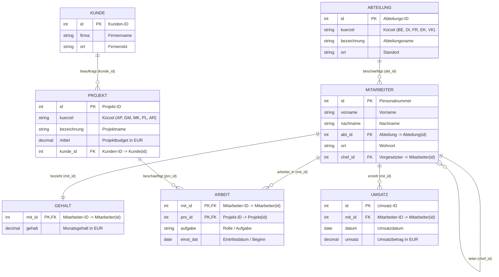
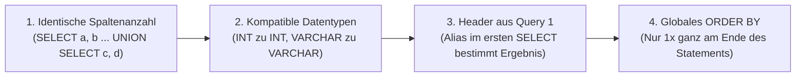
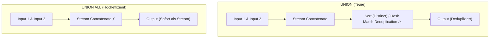
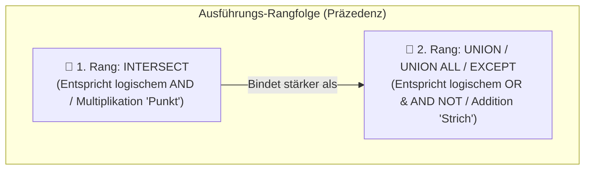
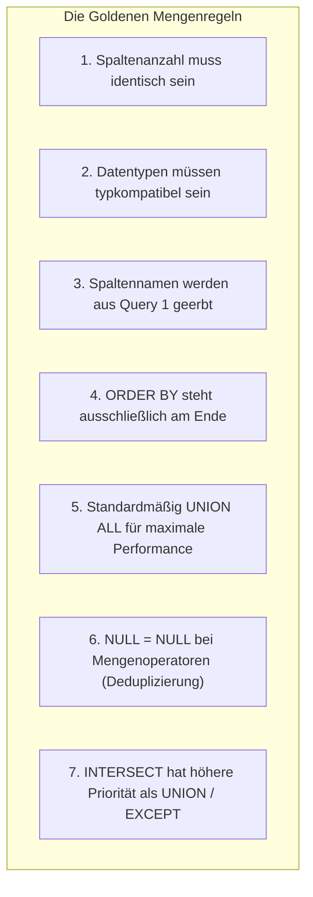

# 📅 Day_19: Mengenoperatoren (Set Operators: UNION, INTERSECT, EXCEPT)

## ℹ️ Kurs-Informationen

* **Datum:** Donnerstag, 27.08.2026
* **Arbeitszeit:** 08:15 - 16:00 Uhr
* **Dozent:** Tom S.
* **Autor:** Tobias Boyke

---

## 🎯 Lernziele des Tages

- [x] **Die 4 Mengenoperatoren beherrschen:** Mathematische Mengenoperationen in SQL anwenden:
  - `UNION`: Vereinigung zweier Ergebnismengen mit automatischer Duplikatentfernung ($A \cup B$).
  - `UNION ALL`: Vereinigung zweier Ergebnismengen unter Beibehaltung aller Duplikate ($A \uplus B$).
  - `INTERSECT`: Schnittmenge zweier Ergebnismengen ($A \cap B$).
  - `EXCEPT` *(in Oracle MINUS)*: Differenzmenge zweier Ergebnismengen ($A \setminus B$).
- [x] **Die fundamentalen Syntax-Regeln verinnerlichen:**
  - Exakt gleiche Anzahl von Spalten in allen Teilanweisungen.
  - Kompatible Datentypen der korrespondierenden Spalten (implizite Konvertierung / Type Precedence).
  - Spaltenüberschriften werden stets vom **ersten** `SELECT`-Statement bestimmt.
  - Das `ORDER BY`-Statement steht **ausschließlich am Ende** des gesamten Statements.
- [x] **Performance-Unterschiede verstehen:** Erkennen, warum `UNION ALL` ein speicher- und CPU-schonender Streaming-Operator (Concatenation) ist, während `UNION`, `INTERSECT` und `EXCEPT` teure Sortier- und Hash-Operationen zur Deduplizierung erfordern.
- [x] **Sonderfall NULL-Werte in Mengenoperatoren:** Verstehen, dass in Mengenoperatoren im Gegensatz zu `WHERE`-Bedingungen `NULL = NULL` gilt und NULL-Werte dedupliziert werden.
- [x] **Operator-Präzedenz & Klammerung:** `INTERSECT` bindet stärker als `UNION` und `EXCEPT`. Beherrschen von expliziter Klammerung `(...)` zur Steuerung komplexer Mengenketten.
- [x] **Mengenoperatoren vs. Joins & Subqueries:** Vergleichende Analyse von Äquivalenzmustern (`EXCEPT` vs. `NOT EXISTS` vs. `LEFT JOIN ... WHERE IS NULL`).
- [x] **Praxislösungen der Aufgabenreihe 10.1 bis 10.10:** Sämtliche Aufgaben aus [`assets/ProjektDB 10 - Mengenoperatoren - Aufgaben.sql`](file:///c:/Users/Tobia/Desktop/cSharpRepo/SQL-Fundamentals/Day_19/assets/ProjektDB%2010%20-%20Mengenoperatoren%20-%20Aufgaben.sql) fehlerfrei gelöst und verifiziert.
- [x] **Single Source of Truth (SoT):** Vollständige Ausrichtung auf das relationale kanonische Schema der `ProjektDB`.

---

## 🗺️ Relationaler Kompass: Der `ProjektDB` Überblick



---

## 📖 Theorie & Kernkonzepte im Detail

### 1. Die vier Mengenoperatoren im Überblick (Venn-Visualisierung)

Während Joins Tabellen **horizontal** über gemeinsame Schlüsselspalten verbinden, kombinieren Mengenoperatoren Datensätze **vertikal** (zeilenweise):

```mermaid
flowchart TD
    subgraph S1["1. UNION (Vereinigung ohne Duplikate)"]
        U1["Menge A: {München, Augsburg}"] --- U2["Menge B: {München, Ulm}"]
        U1 & U2 --> U_RES["Ergebnis: {Augsburg, München, Ulm} (Eindeutige Werte)"]
    end

    subgraph S2["2. UNION ALL (Vereinigung mit Duplikaten)"]
        UA1["Menge A: {München, Augsburg}"] --- UA2["Menge B: {München, Ulm}"]
        UA1 & UA2 --> UA_RES["Ergebnis: {München, Augsburg, München, Ulm} (Alle Zeilen)"]
    end

    subgraph S3["3. INTERSECT (Schnittmenge)"]
        I1["Menge A: {München, Augsburg, Landshut}"] --- I2["Menge B: {München, Ulm, Landshut}"]
        I1 & I2 --> I_RES["Ergebnis: {München, Landshut} (Nur gemeinsame Werte)"]
    end

    subgraph S4["4. EXCEPT (Differenzmenge A ohne B)"]
        E1["Menge A: {München, Augsburg, Landshut}"] --- E2["Menge B: {München, Ulm}"]
        E1 & E2 --> E_RES["Ergebnis: {Augsburg, Landshut} (Werte nur in A, nicht in B)"]
    end
```



#### 📊 Gegenüberstellung der Mengenoperatoren

| Operator | Mengenlehre | Logisches Äquivalent | Ausführungspriorität („Punkt vor Strich“) | Duplikatbehandlung | Performance | Typischer Einsatzzweck |
| :--- | :---: | :---: | :---: | :--- | :--- | :--- |
| **`INTERSECT`** | $A \cap B$ | **`AND`** (Konjunktion) | 🥇 **Höchste Priorität** (wie **Punktrechnung** $\times$) | Entfernt Duplikate | Benötigt Hash/Sort | Schnittmengen / Gemeinsamkeiten finden |
| **`UNION`** | $A \cup B$ | **`OR`** (Disjunktion) | 🥈 Niedrigere Priorität (wie **Strichrechnung** $+$) | Entfernt Duplikate | Benötigt Sort/Hash | Eindeutige Gesamtmengen konsolidieren |
| **`EXCEPT`** | $A \setminus B$ | **`AND NOT`** (Negation) | 🥈 Niedrigere Priorität (wie **Strichrechnung** $-$) | Entfernt Duplikate | Anti-Semi-Join | Differenzmengen / Deltas ermitteln |
| **`UNION ALL`** | $A \uplus B$ | **`OR`** (mit Duplikaten) | 🥈 Niedrigere Priorität (wie **Strichrechnung** $+$) | Behält alle Duplikate | ⚡ Sehr schnell (Stream) | Protokolle, Summen & Adresslisten fusionieren |

---

### 2. Die 4 Goldenen Regeln für Mengenoperatoren

Damit ein SQL-Statement mit Mengenoperatoren fehlerfrei kompiliert und semantisch korrekt arbeitet, müssen vier fundamentale Regeln eingehalten werden:



1. **Gleiche Anzahl an Ausgabespalten:**
   * ❌ `SELECT id, vorname FROM Mitarbeiter UNION SELECT ort FROM Abteilung;` *(Fehler: 2 Spalten vs. 1 Spalte)*
   * ✅ `SELECT ort FROM Mitarbeiter UNION SELECT ort FROM Abteilung;` *(Korrekt: 1 Spalte vs. 1 Spalte)*
2. **Kompatible Datentypen (Type Precedence):**
   * Korrespondierende Spalten müssen vom selben Typ sein oder implizit ineinander konvertiert werden können (z. B. `INT` zu `DECIMAL`, `VARCHAR(50)` zu `VARCHAR(100)`).
3. **Vererbung der Spaltennamen:**
   * Das Alias im ersten `SELECT` bestimmt den Namen der Ausgabespalte im Gesamtergebnis:
   ```sql
   SELECT CONCAT(vorname, ' ', nachname) AS kontakt_name, ort FROM Mitarbeiter
   UNION ALL
   SELECT firma, ort FROM Kunde;
   -- Spaltenname im Ergebnis ist: kontakt_name und ort
   ```
4. **Globales `ORDER BY` am Ende:**
   * Ein `ORDER BY` darf nicht in den einzelnen Teilabfragen stehen, sondern gehört an das Ende der gesamten Anweisung und sortiert die konsolidierte Endmenge.

---

### 3. Performance & Execution Plans: `UNION` vs. `UNION ALL`

Ein häufiger Fehler in der Praxis ist die unbedachte Verwendung von `UNION` anstelle von `UNION ALL`.



> [!TIP]
> **Best Practice:**  
> Verwenden Sie standardmäßig immer **`UNION ALL`**, es sei denn, eine Deduplizierung ist fachlich zwingend erforderlich. Bei Millionen Datensätzen spart `UNION ALL` massive TempDB-I/O und CPU-Zyklen für Sortier- und Hash-Operationen.

---

### 4. Das besondere `NULL`-Verhalten bei Mengenoperatoren

Im SQL-Standard gilt bei Vergleichen in `WHERE`-Klauseln die dreiwertige Logik (3VL): `NULL = NULL` ergibt `UNKNOWN`.  
**Bei Mengenoperatoren (`UNION`, `INTERSECT`, `EXCEPT`) gilt jedoch eine Ausnahme:**
* Zwei `NULL`-Werte gelten als **identisch**.
* Ein `UNION` fasst mehrere `NULL`-Einträge zu genau **einem** `NULL` zusammen.
* Ein `INTERSECT` zweier Mengen, die beide `NULL` enthalten, liefert `NULL` als gemeinsame Schnittmenge zurück.
* Ein `EXCEPT` entfernt `NULL`, wenn die zweite Menge ebenfalls `NULL` enthält.

---

### 5. Operator-Präzedenz & Ausführungsreihenfolge („Punkt vor Strich“)

Werden in einem komplexen SQL-Statement mehrere Mengenoperatoren ohne Klammern miteinander verkettet, gilt eine feste mathematische Ausführungsreihenfolge:



$$\mathbf{INTERSECT} \succ \mathbf{UNION} = \mathbf{EXCEPT}$$

> [!IMPORTANT]
> **💡 Die „Punkt vor Strich“-Analogie:**
> * In der Arithmetik gilt: $2 + 3 \times 4 = 2 + 12 = 14$ *(Multiplikation/Punkt vor Addition/Strich)*.
> * In der Mengenlehre & in SQL gilt: `A UNION B INTERSECT C` wird **immer** ausgewertet als:
>   $$\mathbf{A} \cup (\mathbf{B} \cap \mathbf{C})$$
> * `INTERSECT` (`AND` / Schnittmenge) wird **vor** `UNION` (`OR` / Vereinigung) und `EXCEPT` (`AND NOT` / Differenz) ausgeführt.
> * Wenn zuerst die Vereinigung gebildet werden soll, **muss zwingend geklammert werden**: `(A UNION B) INTERSECT C`.

```sql
-- 1. Ohne Klammern: INTERSECT bindet zuerst -> A UNION (B INTERSECT C)
SELECT id FROM TabA
UNION
SELECT id FROM TabB
INTERSECT
SELECT id FROM TabC;

-- 2. Mit expliziter Klammerung: Erzwingt zuerst UNION -> (A UNION B) INTERSECT C
(
    SELECT id FROM TabA
    UNION
    SELECT id FROM TabB
)
INTERSECT
SELECT id FROM TabC;
```

---

## 🛠️ Praxis-Lösungen: Aufgabenreihe 10 (ProjektDB)

Alle Aufgaben basieren auf dem Aufgabenblatt [`assets/ProjektDB 10 - Mengenoperatoren - Aufgaben.sql`](file:///c:/Users/Tobia/Desktop/cSharpRepo/SQL-Fundamentals/Day_19/assets/ProjektDB%2010%20-%20Mengenoperatoren%20-%20Aufgaben.sql) und dem Lösungsskript [`src/01_mengenoperatoren_grundlagen_und_aufgaben.sql`](file:///c:/Users/Tobia/Desktop/cSharpRepo/SQL-Fundamentals/Day_19/src/01_mengenoperatoren_grundlagen_und_aufgaben.sql).

---

### 📂 Aufgabe 10.1: Eindeutige Städte aus Mitarbeiter & Abteilung (`UNION`)

* **Aufgabenstellung:** Erstellen Sie eine Liste mit allen Städten, in denen entweder ein Mitarbeiter wohnt oder aber eine Abteilung ihren Sitz hat. Jede Stadt soll nur einmal angezeigt werden.
* **Erwartetes Ergebnis:** 9 Zeilen
  ```text
  ort
  NULL
  Augsburg
  Fürth
  Heidenheim
  Landshut
  München
  Rosenheim
  Stuttgart
  Ulm
  ```

#### 🔹 Musterlösung (Aufgabe 10.1: Eindeutige Städte)
```sql
SELECT ort
FROM Mitarbeiter
UNION
SELECT ort
FROM Abteilung;
```

> [!NOTE]
> `UNION` eliminiert automatisch alle Duplikate zwischen den 15 Mitarbeiter-Wohnorten und den 5 Abteilungsstandorten. Auch mehrfache `NULL`-Werte werden auf einen einzigen `NULL`-Eintrag reduziert.

---

### 📂 Aufgabe 10.2: Städte aus Mitarbeiter & Kunde mit Duplikaten (`UNION ALL`)

* **Aufgabenstellung:** Erstellen Sie eine Liste mit allen Städten, in denen entweder Mitarbeiter wohnen oder Kunden ihren Sitz haben. Doppelte Einträge sollen **nicht** weggefiltert werden.
* **Erwartetes Ergebnis:** 21 Zeilen (15 Mitarbeiter-Orte + 6 Kunden-Orte)

#### 🔹 Musterlösung (Aufgabe 10.2: Städte mit Duplikaten)
```sql
SELECT ort
FROM Mitarbeiter
UNION ALL
SELECT ort
FROM Kunde;
```

---

### 📂 Aufgabe 10.3: `UNION ALL` mit Sortierung (`ORDER BY`)

* **Aufgabenstellung:** Geben Sie die Liste aus Aufgabe 10.2 jetzt sortiert nach dem Städtenamen aus.
* **Erwartetes Ergebnis:** 21 Zeilen (NULL-Werte stehen in T-SQL standardmäßig an oberster Stelle)

#### 🔹 Musterlösung (Aufgabe 10.3: Sortierte Städteliste)
```sql
SELECT ort
FROM Mitarbeiter
UNION ALL
SELECT ort
FROM Kunde
ORDER BY ort ASC;
```

---

### 📂 Aufgabe 10.4: `UNION` mit Filterbedingungen & Datumsabgleich

* **Aufgabenstellung:** Finden Sie die IDs der Mitarbeiter, die entweder der Abteilung `a1` (`id = 1`) angehören oder nach dem `01.01.2019` in ihr Projekt eingetreten sind. Die IDs sollen aufsteigend sortiert ausgegeben werden.
* **Erwartetes Ergebnis:** 7 Zeilen (`2581`, `9031`, `9912`, `17000`, `18316`, `28559`, `29346`)

#### 🔹 Musterlösung (Aufgabe 10.4 mit UNION)
```sql
SELECT id
FROM Mitarbeiter
WHERE abt_id = 1
UNION
SELECT mit_id AS id
FROM Arbeit
WHERE einst_dat > '2019-01-01'
ORDER BY id ASC;
```

#### 🔄 Alternative Variante mit Subquery & `OR`
```sql
SELECT id
FROM Mitarbeiter
WHERE abt_id = 1
   OR id IN (
       SELECT mit_id
       FROM Arbeit
       WHERE einst_dat > '2019-01-01'
   )
ORDER BY id ASC;
```

---

### 📂 Aufgabe 10.5: Der Mengenoperatoren-Vierklang (Wohnorte vs. Standorte)

* **Aufgabenstellung:** Die Wohnorte der Mitarbeiter und die Standorte der Abteilungen sollen ausgewertet werden:
  * **a)** Orte, an denen entweder Mitarbeiter wohnen oder Abteilungen sind. (`UNION`)
  * **b)** Orte, an denen sowohl Mitarbeiter als auch Abteilungen sind. (`INTERSECT`)
  * **c)** Orte, an denen Mitarbeiter wohnen, aber keine Abteilungen sind. (`EXCEPT`)
  * **d)** Orte, an denen Abteilungen sind, aber keine Mitarbeiter wohnen. (`EXCEPT`)

#### 🔹 Musterlösungen zu 10.5

```sql
-- a) Vereinigungsmenge (UNION -> 9 Zeilen)
SELECT ort FROM Mitarbeiter
UNION
SELECT ort FROM Abteilung;

-- b) Schnittmenge (INTERSECT -> 2 Zeilen: München, Ulm)
SELECT ort FROM Mitarbeiter
INTERSECT
SELECT ort FROM Abteilung;

-- c) Differenzmenge Mitarbeiter \ Abteilung (EXCEPT -> 6 Zeilen: NULL, Augsburg, Fürth, Heidenheim, Landshut, Rosenheim)
SELECT ort FROM Mitarbeiter
EXCEPT
SELECT ort FROM Abteilung;

-- d) Differenzmenge Abteilung \ Mitarbeiter (EXCEPT -> 1 Zeile: Stuttgart)
SELECT ort FROM Abteilung
EXCEPT
SELECT ort FROM Mitarbeiter;
```

#### 📐 Mengenmathematische Überprüfung
* $|\text{Schnittmenge } (b)| = 2$ (`München`, `Ulm`)
* $|\text{Nur Mitarbeiter } (c)| = 6$
* $|\text{Nur Abteilungen } (d)| = 1$ (`Stuttgart`)
* **Summe:** $2 + 6 + 1 = 9 = |\text{Vereinigungsmenge } (a)|$ $\rightarrow$ **Exakte mathematische Konsistenz!**

---

### 📂 Aufgabe 10.6: `INTERSECT` (Mitarbeiter in Projekt 1 UND Projekt 3)

* **Aufgabenstellung:** Erstellen Sie eine Liste der Mitarbeiter, die sowohl im Projekt 1 als auch im Projekt 3 arbeiten.
* **Erwartetes Ergebnis:**
  ```text
  vorname  nachname
  Petra    Huber
  Rainer   Meier
  ```

#### 🔹 Musterlösung mit `INTERSECT`
```sql
SELECT m.vorname, m.nachname
FROM Mitarbeiter AS m
INNER JOIN Arbeit AS a ON m.id = a.mit_id
WHERE a.pro_id = 1
INTERSECT
SELECT m.vorname, m.nachname
FROM Mitarbeiter AS m
INNER JOIN Arbeit AS a ON m.id = a.mit_id
WHERE a.pro_id = 3;
```

#### 🔄 Alternative Variante mit ID-Schnittmenge
```sql
SELECT m.vorname, m.nachname
FROM Mitarbeiter AS m
WHERE m.id IN (
    SELECT mit_id FROM Arbeit WHERE pro_id = 1
    INTERSECT
    SELECT mit_id FROM Arbeit WHERE pro_id = 3
);
```

---

### 📂 Aufgabe 10.7: `INTERSECT` vs. `EXCEPT` (Projekt 4/5 und Gehalt < 4000)

* **Aufgabenstellung:** Erstellen Sie eine Liste der Mitarbeiter, die in den Projekten 4 oder 5 arbeiten und weniger als 4000 € verdienen.
  * **a)** Nutzen Sie den `INTERSECT`-Operator.
  * **b)** Nutzen Sie den `EXCEPT`-Operator.
* **Erwartetes Ergebnis:**
  ```text
  vorname  nachname
  Dirk     Fuchs
  Klaus    Wolf
  Lena     Albrecht
  Ursula   Richter
  ```

#### 🔹 Musterlösung 10.7.a (`INTERSECT`)
```sql
SELECT m.vorname, m.nachname
FROM Mitarbeiter AS m
INNER JOIN Arbeit AS a ON m.id = a.mit_id
WHERE a.pro_id IN (4, 5)
INTERSECT
SELECT m.vorname, m.nachname
FROM Mitarbeiter AS m
INNER JOIN Gehalt AS g ON m.id = g.mit_id
WHERE g.gehalt < 4000.00;
```

#### 🔹 Musterlösung 10.7.b (`EXCEPT`)
```sql
SELECT m.vorname, m.nachname
FROM Mitarbeiter AS m
INNER JOIN Arbeit AS a ON m.id = a.mit_id
WHERE a.pro_id IN (4, 5)
EXCEPT
SELECT m.vorname, m.nachname
FROM Mitarbeiter AS m
INNER JOIN Gehalt AS g ON m.id = g.mit_id
WHERE g.gehalt >= 4000.00;
```

---

### 📂 Aufgabe 10.8: Mitarbeiter- & Kundenliste kombinieren

* **Aufgabenstellung:** Erstellen Sie eine Liste aller Mitarbeiter, kombiniert mit einer Liste aller Kunden. Geben Sie Firma bzw. Namen und die Stadt aus.
* **Erwartetes Ergebnis:** 21 Zeilen

#### 🔹 Musterlösung (Aufgabe 10.8: Mitarbeiter & Kunden)
```sql
SELECT CONCAT(vorname, ' ', nachname) AS firma,
       ort
FROM Mitarbeiter
UNION ALL
SELECT firma,
       ort
FROM Kunde;
```

---

### 📂 Aufgabe 10.9: Dreifache Konsolidierung (Mitarbeiter + Kunden + Abteilungen)

* **Aufgabenstellung:** Erweitern Sie die Abfrage aus Aufgabe 10.8 und geben Sie auch noch die Abteilungen mit Bezeichnung und Stadt in der Liste aus.
* **Erwartetes Ergebnis:** 26 Zeilen (15 Mitarbeiter + 6 Kunden + 5 Abteilungen)

#### 🔹 Musterlösung (Aufgabe 10.9: Dreifache Fusion)
```sql
SELECT CONCAT(vorname, ' ', nachname) AS bezeichnung,
       ort
FROM Mitarbeiter
UNION ALL
SELECT firma AS bezeichnung,
       ort
FROM Kunde
UNION ALL
SELECT bezeichnung,
       ort
FROM Abteilung;
```

---

### 📂 Aufgabe 10.10: Konsolidierung mit statischer Kategorie-Kennzeichnung

* **Aufgabenstellung:** Um die Übersichtlichkeit zu erhöhen, soll in der Liste markiert werden, ob es sich um eine Abteilung, einen Mitarbeiter oder einen Kunden handelt.
* **Erwartetes Ergebnis:** 26 Zeilen mit 3 Spalten: `bezeichnung`, `ort`, `kategorie`

#### 🔹 Musterlösung (Aufgabe 10.10: Kategorisierte Kontaktliste)
```sql
SELECT CONCAT(vorname, ' ', nachname) AS bezeichnung,
       ort,
       'Mitarbeiter' AS kategorie
FROM Mitarbeiter
UNION ALL
SELECT firma AS bezeichnung,
       ort,
       'Kunde' AS kategorie
FROM Kunde
UNION ALL
SELECT bezeichnung,
       ort,
       'Abteilung' AS kategorie
FROM Abteilung;
```

---

## 🏢 Single Source of Truth (`ProjektDB`) Business-Transfer

In modernen Unternehmensdatenbanken werden Mengenoperatoren vor allem für Audit-Trails, 360-Grad-Finanzberichte und Delta-Analysen eingesetzt.

### 1. Delta-Detektion & Audit-Prüfung (Kundenstandorte ohne Firmenpräsenz)
Mit `EXCEPT` lässt sich sofort prüfen, wo Kunden sitzen, an denen weder Mitarbeiter wohnen noch Abteilungen existieren:
```sql
SELECT ort FROM Kunde
EXCEPT
(
    SELECT ort FROM Mitarbeiter
    UNION
    SELECT ort FROM Abteilung
);
-- Ergebnis: Baden_Baden (Kunde 100% Sonderzeichen AG)
```

### 2. 360-Grad Cashflow- & Finanzübersicht (Vertikale Datenstrom-Fusion)
```sql
SELECT 'Personalkosten' AS kosten_kategorie,
       m.nachname AS beschreibung,
       g.gehalt AS betrag,
       'Monatlich' AS intervall
FROM Mitarbeiter AS m
INNER JOIN Gehalt AS g ON m.id = g.mit_id
UNION ALL
SELECT 'Projektbudget' AS kosten_kategorie,
       p.bezeichnung AS beschreibung,
       p.mittel AS betrag,
       'Einmalig' AS intervall
FROM Projekt AS p
UNION ALL
SELECT 'Umsatzerloes' AS kosten_kategorie,
       CONCAT('Umsatz-ID #', u.id) AS beschreibung,
       u.umsatz AS betrag,
       CONVERT(VARCHAR(10), u.datum, 120) AS intervall
FROM Umsatz AS u
ORDER BY kosten_kategorie ASC, betrag DESC;
```

---

## 🧭 Zusammenfassung & Best-Practice-Leitfaden



### 📋 Schnellübersicht der SQL-Mengenbefehle

| Anforderung | SQL-Syntax | Logik & Präzedenz („Punkt vor Strich“) | Besonderheit |
| :--- | :--- | :--- | :--- |
| **Schnittmenge (Gemeinsamkeiten)** | `SELECT a FROM T1 INTERSECT SELECT b FROM T2;` | `AND` (🥇 **Punktrechnung $\times$ / Höchste Priorität**) | Bindet am stärksten bei Verkettung |
| **Vereinigung ohne Duplikate** | `SELECT a FROM T1 UNION SELECT b FROM T2;` | `OR` (🥈 Strichrechnung $+$) | Sortiert / Dedupliziert automatisch |
| **Vereinigung mit Duplikaten** | `SELECT a FROM T1 UNION ALL SELECT b FROM T2;` | `OR` (🥈 Strichrechnung $+$) | Maximal schnell (Streaming) |
| **Differenzmenge (Nur in 1, nicht in 2)** | `SELECT a FROM T1 EXCEPT SELECT b FROM T2;` | `AND NOT` (🥈 Strichrechnung $-$) | Reihenfolge der Queries ist entscheidend |
| **Klammerung bei Verkettung** | `(SELECT ... UNION SELECT ...) INTERSECT SELECT ...;` | `(...)` (Erzwingt Vorrang) | Überschreibt Standard-Präzedenz |
| **Sortierung der Gesamtergebnismenge** | `SELECT ... UNION ALL SELECT ... ORDER BY Spalte ASC;` | Global am Ende | Nur 1x am Ende erlaubt |

---

## 💻 Praktische Skripte & Assets im Projekt

### 📜 SQL-Lösungsskripte (`Day_19/src/`)
* 📜 **Grundlagen & Aufgaben 10.1 - 10.10:** [`src/01_mengenoperatoren_grundlagen_und_aufgaben.sql`](file:///c:/Users/Tobia/Desktop/cSharpRepo/SQL-Fundamentals/Day_19/src/01_mengenoperatoren_grundlagen_und_aufgaben.sql)
* 📜 **Vertiefung, Performance & Praxistransfer:** [`src/02_mengenoperatoren_vertiefung_und_praxistransfer.sql`](file:///c:/Users/Tobia/Desktop/cSharpRepo/SQL-Fundamentals/Day_19/src/02_mengenoperatoren_vertiefung_und_praxistransfer.sql)

### 📄 Aufgabenblätter (`Day_19/assets/`)
* 📄 **Aufgabenblatt 10 (Mengenoperatoren):** [`assets/ProjektDB 10 - Mengenoperatoren - Aufgaben.sql`](file:///c:/Users/Tobia/Desktop/cSharpRepo/SQL-Fundamentals/Day_19/assets/ProjektDB%2010%20-%20Mengenoperatoren%20-%20Aufgaben.sql)