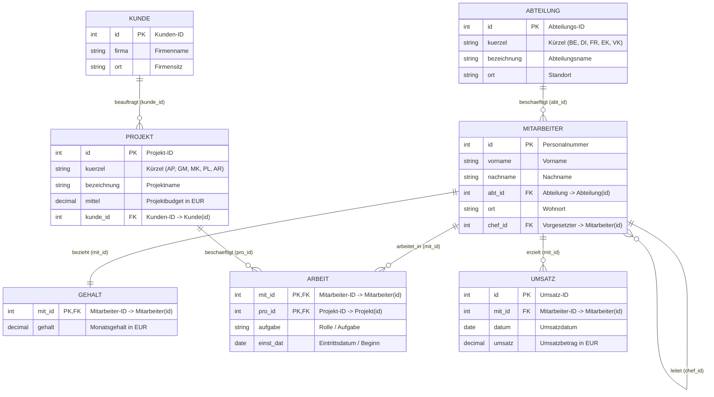
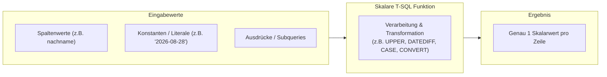
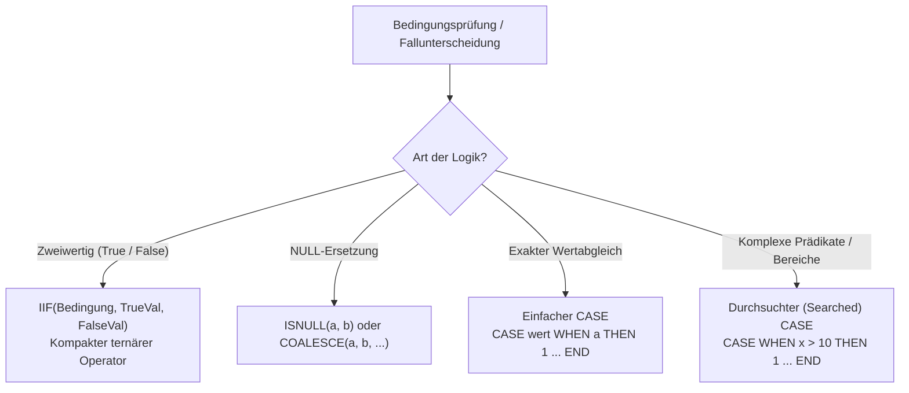
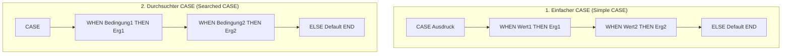
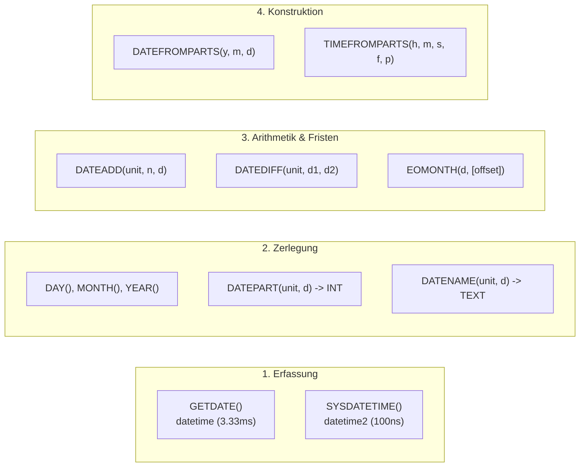
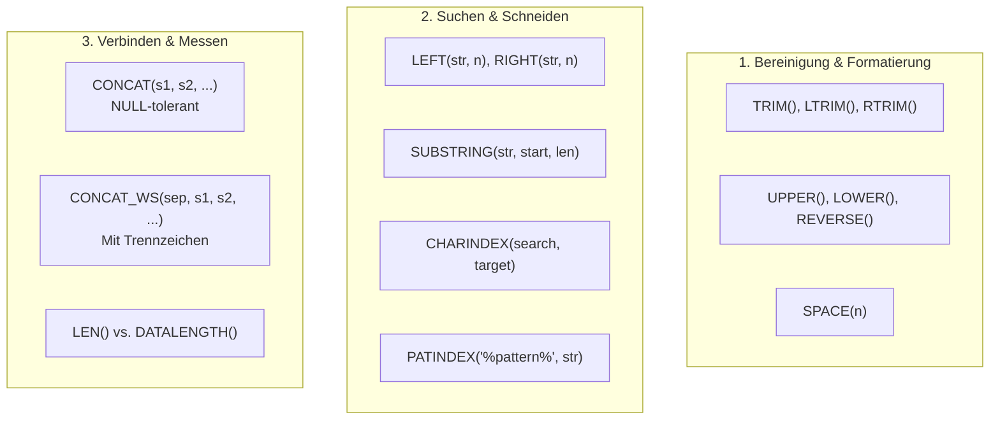
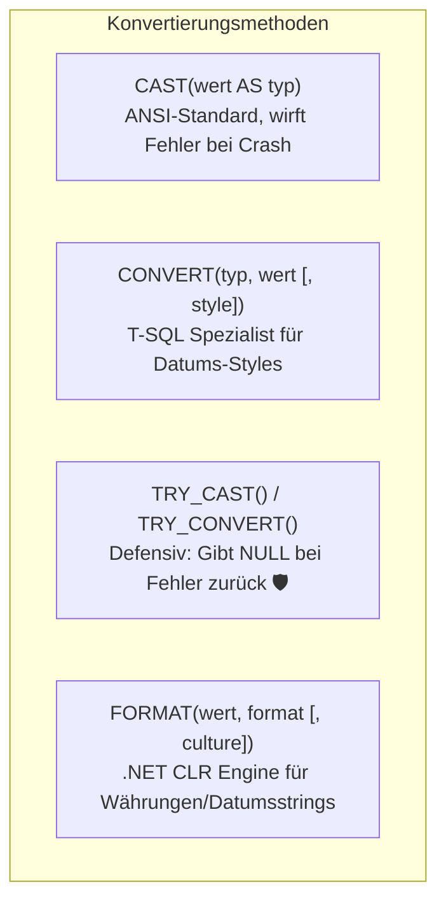
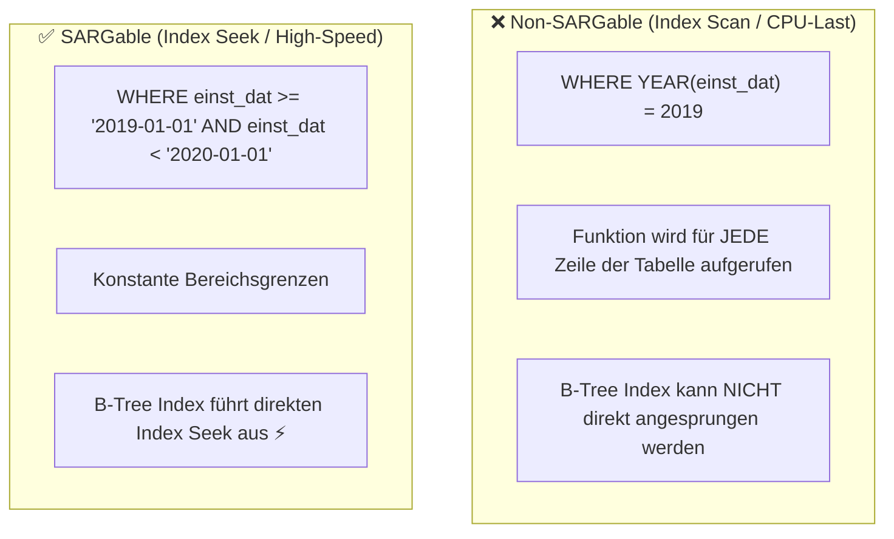
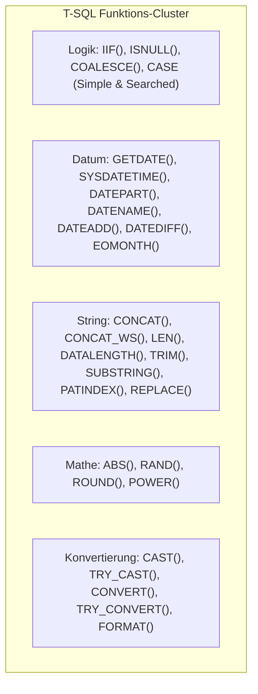

# 📅 Day_20: T-SQL Skalare Funktionen, Logik & CASE-Ausdrücke

## ℹ️ Kurs-Informationen

* **Datum:** Freitag, 28.08.2026
* **Arbeitszeit:** 08:15 - 16:00 Uhr
* **Dozent:** Tom S.
* **Autor:** Tobias Boyke

---

## 🎯 Lernziele des Tages

- [x] **Logische Verzweigungen & Fallunterscheidungen meistern:**
  - `IIF(Bedingung, True-Wert, False-Wert)`: Den ternären Operator in T-SQL als kompakte Syntax für einfache Bedingungen anwenden.
  - `ISNULL(Wert, Ersatz)` vs. `COALESCE(Wert1, Wert2, ...)`: Unterschiede in ANSI-Standard, Typinferenz, Datentyprang (Type Precedence) und Performance verstehen.
  - **Einfacher CASE-Ausdruck (Simple CASE):** Gleichheitsprüfungen gegen einen festen Ausdruck (`CASE Ausdruck WHEN Wert1 THEN ...`).
  - **Durchsuchter / Komplexer CASE-Ausdruck (Searched CASE):** Beliebige boolesche Prädikate, Bereichsabfragen und Subquery-Checks verarbeiten (`CASE WHEN Bedingung1 THEN ...`).
  - **Short-Circuit Evaluation:** Auswertungsreihenfolge und First-Match-Semantik verinnerlichen.
- [x] **Datums- & Uhrzeit-Funktionen (Temporal SQL Engineering):**
  - Zeitstempel: `GETDATE()` (`datetime`, 3,33 ms Präzision) vs. `SYSDATETIME()` (`datetime2`, 100 ns Präzision).
  - Datumsextraktion: `DAY()`, `MONTH()`, `YEAR()`, `DATEPART()` (Ganzzahl) und `DATENAME()` (sprachabhängiger Text).
  - Datumsarithmetik: `DATEADD()` (Hinzufügen/Abziehen von Zeitintervallen) und `DATEDIFF()` (Zählen von Intervallgrenzen).
  - Datumskonstruktion: `DATEFROMPARTS()`, `TIMEFROMPARTS()`, `DATETIME2FROMPARTS()`.
  - Periodenende: `EOMONTH()` mit Vor- und Rückschau-Offsets.
- [x] **String- & Textmanipulation (Data Cleansing & Transformation):**
  - Sichere Verkettung: `CONCAT()` und `CONCAT_WS()` (automatische Typkonvertierung & NULL-Toleranz) vs. traditionaler `+`-Operator.
  - Textlängenanalyse: `LEN()` (Zeichenanzahl ohne Trailing Spaces) vs. `DATALENGTH()` (physische Bytespeicherung inkl. Spaces & Unicode).
  - Bereinigung & Formatierung: `LTRIM()`, `RTRIM()`, `TRIM()`, `UPPER()`, `LOWER()`, `REVERSE()`, `SPACE()`.
  - Segmentierung & Suche: `LEFT()`, `RIGHT()`, `SUBSTRING()`, `CHARINDEX()` (Literalsuche) und `PATINDEX()` (Regex-/Wildcard-Mustersuche).
  - Validierung & Ersetzung: `REPLACE()` und `ISNUMERIC()` (inkl. Fallstricke bei Sonderzeichen).
- [x] **Mathematische Berechnungen:**
  - `ABS()` (Absolutbetrag), `RAND([seed])` (Pseudozufall & Determinismus), `ROUND(Wert, Stellen [, Funktion])` (kaufmännisches Runden vs. Truncation/Abschneiden), `POWER()` (Potenzen).
- [x] **Typkonvertierung & Formatierung:**
  - `CAST()` vs. `CONVERT()` mit T-SQL Style-Codes (z. B. `104` für Deutsches Datum, `120` für ODBC/ISO).
  - Defensive Fehlervermeidung mit `TRY_CAST()` und `TRY_CONVERT()` (Rückgabe von `NULL` statt Query-Absturz).
  - Hochflexible Formatierung via `FORMAT()` (.NET-Kulturen wie `'de-DE'`, Masken `'C'`, `'N'`, `'P'`).
- [x] **Performance & SARGability:** Verstehen, warum Funktionsaufrufe auf Spalten in `WHERE`-Klauseln Index-Scans erzwingen und wie man Abfragen sargable (Search-Argument-able) umformuliert.
- [x] **Praxislösungen der Aufgabenreihe 9 (ProjektDB):** Vollständige Ausarbeitung der Aufgaben 9.1 bis 9.4 (CASE) und 9.5 bis 9.14 (Funktionen).

---

## 🗺️ Relationale Kompasse: Single Source of Truth (`ProjektDB`)

Alle Abfragen, Praxisübungen und Lösungsbeispiele basieren verbindlich auf dem kanonischen Schema der **`ProjektDB`**:



---

## 📖 Theorie & Kernkonzepte im Detail

### 1. Architektur skalarer T-SQL Funktionen

Skalare Funktionen nehmen **null, einen oder mehrere Eingabeparameter** entgegen und liefern **genau einen Skalarwert** (Zahl, Zeichenkette, Datum, Boolean) zurück.



#### Einsatzorte in SQL-Anweisungen
* **`SELECT`**: Formatierung, Datenbereinigung, abgeleitete Spalten und Klassifizierungen.
* **`WHERE`**: Filterkriterien (Vorsicht bei Indexnutzung / SARGability!).
* **`GROUP BY` & `HAVING`**: Gruppierung nach aggregierten Zeitintervallen (z. B. `YEAR(datum)`).
* **`ORDER BY`**: Sortierung nach berechneten Kriterien (z. B. `ORDER BY LEN(nachname)`).
* **`JOIN ON`**: Transformation von Schlüsseln bei Datenunreinheiten.

---

### 2. Logische Funktionen & Fallunterscheidungen



#### 2.1 `IIF()` – Der ternäre Operator
`IIF()` ist eine abkürzende Schreibweise (syntaktischer Zucker) für einen `CASE`-Ausdruck mit zwei Ausgängen:

$$\text{IIF}(\text{Bedingung}, \text{Ergebnis}_{\text{True}}, \text{Ergebnis}_{\text{False}})$$

```sql
-- Beispiel: Gehaltskategorisierung
SELECT mit_id, gehalt, IIF(gehalt < 4000.00, 'Kategorie A', 'Kategorie B') AS status
FROM Gehalt;
```

#### 2.2 `ISNULL()` vs. `COALESCE()` – Die feinen, aber kritischen Unterschiede

| Eigenschaft | `ISNULL(check_expr, repl_value)` | `COALESCE(val1, val2, ..., valN)` |
| :--- | :--- | :--- |
| **Standard** | Proprietär (Microsoft T-SQL) | **ANSI SQL Standard** (portabel) |
| **Anzahl Argumente** | Genau **2** Argumente | **$N$ Argumente** ($2 \le N \le 64$) |
| **Datentyp des Ergebnisses** | Typ des **1. Arguments** (wird gekürzt, falls Ersatz länger ist!) | Typ des Werts mit dem **höchsten Rang** (*Data Type Precedence*) |
| **Subquery-Auswertung** | Wertet Subqueries oft **nur 1x** aus | Kann Subquery unter Umständen mehrfach auswerten (CASE-Expansion) |

> [!CAUTION]
> **Typ-Kürzungsfalle bei `ISNULL`:**
> ```sql
> DECLARE @x VARCHAR(3) = NULL;
> SELECT ISNULL(@x, 'Unbekannt');   --> Liefert 'Unb' (auf 3 Zeichen abgeschnitten!)
> SELECT COALESCE(@x, 'Unbekannt'); --> Liefert 'Unbekannt' (voller VARCHAR(9) Typ)
> ```

#### 2.3 `CASE`-Ausdrücke: Einfach vs. Durchsucht (Searched)



* **Einfacher CASE:** Prüft einen einzigen Ausdruck auf exakte Gleichheit (`=`).
  ```sql
  SELECT kuerzel,
         CASE kuerzel
             WHEN 'EK' THEN 'Einkauf'
             WHEN 'VK' THEN 'Verkauf'
             ELSE 'Sonstige'
         END AS abteilung_lang
  FROM Abteilung;
  ```
* **Durchsuchter / Komplexer CASE:** Kann relationale Operatoren (`<`, `>`, `BETWEEN`), logische Operatoren (`AND`, `OR`), `IN`, `LIKE` und sogar Subqueries (`EXISTS`) verarbeiten.
  ```sql
  SELECT nachname, ort,
         CASE
             WHEN ort IN ('Landshut', 'Rosenheim') THEN 'Kategorie F'
             WHEN ort IS NULL THEN 'Kategorie Unbekannt'
             ELSE 'Kategorie Standard'
         END AS standort_klasse
  FROM Mitarbeiter;
  ```

> [!IMPORTANT]
> **Short-Circuit Evaluation & Reihenfolge:**
> SQL Server wertet `WHEN`-Zweige streng von **oben nach unten** aus. Sobald die erste Bedingung `TRUE` ergibt, wird der zugehörige `THEN`-Wert zurückgegeben und die weitere Auswertung **sofort beendet**. Spezifischere Bedingungen müssen daher **immer vor** allgemeineren Bedingungen stehen!

---

### 3. Datums- & Uhrzeit-Funktionen (Temporal Engineering)



#### 📊 Übersicht aller Datums-Einheiten (`datepart` / `unit`)

| Einheit | Gültige Kürzel | Beschreibung | Möglicher Wertebereich |
| :--- | :--- | :--- | :--- |
| **`year`** | `yy`, `yyyy` | Kalenderjahr | $1 - 9999$ |
| **`quarter`** | `qq`, `q` | Quartal | $1 - 4$ |
| **`month`** | `mm`, `m` | Monat | $1 - 12$ |
| **`dayofyear`** | `dy`, `y` | Tag des Jahres | $1 - 366$ |
| **`day`** | `dd`, `d` | Tag des Monats | $1 - 31$ |
| **`week`** | `wk`, `ww` | Kalenderwoche (US/Server-Standard) | $1 - 53$ |
| **`iso_week`** | `isowk`, `isoww` | **Europäische ISO 8601 Kalenderwoche** | $1 - 53$ |
| **`weekday`** | `dw`, `w` | Wochentag | $1 - 7$ (abhängig von `@@DATEFIRST`) |
| **`hour`** | `hh` | Stunde | $0 - 23$ |
| **`minute`** | `mi`, `n` | Minute | $0 - 59$ |
| **`second`** | `ss`, `s` | Sekunde | $0 - 59$ |
| **`millisecond`** | `ms` | Millisekunde | $0 - 999$ |
| **`microsecond`** | `mcs` | Mikrosekunde | $0 - 999999$ |
| **`nanosecond`** | `ns` | Nanosekunde | $0 - 999999999$ |

#### 3.1 `DATEPART` vs. `DATENAME`
* `DATEPART(unit, date)` gibt immer eine **Ganzzahl (`INT`)** zurück.
* `DATENAME(unit, date)` gibt die textuelle Bezeichnung als **Zeichenkette (`NVARCHAR`)** unter Berücksichtigung der aktuellen Session-Sprache (`SET LANGUAGE`) zurück:
  ```sql
  SET LANGUAGE German;
  SELECT DATEPART(weekday, '2026-08-28'); --> 5 (Freitag bei DATEFIRST 7)
  SELECT DATENAME(weekday, '2026-08-28'); --> 'Freitag'
  SELECT DATENAME(month,   '2026-08-28'); --> 'August'
  ```

#### 3.2 `DATEDIFF` vs. Reale Zeitdifferenz
> [!WARNING]
> **Wichtig für IHK-Prüfungen & Praxis:**  
> `DATEDIFF(unit, start, end)` misst **nicht** die verflossene Nettozeit, sondern zählt, wie oft die **Grenze der Einheit überschritten** wurde:
> ```sql
> -- Obwohl nur 2 Sekunden vergangen sind, zählt DATEDIFF '1 Jahr':
> SELECT DATEDIFF(year, '2025-12-31 23:59:59', '2026-01-01 00:00:01'); --> 1
> ```

#### 3.3 `EOMONTH()` (End of Month) mit Offsets
`EOMONTH(datum [, offset])` ermittelt blitzschnell den Monatsletzten (unter Berücksichtigung von Schaltjahren):
```sql
SELECT EOMONTH('2024-02-10');       --> '2024-02-29' (Schaltjahr!)
SELECT EOMONTH(GETDATE(), 1);       --> Letzter Tag des nächsten Monats
SELECT EOMONTH(GETDATE(), -1);      --> Letzter Tag des Vormonats
```

---

### 4. String- & Text-Funktionen (Data Cleansing)



#### 4.1 Verkettung: `CONCAT()` vs. `+` Operator
* Traditioneller `+`-Operator: Ergibt `NULL`, sobald **ein einziger Summand `NULL`** ist (`'Hans ' + NULL` $\rightarrow$ `NULL`).
* `CONCAT(a, b, c, ...)`: Wandelt Datentypen automatisch in Text um und behandelt `NULL` wie eine leere Zeichenkette `''`.
* `CONCAT_WS(separator, a, b, ...)`: Fügt das angegebene Trennzeichen nur zwischen nicht-leeren Werten ein (perfekt für CSV/Adresszeilen).

#### 4.2 Längenmessung: `LEN()` vs. `DATALENGTH()`

```sql
DECLARE @txt NVARCHAR(20) = N'SQL Server   '; -- 10 Zeichen + 3 Leerzeichen

SELECT LEN(@txt);         --> 10 (Zählt Zeichen, IGNORIERT abschließende Leerzeichen)
SELECT DATALENGTH(@txt);  --> 26 (Zählt Bytes: 13 Zeichen * 2 Bytes für NVARCHAR!)
```

#### 4.3 Positionssuche: `CHARINDEX()` vs. `PATINDEX()`
* `CHARINDEX('Muster', Text [, Start])`: Sucht nach einer **exakten Zeichenfolge**.
* `PATINDEX('%Muster%', Text)`: Unterstützt **Wildcards** wie `LIKE`:
  * `%[0-9]%`: Findet die Position der ersten Ziffer.
  * `%[aeiouäöü]%`: Findet die Position des ersten Vokals.
  * `%[^a-zA-Z]%`: Findet das erste Sonderzeichen.

---

### 5. Mathematische Funktionen

| Funktion | Syntax | Beschreibung & Verhalten | Praxisbeispiel |
| :--- | :--- | :--- | :--- |
| **`ABS()`** | `ABS(wert)` | Gibt den Absolutbetrag (ohne Vorzeichen) zurück. | `ABS(-150.00)` $\rightarrow$ `150.00` |
| **`RAND()`** | `RAND([seed])` | Liefert Pseudozufallszahl $0 \le r < 1$. Mit festem Seed deterministisch. | `FLOOR(RAND() * 100) + 1` ($1..100$) |
| **`ROUND()`** | `ROUND(wert, st [, fkt])` | Rundet kaufmännisch. Bei `fkt != 0` wird **abgeschnitten (trunc)**. | `ROUND(123.456, 2, 1)` $\rightarrow$ `123.450` |
| **`POWER()`** | `POWER(basis, exp)` | Berechnet Potenz $\text{basis}^{\text{exp}}$. | `POWER(2, 8)` $\rightarrow$ `256` |

---

### 6. Typkonvertierung & Formatierung



#### 6.1 Wichtige `CONVERT()` Datums-Styles

| Style-Code (mit Jahrhundert) | Standard / Format | Beispiel-Ausgabe |
| :---: | :--- | :--- |
| **`104`** | **Deutsch (DIN):** `TT.MM.JJJJ` | `28.08.2026` |
| **`120`** | **ODBC Kanonisch:** `JJJJ-MM-TT HH:MI:SS` | `2026-08-28 14:30:00` |
| **`112`** | **ISO Reines Datum:** `JJJJMMTT` | `20260828` |
| **`108`** | **Uhrzeit:** `HH:MI:SS` | `14:30:00` |

#### 6.2 Defensive Programmierung: `TRY_CAST` und `TRY_CONVERT`
Verhindert Laufzeitabbrüche beim Parsen von Benutzereingaben oder unbereinigten Daten:
```sql
-- Wirft keinen Fehler, sondern liefert sicher NULL:
SELECT TRY_CONVERT(DATE, '31.02.2026', 104) AS ungueltiges_datum; --> NULL
SELECT TRY_CAST('UngueltigeZahl' AS INT)    AS ungueltige_zahl;    --> NULL
```

#### 6.3 Flexible .NET-Formatierung mit `FORMAT()`
```sql
-- Währungsformatierung mit Ländercode:
SELECT FORMAT(3450.50, 'C', 'de-DE'); --> '3.450,50 €'
SELECT FORMAT(3450.50, 'C', 'en-US'); --> '$3,450.50'

-- Benutzerdefiniertes Datumsformat:
SELECT FORMAT(GETDATE(), 'dddd, dd. MMMM yyyy (HH:mm "Uhr")', 'de-DE');
--> 'Freitag, 28. August 2026 (14:30 Uhr)'
```

> [!TIP]
> **Performance-Warnung zu `FORMAT()`:**  
> `FORMAT()` greift auf die .NET CLR-Engine zurück. Bei Millionen von Datensätzen ist `CONVERT()` um den Faktor **10- bis 20-mal schneller** als `FORMAT()`. Verwenden Sie `FORMAT()` bevorzugt für UI-Ausgaben oder Reporting-Aggregatzeilen.

---

### 7. Performance & SARGability (Search Argumentable)



---

## 🛠️ Praxis-Lösungen: Aufgabenreihe 9 (ProjektDB)

Die Lösungen basieren auf den Aufgabenblättern [`assets/ProjektDB 09 - CASE - Aufgaben.sql`](file:///c:/Users/Tobia/Desktop/cSharpRepo/SQL-Fundamentals/Day_20/assets/ProjektDB%2009%20-%20CASE%20-%20Aufgaben.sql) und [`assets/ProjektDB 09 - Funktionen - Aufgaben.sql`](file:///c:/Users/Tobia/Desktop/cSharpRepo/SQL-Fundamentals/Day_20/assets/ProjektDB%2009%20-%20Funktionen%20-%20Aufgaben.sql).

---

### 📂 Aufgabe 9.1: Projekt-Kategorisierung nach Mitteln (CASE)

* **Aufgabenstellung:** Teilen Sie alle Projekte anhand ihrer verfügbaren Mittel in 4 Kategorien ein:
  * $< 90.000$ $\rightarrow$ Kategorie 1
  * $< 135.000$ $\rightarrow$ Kategorie 2
  * $< 170.000$ $\rightarrow$ Kategorie 3
  * $\ge 170.000$ $\rightarrow$ Kategorie 4
* **Erwartetes Ergebnis:**
  ```text
  bezeichnung  kategorie
  Apollo       2
  Gemini       2
  Merkur       4
  Pluto        1
  Ariane       3
  ```

#### 🔹 Musterlösung (Aufgabe 9.1)
```sql
SELECT bezeichnung,
       CASE
           WHEN mittel < 90000.00 THEN 1
           WHEN mittel < 135000.00 THEN 2
           WHEN mittel < 170000.00 THEN 3
           ELSE 4
       END AS kategorie
FROM Projekt;
```

> [!NOTE]
> Dank der **Top-Down-Auswertung** greift bei einem Wert von `120000` (`Apollo`) die zweite Bedingung (`< 135000`), da die erste (`< 90000`) `FALSE` ergab.

---

### 📂 Aufgabe 9.2: Mitarbeiter-Kategorisierung (Standort vs. Abteilung)

* **Aufgabenstellung:**
  * Einkauf $\rightarrow$ Kategorie A
  * Andere Abteilungen $\rightarrow$ Kategorie B
  * Wohnort in Landshut oder Rosenheim $\rightarrow$ **immer Kategorie F** (höchste Priorität!)
* **Erwartetes Ergebnis:** 15 Zeilen

#### 🔹 Musterlösung (Aufgabe 9.2)
```sql
SELECT m.id,
       m.nachname,
       m.ort,
       a.bezeichnung,
       CASE
           WHEN m.ort IN ('Landshut', 'Rosenheim') THEN 'F'
           WHEN a.bezeichnung = 'Einkauf' THEN 'A'
           ELSE 'B'
       END AS kategorie
FROM Mitarbeiter AS m
INNER JOIN Abteilung AS a ON m.abt_id = a.id;
```

---

### 📂 Aufgabe 9.3: Erweiterte Mitarbeiter-Kategorisierung (B1 / B2 mit Projektbudget)

* **Aufgabenstellung:** Erweitern Sie Aufgabe 9.2: Mitarbeiter der Kategorie B werden unterteilt:
  * Arbeiten sie an einem Projekt mit mehr als $100.000$ € Budget $\rightarrow$ Kategorie B1
  * Sonst $\rightarrow$ Kategorie B2
* **Erwartetes Ergebnis:** 15 Zeilen

#### 🔹 Musterlösung mit `EXISTS` im CASE (Aufgabe 9.3)
```sql
SELECT m.id,
       m.nachname,
       m.ort,
       a.bezeichnung,
       CASE
           WHEN m.ort IN ('Landshut', 'Rosenheim') THEN 'F'
           WHEN a.bezeichnung = 'Einkauf' THEN 'A'
           WHEN EXISTS (
               SELECT 1
               FROM Arbeit AS ar
               INNER JOIN Projekt AS p ON ar.pro_id = p.id
               WHERE ar.mit_id = m.id AND p.mittel > 100000.00
           ) THEN 'B1'
           ELSE 'B2'
       END AS kategorie
FROM Mitarbeiter AS m
INNER JOIN Abteilung AS a ON m.abt_id = a.id;
```

---

### 📂 Aufgabe 9.4: Arbeiter-Klassifizierung nach Wochentag (`DATENAME`)

* **Aufgabenstellung:**
  * Eintritt am Wochenende (Samstag / Sonntag) $\rightarrow$ `Arbeitstier`
  * Eintritt am Montag oder Dienstag $\rightarrow$ `Fleissig`
  * Rest $\rightarrow$ `Faulenzer`
* **Erwartetes Ergebnis:** 20 Zeilen

#### 🔹 Musterlösung (Aufgabe 9.4)
```sql
SET LANGUAGE German;

SELECT a.einst_dat,
       DATENAME(dw, a.einst_dat) AS wochentag,
       CASE
           WHEN DATENAME(dw, a.einst_dat) IN ('Samstag', 'Sonntag') THEN 'Arbeitstier'
           WHEN DATENAME(dw, a.einst_dat) IN ('Montag', 'Dienstag') THEN 'Fleissig'
           ELSE 'Faulenzer'
       END AS kategorie
FROM Arbeit AS a;
```

---

### 📂 Aufgabe 9.5: Mitarbeiter-Code-Generator (String-Kombination)

* **Aufgabenstellung:** Generieren Sie Mitarbeiter-Codes nach folgendem Muster:
  1. Erster Buchstabe des Nachnamens
  2. Vierter Buchstabe des Nachnamens (Großbuchstabe)
  3. Letzter Buchstabe des Vornamens (Großbuchstabe)
  4. Abteilungskürzel rückwärts gewendet (z. B. `EK` $\rightarrow$ `KE`)
* **Erwartete Ausgabe:** `nachname`, `vorname`, `kuerzel`, `code` (z. B. Kaufmann Brigitte DI $\rightarrow$ `KFEID`)

#### 🔹 Musterlösung (Aufgabe 9.5)
```sql
SELECT m.nachname,
       m.vorname,
       abt.kuerzel,
       CONCAT(
           LEFT(m.nachname, 1),
           UPPER(SUBSTRING(m.nachname, 4, 1)),
           UPPER(RIGHT(m.vorname, 1)),
           REVERSE(abt.kuerzel)
       ) AS code
FROM Mitarbeiter AS m
INNER JOIN Abteilung AS abt ON m.abt_id = abt.id;
```

---

### 📂 Aufgabe 9.6: Vollständiger Name (`CONCAT` & `TRIM`)

* **Aufgabenstellung:** Geben Sie Vor- und Nachnamen der Mitarbeiter in einer Spalte namens `name` aus.
* **Erwartetes Ergebnis:** 15 Zeilen

#### 🔹 Musterlösung (Aufgabe 9.6)
```sql
SELECT CONCAT(TRIM(vorname), ' ', TRIM(nachname)) AS name
FROM Mitarbeiter;
```

---

### 📂 Aufgabe 9.7: Name & Wohnort mit NULL-Handling (`COALESCE`)

* **Aufgabenstellung:** Vor- und Nachname gefolgt von Komma und Wohnort. Ist kein Wohnort vorhanden, soll `'unbekannt'` ausgegeben werden.
* **Erwartetes Ergebnis:** 15 Zeilen (z. B. `Brigitte Kaufmann, unbekannt`, `Sabine Schäfer, Landshut`)

#### 🔹 Musterlösung (Aufgabe 9.7)
```sql
SELECT CONCAT(
           TRIM(vorname), ' ', 
           TRIM(nachname), ', ', 
           COALESCE(ort, 'unbekannt')
       ) AS mitarbeiter
FROM Mitarbeiter;
```

---

### 📂 Aufgabe 9.8: Namenskürzel (`LEFT` & `CONCAT`)

* **Aufgabenstellung:** Kurzform des Mitarbeiternamens (z. B. `B. Kaufmann`, `S. Schäfer`).
* **Erwartetes Ergebnis:** 15 Zeilen

#### 🔹 Musterlösung (Aufgabe 9.8)
```sql
SELECT CONCAT(LEFT(TRIM(vorname), 1), '. ', TRIM(nachname)) AS name
FROM Mitarbeiter;
```

---

### 📂 Aufgabe 9.9: Nachnamen nach Länge & Alphabet sortieren (`LEN`)

* **Aufgabenstellung:** Nachnamen aufsteigend nach ihrer Zeichenlänge sortieren. Bei gleicher Länge alphabetisch absteigend sortieren.
* **Erwartetes Ergebnis:** 15 Zeilen (`Wolf`, `Vogel`, `Mozer`, `Meier`, `Huber`, `Fuchs`, ...)

#### 🔹 Musterlösung (Aufgabe 9.9)
```sql
SELECT nachname
FROM Mitarbeiter
ORDER BY LEN(nachname) ASC, nachname DESC;
```

---

### 📂 Aufgabe 9.10: Erster Vokal im Nachnamen (`PATINDEX`)

* **Aufgabenstellung:** Finden Sie für alle Mitarbeiter die Position des ersten Vokals im Nachnamen.
* **Erwartetes Ergebnis:** `nachname`, `erster_vokal` (15 Zeilen)

#### 🔹 Musterlösung (Aufgabe 9.10)
```sql
SELECT nachname,
       PATINDEX('%[aeiouäöü]%', LOWER(nachname)) AS erster_vokal
FROM Mitarbeiter;
```

---

### 📂 Aufgabe 9.11: Bruttotage im Kursmodul (`DATEDIFF` & `GETDATE`)

* **Aufgabenstellung:** Berechnen Sie die Anzahl der Tage (brutto), die seit Kursbeginn vergangen sind.

#### 🔹 Musterlösung (Aufgabe 9.11)
```sql
-- Berechnung bezogen auf den Aufgabenblatt-Startpunkt (01.08.2024):
SELECT DATEDIFF(day, '2024-08-01', GETDATE()) AS tage_in_modul;

-- Berechnung bezogen auf den aktuellen August-Zyklus 2026:
SELECT DATEDIFF(day, '2026-08-03', GETDATE()) AS tage_in_modul_2026;
```

---

### 📂 Aufgabe 9.12: Volltext-Datumsformatierung

* **Aufgabenstellung:** Geben Sie das heutige Datum formatiert im Satz aus:  
  *„Heute ist Freitag, der 28. August des Jahres 2026 in der 35. Kalenderwoche“*

#### 🔹 Musterlösung (Aufgabe 9.12)
```sql
SET LANGUAGE German;

SELECT CONCAT(
           'Heute ist ', 
           DATENAME(dw, GETDATE()), 
           ', der ', 
           DATEPART(dd, GETDATE()), 
           '. ', 
           DATENAME(mm, GETDATE()), 
           ' des Jahres ', 
           DATEPART(yy, GETDATE()), 
           ' in der ', 
           DATEPART(wk, GETDATE()), 
           '. Kalenderwoche'
       ) AS datum_formatiert;
```

---

### 📂 Aufgabe 9.13: Tag des Jahres (`DATEPART`)

* **Aufgabenstellung:** Ermitteln Sie das heutige Datum und den wievielten Tag des Jahres wir heute haben.

#### 🔹 Musterlösung (Aufgabe 9.13)
```sql
SELECT CAST(GETDATE() AS DATE)        AS datum,
       DATEPART(dayofyear, GETDATE()) AS tag_des_jahres;
```

---

### 📂 Aufgabe 9.14: Gehaltskategorisierung mit `IIF()`

* **Aufgabenstellung:** Gehalt unter $4.000$ € $\rightarrow$ Kategorie A, sonst Kategorie B. Verwenden Sie `IIF()`.
* **Erwartete Spalten:** `mit_id`, `gehalt`, `kategorie` (15 Zeilen)

#### 🔹 Musterlösung (Aufgabe 9.14)
```sql
SELECT g.mit_id,
       g.gehalt,
       IIF(g.gehalt < 4000.00, 'A', 'B') AS kategorie
FROM Gehalt AS g;
```

---

## 🏢 Single Source of Truth (`ProjektDB`) Praxistransfer

### 1. Enterprise HR & Gehaltsband-Dashboard
```sql
SELECT m.id,
       CONCAT(m.vorname, ' ', m.nachname) AS mitarbeiter_name,
       a.bezeichnung AS abteilung,
       FORMAT(g.gehalt, 'C', 'de-DE') AS monatsgehalt,
       FORMAT(g.gehalt * 12, 'C', 'de-DE') AS jahresgehalt,
       CASE
           WHEN g.gehalt >= 5000.00 THEN 'Executive Band'
           WHEN g.gehalt >= 3500.00 THEN 'Senior Professional'
           ELSE 'Associate'
       END AS karriere_stufe,
       COALESCE(m.ort, 'Standort nicht erfasst') AS wohnort
FROM Mitarbeiter AS m
INNER JOIN Abteilung AS a ON m.abt_id = a.id
INNER JOIN Gehalt AS g ON m.id = g.mit_id
ORDER BY g.gehalt DESC;
```

### 2. Projektcontrolling & Fristenmanagement
```sql
SELECT p.kuerzel,
       p.bezeichnung AS projekt_name,
       FORMAT(p.mittel, 'C', 'de-DE') AS budget,
       k.firma AS auftraggeber,
       COUNT(ar.mit_id) AS anzahl_mitarbeiter,
       MIN(ar.einst_dat) AS fruehester_start,
       DATEDIFF(day, MIN(ar.einst_dat), GETDATE()) AS laufzeit_tage,
       EOMONTH(MAX(ar.einst_dat)) AS naechste_review_deadline
FROM Projekt AS p
LEFT JOIN Kunde AS k ON p.kunde_id = k.id
LEFT JOIN Arbeit AS ar ON p.id = ar.pro_id
GROUP BY p.kuerzel, p.bezeichnung, p.mittel, k.firma;
```

---

## 🧭 Zusammenfassung & Funktions-Matrix (Cheat Sheet)



### 📋 Schnellreferenz

| Funktionskategorie | Funktion & Syntax | Wichtigster Rückgabetyp | Typischer Praxiseinsatz |
| :--- | :--- | :---: | :--- |
| **Bedingung** | `IIF(cond, t, f)` | Typ von $t$ oder $f$ | Kompakte Inline-Ifs in `SELECT` |
| **NULL-Handling** | `COALESCE(v1, v2, ...)` | Höchster Typenrang | Sichere Standardwert-Ersetzung |
| **Fallunterscheidung** | `CASE WHEN c THEN r ... END` | Höchster Typenrang | Komplexe Business-Logik & Einstufungen |
| **Zeitstempel** | `GETDATE()` / `SYSDATETIME()` | `datetime` / `datetime2` | Audit-Trails & Zeitmessungen |
| **Datums-Part** | `DATENAME(dw, date)` | `NVARCHAR` | Wochentage & Monatsnamen als Text |
| **Datums-Mathe** | `DATEDIFF(unit, d1, d2)` | `INT` | Alters- & Dauermessung in Tagen/Jahren |
| **Periodenende** | `EOMONTH(date, [offset])` | `DATE` | Monatsabschluss & Abrechnungszeiträume |
| **Verkettung** | `CONCAT_WS(sep, s1, s2, ...)` | `NVARCHAR` | CSV-Export & saubere Adresszeilen |
| **Mustererkennung**| `PATINDEX('%[0-9]%', str)` | `INT` | Datenbereinigung & Ziffern-/Vokalsuche |
| **Sichere Typwandlung** | `TRY_CAST(val AS type)` | Zieltyp oder `NULL` | Defensives Parsen externer Datenquellen |
| **UI-Formatierung**| `FORMAT(val, 'C', 'de-DE')` | `NVARCHAR` | Lokalisierte Währungs- & Datumsdarstellung |

---

## 💻 Praktische Skripte & Assets im Projekt

### 📜 SQL-Lösungsskripte (`Day_20/src/`)
* 📜 **CASE-Ausdrücke & Logik (Aufgaben 9.1 - 9.4):** [`src/01_case_und_logische_funktionen_aufgaben.sql`](file:///c:/Users/Tobia/Desktop/cSharpRepo/SQL-Fundamentals/Day_20/src/01_case_und_logische_funktionen_aufgaben.sql)
* 📜 **Skalare Funktionen (Aufgaben 9.5 - 9.14):** [`src/02_t_sql_skalare_funktionen_aufgaben.sql`](file:///c:/Users/Tobia/Desktop/cSharpRepo/SQL-Fundamentals/Day_20/src/02_t_sql_skalare_funktionen_aufgaben.sql)
* 📜 **Funktions-Kompendium & Praxistransfer:** [`src/03_funktionen_kompendium_vertiefung.sql`](file:///c:/Users/Tobia/Desktop/cSharpRepo/SQL-Fundamentals/Day_20/src/03_funktionen_kompendium_vertiefung.sql)

### 📄 Aufgabenblätter & Dokumente (`Day_20/assets/`)
* 📄 **Theorie-Präsentation:** [`assets/SQL 99 - Funktionen.pdf`](file:///c:/Users/Tobia/Desktop/cSharpRepo/SQL-Fundamentals/Day_20/assets/SQL%2099%20-%20Funktionen.pdf)
* 📄 **Aufgabenblatt 9 (CASE):** [`assets/ProjektDB 09 - CASE - Aufgaben.sql`](file:///c:/Users/Tobia/Desktop/cSharpRepo/SQL-Fundamentals/Day_20/assets/ProjektDB%2009%20-%20CASE%20-%20Aufgaben.sql)
* 📄 **Aufgabenblatt 9 (Funktionen):** [`assets/ProjektDB 09 - Funktionen - Aufgaben.sql`](file:///c:/Users/Tobia/Desktop/cSharpRepo/SQL-Fundamentals/Day_20/assets/ProjektDB%2009%20-%20Funktionen%20-%20Aufgaben.sql)