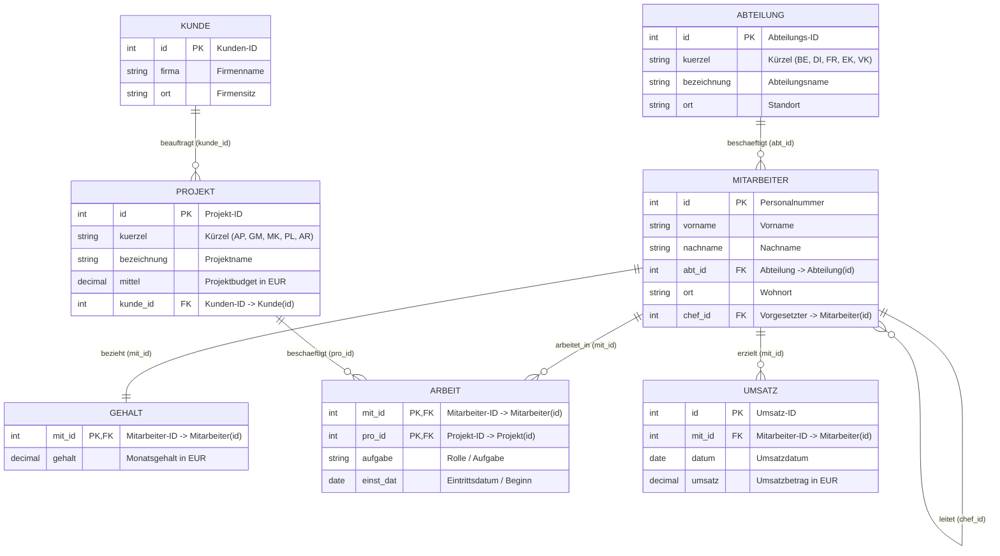
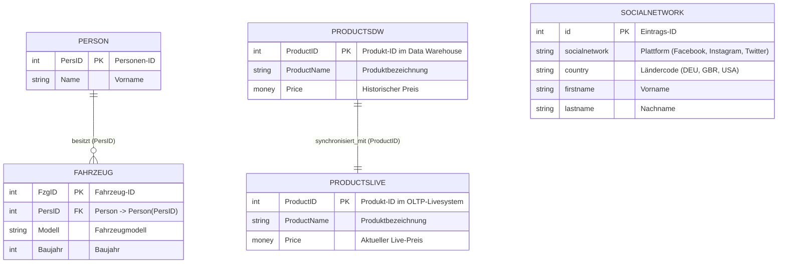
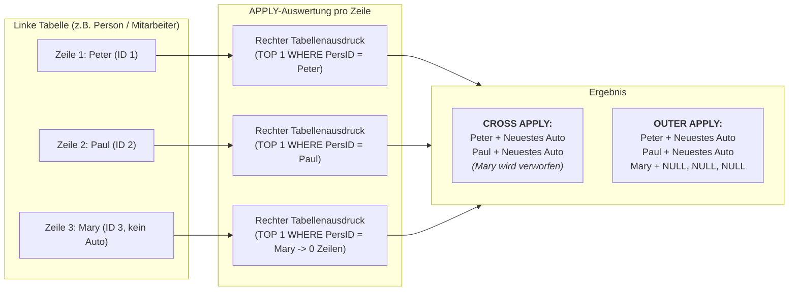
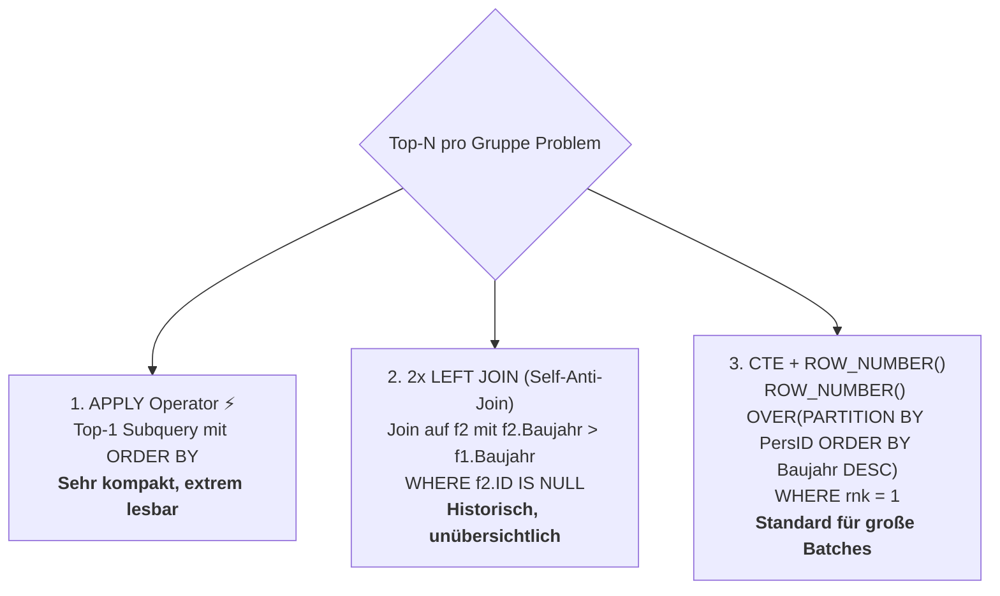
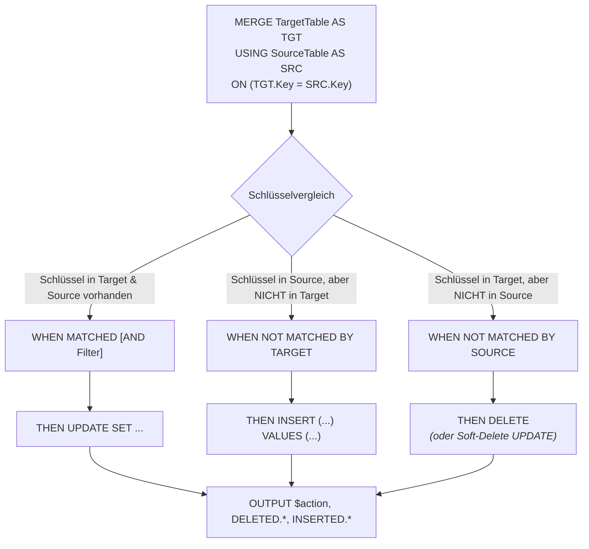
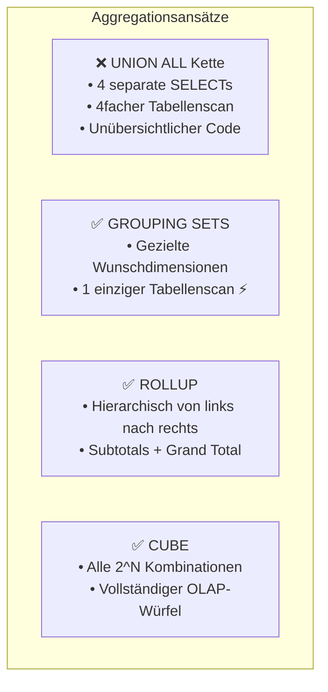
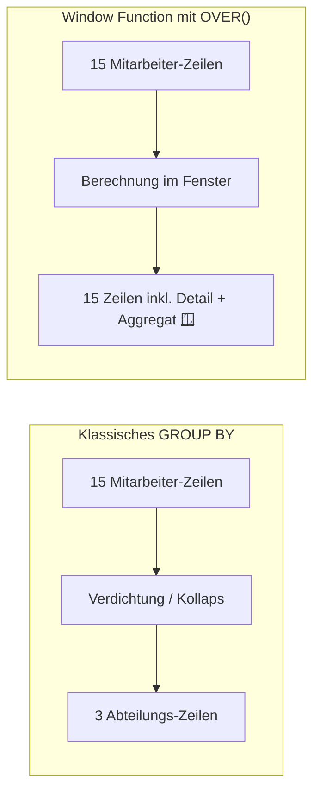
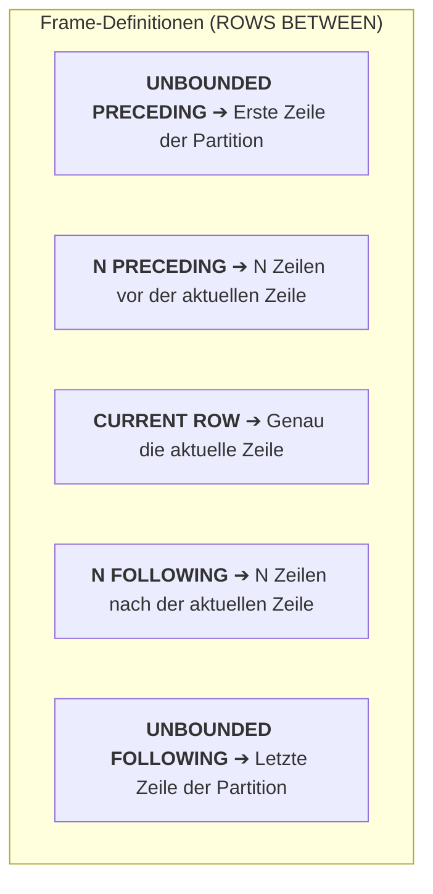
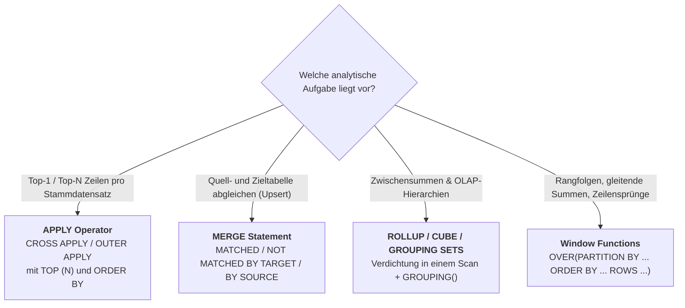

# 📅 Day_21: Advanced T-SQL – APPLY, MERGE, GROUPING SETS & Fensterfunktionen

## ℹ️ Kurs-Informationen

* **Datum:** Montag, 31.08.2026
* **Arbeitszeit:** 08:15 - 16:00 Uhr
* **Dozent:** Tom S.
* **Autor:** Tobias Boyke

---

## 🎯 Lernziele des Tages

- [x] **Der `APPLY`-Operator (`CROSS APPLY` & `OUTER APPLY`):**
  - Zeilenweise Auswertung korrelierter Tabellenausdrücke und Inline Table-Valued Functions (TVFs) verstehen.
  - Das fundamentale Problem „**Top-N pro Gruppe**“ (z. B. der jeweils neueste Datensatz oder Höchstwert pro Entität) elegant lösen.
  - Semantischer und technischer Vergleich: `CROSS APPLY` (INNER JOIN Verhalten) vs. `OUTER APPLY` (LEFT JOIN Verhalten).
  - Gegenüberstellung mit alternativen Ansätzen: Multi-Table `LEFT JOIN` (Self-Anti-Join) und Window Functions mit CTE.
- [x] **Das `MERGE`-Statement (ETL-Synchronisation & Upsert):**
  - Atomare Zusammenführung von `INSERT`, `UPDATE` und `DELETE` in einer einzigen DML-Anweisung.
  - Die drei Aktionszweige beherrschen: `WHEN MATCHED`, `WHEN NOT MATCHED [BY TARGET]`, `WHEN NOT MATCHED BY SOURCE`.
  - Auditierung und Change Tracking über die `OUTPUT`-Klausel mit `$action`, `DELETED.*` und `INSERTED.*`.
  - Vermeidung kritischer Fallstricke: Laufzeitfehler 8672 (nicht-deterministische Quell-Matches) und zwingendes Abschluss-Semikolon (`;`).
- [x] **Multidimensionale Aggregationen (`GROUPING SETS`, `CUBE`, `ROLLUP`):**
  - Das Problem unperformanter `UNION ALL`-Ketten für Zwischensummen (Subtotals) und Gesamtsummen (Grand Totals) eliminieren.
  - `GROUPING SETS`: Gezielte Aggregationskombinationen in einem einzigen Tabellenscan definieren.
  - `ROLLUP`: Hierarchische Verdichtung von der feinsten Dimension bis zur Gesamtsumme ($N + 1$ Aggregationsstufen).
  - `CUBE`: Vollständige multidimensionale Potenzmenge ($2^N$ Aggregationskombinationen) für OLAP-Analysen berechnen.
  - Die Kontrollfunktionen `GROUPING()` und `GROUPING_ID()` zur sicheren Unterscheidung zwischen Daten-`NULL` und Aggregat-`NULL` einsetzen.
- [x] **Analytische Fensterfunktionen (Window Functions):**
  - Das Prinzip der `OVER()`-Klausel verinnerlichen: Analysen und Aggregationen durchführen, **ohne** dass Detailzeilen kollabieren.
  - **Ranking-Funktionen:** `ROW_NUMBER()`, `RANK()`, `DENSE_RANK()` und `NTILE(n)` differenziert einsetzen.
  - **Aggregierende Fensterfunktionen:** Summen, Durchschnitte, Min/Max und prozentuale Anteile über Partitionen berechnen.
  - **Fensterrahmen (Frames):** Kumulierte Summen (*Running Totals*) mit `ROWS BETWEEN UNBOUNDED PRECEDING AND CURRENT ROW` und Restsummen mit `ROWS BETWEEN CURRENT ROW AND UNBOUNDED FOLLOWING`.
  - **Offset-Funktionen:** Direkter Zeilenzugriff auf Vorgänger- (`LAG`) und Nachfolgerwerte (`LEAD`) sowie Randwerte (`FIRST_VALUE`, `LAST_VALUE`).
  - **Benannte Fenster:** T-SQL `WINDOW`-Klausel zur Reduktion redundanter `OVER()`-Definitionen.
- [x] **Single Source of Truth (`ProjektDB`) & Ergänzungsdatenbank (`WeitereBeispiele`):**
  - Übertragung aller fortgeschrittenen Konzepte auf das kanonische SoT-Schema der `ProjektDB`.

---

## 🗺️ Relationale Kompasse: Single Source of Truth (`ProjektDB`) & Begleitschema

### 1. Single Source of Truth (`ProjektDB`)

Alle unternehmensweiten Abfragen, Gehalts- und Umsatzanalysen basieren verbindlich auf dem kanonischen Schema der **`ProjektDB`**:



---

### 2. Begleitdatenbank (`WeitereBeispiele`)

Zur isolierten Demonstration spezieller Szenarien (ETL-Upsert, Fuhrpark-Zuordnung, Social-Network-Demografie) dient die Datenbank `WeitereBeispiele`:



---

## 📖 Theorie & Kernkonzepte im Detail

---

### 1. Der `APPLY`-Operator (`CROSS APPLY` & `OUTER APPLY`)

Der `APPLY`-Operator erlaubt es, für **jede Zeile** einer linken Eingabetabelle einen rechten Tabellenausdruck (eine korrelierte Unterabfrage oder eine Inline Table-Valued Function) auszuwerten.



#### 1.1 `CROSS APPLY` vs. `OUTER APPLY` im Vergleich

| Eigenschaft | `CROSS APPLY` | `OUTER APPLY` |
| :--- | :--- | :--- |
| **Relationale Entsprechung** | `INNER JOIN` | `LEFT OUTER JOIN` |
| **Verhalten bei 0 Treffern** | Linke Zeile wird aus dem Ergebnis **verworfen** | Linke Zeile bleibt **erhalten**, rechte Spalten sind `NULL` |
| **Typischer Einsatzzweck** | Pflichtbeziehungen, Top-N pro Gruppe nur für aktive Entitäten | Vollständige Stammdatenlisten inkl. Null-Ergebnissen |
| **Korrelation** | Rechte Seite darf Spalten der linken Seite referenzieren | Rechte Seite darf Spalten der linken Seite referenzieren |

#### 1.2 Der Klassiker: "Top-1 pro Gruppe" (Neuestes Fahrzeug pro Person)

```sql
-- Mit OUTER APPLY: Behält auch Personen ohne Fahrzeug (z.B. Mary)
SELECT p.PersID,
       p.Name,
       a.FzgID,
       a.Modell,
       a.Baujahr
FROM Person AS p
OUTER APPLY
(
    SELECT TOP (1) 
           f.FzgID,
           f.Modell,
           f.Baujahr
    FROM Fahrzeug AS f
    WHERE f.PersID = p.PersID
    ORDER BY f.Baujahr DESC
) AS a;
```

#### 1.3 Methodenvergleich: `APPLY` vs. `2x LEFT JOIN` vs. Window Function

Um das neueste Element pro Gruppe zu finden, existieren drei relationale Lösungswege:



```sql
-- Vergleichsmethode: 2x LEFT JOIN (Anti-Join auf höhere Baujahre)
SELECT p.PersID, p.Name, f.FzgID, f.Modell, f.Baujahr
FROM Person AS p
LEFT JOIN Fahrzeug AS f 
    ON f.PersID = p.PersID
LEFT JOIN Fahrzeug AS f2 
    ON f2.PersID = p.PersID AND f2.Baujahr > f.Baujahr
WHERE f2.FzgID IS NULL;
```

> [!TIP]
> **Warum `APPLY` bevorzugen?**  
> Bei `APPLY` entfällt die fehleranfällige Logik von Doppel-Joins und Anti-Join-Prädikaten (`IS NULL`). Zudem lässt sich die Anzahl der Treffer per `TOP (N)` trivial von 1 auf 2, 3 oder $N$ erweitern.

---

### 2. Das `MERGE`-Statement (ETL & Upsert-Operationen)

Das `MERGE`-Statement synchronisiert eine Zieltabelle (**TARGET**) mit einer Quelltabelle (**SOURCE**) anhand einer Schlüsselbedingung in einer einzigen atomaren Transaktion.



#### 2.1 Vollständige `MERGE`-Syntax & Auditierung mit `OUTPUT`

```sql
MERGE ProductsDW AS TGT
USING ProductsLive AS SRC
ON (TGT.ProductID = SRC.ProductID)
WHEN MATCHED AND (TGT.Price <> SRC.Price)
    -- Fall 1: Datensatz existiert in beiden Systemen, Preis weicht ab -> UPDATE
    THEN UPDATE SET TGT.Price = SRC.Price
WHEN NOT MATCHED BY TARGET
    -- Fall 2: Neues Produkt im Live-System -> INSERT ins Data Warehouse
    THEN INSERT (ProductID, ProductName, Price) 
         VALUES (SRC.ProductID, SRC.ProductName, SRC.Price)
WHEN NOT MATCHED BY SOURCE
    -- Fall 3: Produkt im Live-System gelöscht -> Im DW als 'invalid' markieren
    THEN UPDATE SET TGT.ProductName = CONCAT(TGT.ProductName, ' - invalid')
OUTPUT 
    $action AS aktion,
    DELETED.ProductID   AS alt_id,
    DELETED.ProductName AS alt_name,
    DELETED.Price       AS alt_preis,
    INSERTED.ProductID  AS neu_id,
    INSERTED.ProductName AS neu_name,
    INSERTED.Price      AS neu_preis;
```

#### 2.2 Wichtige Fallstricke & Best Practices beim `MERGE`

> [!CAUTION]
> **1. Fehler 8672 (Nicht-deterministisches MERGE):**  
> Liefert die Quelltabelle (SOURCE) **mehr als eine Zeile** für denselben Schlüssel der Zieltabelle (TARGET), bricht SQL Server mit Fehler 8672 ab. Stellen Sie sicher, dass die Quelltabelle über den `ON`-Schlüssel eindeutig ist (`UNIQUE` oder `GROUP BY`).
>
> **2. Zwingendes Semikolon (`;`):**  
> T-SQL verlangt zwingend, dass jede `MERGE`-Anweisung mit einem Semikolon abgeschlossen wird. Ein Fehlen führt zu einem Syntaxfehler.
>
> **3. Parallelität & Deadlocks:**  
> Bei hochparallelen ETL-Prozessen sollte die Zieltabelle mit dem Hint `WITH (HOLDLOCK)` angesprochen werden, um Race Conditions bei gleichzeitigen Inserts zu verhindern.

---

### 3. Multidimensionale Aggregationen (`GROUPING SETS`, `CUBE`, `ROLLUP`)

Standard-SQL erfordert für Zwischen- und Gesamtsummen mehrere `SELECT`-Statements mit `UNION ALL`. T-SQL bietet moderne Erweiterungen zur multidimensionalen Verdichtung in einem einzigen Scan:



#### 3.1 Gegenüberstellung der Aggregationstypen

| Typ | Syntax | Erzeugte Aggregationsebenen für `(A, B)` | Anzahl Sets |
| :--- | :--- | :--- | :---: |
| **`GROUPING SETS`** | `GROUP BY GROUPING SETS ((), (A), (B), (A, B))` | Exakt die explizit in Klammern definierten Sets | Frei wählbar |
| **`ROLLUP`** | `GROUP BY ROLLUP (A, B)` | `(A, B)` $\rightarrow$ `(A)` $\rightarrow$ `()` | $N + 1$ |
| **`CUBE`** | `GROUP BY CUBE (A, B)` | `(A, B)` $\rightarrow$ `(A)` $\rightarrow$ `(B)` $\rightarrow$ `()` | $2^N$ |

#### 3.2 Die Kontrollfunktion `GROUPING()`

Wenn Spalten aggregiert werden, setzt SQL Server für die zusammengefassten Spalten den Wert `NULL`. Die Funktion `GROUPING(spaltenname)` unterscheidet echte Tabellen-`NULL`-Werte von Aggregats-Platzhaltern:

$$\text{GROUPING}(\text{Spalte}) = \begin{cases} 1 & \text{wenn die Zeile eine Aggregation über diese Spalte darstellt (Super-Aggregate)} \\ 0 & \text{wenn der Wert aus den Originaldaten stammt} \end{cases}$$

```sql
SELECT 
    CASE WHEN GROUPING(country) = 1 THEN '>>> ALLE LÄNDER <<<' ELSE country END AS country,
    CASE WHEN GROUPING(socialnetwork) = 1 THEN '>>> ALLE NETZWERKE <<<' ELSE socialnetwork END AS socialnetwork,
    COUNT(*) AS anzahl_nutzer
FROM SocialNetwork
GROUP BY ROLLUP (country, socialnetwork)
ORDER BY GROUPING(country), country, GROUPING(socialnetwork);
```

---

### 4. Analytische Fensterfunktionen (Window Functions)

Fensterfunktionen berechnen relationale Kennzahlen, Rangfolgen und gleitende Durchschnitte über ein Fenster von Zeilen, **ohne** die Zeilenanzahl der Ergebnismenge zu reduzieren.



#### 4.1 Anatomie der `OVER()`-Klausel

$$\text{FUNCTION}()\ \text{OVER}\ (\ [\text{PARTITION BY } p_1, p_2]\ [\text{ORDER BY } o_1\ [\text{ASC}|\text{DESC}]]\ [\text{ROWS BETWEEN } r_{\text{start}}\ \text{AND } r_{\text{end}}]\ )$$

* **`PARTITION BY`**: Unterteilt die Ergebnismenge in isolierte Partitionen (Fenster). Fehlt diese Angabe, umfasst das Fenster die gesamte Tabelle.
* **`ORDER BY`**: Legt die logische Sortierung innerhalb jeder Partition fest.
* **`ROWS BETWEEN`**: Definiert den physischen Fensterrahmen (*Window Frame*).

---

#### 4.2 Ranking-Funktionen im direkten Vergleich

Angenommen, vier Mitarbeiter besitzen folgende Gehälter: `5000`, `4000`, `4000`, `3000`.

| Gehalt | `ROW_NUMBER()` | `RANK()` | `DENSE_RANK()` | `NTILE(2)` | Erklärung & Verhalten |
| :---: | :---: | :---: | :---: | :---: | :--- |
| **5000 €** | `1` | `1` | `1` | `1` | Eindeutiger Spitzenwert |
| **4000 €** | `2` | `2` | `2` | `1` | Erster Gleichstand |
| **4000 €** | `3` | `2` | `2` | `2` | Zweiter Gleichstand (`RANK` bleibt bei 2, `ROW_NUMBER` zählt weiter) |
| **3000 €** | `4` | **`4`** | **`3`** | `2` | `RANK` überspringt Rang 3 (Lücke!), `DENSE_RANK` vergibt lückenlos 3 |

```sql
SELECT mit_id, gehalt,
       ROW_NUMBER() OVER(ORDER BY gehalt DESC) AS rnk_row_number,
       RANK()       OVER(ORDER BY gehalt DESC) AS rnk_rank,
       DENSE_RANK() OVER(ORDER BY gehalt DESC) AS rnk_dense_rank,
       NTILE(4)     OVER(ORDER BY gehalt DESC) AS quartil
FROM Gehalt
ORDER BY gehalt DESC;
```

---

#### 4.3 Fensterrahmen (Frames) & Kumulierte Summen (Running Totals)

Wird `ORDER BY` innerhalb von `OVER()` ohne expliziten Frame angegeben, gilt standardmäßig `RANGE BETWEEN UNBOUNDED PRECEDING AND CURRENT ROW`. Für performante und deterministische Berechnungen verwendet man die `ROWS`-Syntax:



```sql
-- Kumulierte Summe (vom Partitionsanfang bis zur aktuellen Zeile)
SELECT u.mit_id, u.datum, u.umsatz,
       SUM(u.umsatz) OVER(
           PARTITION BY u.mit_id 
           ORDER BY u.datum, u.id
           ROWS BETWEEN UNBOUNDED PRECEDING AND CURRENT ROW
       ) AS kumulierter_umsatz_laufend,
       -- Inverse Restsumme (von der aktuellen Zeile bis zum Partitionsende)
       SUM(u.umsatz) OVER(
           PARTITION BY u.mit_id 
           ORDER BY u.datum, u.id
           ROWS BETWEEN CURRENT ROW AND UNBOUNDED FOLLOWING
       ) AS verbleibender_umsatz_rest
FROM Umsatz AS u
ORDER BY u.mit_id, u.datum;
```

---

#### 4.4 Offset-Funktionen (`LAG`, `LEAD`, `FIRST_VALUE`, `LAST_VALUE`)

* **`LAG(spalte [, offset [, default]])`**: Greift auf den Wert der vorherigen Zeile(n) zu (ideal für Periodenvergleiche $\Delta = \text{Umsatz}_t - \text{Umsatz}_{t-1}$).
* **`LEAD(spalte [, offset [, default]])`**: Greift auf den nachfolgenden Zeilenwert zu.
* **`FIRST_VALUE(spalte)`**: Liefert den ersten Wert des aktuellen Rahmens.
* **`LAST_VALUE(spalte)`**: Liefert den letzten Wert des aktuellen Rahmens.

> [!WARNING]
> **Die `LAST_VALUE`-Falle:**  
> Standardmäßig endet der Fensterrahmen bei `CURRENT ROW`. Daher liefert `LAST_VALUE()` ohne Frame-Erweiterung einfach den Wert der **aktuellen Zeile**!  
> **Lösung:** Immer explizit `ROWS BETWEEN UNBOUNDED PRECEDING AND UNBOUNDED FOLLOWING` deklarieren.

```sql
-- Demonstration der T-SQL WINDOW-Klausel (wiederverwendbare Fensterspezifikation)
SELECT m.id, m.vorname, m.nachname, m.ort,
       FIRST_VALUE(m.nachname) OVER W_ORT AS erster_nachname,
       LAST_VALUE(m.nachname)  OVER(W_ORT ROWS BETWEEN UNBOUNDED PRECEDING AND UNBOUNDED FOLLOWING) AS letzter_nachname
FROM Mitarbeiter AS m
WINDOW W_ORT AS (PARTITION BY m.ort ORDER BY m.nachname)
ORDER BY m.ort, m.nachname;
```

---

## 🏢 Single Source of Truth (`ProjektDB`) Praxistransfer

### 1. Enterprise HR: Gehaltshierarchien, Quartile & Gehaltsabstände

```sql
SELECT m.id AS mitarbeiter_id,
       CONCAT(m.vorname, ' ', m.nachname) AS name,
       a.bezeichnung AS abteilung,
       g.gehalt,
       DENSE_RANK() OVER(ORDER BY g.gehalt DESC) AS gehalt_rang_gesamt,
       DENSE_RANK() OVER(PARTITION BY m.abt_id ORDER BY g.gehalt DESC) AS gehalt_rang_abt,
       NTILE(4)     OVER(ORDER BY g.gehalt DESC) AS gehalt_quartil,
       LAG(g.gehalt, 1) OVER(PARTITION BY m.abt_id ORDER BY g.gehalt DESC) - g.gehalt AS abstand_zum_baendler_drueber
FROM Mitarbeiter AS m
INNER JOIN Abteilung AS a ON m.abt_id = a.id
INNER JOIN Gehalt AS g ON m.id = g.mit_id
ORDER BY m.abt_id, g.gehalt DESC;
```

---

### 2. Enterprise Controlling: Umsatz-Dashboard mit `ROLLUP` & Prozentanteil

```sql
SELECT 
    CASE WHEN GROUPING(a.bezeichnung) = 1 THEN '== GESAMTUNTERNEHMEN ==' ELSE a.bezeichnung END AS abteilung,
    CASE WHEN GROUPING(m.nachname) = 1 THEN '-- Abteilungs-Subtotal --' ELSE m.nachname END AS mitarbeiter,
    COUNT(u.id) AS anzahl_transaktionen,
    FORMAT(SUM(u.umsatz), 'C', 'de-DE') AS summe_umsatz,
    FORMAT(AVG(u.umsatz), 'C', 'de-DE') AS durchschnitt_umsatz
FROM Mitarbeiter AS m
INNER JOIN Abteilung AS a ON m.abt_id = a.id
INNER JOIN Umsatz AS u ON m.id = u.mit_id
GROUP BY ROLLUP (a.bezeichnung, m.nachname)
ORDER BY GROUPING(a.bezeichnung), a.bezeichnung, GROUPING(m.nachname);
```

---

### 3. Vertriebs-Analytics: Höchster Einzelumsatz pro Mitarbeiter via `CROSS APPLY`

```sql
SELECT m.id,
       m.nachname,
       a.bezeichnung AS abteilung,
       top_u.datum AS rekord_datum,
       FORMAT(top_u.umsatz, 'C', 'de-DE') AS spitzenumsatz
FROM Mitarbeiter AS m
INNER JOIN Abteilung AS a ON m.abt_id = a.id
CROSS APPLY
(
    SELECT TOP (1) u.datum, u.umsatz
    FROM Umsatz AS u
    WHERE u.mit_id = m.id
    ORDER BY u.umsatz DESC, u.datum DESC
) AS top_u
ORDER BY top_u.umsatz DESC;
```

---

## 🧭 Zusammenfassung & Entscheidungsmatrix (Cheat Sheet)



### 📋 Funktions- & Syntax-Matrix

| Kategorie | Konstrukt / Funktion | Syntaxbeispiel | Typischer Praxiseinsatz |
| :--- | :--- | :--- | :--- |
| **Zeilenweise Verknüpfung** | `CROSS APPLY` | `FROM Tab t CROSS APPLY (SELECT TOP 1 ... WHERE x = t.x) a` | Höchster Einzelwert / TVF-Aufruf pro Zeile |
| **Zeilenweise Verknüpfung** | `OUTER APPLY` | `FROM Tab t OUTER APPLY (SELECT TOP 1 ... WHERE x = t.x) a` | Top-N pro Zeile inkl. Stammdaten ohne Treffer |
| **ETL & Upsert** | `MERGE` | `MERGE Target USING Source ON (...) WHEN ...` | Automatische Synchronisation zweier Datenstände |
| **Auditierung** | `OUTPUT $action` | `OUTPUT $action, DELETED.val, INSERTED.val` | Protokollierung von DML-Änderungen in Echtzeit |
| **Multidimensionale Aggregation** | `GROUPING SETS` | `GROUP BY GROUPING SETS ((), (A), (A, B))` | Benutzerdefinierte Zwischen- und Gesamtsummen |
| **Hierarchische Aggregation** | `ROLLUP` | `GROUP BY ROLLUP (Land, Region, Filiale)` | Drill-Down Berichte mit automatischen Zwischensummen |
| **Vollständige Kombinationen** | `CUBE` | `GROUP BY CUBE (Produkt, Kanal, Quartal)` | Data Warehousing & OLAP-Auswertungen |
| **Aggregat-Erkennung** | `GROUPING()` | `CASE WHEN GROUPING(spalte) = 1 THEN 'Alle' ...` | Ersetzen von Aggregat-`NULL` durch Klartext-Labels |
| **Eindeutige Nummerierung** | `ROW_NUMBER()` | `ROW_NUMBER() OVER(ORDER BY gehalt DESC)` | Paginierung & deterministische Zeilennummern |
| **Rang mit Lücken** | `RANK()` | `RANK() OVER(ORDER BY gehalt DESC)` | Sport- und Notenranglisten bei Gleichstand |
| **Rang ohne Lücken** | `DENSE_RANK()` | `DENSE_RANK() OVER(ORDER BY gehalt DESC)` | Gehaltsbänder und dichte Hierarchiestufen |
| **Quantile & Buckets** | `NTILE(n)` | `NTILE(4) OVER(ORDER BY gehalt DESC)` | Quartils-, Dezils- und Perzentils-Einteilung |
| **Vorgänger-Zugriff** | `LAG()` | `LAG(umsatz, 1, 0) OVER(ORDER BY datum)` | Periodenvergleiche & Wachstumsraten |
| **Nachfolger-Zugriff** | `LEAD()` | `LEAD(umsatz, 1) OVER(ORDER BY datum)` | Fristenauswertungen & Folgeereignisse |
| **Kumulierte Summe** | `SUM() OVER(...)` | `SUM(u) OVER(ORDER BY d ROWS BETWEEN UNBOUNDED PRECEDING AND CURRENT ROW)` | Fortlaufendes Budget- und Umsatzcontrolling |

---

## 💻 Praktische Skripte & Assets im Projekt

### 📜 SQL-Skripte im Repository (`Day_21/src/`)
* 📜 **APPLY-Operatoren (`CROSS` & `OUTER`):** [`src/01_apply_operatoren_cross_und_outer.sql`](file:///c:/Users/Tobia/Desktop/cSharpRepo/SQL-Fundamentals/Day_21/src/01_apply_operatoren_cross_und_outer.sql)
* 📜 **MERGE-Statement (ETL & Upsert):** [`src/02_merge_datenabgleich_und_upsert.sql`](file:///c:/Users/Tobia/Desktop/cSharpRepo/SQL-Fundamentals/Day_21/src/02_merge_datenabgleich_und_upsert.sql)
* 📜 **GROUPING SETS, CUBE & ROLLUP:** [`src/03_grouping_sets_cube_rollup.sql`](file:///c:/Users/Tobia/Desktop/cSharpRepo/SQL-Fundamentals/Day_21/src/03_grouping_sets_cube_rollup.sql)
* 📜 **Analytische Fensterfunktionen (Window Functions):** [`src/04_window_functions_analytische_funktionen.sql`](file:///c:/Users/Tobia/Desktop/cSharpRepo/SQL-Fundamentals/Day_21/src/04_window_functions_analytische_funktionen.sql)

### 📄 Kurs-Assets & Original-Vorlesungsskripte (`Day_21/assets/`)
* 📄 **APPLY-Skript:** [`assets/20260831-1 APPLY.sql`](file:///c:/Users/Tobia/Desktop/cSharpRepo/SQL-Fundamentals/Day_21/assets/20260831-1%20APPLY.sql)
* 📄 **MERGE-Skript:** [`assets/20260831-2 MERGE.sql`](file:///c:/Users/Tobia/Desktop/cSharpRepo/SQL-Fundamentals/Day_21/assets/20260831-2%20MERGE.sql)
* 📄 **GROUPING SETS-Skript:** [`assets/20260831-3 GROUPING SETS.sql`](file:///c:/Users/Tobia/Desktop/cSharpRepo/SQL-Fundamentals/Day_21/assets/20260831-3%20GROUPING%20SETS.sql)
* 📄 **WINDOW FUNCTIONS-Skript:** [`assets/20260831-4 WINDOW FUNCTIONS.sql`](file:///c:/Users/Tobia/Desktop/cSharpRepo/SQL-Fundamentals/Day_21/assets/20260831-4%20WINDOW%20FUNCTIONS.sql)
* 📄 **Schema WeitereBeispiele:** [`assets/CREATE WeitereBeispiele komplett.sql`](file:///c:/Users/Tobia/Desktop/cSharpRepo/SQL-Fundamentals/Day_21/assets/CREATE%20WeitereBeispiele%20komplett.sql)