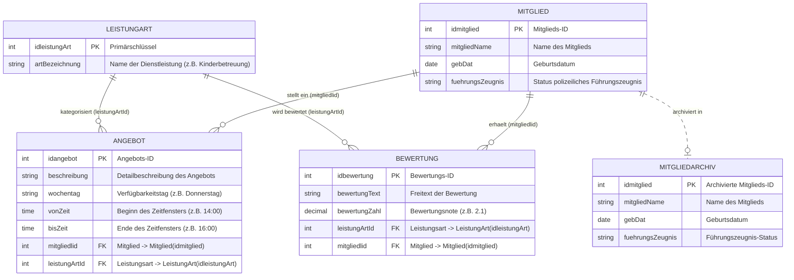
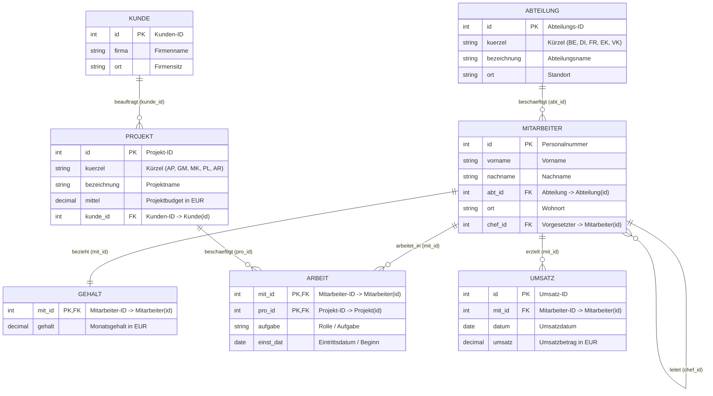
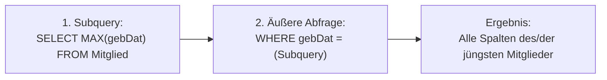
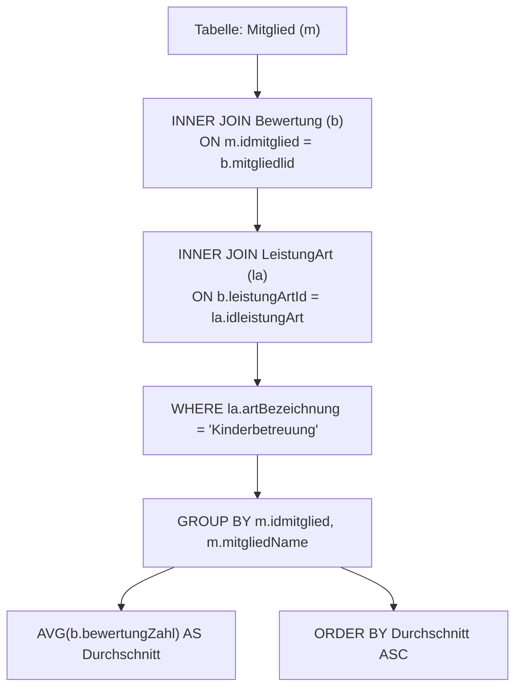
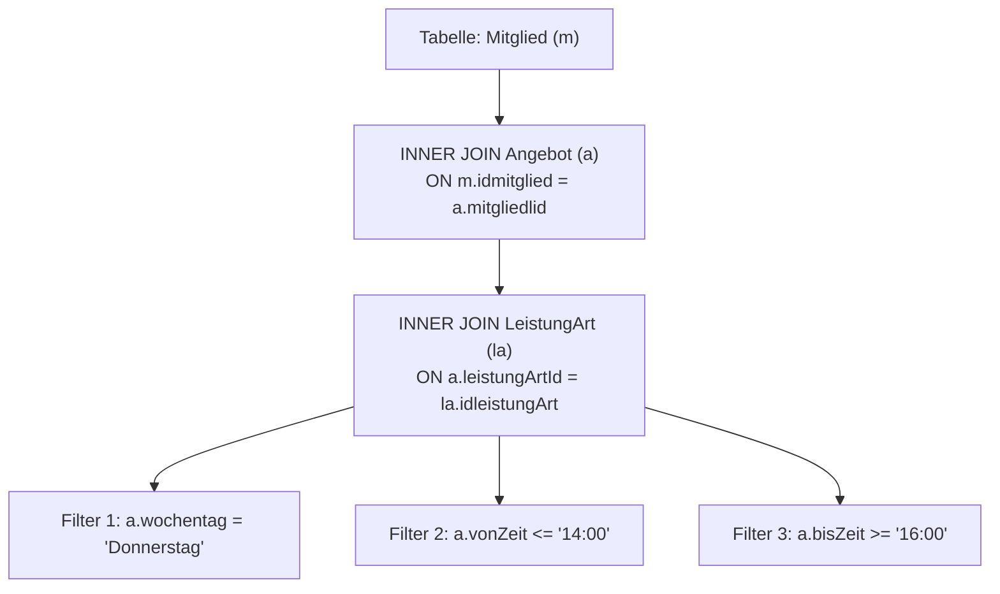
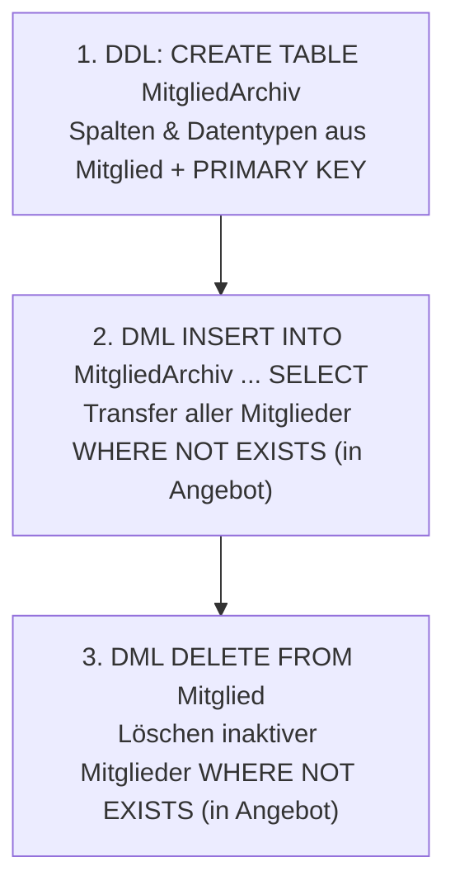
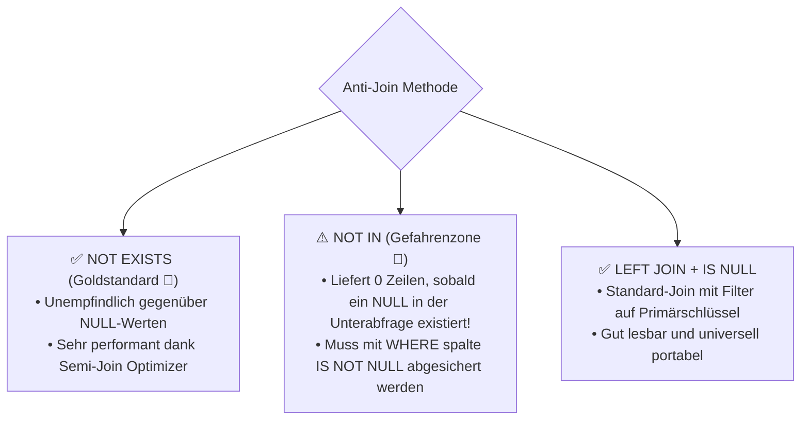
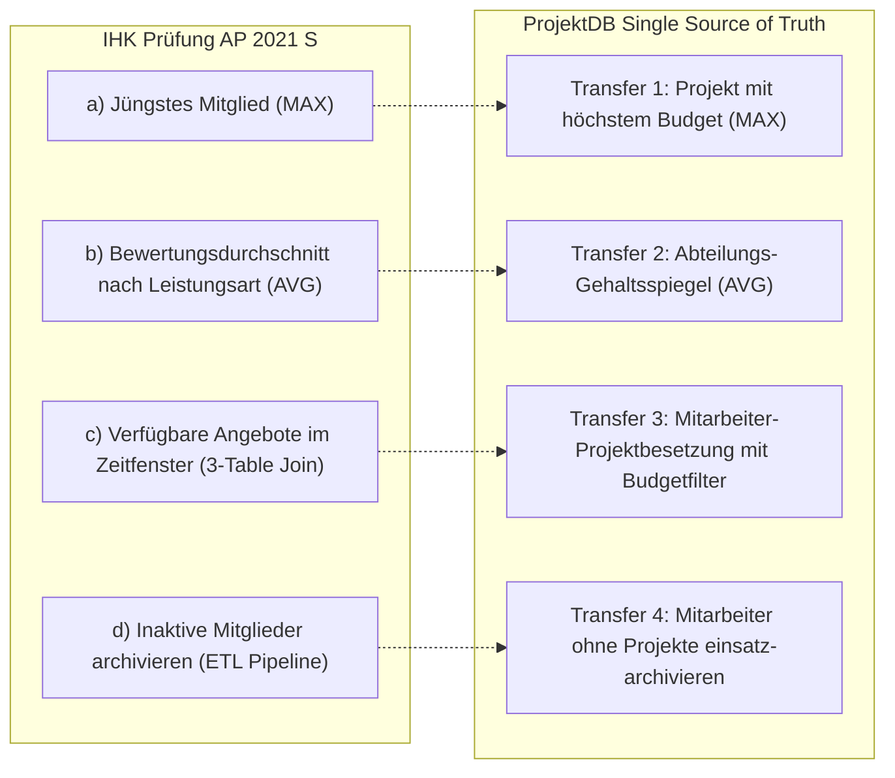

# 📅 Day_22: IHK-Prüfungstraining – Mitgliederbewertung, Vermittlung & Archivierung

## ℹ️ Kurs-Informationen

* **Datum:** Dienstag, 01.09.2026
* **Arbeitszeit:** 08:15 - 16:00 Uhr
* **Dozent:** Tom S.
* **Autor:** Tobias Boyke

---

## 🎯 Lernziele des Tages

- [x] **IHK-Abschlussprüfung Sommer 2021 (GA1, Handlungsschritt 5 – 25 Punkte) meistern:**
  - **Teilaufgabe a (4 Punkte):** Extremwertsuche mit skalarer Subquery (`MAX(gebDat)`) und dem T-SQL Konstrukt `TOP (1) WITH TIES`.
  - **Teilaufgabe b (6 Punkte):** Berechnung von Bewertungsdurchschnitten mittels `AVG()`, Multi-Table-Joins über 3 Relationen (`Mitglied` $\rightarrow$ `Bewertung` $\rightarrow$ `LeistungArt`), Filterung und aufsteigender Sortierung.
  - **Teilaufgabe c (7 Punkte):** Ermittlung verfügbarer Dienstleistungsangebote über Zeitfenster-Filter (`wochentag = 'Donnerstag'`, `vonZeit <= '14:00'`, `bisZeit >= '16:00'`).
  - **Teilaufgabe d (8 Punkte):** Vollständige ETL-Archivierungspipeline (DDL `CREATE TABLE MitgliedArchiv`, DML `INSERT INTO ... SELECT` und bereinigendes `DELETE` inaktiver Datensätze).
- [x] **Anti-Join-Muster & Null-Wert-Fallen in Prüfungen:**
  - `NOT EXISTS` vs. `NOT IN` vs. `LEFT JOIN ... WHERE ... IS NULL`: Verstehen, warum `NOT IN` bei vorhandenen `NULL`-Werten in der Unterabfrage fehlschlägt.
- [x] **Transaktionsmanagement (ACID / TCL):**
  - Kapselung von mehrstufigen Archivierungs- und Löschoperationen in atomare Transaktionen (`BEGIN TRANSACTION`, `COMMIT`, `ROLLBACK` und `TRY...CATCH`).
- [x] **Analytische Erweiterungen & Ranking:**
  - Notenranglisten und Leistungsvergleiche mittels Window Functions (`DENSE_RANK() OVER(PARTITION BY ...)`).
- [x] **Single Source of Truth (`ProjektDB`):**
  - 1:1-Transfer aller 4 IHK-Aufgabentypen auf die kanonische Übungsdatenbank `ProjektDB`.

---

## 🗺️ Relationale Kompasse: Schemata im Überblick

### 1. Relationales Schema der IHK-Abschlussprüfung (AP 2021 S GA1 HS5)

Das folgende Entity-Relationship-Diagramm bildet die Prüfungsdatenbank zur Dienstleistungsvermittlung und Mitgliederbewertung exakt ab:



---

### 2. Single Source of Truth (`ProjektDB`)

Als verbindliche Referenzdatenbank für alle Enterprise-Transfers gilt das kanonische Schema der **`ProjektDB`**:



---

## 📝 Ausarbeitung der IHK-Abschlussprüfung (25 Punkte)

Quelle: [`assets/AP 2021 S GA1 HS5 SQL Mitgliederbewertung - Aufgabe.pdf`](file:///c:/Users/Tobia/Desktop/cSharpRepo/SQL-Fundamentals/Day_22/assets/AP%202021%20S%20GA1%20HS5%20SQL%20Mitgliederbewertung%20-%20Aufgabe.pdf)

---

### 📂 Aufgabe a) Jüngstes Mitglied ermitteln (4 Punkte)

* **Aufgabenstellung:** Geben Sie alle Attribute des jüngsten Mitglieds aus.
* **Hintergrund:** Das „jüngste Mitglied“ besitzt das chronologisch späteste bzw. **größte Geburtsdatum** (`MAX(gebDat)`).



#### 🔹 IHK-Musterlösung (Aufgabe a)

```sql
SELECT idmitglied,
       mitgliedName,
       gebDat,
       fuehrungsZeugnis
FROM Mitglied
WHERE gebDat = (
    SELECT MAX(gebDat) 
    FROM Mitglied
);
```

#### 🔹 Alternative T-SQL Lösung (mit Berücksichtigung von Gleichständen)

```sql
SELECT TOP (1) WITH TIES 
       idmitglied,
       mitgliedName,
       gebDat,
       fuehrungsZeugnis
FROM Mitglied
ORDER BY gebDat DESC;
```

> [!CAUTION]
> **Typische Prüfungsfalle:**  
> Verwenden Sie bei `ORDER BY gebDat DESC` im Standard-SQL **nicht** einfach `LIMIT 1` bzw. `TOP 1` ohne `WITH TIES`, falls am selben Tag mehrere Mitglieder geboren wurden. Die Subquery-Lösung mit `WHERE gebDat = (SELECT MAX(gebDat)...)` ist prüfungstechnisch am sichersten und liefert alle gleichaltrigen jüngsten Mitglieder.

#### 📊 IHK-Bewertungsmatrix (Aufgabe a – 4 Punkte)

| Prüfungskriterium | Vergebene Punkte |
| :--- | :---: |
| Unterabfrage zur Ermittlung des maximalen Geburtsdatums (`MAX(gebDat)`) | **2 Punkte** |
| Hauptabfrage mit Selektion aller Attribute und korrektem `WHERE`-Filter | **2 Punkte** |

---

### 📂 Aufgabe b) Notendurchschnitte für „Kinderbetreuung“ (6 Punkte)

* **Aufgabenstellung:** Ermitteln Sie eine Mitgliederliste aufsteigend sortiert nach der durchschnittlichen Bewertung für die Leistungsart „Kinderbetreuung“.
* **Erwartete Beispielausgabe:**
  ```text
  idmitglied | mitgliedName | Durchschnitt
  3          | Müller       | 2.1
  2          | Maier        | 3.0
  25         | Spielmann    | 4.5
  ```



#### 🔹 IHK-Musterlösung (Aufgabe b)

```sql
SELECT m.idmitglied,
       m.mitgliedName,
       CAST(AVG(b.bewertungZahl) AS DECIMAL(3, 1)) AS Durchschnitt
FROM Mitglied AS m
INNER JOIN Bewertung AS b 
    ON m.idmitglied = b.mitgliedlid
INNER JOIN LeistungArt AS la 
    ON b.leistungArtId = la.idleistungArt
WHERE la.artBezeichnung = 'Kinderbetreuung'
GROUP BY m.idmitglied, m.mitgliedName
ORDER BY Durchschnitt ASC;
```

> [!IMPORTANT]
> **GROUP BY Regel:**  
> Alle Spalten in der `SELECT`-Klausel, die nicht Teil einer Aggregatfunktion (`AVG`) sind, müssen zwingend in der `GROUP BY`-Klausel aufgeführt werden (`m.idmitglied, m.mitgliedName`).

#### 📊 IHK-Bewertungsmatrix (Aufgabe b – 6 Punkte)

| Prüfungskriterium | Vergebene Punkte |
| :--- | :---: |
| Korrekte Tabellenverknüpfungen (`Mitglied` $\rightarrow$ `Bewertung` $\rightarrow$ `LeistungArt`) | **2 Punkte** |
| Filterbedingung auf die Leistungsart `'Kinderbetreuung'` | **1 Punkt** |
| Aggregation mit `AVG(bewertungZahl)` und vollständiges `GROUP BY` | **2 Punkte** |
| Aufsteigende Sortierung nach dem berechneten Durchschnittswert | **1 Punkt** |

---

### 📂 Aufgabe c) Verfügbare Angebote donnerstags (7 Punkte)

* **Aufgabenstellung:** Erstellen Sie eine Angebotsliste, die alle Mitglieder und die entsprechende Leistungsart des Angebots ausgibt, welche donnerstags von 14:00 Uhr bis 16:00 Uhr zur Verfügung stehen.
* **Erwartete Beispielausgabe:**
  ```text
  idMitglied | mitgliedName | artBezeichnung   | wochentag   | vonZeit | bisZeit
  4          | Hauser       | Gartenarbeit     | Donnerstag  | 14:00   | 16:00
  4          | Hauser       | Hausarbeit       | Donnerstag  | 14:00   | 16:00
  2          | Maier        | Kinderbetreuung  | Donnerstag  | 14:00   | 16:00
  ```



#### 🔹 IHK-Musterlösung (Aufgabe c)

```sql
SELECT m.idmitglied,
       m.mitgliedName,
       la.artBezeichnung,
       a.wochentag,
       a.vonZeit,
       a.bisZeit
FROM Mitglied AS m
INNER JOIN Angebot AS a 
    ON m.idmitglied = a.mitgliedlid
INNER JOIN LeistungArt AS la 
    ON a.leistungArtId = la.idleistungArt
WHERE a.wochentag = 'Donnerstag'
  AND a.vonZeit <= '14:00'
  AND a.bisZeit >= '16:00';
```

> [!TIP]
> **Zeitintervall-Logik (Verfügbarkeit abdecken):**  
> Ein Mitglied, das von `13:00` bis `17:00` Uhr Zeit hat, steht dem geforderten Zeitfenster von `14:00` bis `16:00` Uhr vollständig zur Verfügung. Daher lautet die korrekte Bedingung: `vonZeit <= '14:00' AND bisZeit >= '16:00'`. (In IHK-Musterlösungen wird teils auch die exakte Gleichheit `vonZeit = '14:00' AND bisZeit = '16:00'` mit voller Punktzahl bewertet).

#### 📊 IHK-Bewertungsmatrix (Aufgabe c – 7 Punkte)

| Prüfungskriterium | Vergebene Punkte |
| :--- | :---: |
| Vollständige Joins über `Mitglied`, `Angebot` und `LeistungArt` | **3 Punkte** |
| Filterung auf Wochentag `'Donnerstag'` | **1 Punkt** |
| Korrekte Zeitfensterfilterung (`vonZeit` und `bisZeit`) | **3 Punkte** |

---

### 📂 Aufgabe d) Datenarchivierung inaktiver Mitglieder (8 Punkte)

* **Aufgabenstellung:** Erstellen Sie eine neue Tabelle `MitgliedArchiv`. Transferieren Sie alle Mitglieder, die kein Angebot eingestellt haben, in diese Tabelle. Löschen Sie diese inaktiven Mitglieder aus der Tabelle `Mitglied`.



#### 🔹 IHK-Musterlösung (Aufgabe d)

```sql
-- 1. DDL: Archivtabelle anlegen (3 Punkte)
CREATE TABLE MitgliedArchiv (
    idmitglied INT NOT NULL,
    mitgliedName VARCHAR(50) NOT NULL,
    gebDat DATE NOT NULL,
    fuehrungsZeugnis VARCHAR(50) NULL,
    CONSTRAINT pk_MitgliedArchiv PRIMARY KEY (idmitglied)
);

-- 2. DML: Transfer der inaktiven Mitglieder (3 Punkte)
INSERT INTO MitgliedArchiv (idmitglied, mitgliedName, gebDat, fuehrungsZeugnis)
SELECT m.idmitglied,
       m.mitgliedName,
       m.gebDat,
       m.fuehrungsZeugnis
FROM Mitglied AS m
WHERE NOT EXISTS (
    SELECT 1 
    FROM Angebot AS a 
    WHERE a.mitgliedlid = m.idmitglied
);

-- 3. DML: Bereinigung der Quelltabelle (2 Punkte)
DELETE FROM Mitglied
WHERE NOT EXISTS (
    SELECT 1 
    FROM Angebot AS a 
    WHERE a.mitgliedlid = Mitglied.idmitglied
);
```

#### 📊 IHK-Bewertungsmatrix (Aufgabe d – 8 Punkte)

| Prüfungskriterium | Vergebene Punkte |
| :--- | :---: |
| `CREATE TABLE MitgliedArchiv` mit korrekten Spaltendatentypen und Primärschlüssel | **3 Punkte** |
| `INSERT INTO ... SELECT` mit korrekter Anti-Join-Bedingung (`NOT EXISTS` / `NOT IN`) | **3 Punkte** |
| `DELETE FROM Mitglied` mit korrekter Filterbedingung | **2 Punkte** |

---

## 🔬 Vertiefung & Prüfungs-Tricks

### 1. Der Anti-Join-Vergleich (`NOT EXISTS` vs. `NOT IN` vs. `LEFT JOIN`)



> [!WARNING]
> **Die fatale `NOT IN` NULL-Falle:**  
> Wenn die Unterabfrage `SELECT mitgliedlid FROM Angebot` einen einzigen `NULL`-Wert enthält, ergibt `idmitglied NOT IN (...)` für jede Zeile den Wahrheitswert `UNKNOWN`. Die gesamte Abfrage gibt **0 Zeilen** zurück!  
> **Lösung:** Immer `NOT EXISTS` bevorzugen oder bei `NOT IN` zwingend `WHERE mitgliedlid IS NOT NULL` ergänzen.

---

### 2. Transaktionssicherheit (ACID) bei Datenmigrationen

In professionellen Produktivsystemen dürfen Archivierungs- und Löschschritte niemals getrennt ausgeführt werden, um Datenverlust bei Verbindungsabbrüchen zu verhindern:

```sql
BEGIN TRY
    BEGIN TRANSACTION;

    INSERT INTO MitgliedArchiv (idmitglied, mitgliedName, gebDat, fuehrungsZeugnis)
    SELECT idmitglied, mitgliedName, gebDat, fuehrungsZeugnis
    FROM Mitglied AS m
    WHERE NOT EXISTS (
        SELECT 1 FROM Angebot AS a WHERE a.mitgliedlid = m.idmitglied
    );

    DELETE FROM Mitglied
    WHERE idmitglied IN (SELECT idmitglied FROM MitgliedArchiv);

    COMMIT TRANSACTION;
    PRINT 'Archivierung erfolgreich abgeschlossen.';
END TRY
BEGIN CATCH
    IF @@TRANCOUNT > 0
        ROLLBACK TRANSACTION;
    THROW;
END CATCH;
```

---

## 🏢 Single Source of Truth (`ProjektDB`) Praxistransfer

Die 4 IHK-Prüfungsmuster übertragen auf das Unternehmens-Schema der **`ProjektDB`**:



### 1. Transfer Aufgabe a: Projekt mit maximalem Budget
```sql
SELECT id, bezeichnung, mittel, kunde_id
FROM Projekt
WHERE mittel = (SELECT MAX(mittel) FROM Projekt);
```

### 2. Transfer Aufgabe b: Abteilungs-Gehaltsspiegel
```sql
SELECT a.id AS abt_id,
       a.bezeichnung AS abteilung,
       COUNT(m.id) AS anzahl_mitarbeiter,
       CAST(AVG(g.gehalt) AS DECIMAL(10, 2)) AS durchschnittsgehalt
FROM Abteilung AS a
INNER JOIN Mitarbeiter AS m ON a.id = m.abt_id
INNER JOIN Gehalt AS g ON m.id = g.mit_id
GROUP BY a.id, a.bezeichnung
ORDER BY AVG(g.gehalt) DESC;
```

### 3. Transfer Aufgabe c: Projektbesetzung über 4 Tabellen
```sql
SELECT m.id AS mitarbeiter_id,
       CONCAT(m.vorname, ' ', m.nachname) AS mitarbeiter,
       p.bezeichnung AS projekt,
       k.firma AS auftraggeber,
       ar.aufgabe,
       ar.einst_dat
FROM Mitarbeiter AS m
INNER JOIN Arbeit AS ar ON m.id = ar.mit_id
INNER JOIN Projekt AS p ON ar.pro_id = p.id
INNER JOIN Kunde AS k ON p.kunde_id = k.id
WHERE p.mittel >= 100000.00
  AND ar.einst_dat >= '2019-01-01'
ORDER BY p.mittel DESC, m.nachname ASC;
```

### 4. Transfer Aufgabe d: Archivierung projektloser Mitarbeiter
```sql
-- DDL
CREATE TABLE MitarbeiterArchiv (
    id INT NOT NULL,
    vorname VARCHAR(50) NOT NULL,
    nachname VARCHAR(50) NOT NULL,
    abt_id INT NULL,
    ort VARCHAR(50) NULL,
    chef_id INT NULL,
    archiviertAm DATETIME DEFAULT GETDATE(),
    CONSTRAINT pk_MitarbeiterArchiv PRIMARY KEY (id)
);

-- ETL Transfer
INSERT INTO MitarbeiterArchiv (id, vorname, nachname, abt_id, ort, chef_id)
SELECT m.id, m.vorname, m.nachname, m.abt_id, m.ort, m.chef_id
FROM Mitarbeiter AS m
WHERE NOT EXISTS (
    SELECT 1 FROM Arbeit AS ar WHERE ar.mit_id = m.id
);
```

---

## 🧭 IHK-Prüfungs-Cheat Sheet & Lösungsmatrix

| Aufgabentyp | Typische Formulierung | Lösungsstruktur | Wichtigste Punkte |
| :--- | :--- | :--- | :--- |
| **Extremwertsuche** | *„Geben Sie alle Attribute des jüngsten / teuersten / größten X aus.“* | `WHERE spalte = (SELECT MAX(spalte) FROM Tab)` | Subquery zwingend in Klammern, kein hartcodierter Wert |
| **Gruppierte Durchschnitte** | *„Ermitteln Sie die Liste aufsteigend sortiert nach dem Durchschnitt...“* | `SELECT id, name, AVG(zahl) FROM ... GROUP BY id, name ORDER BY AVG(zahl) ASC` | Alle Non-Aggregatspalten ins `GROUP BY` |
| **Bereichs- & Zeitfilter** | *„...welche am Wochentag X von A bis B zur Verfügung stehen.“* | `WHERE tag = 'X' AND von <= 'A' AND bis >= 'B'` | Auf Intervallabdeckung achten (`<=` Start, `>=` Ende) |
| **ETL & Datenarchivierung** | *„Erstellen Sie Tabelle Archiv, transferieren Sie inaktive X und löschen Sie diese.“* | 1. `CREATE TABLE`<br/>2. `INSERT INTO ... SELECT WHERE NOT EXISTS`<br/>3. `DELETE FROM ... WHERE NOT EXISTS` | Primärschlüssel im `CREATE TABLE`, `NOT EXISTS` für Anti-Join |

---

## 💻 Praktische Skripte & Assets im Projekt

### 📜 SQL-Lösungsskripte (`Day_22/src/`)
* 📜 **IHK AP 2021 S Musterlösung & DDL/DML:** [`src/01_ihk_ap2021_sommer_ga1_hs5_mitgliederbewertung.sql`](file:///c:/Users/Tobia/Desktop/cSharpRepo/SQL-Fundamentals/Day_22/src/01_ihk_ap2021_sommer_ga1_hs5_mitgliederbewertung.sql)
* 📜 **Vertiefung, Transaktionen (TCL) & Anti-Joins:** [`src/02_mitgliederbewertung_vertiefung_und_tuning.sql`](file:///c:/Users/Tobia/Desktop/cSharpRepo/SQL-Fundamentals/Day_22/src/02_mitgliederbewertung_vertiefung_und_tuning.sql)
* 📜 **Single Source of Truth (`ProjektDB`) Transfer:** [`src/03_projektdb_sot_transfer_pruefungslogik.sql`](file:///c:/Users/Tobia/Desktop/cSharpRepo/SQL-Fundamentals/Day_22/src/03_projektdb_sot_transfer_pruefungslogik.sql)

### 📄 Prüfungsunterlagen (`Day_22/assets/`)
* 📄 **Original IHK-Prüfungsaufgabe (PDF):** [`assets/AP 2021 S GA1 HS5 SQL Mitgliederbewertung - Aufgabe.pdf`](file:///c:/Users/Tobia/Desktop/cSharpRepo/SQL-Fundamentals/Day_22/assets/AP%202021%20S%20GA1%20HS5%20SQL%20Mitgliederbewertung%20-%20Aufgabe.pdf)