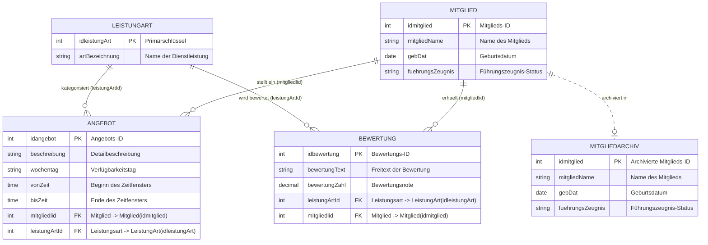
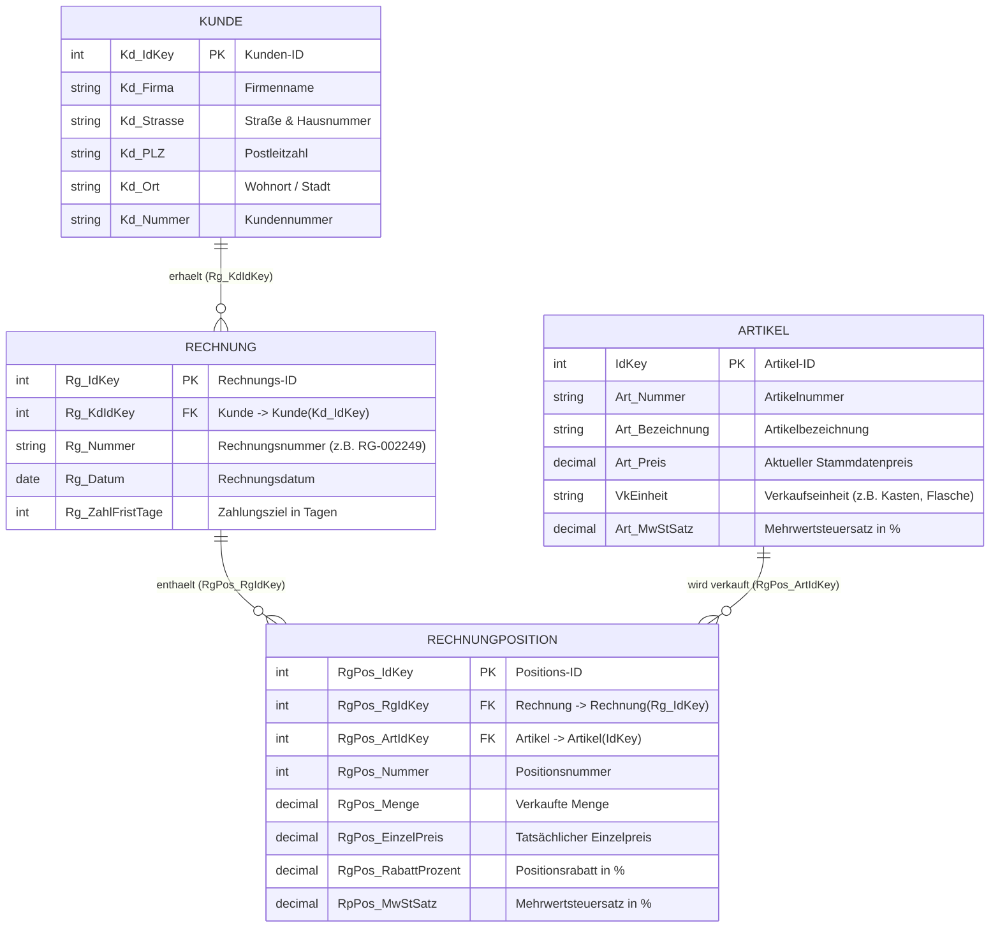
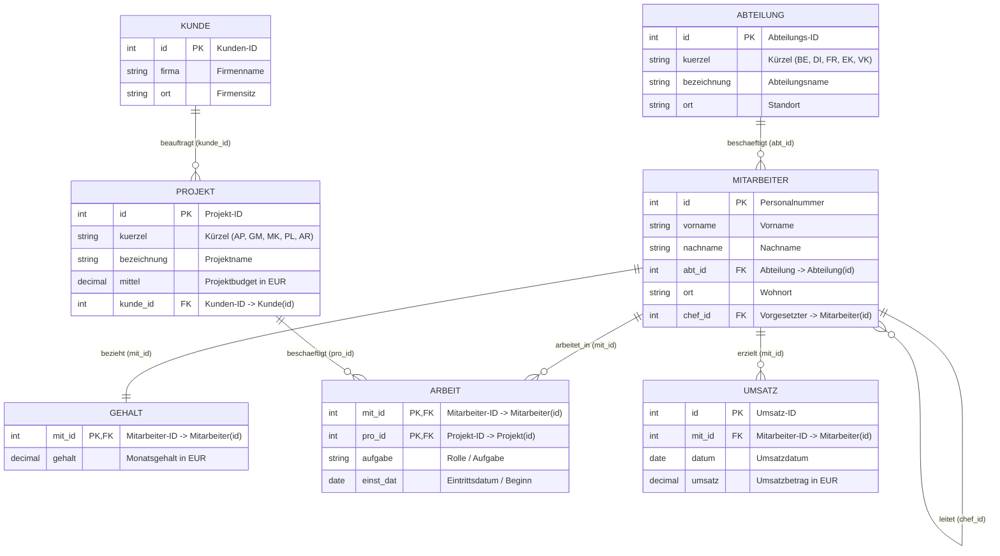
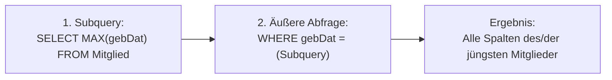
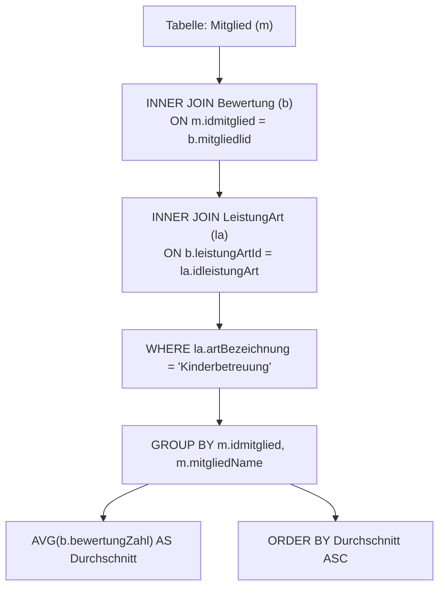
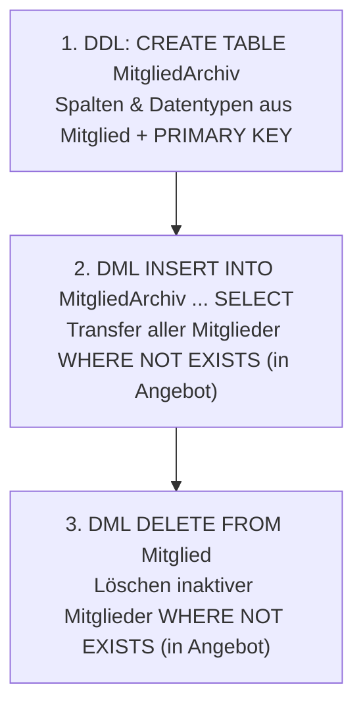
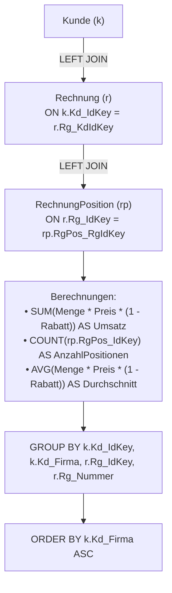
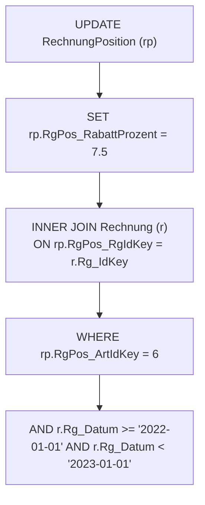
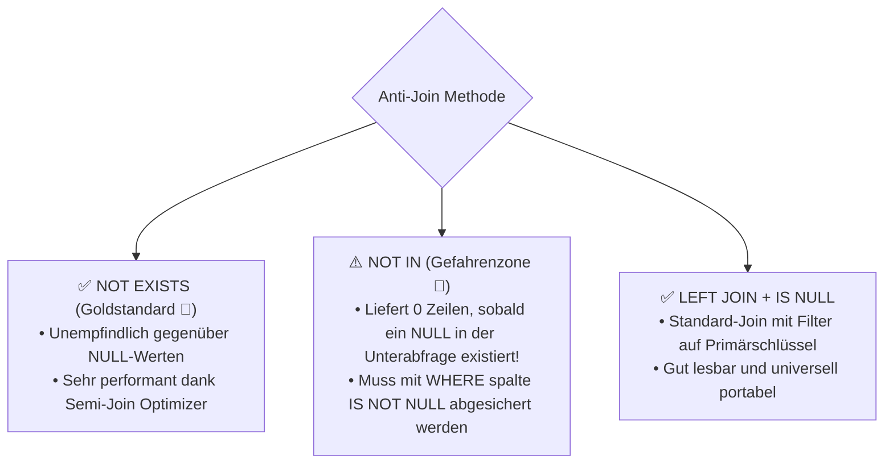
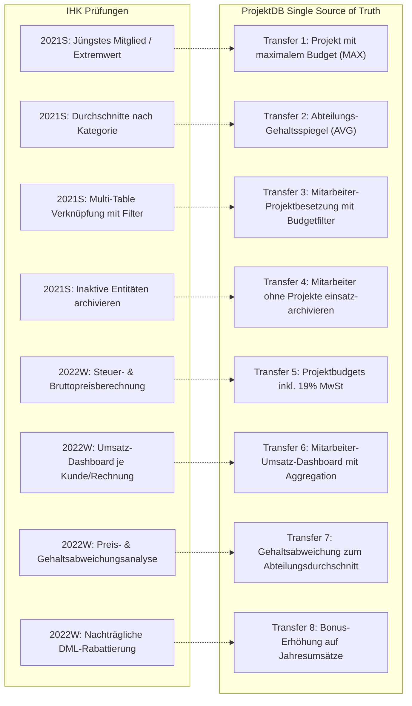

# 📅 Day_22: IHK-Prüfungstraining – Mitgliederbewertung & Rechnungserstellung

## ℹ️ Kurs-Informationen

* **Datum:** Dienstag, 01.09.2026
* **Arbeitszeit:** 08:15 - 16:00 Uhr
* **Dozent:** Tom S.
* **Autor:** Tobias Boyke

---

## 🎯 Lernziele des Tages

- [x] **IHK-Abschlussprüfung 1: Sommer 2021 (GA1, Handlungsschritt 5 – 25 Punkte) meistern:**
  - **Teilaufgabe a (4 Punkte):** Extremwertsuche mit skalarer Subquery (`MAX(gebDat)`) und dem T-SQL Konstrukt `TOP (1) WITH TIES`.
  - **Teilaufgabe b (6 Punkte):** Berechnung von Bewertungsdurchschnitten mittels `AVG()`, Multi-Table-Joins über 3 Relationen (`Mitglied` $\rightarrow$ `Bewertung` $\rightarrow$ `LeistungArt`), Filterung und aufsteigender Sortierung.
  - **Teilaufgabe c (7 Punkte):** Ermittlung verfügbarer Dienstleistungsangebote über Zeitfenster-Filter (`wochentag = 'Donnerstag'`, `vonZeit <= '14:00'`, `bisZeit >= '16:00'`).
  - **Teilaufgabe d (8 Punkte):** Vollständige ETL-Archivierungspipeline (DDL `CREATE TABLE MitgliedArchiv`, DML `INSERT INTO ... SELECT` und bereinigendes `DELETE` inaktiver Datensätze).
- [x] **IHK-Abschlussprüfung 2: Winter 2022/2023 (GA1, Handlungsschritt 5 – 25 Punkte) meistern:**
  - **Teilaufgabe a (3 Punkte):** Mathematische Berechnungen im `SELECT` (Bruttopreis aus Nettopreis und Mehrwertsteuersatz $\text{Art\_Preis} \cdot (1 + \text{MwSt} / 100)$).
  - **Teilaufgabe b (10 Punkte):** Komplexe Umsatzaggregation je Kunde und Rechnung (`SUM(Menge * Einzelpreis * (1 - Rabatt/100))`), Positionszählung (`COUNT`), Durchschnitt (`AVG`) und `LEFT JOIN`-Verkettung.
  - **Teilaufgabe c (8 Punkte):** Abweichungsanalyse zwischen Stammdatenpreis und tatsächlichem Rechnungspositionspreis (`WHERE rp.RgPos_EinzelPreis <> a.Art_Preis`) mit Differenzberechnung.
  - **Teilaufgabe d (4 Punkte):** Gezielte Massendatenaktualisierung (`UPDATE`) über Tabellen-Joins bzw. Subqueries mit kombinierten Artikel- und Jahresfiltern (`YEAR(Rg_Datum) = 2022`).
- [x] **Anti-Join-Muster & Null-Wert-Fallen in Prüfungen:**
  - `NOT EXISTS` vs. `NOT IN` vs. `LEFT JOIN ... WHERE ... IS NULL`: Verstehen, warum `NOT IN` bei vorhandenen `NULL`-Werten in der Unterabfrage fehlschlägt.
- [x] **Transaktionsmanagement (ACID / TCL):**
  - Kapselung von mehrstufigen Archivierungs- und Updateoperationen in atomare Transaktionen (`BEGIN TRANSACTION`, `COMMIT`, `ROLLBACK` und `TRY...CATCH`).
- [x] **Single Source of Truth (`ProjektDB`):**
  - 1:1-Transfer aller 8 IHK-Aufgabentypen auf die kanonische Übungsdatenbank `ProjektDB`.

---

## 🗺️ Relationale Kompasse: Schemata im Überblick

### 1. Schema Prüfung 1: Dienstleistungsvermittlung (AP 2021 S GA1 HS5)



---

### 2. Schema Prüfung 2: Rechnungserstellung (AP 2022 W GA1 HS5)



---

### 3. Single Source of Truth (`ProjektDB`)

Als verbindliche Referenzdatenbank für alle Enterprise-Transfers gilt das kanonische Schema der **`ProjektDB`**:



---

## 📝 Prüfung 1: AP 2021 S GA1 HS5 (Mitgliederbewertung – 25 Punkte)

Quellen:
* Aufgabenblatt: [`assets/AP 2021 S GA1 HS5 SQL Mitgliederbewertung - Aufgabe.pdf`](file:///c:/Users/Tobia/Desktop/cSharpRepo/SQL-Fundamentals/Day_22/assets/AP%202021%20S%20GA1%20HS5%20SQL%20Mitgliederbewertung%20-%20Aufgabe.pdf)
* Offizielle Lösung: [`assets/AP 2021 S GA1 HS5 SQL Mitgliederbewertung - Lösung.pdf`](file:///c:/Users/Tobia/Desktop/cSharpRepo/SQL-Fundamentals/Day_22/assets/AP%202021%20S%20GA1%20HS5%20SQL%20Mitgliederbewertung%20-%20L%C3%B6sung.pdf)

---

### 📂 Aufgabe 1.a) Jüngstes Mitglied ermitteln (4 Punkte)

* **Aufgabenstellung:** Geben Sie alle Attribute des jüngsten Mitglieds aus.
* **Hintergrund:** Das „jüngste Mitglied“ besitzt das chronologisch späteste bzw. **größte Geburtsdatum** (`MAX(gebDat)`).



#### 🔹 IHK-Musterlösung (Aufgabe 1.a)

```sql
SELECT idmitglied,
       mitgliedName,
       gebDat,
       fuehrungsZeugnis
FROM Mitglied
WHERE gebDat = (
    SELECT MAX(gebDat) 
    FROM Mitglied
);
```

#### 🔹 Alternative T-SQL Lösung (mit Gleichstand-Unterstützung)

```sql
SELECT TOP (1) WITH TIES 
       idmitglied,
       mitgliedName,
       gebDat,
       fuehrungsZeugnis
FROM Mitglied
ORDER BY gebDat DESC;
```

> [!CAUTION]
> **Typische Prüfungsfalle:**  
> Verwenden Sie bei `ORDER BY gebDat DESC` im Standard-SQL **nicht** einfach `LIMIT 1` bzw. `TOP 1` ohne `WITH TIES`, falls am selben Tag mehrere Mitglieder geboren wurden. Die Subquery-Lösung mit `WHERE gebDat = (SELECT MAX(gebDat)...)` ist prüfungstechnisch am sichersten.

#### 📊 IHK-Bewertungsmatrix (Aufgabe 1.a – 4 Punkte)

| Prüfungskriterium | Vergebene Punkte |
| :--- | :---: |
| Unterabfrage zur Ermittlung des maximalen Geburtsdatums (`MAX(gebDat)`) | **2 Punkte** |
| Hauptabfrage mit Selektion aller Attribute und korrektem `WHERE`-Filter | **2 Punkte** |

---

### 📂 Aufgabe 1.b) Notendurchschnitte für „Kinderbetreuung“ (6 Punkte)

* **Aufgabenstellung:** Ermitteln Sie eine Mitgliederliste aufsteigend sortiert nach der durchschnittlichen Bewertung für die Leistungsart „Kinderbetreuung“.
* **Erwartete Beispielausgabe:**
  ```text
  idmitglied | mitgliedName | Durchschnitt
  3          | Müller       | 2.1
  2          | Maier        | 3.0
  25         | Spielmann    | 4.5
  ```



#### 🔹 IHK-Musterlösung (Aufgabe 1.b)

```sql
SELECT m.idmitglied,
       m.mitgliedName,
       CAST(AVG(b.bewertungZahl) AS DECIMAL(3, 1)) AS Durchschnitt
FROM Mitglied AS m
INNER JOIN Bewertung AS b 
    ON m.idmitglied = b.mitgliedlid
INNER JOIN LeistungArt AS la 
    ON b.leistungArtId = la.idleistungArt
WHERE la.artBezeichnung = 'Kinderbetreuung'
GROUP BY m.idmitglied, m.mitgliedName
ORDER BY Durchschnitt ASC;
```

#### 📊 IHK-Bewertungsmatrix (Aufgabe 1.b – 6 Punkte)

| Prüfungskriterium | Vergebene Punkte |
| :--- | :---: |
| Korrekte Tabellenverknüpfungen (`Mitglied` $\rightarrow$ `Bewertung` $\rightarrow$ `LeistungArt`) | **2 Punkte** |
| Filterbedingung auf die Leistungsart `'Kinderbetreuung'` | **1 Punkt** |
| Aggregation mit `AVG(bewertungZahl)` und vollständiges `GROUP BY` | **2 Punkte** |
| Aufsteigende Sortierung nach dem berechneten Durchschnittswert | **1 Punkt** |

---

### 📂 Aufgabe 1.c) Verfügbare Angebote donnerstags (7 Punkte)

* **Aufgabenstellung:** Erstellen Sie eine Angebotsliste, die alle Mitglieder und die entsprechende Leistungsart des Angebots ausgibt, welche donnerstags von 14:00 Uhr bis 16:00 Uhr zur Verfügung stehen.
* **Erwartete Beispielausgabe:**
  ```text
  idMitglied | mitgliedName | artBezeichnung   | wochentag   | vonZeit | bisZeit
  4          | Hauser       | Gartenarbeit     | Donnerstag  | 14:00   | 16:00
  4          | Hauser       | Hausarbeit       | Donnerstag  | 14:00   | 16:00
  2          | Maier        | Kinderbetreuung  | Donnerstag  | 14:00   | 16:00
  ```

#### 🔹 IHK-Musterlösung (Aufgabe 1.c)

```sql
SELECT m.idmitglied,
       m.mitgliedName,
       la.artBezeichnung,
       a.wochentag,
       a.vonZeit,
       a.bisZeit
FROM Mitglied AS m
INNER JOIN Angebot AS a 
    ON m.idmitglied = a.mitgliedlid
INNER JOIN LeistungArt AS la 
    ON a.leistungArtId = la.idleistungArt
WHERE a.wochentag = 'Donnerstag'
  AND a.vonZeit <= '14:00'
  AND a.bisZeit >= '16:00';
```

#### 📊 IHK-Bewertungsmatrix (Aufgabe 1.c – 7 Punkte)

| Prüfungskriterium | Vergebene Punkte |
| :--- | :---: |
| Vollständige Joins über `Mitglied`, `Angebot` und `LeistungArt` | **3 Punkte** |
| Filterung auf Wochentag `'Donnerstag'` | **1 Punkt** |
| Korrekte Zeitfensterfilterung (`vonZeit` und `bisZeit`) | **3 Punkte** |

---

### 📂 Aufgabe 1.d) Datenarchivierung inaktiver Mitglieder (8 Punkte)

* **Aufgabenstellung:** Erstellen Sie eine neue Tabelle `MitgliedArchiv`. Transferieren Sie alle Mitglieder, die kein Angebot eingestellt haben, in diese Tabelle. Löschen Sie diese inaktiven Mitglieder aus der Tabelle `Mitglied`.



#### 🔹 IHK-Musterlösung (Aufgabe 1.d)

```sql
-- 1. DDL: Archivtabelle anlegen (3 Punkte)
CREATE TABLE MitgliedArchiv (
    idmitglied INT NOT NULL,
    mitgliedName VARCHAR(50) NOT NULL,
    gebDat DATE NOT NULL,
    fuehrungsZeugnis VARCHAR(50) NULL,
    CONSTRAINT pk_MitgliedArchiv PRIMARY KEY (idmitglied)
);

-- 2. DML: Transfer der inaktiven Mitglieder (3 Punkte)
INSERT INTO MitgliedArchiv (idmitglied, mitgliedName, gebDat, fuehrungsZeugnis)
SELECT m.idmitglied,
       m.mitgliedName,
       m.gebDat,
       m.fuehrungsZeugnis
FROM Mitglied AS m
WHERE NOT EXISTS (
    SELECT 1 
    FROM Angebot AS a 
    WHERE a.mitgliedlid = m.idmitglied
);

-- 3. DML: Bereinigung der Quelltabelle (2 Punkte)
DELETE FROM Mitglied
WHERE NOT EXISTS (
    SELECT 1 
    FROM Angebot AS a 
    WHERE a.mitgliedlid = Mitglied.idmitglied
);
```

#### 📊 IHK-Bewertungsmatrix (Aufgabe 1.d – 8 Punkte)

| Prüfungskriterium | Vergebene Punkte |
| :--- | :---: |
| `CREATE TABLE MitgliedArchiv` mit korrekten Spaltendatentypen und Primärschlüssel | **3 Punkte** |
| `INSERT INTO ... SELECT` mit korrekter Anti-Join-Bedingung (`NOT EXISTS` / `NOT IN`) | **3 Punkte** |
| `DELETE FROM Mitglied` mit korrekter Filterbedingung | **2 Punkte** |

---

## 📝 Prüfung 2: AP 2022 W GA1 HS5 (Rechnungserstellung – 25 Punkte)

Quelle: [`assets/AP 2022 W GA1 HS5 SQL Rechnungserstellung - Aufgabe.pdf`](file:///c:/Users/Tobia/Desktop/cSharpRepo/SQL-Fundamentals/Day_22/assets/AP%202022%20W%20GA1%20HS5%20SQL%20Rechnungserstellung%20-%20Aufgabe.pdf)

---

### 📂 Aufgabe 2.a) Bruttopreis aller Artikel berechnen (3 Punkte)

* **Aufgabenstellung:** Erstellen Sie eine SQL-Anweisung, mit der Sie alle Artikel mit dem entsprechenden Bruttopreis erhalten.
* **Erwartete Beispielausgabe:**
  ```text
  Art_IdKey | Art_Nummer | Art_Bezeichnung | Art_Preis | Art_MwStSatz | BruttoPreis
  1         | BK1221     | Unterhopf       | 14.30     | 19.00        | 17.017000
  2         | BK1229     | Frühes          | 13.80     | 19.00        | 16.422000
  3         | BK1233     | Pilschen        | 15.40     | 19.00        | 18.326000
  4         | BB0088     | Birnenbrand     | 9.60      | 19.00        | 11.424000
  ```
* **Mathematische Formel:**

$$\text{BruttoPreis} = \text{Art\_Preis} \cdot \left(1 + \frac{\text{Art\_MwStSatz}}{100}\right)$$

#### 🔹 IHK-Musterlösung (Aufgabe 2.a)

```sql
SELECT IdKey AS Art_IdKey,
       Art_Nummer,
       Art_Bezeichnung,
       Art_Preis,
       Art_MwStSatz,
       Art_Preis * (1.0 + Art_MwStSatz / 100.0) AS BruttoPreis
FROM Artikel;
```

#### 📊 IHK-Bewertungsmatrix (Aufgabe 2.a – 3 Punkte)

| Prüfungskriterium | Vergebene Punkte |
| :--- | :---: |
| Korrekte Selektion aller geforderten Artikelattribute | **1 Punkt** |
| Richtige mathematische Formel zur Mehrwertsteuer- und Bruttopreisberechnung | **2 Punkte** |

---

### 📂 Aufgabe 2.b) Rechnungs-Umsatz, Positionen & Durchschnitt je Kunde (10 Punkte)

* **Aufgabenstellung:** Erstellen Sie eine SQL-Anweisung, mit der Sie alle Kunden, die dazugehörigen Rechnungen, den Umsatz je Rechnung sowie die Anzahl der Rechnungspositionen und den durchschnittlichen Wert der Rechnung erhalten. Die Sortierung soll aufsteigend nach `Kd_Firma` vorgenommen werden.
* **Erwartete Beispielausgabe:**
  ```text
  KdId | Firma             | Rechnungsnummer | Umsatz   | AnzahlPositionen | Durchschnitt
  4    | Brauhaus Brömle   | RG-002256       | 57.60    | 1                | 57.600000
  4    | Brauhaus Brömle   | RG-002257       | 1251.00  | 7                | 178.714285
  2    | Gasthaus 'Die Perle' | RG-002249    | 383.60   | 4                | 95.900000
  1    | LikeLimo          | RG-002252       | 261.00   | 3                | 87.000000
  1    | LikeLimo          | RG-002255       | 442.20   | 2                | 221.100000
  ```

* **Berechnungslogik je Position:**

$$\text{PosBetrag} = \text{Menge} \cdot \text{Einzelpreis} \cdot \left(1 - \frac{\text{RabattProzent}}{100}\right)$$



#### 🔹 IHK-Musterlösung (Aufgabe 2.b)

```sql
SELECT k.Kd_IdKey AS KdId,
       k.Kd_Firma AS Firma,
       r.Rg_Nummer AS Rechnungsnummer,
       COALESCE(SUM(rp.RgPos_Menge * rp.RgPos_EinzelPreis * (1.0 - rp.RgPos_RabattProzent / 100.0)), 0.00) AS Umsatz,
       COUNT(rp.RgPos_IdKey) AS AnzahlPositionen,
       COALESCE(AVG(rp.RgPos_Menge * rp.RgPos_EinzelPreis * (1.0 - rp.RgPos_RabattProzent / 100.0)), 0.00) AS Durchschnitt
FROM Kunde AS k
LEFT JOIN Rechnung AS r 
    ON k.Kd_IdKey = r.Rg_KdIdKey
LEFT JOIN RechnungPosition AS rp 
    ON r.Rg_IdKey = rp.RgPos_RgIdKey
GROUP BY k.Kd_IdKey, k.Kd_Firma, r.Rg_IdKey, r.Rg_Nummer
ORDER BY k.Kd_Firma ASC;
```

#### 📊 IHK-Bewertungsmatrix (Aufgabe 2.b – 10 Punkte)

| Prüfungskriterium | Vergebene Punkte |
| :--- | :---: |
| Joins zwischen `Kunde`, `Rechnung` und `RechnungPosition` (inkl. `LEFT JOIN` Berücksichtigung) | **3 Punkte** |
| Korrekte Umsatzberechnung unter Einbezug von Rabatten (`SUM(...)`) | **3 Punkte** |
| Zählung der Positionen (`COUNT(...)`) und Durchschnittsberechnung (`AVG(...)`) | **2 Punkte** |
| Vollständige `GROUP BY`-Klausel über alle nicht-aggregierten Kunden- und Rechnungsspalten | **1 Punkt** |
| Aufsteigende Sortierung nach Firmenname (`ORDER BY Kd_Firma ASC`) | **1 Punkt** |

---

### 📂 Aufgabe 2.c) Abweichende Verkaufspreise & Differenz (8 Punkte)

* **Aufgabenstellung:** Erstellen Sie eine SQL-Anweisung, mit der Sie alle Artikel mit der zugehörigen Rechnungsnummer erhalten, welche nicht mit dem aktuellen Artikelpreis verkauft wurden. Die Differenz soll mit ausgegeben werden.
* **Erwartete Beispielausgabe:**
  ```text
  Art_IdKey | Art_Nummer | Art_Bezeichnung | Art_Preis | Art_VkEinheit | Rg_Nummer | Differenz
  2         | BK1229     | Frühes          | 13.80     | Kasten        | RG-002249 | -1.00
  1         | BK1221     | Unterhopf       | 14.30     | Kasten        | RG-002249 | -1.00
  ```

#### 🔹 IHK-Musterlösung (Aufgabe 2.c)

```sql
SELECT a.IdKey AS Art_IdKey,
       a.Art_Nummer,
       a.Art_Bezeichnung,
       a.Art_Preis,
       a.VkEinheit AS Art_VkEinheit,
       r.Rg_Nummer,
       (rp.RgPos_EinzelPreis - a.Art_Preis) AS Differenz
FROM Artikel AS a
INNER JOIN RechnungPosition AS rp 
    ON a.IdKey = rp.RgPos_ArtIdKey
INNER JOIN Rechnung AS r 
    ON rp.RgPos_RgIdKey = r.Rg_IdKey
WHERE rp.RgPos_EinzelPreis <> a.Art_Preis;
```

#### 📊 IHK-Bewertungsmatrix (Aufgabe 2.c – 8 Punkte)

| Prüfungskriterium | Vergebene Punkte |
| :--- | :---: |
| Joins zwischen `Artikel`, `RechnungPosition` und `Rechnung` | **3 Punkte** |
| Filterbedingung auf ungleiche Preise (`rp.RgPos_EinzelPreis <> a.Art_Preis`) | **2 Punkte** |
| Korrekte Differenzberechnung `(RgPos_EinzelPreis - Art_Preis)` | **2 Punkte** |
| Selektion aller geforderten Ergebnisspalten | **1 Punkt** |

---

### 📂 Aufgabe 2.d) Nachträgliche Rabattierung im Jahr 2022 (4 Punkte)

* **Aufgabenstellung:** Erstellen Sie eine SQL-Anweisung, mit der Sie alle Rechnungspositionen des Artikels mit der `Art_IdKey = 6` aus dem Rechnungsjahr 2022 nachträglich mit einem Rabatt von 7,5 % versehen.



#### 🔹 IHK-Musterlösung (Aufgabe 2.d)

```sql
-- Variante 1: T-SQL UPDATE mit JOIN
UPDATE rp
SET rp.RgPos_RabattProzent = 7.5
FROM RechnungPosition AS rp
INNER JOIN Rechnung AS r 
    ON rp.RgPos_RgIdKey = r.Rg_IdKey
WHERE rp.RgPos_ArtIdKey = 6
  AND r.Rg_Datum >= '2022-01-01' 
  AND r.Rg_Datum < '2023-01-01';

-- Variante 2: ANSI SQL UPDATE mit Subquery
UPDATE RechnungPosition
SET RgPos_RabattProzent = 7.5
WHERE RgPos_ArtIdKey = 6
  AND RgPos_RgIdKey IN (
      SELECT r.Rg_IdKey
      FROM Rechnung AS r
      WHERE r.Rg_Datum >= '2022-01-01' 
        AND r.Rg_Datum < '2023-01-01'
  );
```

#### 📊 IHK-Bewertungsmatrix (Aufgabe 2.d – 4 Punkte)

| Prüfungskriterium | Vergebene Punkte |
| :--- | :---: |
| `UPDATE` auf Tabelle `RechnungPosition` mit Zuweisung `SET RgPos_RabattProzent = 7.5` | **2 Punkte** |
| Korrekter Filter auf Artikel-ID `6` und Datumsfilter auf das Jahr `2022` | **2 Punkte** |

---

## 🔬 Vertiefung & Prüfungs-Tricks

### 1. Der Anti-Join-Vergleich (`NOT EXISTS` vs. `NOT IN` vs. `LEFT JOIN`)



> [!WARNING]
> **Die fatale `NOT IN` NULL-Falle:**  
> Wenn die Unterabfrage `SELECT mitgliedlid FROM Angebot` einen einzigen `NULL`-Wert enthält, ergibt `idmitglied NOT IN (...)` für jede Zeile den Wahrheitswert `UNKNOWN`. Die gesamte Abfrage gibt **0 Zeilen** zurück!  
> **Lösung:** Immer `NOT EXISTS` bevorzugen oder bei `NOT IN` zwingend `WHERE mitgliedlid IS NOT NULL` ergänzen.

---

### 2. Transaktionssicherheit (ACID) bei Datenmigrationen

In professionellen Produktivsystemen dürfen Archivierungs- und Löschschritte niemals getrennt ausgeführt werden, um Datenverlust bei Verbindungsabbrüchen zu verhindern:

```sql
BEGIN TRY
    BEGIN TRANSACTION;

    INSERT INTO MitgliedArchiv (idmitglied, mitgliedName, gebDat, fuehrungsZeugnis)
    SELECT idmitglied, mitgliedName, gebDat, fuehrungsZeugnis
    FROM Mitglied AS m
    WHERE NOT EXISTS (
        SELECT 1 FROM Angebot AS a WHERE a.mitgliedlid = m.idmitglied
    );

    DELETE FROM Mitglied
    WHERE idmitglied IN (SELECT idmitglied FROM MitgliedArchiv);

    COMMIT TRANSACTION;
    PRINT 'Archivierung erfolgreich abgeschlossen.';
END TRY
BEGIN CATCH
    IF @@TRANCOUNT > 0
        ROLLBACK TRANSACTION;
    THROW;
END CATCH;
```

---

## 🏢 Single Source of Truth (`ProjektDB`) Praxistransfer

Die Prüfungsmuster beider IHK-Klausuren übertragen auf das Unternehmens-Schema der **`ProjektDB`**:



### 1. Transfer 1: Projekt mit maximalem Budget
```sql
SELECT id, bezeichnung, mittel, kunde_id
FROM Projekt
WHERE mittel = (SELECT MAX(mittel) FROM Projekt);
```

### 2. Transfer 2: Abteilungs-Gehaltsspiegel
```sql
SELECT a.id AS abt_id,
       a.bezeichnung AS abteilung,
       COUNT(m.id) AS anzahl_mitarbeiter,
       CAST(AVG(g.gehalt) AS DECIMAL(10, 2)) AS durchschnittsgehalt
FROM Abteilung AS a
INNER JOIN Mitarbeiter AS m ON a.id = m.abt_id
INNER JOIN Gehalt AS g ON m.id = g.mit_id
GROUP BY a.id, a.bezeichnung
ORDER BY AVG(g.gehalt) DESC;
```

### 3. Transfer 3: Multi-Table Projektbesetzung mit Zeit- & Budgetfilter
```sql
SELECT m.id AS mitarbeiter_id,
       CONCAT(m.vorname, ' ', m.nachname) AS mitarbeiter,
       p.bezeichnung AS projekt,
       k.firma AS auftraggeber,
       ar.aufgabe,
       ar.einst_dat
FROM Mitarbeiter AS m
INNER JOIN Arbeit AS ar ON m.id = ar.mit_id
INNER JOIN Projekt AS p ON ar.pro_id = p.id
INNER JOIN Kunde AS k ON p.kunde_id = k.id
WHERE p.mittel >= 100000.00
  AND ar.einst_dat >= '2019-01-01'
ORDER BY p.mittel DESC, m.nachname ASC;
```

### 4. Transfer 4: Archivierung projektloser Mitarbeiter
```sql
-- DDL
CREATE TABLE MitarbeiterArchiv (
    id INT NOT NULL,
    vorname VARCHAR(50) NOT NULL,
    nachname VARCHAR(50) NOT NULL,
    abt_id INT NULL,
    ort VARCHAR(50) NULL,
    chef_id INT NULL,
    archiviertAm DATETIME DEFAULT GETDATE(),
    CONSTRAINT pk_MitarbeiterArchiv PRIMARY KEY (id)
);

-- ETL Transfer
INSERT INTO MitarbeiterArchiv (id, vorname, nachname, abt_id, ort, chef_id)
SELECT m.id, m.vorname, m.nachname, m.abt_id, m.ort, m.chef_id
FROM Mitarbeiter AS m
WHERE NOT EXISTS (
    SELECT 1 FROM Arbeit AS ar WHERE ar.mit_id = m.id
);
```

### 5. Transfer 5: Projektbudgets Netto vs. Brutto (19% MwSt)
```sql
SELECT p.id,
       p.kuerzel,
       p.bezeichnung,
       p.mittel AS budget_netto,
       CAST(p.mittel * 1.19 AS DECIMAL(12, 2)) AS budget_brutto
FROM Projekt AS p
ORDER BY p.mittel DESC;
```

### 6. Transfer 6: Mitarbeiter-Umsatz-Dashboard mit Aggregation
```sql
SELECT m.id AS mitarbeiter_id,
       CONCAT(m.vorname, ' ', m.nachname) AS mitarbeiter_name,
       a.bezeichnung AS abteilung,
       COALESCE(SUM(u.umsatz), 0.00) AS gesamtumsatz,
       COUNT(u.id) AS anzahl_umsatzvorgaenge,
       COALESCE(AVG(u.umsatz), 0.00) AS durchschnittlicher_umsatz
FROM Mitarbeiter AS m
INNER JOIN Abteilung AS a ON m.abt_id = a.id
LEFT JOIN Umsatz AS u ON m.id = u.mit_id
GROUP BY m.id, m.vorname, m.nachname, a.bezeichnung
ORDER BY gesamtumsatz DESC;
```

### 7. Transfer 7: Gehaltsabweichung zum Abteilungsdurchschnitt
```sql
WITH AbtSchnitt AS (
    SELECT abt_id, AVG(g.gehalt) AS avg_gehalt_abt
    FROM Mitarbeiter AS m
    INNER JOIN Gehalt AS g ON m.id = g.mit_id
    GROUP BY abt_id
)

SELECT m.id,
       m.nachname,
       a.bezeichnung AS abteilung,
       g.gehalt,
       CAST(s.avg_gehalt_abt AS DECIMAL(10, 2)) AS abt_durchschnitt,
       CAST(g.gehalt - s.avg_gehalt_abt AS DECIMAL(10, 2)) AS differenz
FROM Mitarbeiter AS m
INNER JOIN Abteilung AS a ON m.abt_id = a.id
INNER JOIN Gehalt AS g ON m.id = g.mit_id
INNER JOIN AbtSchnitt AS s ON m.abt_id = s.abt_id
WHERE g.gehalt <> s.avg_gehalt_abt
ORDER BY differenz DESC;
```

### 8. Transfer 8: Nachträgliche DML-Bonusaktualisierung
```sql
BEGIN TRANSACTION;

UPDATE u
SET u.umsatz = u.umsatz * 1.05
FROM Umsatz AS u
INNER JOIN Mitarbeiter AS m ON u.mit_id = m.id
WHERE u.datum >= '2023-01-01' AND u.datum < '2024-01-01';

ROLLBACK TRANSACTION;
```

---

## 🧭 IHK-Prüfungs-Cheat Sheet & Lösungsmatrix

| Aufgabentyp | Typische Formulierung | Lösungsstruktur | Wichtigste Punkte |
| :--- | :--- | :--- | :--- |
| **Extremwertsuche** | *„Geben Sie alle Attribute des jüngsten / teuersten / größten X aus.“* | `WHERE spalte = (SELECT MAX(spalte) FROM Tab)` | Subquery zwingend in Klammern, kein hartcodierter Wert |
| **Gruppierte Durchschnitte** | *„Ermitteln Sie die Liste aufsteigend sortiert nach dem Durchschnitt...“* | `SELECT id, name, AVG(zahl) FROM ... GROUP BY id, name ORDER BY AVG(zahl) ASC` | Alle Non-Aggregatspalten ins `GROUP BY` |
| **Bereichs- & Zeitfilter** | *„...welche am Wochentag X von A bis B zur Verfügung stehen.“* | `WHERE tag = 'X' AND von <= 'A' AND bis >= 'B'` | Auf Intervallabdeckung achten (`<=` Start, `>=` Ende) |
| **ETL & Datenarchivierung** | *„Erstellen Sie Tabelle Archiv, transferieren Sie inaktive X und löschen Sie diese.“* | 1. `CREATE TABLE`<br/>2. `INSERT INTO ... SELECT WHERE NOT EXISTS`<br/>3. `DELETE FROM ... WHERE NOT EXISTS` | Primärschlüssel im `CREATE TABLE`, `NOT EXISTS` für Anti-Join |
| **Preis- & MwSt-Rechnung** | *„...mit dem entsprechenden Bruttopreis erhalten.“* | `SELECT preis * (1 + mwst / 100) AS BruttoPreis` | Dezimaldivision (`/ 100.0`) beachten |
| **Rechnungs-Umsatz & Rabatt**| *„...den Umsatz je Rechnung sowie die Anzahl der Positionen...“* | `SUM(menge * preis * (1 - rabatt/100))` mit `LEFT JOIN` | Rabatt in Abzug bringen, `COUNT(pos_id)` |
| **Preisabweichungsanalyse** | *„...nicht mit dem aktuellen Artikelpreis verkauft wurden.“* | `WHERE rp.EinzelPreis <> a.StammPreis` | Differenz `(rp.EinzelPreis - a.StammPreis)` |
| **Massen-Update mit Join** | *„...Positionen von Artikel X aus Jahr Y mit Rabatt Z versehen.“* | `UPDATE rp SET rp.Rabatt = Z FROM Tab rp INNER JOIN ...` | Vorsicht bei Datumsfiltern (`YEAR()` oder SARGable Bereich) |

---

## 💻 Praktische Skripte & Assets im Projekt

### 📜 SQL-Lösungsskripte (`Day_22/src/`)
* 📜 **IHK AP 2021 S Musterlösung & DDL/DML:** [`src/01_ihk_ap2021_sommer_ga1_hs5_mitgliederbewertung.sql`](file:///c:/Users/Tobia/Desktop/cSharpRepo/SQL-Fundamentals/Day_22/src/01_ihk_ap2021_sommer_ga1_hs5_mitgliederbewertung.sql)
* 📜 **IHK AP 2022 W Musterlösung & DDL/DML:** [`src/02_ihk_ap2022_winter_ga1_hs5_rechnungserstellung.sql`](file:///c:/Users/Tobia/Desktop/cSharpRepo/SQL-Fundamentals/Day_22/src/02_ihk_ap2022_winter_ga1_hs5_rechnungserstellung.sql)
* 📜 **Vertiefung, Transaktionen (TCL) & Anti-Joins:** [`src/03_mitgliederbewertung_vertiefung_und_tuning.sql`](file:///c:/Users/Tobia/Desktop/cSharpRepo/SQL-Fundamentals/Day_22/src/03_mitgliederbewertung_vertiefung_und_tuning.sql)
* 📜 **Single Source of Truth (`ProjektDB`) Transfer:** [`src/04_projektdb_sot_transfer_pruefungslogik.sql`](file:///c:/Users/Tobia/Desktop/cSharpRepo/SQL-Fundamentals/Day_22/src/04_projektdb_sot_transfer_pruefungslogik.sql)

### 📄 Prüfungsunterlagen (`Day_22/assets/`)
* 📄 **IHK AP 2021 S Aufgabe (PDF):** [`assets/AP 2021 S GA1 HS5 SQL Mitgliederbewertung - Aufgabe.pdf`](file:///c:/Users/Tobia/Desktop/cSharpRepo/SQL-Fundamentals/Day_22/assets/AP%202021%20S%20GA1%20HS5%20SQL%20Mitgliederbewertung%20-%20Aufgabe.pdf)
* 📄 **IHK AP 2021 S Offizielle Lösung (PDF):** [`assets/AP 2021 S GA1 HS5 SQL Mitgliederbewertung - Lösung.pdf`](file:///c:/Users/Tobia/Desktop/cSharpRepo/SQL-Fundamentals/Day_22/assets/AP%202021%20S%20GA1%20HS5%20SQL%20Mitgliederbewertung%20-%20L%C3%B6sung.pdf)
* 📄 **IHK AP 2022 W Aufgabe (PDF):** [`assets/AP 2022 W GA1 HS5 SQL Rechnungserstellung - Aufgabe.pdf`](file:///c:/Users/Tobia/Desktop/cSharpRepo/SQL-Fundamentals/Day_22/assets/AP%202022%20W%20GA1%20HS5%20SQL%20Rechnungserstellung%20-%20Aufgabe.pdf)