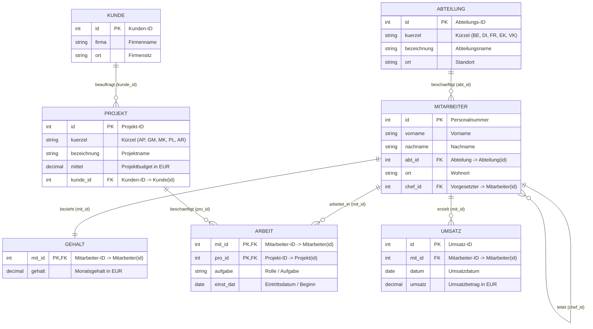
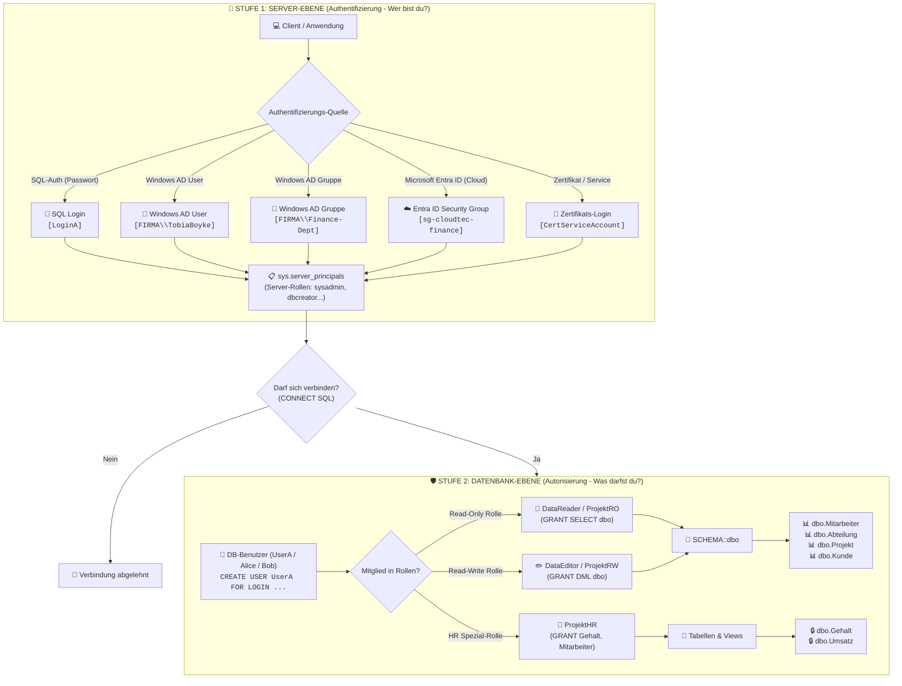
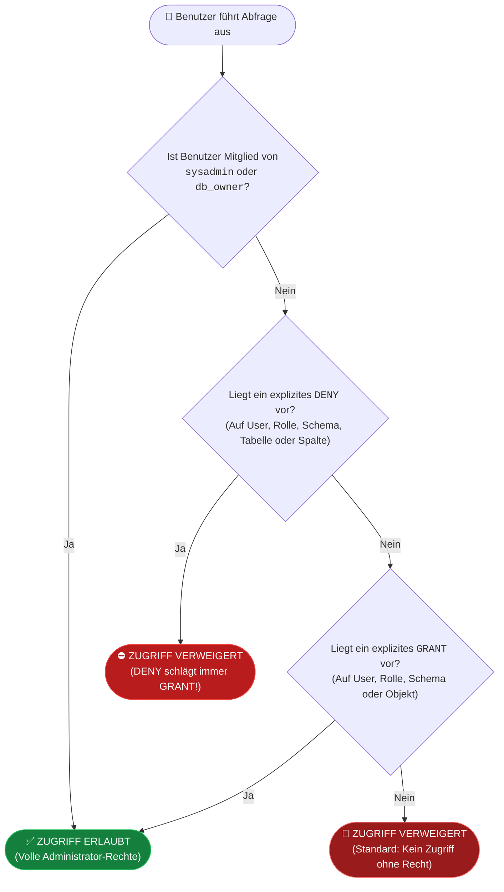
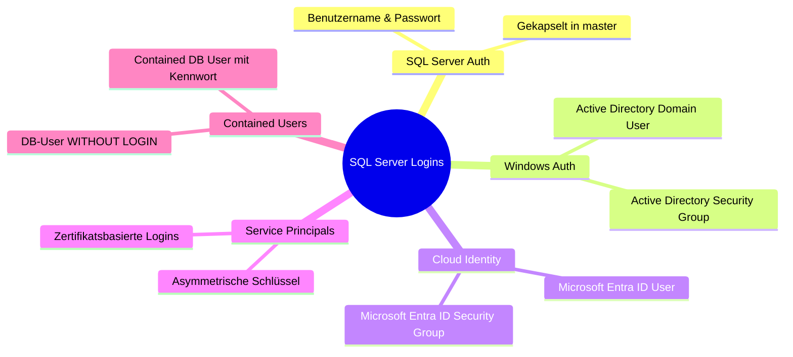
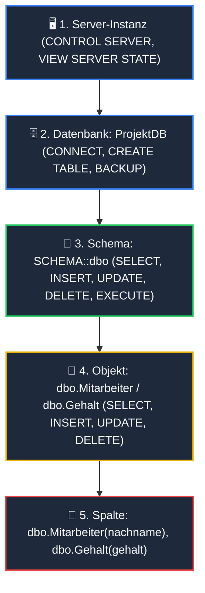
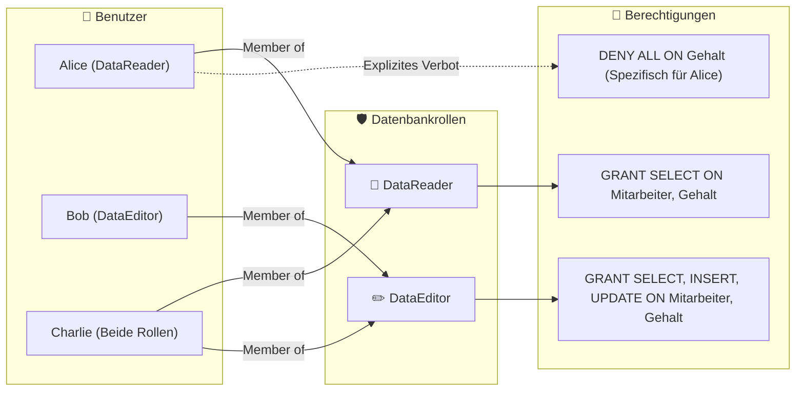

# 📅 Day_23: DCL & SQL Server Sicherheit – Logins, Users, Rollen & Berechtigungshierarchien

## ℹ️ Kurs-Informationen

* **Datum:** Mittwoch, 02.09.2026
* **Arbeitszeit:** 08:15 - 16:00 Uhr
* **Dozent:** Tom S.
* **Autor:** Tobias Boyke

---

## 🎯 Lernziele des Tages

- [x] **Das 2-stufige Sicherheitsmodell von Microsoft SQL Server & moderne Authentifizierung:**
  - **Stufe 1 (Server-Ebene / Authentifizierung):** Server-Logins (`CREATE LOGIN`), Authentifizierungsmodi (*Windows Authentication*, *SQL Server Authentication*, Active Directory Groups, Microsoft Entra ID Cloud-Provider via `EXTERNAL PROVIDER` sowie Zertifikate).
  - **Stufe 2 (Datenbank-Ebene / Autorisierung):** Datenbank-Benutzer (`CREATE USER ... FOR LOGIN ...` bzw. `WITHOUT LOGIN`), Standard-Schemas (`dbo`), Datenbank-Rollen und Zuweisung von Rechten.
- [x] **DCL (Data Control Language) – Die Kernbefehle:**
  - `GRANT`: Explizites Erteilen von Berechtigungen auf Schemas, Tabellen, Views und Prozeduren.
  - `REVOKE`: Zurücknehmen von Rechten in den neutralen Standardzustand (weder erlaubt noch verboten).
  - `DENY`: Explizites Verbieten von Rechten mit absoluter Priorität (*"DENY schlägt immer GRANT"*).
- [x] **Die relationale Berechtigungshierarchie (Securables Hierarchy):**
  - Kaskadierende Berechtigungsvererbung: $\text{Server} \rightarrow \text{Datenbank} \rightarrow \text{Schema} \rightarrow \text{Objekt (Tabelle/View)} \rightarrow \text{Spalte}$.
  - Berechtigungskapselung auf Schema-Ebene (`GRANT SELECT ON SCHEMA::dbo`) und deren automatische Vererbung auf alle enthaltenen Tabellen.
  - Granulare Spaltenberechtigungen (*Column-Level Permissions*) und deren Vor- und Nachteile gegenüber sicherheitskapselnden Sichten.
- [x] **Role-Based Access Control (RBAC) & Rollenverwaltung:**
  - Das Best-Practice-Paradigma: Logins $\rightarrow$ Users $\rightarrow$ Rollen $\rightarrow$ Berechtigungen (Verbot direkter User-Berechtigungen).
  - Erstellung und Pflege benutzerdefinierter Rollen (`DataReader`, `DataEditor`, `ProjektRO`, `ProjektRW`, `ProjektHR`) für die `ProjektDB`.
  - Rollenmitgliedschaften dynamisch verwalten mittels `ALTER ROLE ... ADD MEMBER` und `DROP MEMBER`.
- [x] **Praxis-Workshop: ProjektDB 12 – Rollen & Rechte (Aufgaben 12.1 – 12.4):**
  - Vollständige Modellierung von `Alice` (Leserin ohne Gehaltseinsicht via `DENY`), `Bob` (Sachbearbeiter/Editor) und `Charlie` (Doppelrollen-Inhaber).
- [x] **Schemakonzept, `dbo` (Database Owner) & Ownership Chaining:**
  - Trennung von Benutzer und Schema (seit SQL Server 2005).
  - Das Prinzip der Eigentümerketten (*Ownership Chaining*): Sichere Datenmaskierung sensibler Attribute (z. B. `Gehalt`) über Views, ohne direkte Tabellenberechtigung.
- [x] **Testen, Simulation & Sicherheitsaudit:**
  - Kontextwechsel zu Test- und Revisionszwecken (`EXECUTE AS USER = '...'` und `REVERT`).
  - Abfrage von Systemkatalogen (`sys.server_principals`, `sys.database_principals`, `sys.database_permissions`, `sys.database_role_members`).
  - Überprüfung effektiver Rechte mit `HAS_PERMS_BY_NAME()` und `sys.fn_my_permissions()`.
  - Identifikation und Reparatur verwaister Datenbankbenutzer (*Orphaned Users*) nach DB-Restores.

---

## 🗺️ Relationale Kompasse: Single Source of Truth & Sicherheitsarchitektur

### 1. Single Source of Truth (`ProjektDB`)

Alle praktischen Sicherheitskonzepte, Rollenmodelle und Berechtigungsprüfungen basieren verbindlich auf dem kanonischen Schema der **`ProjektDB`**:



---

### 2. Das 2-Stufige Sicherheitsmodell von Microsoft SQL Server

Die Architektur trennt strikt zwischen **Authentifizierung** (Instanz-Ebene) und **Autorisierung** (Datenbank-Ebene):



---

### 3. Der DCL-Entscheidungsbaum & Rechteauswertung

Bei jeder SQL-Abfrage durchläuft die SQL Server Security Engine folgenden hierarchischen Prüfpfad:



---

## 📖 Theorie & Kernkonzepte im Detail

---

### 1. Authentifizierung vs. Autorisierung & Das 2-Stufen-Modell

Microsoft SQL Server trennt den Sicherheitszugriff in zwei voneinander unabhängige Barrieren:

```
┌─────────────────────────────────────────────────────────────────────────────┐
│ 1. AUTHENTIFIZIERUNG (Server-Ebene): "Wer bist du?"                         │
│    - Prüfung der Identität anhand von Anmeldeinformationen (Login).        │
│    - Das Login entscheidet nur, ob eine Verbindung zur Instanz gelingt.     │
└──────────────────────────────────────┬──────────────────────────────────────┘
                                       │ Mappt auf (1:1 pro DB)
┌──────────────────────────────────────▼──────────────────────────────────────┐
│ 2. AUTORISIERUNG (Datenbank-Ebene): "Was darfst du tun?"                    │
│    - Ein Login wird in jeder Datenbank einem spezifischen USER zugeordnet. │
│    - Der DB-User definiert über Rechte und Rollen den Zugriff auf Daten.   │
└─────────────────────────────────────────────────────────────────────────────┘
```

#### 1.1 Moderne Login-Typen & Authentifizierungsquellen

In modernen Unternehmensarchitekturen (On-Premises, Hybrid und Cloud) unterstützt SQL Server vielfältige Authentifizierungs-Provider:



| Login-Typ & Syntax | Identitäts-Quelle | Typischer Einsatzzweck & Best Practice |
| :--- | :--- | :--- |
| **SQL Server Login**<br/>`CREATE LOGIN [LoginA] WITH PASSWORD = '...';` | SQL Server interner Hash-Katalog (`master`) | Legacy-Applikationen, externe Dienstleister ohne Active Directory |
| **Windows Domain User**<br/>`CREATE LOGIN [FIRMA\TobiaBoyke] FROM WINDOWS;` | On-Premises Active Directory (Kerberos/NTLM) | Personengebundene Administrations- und Entwicklerzugänge |
| **Windows Security Group**<br/>`CREATE LOGIN [FIRMA\Finance-Dept] FROM WINDOWS;` | Active Directory Abteilungs-Sicherheitsgruppe | **Best Practice für Großunternehmen:** Verwaltung der Zugänge im AD |
| **Microsoft Entra ID Security Group**<br/>`CREATE LOGIN [sg-cloudtec-finance] FROM EXTERNAL PROVIDER;` | Azure Active Directory / Microsoft Entra ID | **Cloud- & Hybrid-Standard (Azure SQL / Managed Instance):** Rollen-Mapping |
| **Microsoft Entra ID Cloud User**<br/>`CREATE LOGIN [tobia@cloudtec.com] FROM EXTERNAL PROVIDER;` | Azure AD Cloud-Benutzer | Cloud-Identitäten ohne On-Premises Domain Controller |
| **Zertifikats-Login**<br/>`CREATE LOGIN CertLogin FROM CERTIFICATE AppCert;` | X.509 Zertifikat | Automatisierte CI/CD-Pipelines & kryptografisch signierte Prozeduren |
| **User WITHOUT LOGIN**<br/>`CREATE USER Alice WITHOUT LOGIN;` | Reine Datenbank-Ebene (Kein Instanz-Login) | Sandboxing, isolierte Test-Suiten & Rechte-Simulation via `EXECUTE AS` |
| **Contained Database User**<br/>`CREATE USER AppUser WITH PASSWORD = '...';` | Eigenständige Datenbank (*Contained DB*) | Hochverfügbarkeit (Always On), einfache Datenbank-Migrationen |

#### 1.2 Die 3-Schritt-Verbindungskette

1. **Schritt 1: Server-Login erstellen** (Instanz-Ebene in `master`):
   ```sql
   USE master;
   -- Klassisches SQL Server Login:
   CREATE LOGIN LoginA 
   WITH PASSWORD = 'SecureP@ssw0rd!2026', 
        DEFAULT_DATABASE = ProjektDB,
        CHECK_POLICY = ON;

   -- ODER: Windows AD Sicherheitsgruppe:
   -- CREATE LOGIN [FIRMA\Finance-Dept] FROM WINDOWS;

   -- ODER: Microsoft Entra ID Cloud Security Group:
   -- CREATE LOGIN [sg-cloudtec-finance] FROM EXTERNAL PROVIDER;
   ```
2. **Schritt 2: Datenbank-User erstellen** (In der Zieldatenbank `ProjektDB`):
   ```sql
   USE ProjektDB;
   CREATE USER UserA 
   FOR LOGIN LoginA 
   WITH DEFAULT_SCHEMA = dbo;
   ```
3. **Schritt 3: Berechtigungen vergeben (DCL)**:
   ```sql
   GRANT SELECT ON SCHEMA::dbo TO UserA;
   ```

---

### 2. Die DCL-Triade: `GRANT`, `REVOKE` und `DENY`

Die Data Control Language (DCL) steuert die Zugriffsberechtigungen auf allen Ebenen des SQL Servers.

```
                  ┌───────────────────────┐
                  │    GRANT (Erlauben)   │
                  └───────────┬───────────┘
                              │
               REVOKE         │         DENY
         (Neutralisieren)     │   (Explizit verbieten)
                              │
                  ┌───────────▼───────────┐
                  │    NEUTRALER STATUS   │
                  │ (Standard: Kein Recht)│
                  └───────────▲───────────┘
                              │
                  ┌───────────┴───────────┐
                  │    DENY (Verbieten)   │
                  │   *SCHLÄGT ALLES*     │
                  └───────────────────────┘
```

#### 2.1 Übersicht der DCL-Befehle

| Befehl | Bedeutung | Auswirkung auf Rechteprüfung |
| :--- | :--- | :--- |
| `GRANT` | **Erteilen:** Erlaubt die Ausführung der angegebenen Aktion. | Der Benutzer darf die Aktion ausführen, sofern kein `DENY` existiert. |
| `REVOKE` | **Entziehen / Neutralisieren:** Entfernt eine zuvor explizit vergebene Berechtigung (`GRANT` oder `DENY`). | Setzt die Berechtigung auf den neutralen Zustand zurück. Wenn der Benutzer über eine Rollenmitgliedschaft noch ein `GRANT` besitzt, darf er weiterhin zugreifen! |
| `DENY` | **Verweigern / Verbieten:** Verbietet die Aktion explizit. | **Absolute Priorität:** Verhindert den Zugriff garantiert, selbst wenn der Benutzer über Rollen, Gruppen oder Schema-Vererbung ein `GRANT` besitzt. |

#### 2.2 Der kritische Unterschied zwischen `REVOKE` und `DENY`

> [!CAUTION]
> **Häufiger Praxis- und Prüfungsfehler:**  
> Viele Entwickler glauben, `REVOKE` würde den Zugriff sicher verhindern. Das ist **falsch**!  
> - `REVOKE` löscht lediglich den individuellen Eintrag aus der Rechtematrix. Ist der Benutzer zusätzlich Mitglied einer Rolle (z. B. `DataReader`), die `GRANT SELECT` hat, kann er die Tabelle **immer noch lesen**!
> - Erst ein **`DENY`** errichtet eine unüberwindbare Barriere, die alle vererbten und rollenbasierten `GRANT`-Rechte überschreibt.

```sql
-- Szenario: Alice ist in der Rolle DataReader (hat GRANT SELECT auf dbo.Gehalt)
-- 1. REVOKE auf Tabelle Gehalt:
REVOKE SELECT ON dbo.Gehalt FROM Alice;
-- -> Alice KANN Gehalt IMMER NOCH LESEN (über die Rolle DataReader)!

-- 2. DENY auf Tabelle Gehalt:
DENY SELECT ON dbo.Gehalt TO Alice;
-- -> Alice KANN Gehalt NICHT MEHR LESEN (DENY blockiert auch das Rollen-GRANT)!
```

---

### 3. Berechtigungshierarchie & Vererbung (Securables Hierarchy)

Berechtigungen im SQL Server sind hierarchisch strukturiert. Ein Recht, das auf einer höheren Ebene vergeben wird, gilt automatisch für alle darunterliegenden Ebenen, sofern kein explizites `DENY` existiert.



#### 3.1 Vererbung auf Schema-Ebene (`SCHEMA::dbo`)

Anstatt für jede einzelne Tabelle separate `GRANT`-Befehle auszuführen, bietet das Schema-Level eine elegante Kapselung:

```sql
-- Erlaubt SELECT auf ALLE aktuellen und zukünftigen Tabellen im dbo-Schema:
GRANT SELECT ON SCHEMA::dbo TO ProjektRO;
```

#### 3.2 Spaltenberechtigungen vs. Maskierende Sichten (Views)

SQL Server erlaubt Berechtigungen bis auf Spaltenebene herunterzubrechen:
```sql
-- Spaltenweises DENY auf sensible Attribute:
DENY SELECT ON dbo.Mitarbeiter(nachname) TO UserA;
DENY SELECT ON dbo.Gehalt(gehalt) TO UserA;
```

> [!TIP]
> **Best Practice in der Datenbank-Architektur:**  
> Granulare Spaltenberechtigungen führen zu erheblichem Wartungsaufwand und können Abfragepläne verkomplizieren.  
> **Empfohlener Best-Practice-Weg:** Erstellung dedizierter Views (z. B. `v_MitarbeiterPublic`), die sensible Spalten gar nicht erst enthalten, kombiniert mit *Ownership Chaining*.

---

### 4. Role-Based Access Control (RBAC) – Das Profi-Sicherheitsmodell

In professionellen Unternehmensdatenbanken werden Berechtigungen **ausschließlich Rollen** zugewiesen, niemals einzelnen Benutzern.



---

### 5. Praxis-Workshop: ProjektDB 12 – Rollen & Rechte (Aufgaben 12.1 – 12.4)

Die folgende Aufgabenstellung stammt direkt aus dem Kurs-Übungssatz [`Day_23/assets/ProjektDB 12 - Rollen und Rechte - Aufgaben.sql`](./assets/ProjektDB%2012%20-%20Rollen%20und%20Rechte%20-%20Aufgaben.sql) und demonstriert die exakte praktische Umsetzung von RBAC und DCL-Konfliktauflösung:

```
┌─────────────────────────────────────────────────────────────────────────────────────────┐
│ AUFGABENÜBERSICHT: PROJEKTDB 12                                                         │
├─────────────────────────────────────────────────────────────────────────────────────────┤
│ Aufgabe 12.1: Drei neue User anlegen: Alice, Bob, Charlie.                              │
│ Aufgabe 12.2: Zwei neue Rollen anlegen: DataReader, DataEditor.                         │
│ Aufgabe 12.3: User den Rollen zuordnen:                                                 │
│               • Alice   -> DataReader                                                   │
│               • Bob     -> DataEditor                                                   │
│               • Charlie -> DataReader UND DataEditor                                    │
│ Aufgabe 12.4: Rechte vergeben:                                                          │
│               • DataReader darf Mitarbeiter und Gehalt LESEN.                           │
│               • DataEditor darf Mitarbeiter und Gehalt LESEN, EINFÜGEN und ÄNDERN.      │
│               • Niemand darf über diese Rollen Datensätze LÖSCHEN.                      │
│               • Alice soll AUSDRÜCKLICH keinen Zugriff auf Gehalt bekommen.             │
└─────────────────────────────────────────────────────────────────────────────────────────┘
```

#### 5.1 Schritt-für-Schritt Lösung in T-SQL

```sql
USE ProjektDB;
GO

-- Aufgabe 12.1: User anlegen (ohne Server-Login für Sandbox-Tests)
CREATE USER Alice WITHOUT LOGIN;
CREATE USER Bob WITHOUT LOGIN;
CREATE USER Charlie WITHOUT LOGIN;
GO

-- Aufgabe 12.2: Rollen anlegen
CREATE ROLE DataReader;
CREATE ROLE DataEditor;
GO

-- Aufgabe 12.3: User den Rollen zuordnen
ALTER ROLE DataReader ADD MEMBER Alice;
ALTER ROLE DataEditor ADD MEMBER Bob;
ALTER ROLE DataReader ADD MEMBER Charlie;
ALTER ROLE DataEditor ADD MEMBER Charlie;
GO

-- Aufgabe 12.4: Rechte vergeben
-- 1. DataReader darf lesen:
GRANT SELECT ON dbo.Mitarbeiter TO DataReader;
GRANT SELECT ON dbo.Gehalt TO DataReader;

-- 2. DataEditor darf lesen, einfügen und ändern:
GRANT SELECT, INSERT, UPDATE ON dbo.Mitarbeiter TO DataEditor;
GRANT SELECT, INSERT, UPDATE ON dbo.Gehalt TO DataEditor;

-- 3. Keine DELETE-Rechte für die Rollen (wird nicht gegranted).

-- 4. Alice soll AUSDRÜCKLICH keinen Zugriff auf Gehalt bekommen:
-- ZWINGEND DENY, um das von DataReader geerbte SELECT-Recht zu blockieren!
DENY SELECT, INSERT, UPDATE, DELETE ON dbo.Gehalt TO Alice;
GO
```

#### 5.2 Matrix der effektiven Benutzerrechte

| Benutzer | Rollen | `dbo.Mitarbeiter` | `dbo.Gehalt` |
| :--- | :--- | :--- | :--- |
| **Alice** | `DataReader` | ✅ `SELECT` | ⛔ **VERWEIGERT** (*DENY überschreibt Rollen-GRANT*) |
| **Bob** | `DataEditor` | ✅ `SELECT`, `INSERT`, `UPDATE` | ✅ `SELECT`, `INSERT`, `UPDATE` (❌ Kein `DELETE`) |
| **Charlie** | `DataReader` + `DataEditor` | ✅ `SELECT`, `INSERT`, `UPDATE` | ✅ `SELECT`, `INSERT`, `UPDATE` (❌ Kein `DELETE`) |

---

### 6. Schemakonzept, `dbo` & Ownership Chaining

#### 6.1 Was bedeutet `dbo`?
- **`dbo` als Schema:** Das Standardschema in SQL Server. Wenn bei einer Abfrage kein Schema angegeben wird (`SELECT * FROM Mitarbeiter`), sucht SQL Server standardmäßig nach `dbo.Mitarbeiter`.
- **`dbo` als Benutzer:** Der Datenbank-Eigentümer (*Database Owner*). Innerhalb der Datenbank besitzt der `dbo`-User uneingeschränkte Vollmachten (`CONTROL DATABASE`).

#### 6.2 Ownership Chaining (Eigentümerketten)

Wenn ein Benutzer auf ein Objekt (z. B. eine Sicht oder Stored Procedure) zugreift, das auf andere Objekte (z. B. Basistabellen) verweist, und **beide Objekte denselben Eigentümer** (z. B. `dbo`) haben, prüft SQL Server die Berechtigung **nur auf dem aufgerufenen Objekt**, nicht auf den darunterliegenden Basistabellen!

```mermaid
flowchart LR
    User["👤 UserA<br/>(Kein Recht auf dbo.Gehalt)"]
    View["👁️ View: dbo.v_AbteilungGehaltsstatistik<br/>Owner: dbo<br/><b>UserA hat GRANT SELECT</b>"]
    Table["🔒 Tabelle: dbo.Gehalt<br/>Owner: dbo<br/><b>UserA hat KEIN Recht</b>"]

    User -->|1. SELECT auf View| View
    View -->|2. Interner Zugriff (Gleicher Owner dbo)| Table
    Table -.->|3. Aggregierte Daten zurück| User

    style View fill:#15803d,stroke:#22c55e,color:#ffffff
    style Table fill:#b91c1c,stroke:#ef4444,color:#ffffff
```

```sql
-- Sichere Aggregat-Sicht zur Ermittlung von Abteilungsdurchschnitten
CREATE OR ALTER VIEW dbo.v_AbteilungGehaltsstatistik
AS
SELECT a.id AS AbteilungID,
       a.kuerzel,
       a.bezeichnung AS Abteilungsname,
       COUNT(m.id) AS AnzahlMitarbeiter,
       AVG(g.gehalt) AS Durchschnittsgehalt
FROM dbo.Abteilung AS a
LEFT JOIN dbo.Mitarbeiter AS m ON a.id = m.abt_id
LEFT JOIN dbo.Gehalt AS g ON m.id = g.mit_id
GROUP BY a.id, a.kuerzel, a.bezeichnung;
GO

-- UserA benötigt NUR Recht auf die Sicht, nicht auf dbo.Gehalt!
GRANT SELECT ON dbo.v_AbteilungGehaltsstatistik TO ProjektRO;
```

---

### 7. Testen, Simulieren & Sicherheitsaudit

#### 7.1 Kontextwechsel mit `EXECUTE AS` und `REVERT`

Um als Administrator zu überprüfen, ob die Berechtigungen für einen bestimmten Benutzer oder Login exakt wie gewünscht greifen, bietet T-SQL den temporären Kontextwechsel:

```sql
-- 1. Kontext als UserA einnehmen
EXECUTE AS USER = 'UserA';

-- 2. Aktiven Kontext überprüfen
SELECT SUSER_NAME() AS ServerLogin,
       USER_NAME() AS DBUser,
       ORIGINAL_LOGIN() AS UrspruenglicherAdmin;

-- 3. Testabfrage durchführen
SELECT TOP (5) * FROM dbo.Mitarbeiter;

-- 4. Zurück zum Administrator wechseln
REVERT;
```

#### 7.2 Effektive Rechte abfragen

```sql
-- Alle effektiven Rechte des aktuellen Kontexts auf ein Schema prüfen
SELECT entity_name, subentity_name, permission_name
FROM sys.fn_my_permissions('dbo', 'SCHEMA');

-- Einzelne Berechtigung deterministisch prüfen (1 = Ja, 0 = Nein)
SELECT HAS_PERMS_BY_NAME('dbo.Mitarbeiter', 'OBJECT', 'SELECT') AS KannMitarbeiterLesen,
       HAS_PERMS_BY_NAME('dbo.Gehalt', 'OBJECT', 'SELECT') AS KannGehaltLesen;
```

#### 7.3 Orphaned Users (Verwaiste Benutzer) aufspüren

Nach einer Datenbanksicherung und Wiederherstellung (*Backup/Restore*) auf einem anderen SQL Server stimmen die Sicherheits-IDs (SIDs) der Datenbank-Benutzer oft nicht mehr mit den Server-Logins überein. Der Benutzer wird zum „Orphaned User“.

```sql
-- Verwaiste Benutzer ermitteln
SELECT dp.name AS OrphanedUser, dp.sid
FROM sys.database_principals AS dp
LEFT JOIN sys.server_principals AS sp ON dp.sid = sp.sid
WHERE dp.type IN ('S', 'U')
  AND dp.name NOT IN ('dbo', 'guest', 'INFORMATION_SCHEMA', 'sys')
  AND sp.sid IS NULL;

-- Reparatur (Verknüpfung mit bestehendem Server-Login reparieren)
ALTER USER [UserA] WITH LOGIN = [LoginA];
```

---

## 💻 Praktische Übungen im Verzeichnis `src/`

Alle praktischen Übungen sind als eigenständige, idempotent ausführbare T-SQL-Skripte im Ordner [`src/`](./src/) abgelegt:

| Datei | Themenschwerpunkt | Beschreibung & Kerninhalte |
| :--- | :--- | :--- |
| [📄 `01_authentifizierung_logins_und_users.sql`](./src/01_authentifizierung_logins_und_users.sql) | **Authentifizierung & Prinzipale** | Schritt-für-Schritt-Erstellung von Server-Logins (`master`), Zuweisung von DB-Benutzern (`ProjektDB`), Katalogabfragen in `sys.server_principals` / `sys.database_principals` und erster Verbindungstest mit `EXECUTE AS`. |
| [📄 `02_dcl_grant_revoke_deny_und_vererbung.sql`](./src/02_dcl_grant_revoke_deny_und_vererbung.sql) | **DCL & Berechtigungshierarchien** | Praxisdemonstration von `GRANT SELECT ON SCHEMA::dbo`, Kaskadierung, gezieltes `DENY` auf sensible Tabellen (`dbo.Gehalt`), der Unterschied zwischen `REVOKE` und `DENY` sowie Column-Level Permissions. |
| [📄 `03_rollenbasierte_sicherheit_rbac_projektdb.sql`](./src/03_rollenbasierte_sicherheit_rbac_projektdb.sql) | **RBAC & Ownership Chaining** | Vollständige Implementierung von Unternehmensrollen (`ProjektRO`, `ProjektRW`, `ProjektHR`) für `ProjektDB`, sichere Aggregat-Sichten mit Ownership Chaining und strukturierte Testfälle. |
| [📄 `04_sicherheitsaudit_metadaten_und_troubleshooting.sql`](./src/04_sicherheitsaudit_metadaten_und_troubleshooting.sql) | **Security Audit & Troubleshooting** | Umfassende Audit-Queries über `sys.database_permissions`, Abfrage effektiver Berechtigungen (`sys.fn_my_permissions`, `HAS_PERMS_BY_NAME`), Erkennung verwaister Benutzer und automatisiertes Teardown-Skript. |
| [📄 `05_projektdb_12_rollen_und_rechte_loesungen.sql`](./src/05_projektdb_12_rollen_und_rechte_loesungen.sql) | **Musterlösung ProjektDB 12** | Vollständige Ausarbeitung der Aufgaben 12.1 – 12.4 (Alice, Bob, Charlie, `DataReader`, `DataEditor`, `DENY` auf `Gehalt`) inkl. automatisierter Testsuite via `EXECUTE AS`. |

---

## 💡 Wichtige Notizen & Best Practices

> [!IMPORTANT]
> **Die 5 goldenen Regeln der Datenbanksicherheit:**
> 1. **Principle of Least Privilege (PoLP):** Jeder Benutzer und jede Anwendung erhält exakt nur die minimal notwendigen Rechte zur Erfüllung ihrer Aufgaben.
> 2. **Keine Direktberechtigung von Benutzern (RBAC):** Berechtigungen werden ausnahmslos an **Rollen** vergeben, Benutzer werden Rollen als Mitglieder zugewiesen.
> 3. **`DENY` schlägt immer `GRANT`:** Ein Verbot hat absolute Priorität und überschreibt alle Rollen- und Gruppenberechtigungen.
> 4. **Sicherheitskapselung über Views statt Spalten-Permissions:** Sensible Daten (wie Gehälter oder Umsätze) werden über Sichten gefiltert und per Ownership Chaining sicher bereitgestellt.
> 5. **`sa`-Konto schützen:** Das integrierte Systemadministrator-Konto `sa` darf im Regelbetrieb niemals für Applikationen verwendet werden.