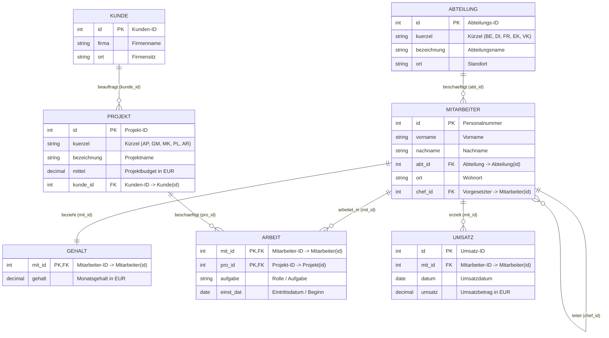
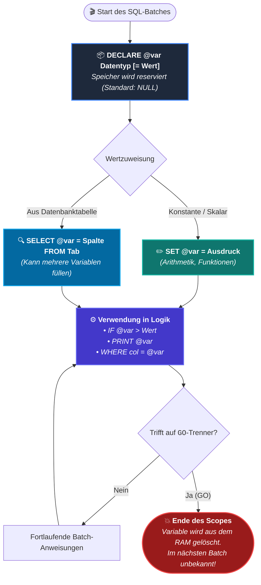
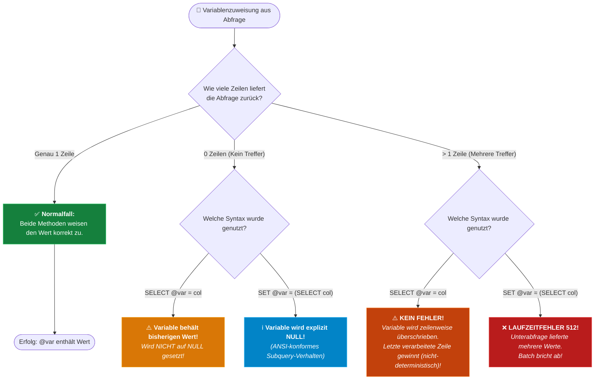
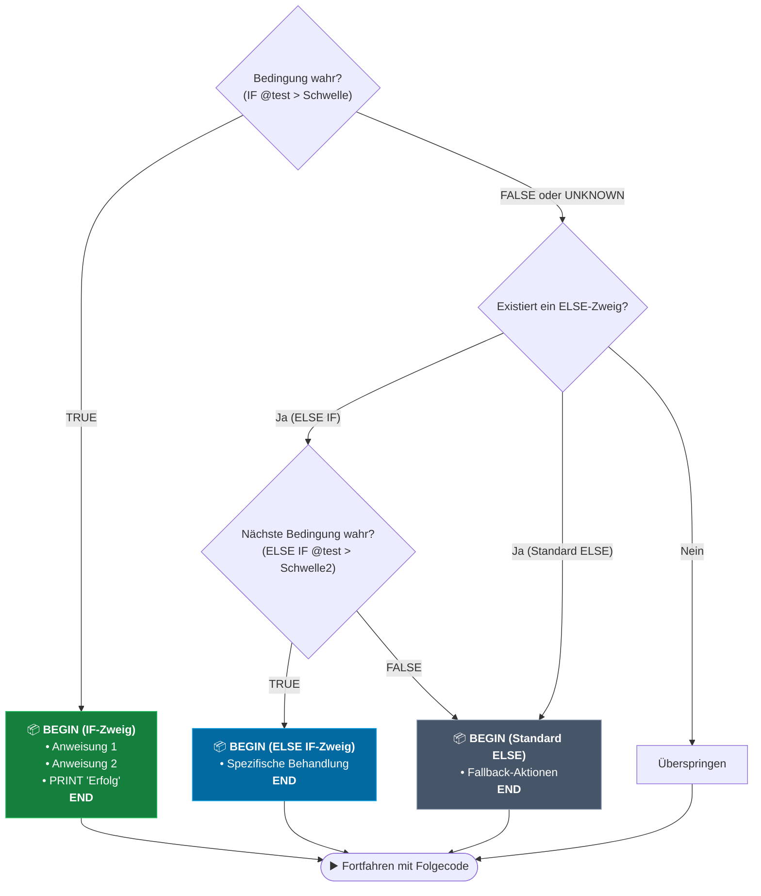
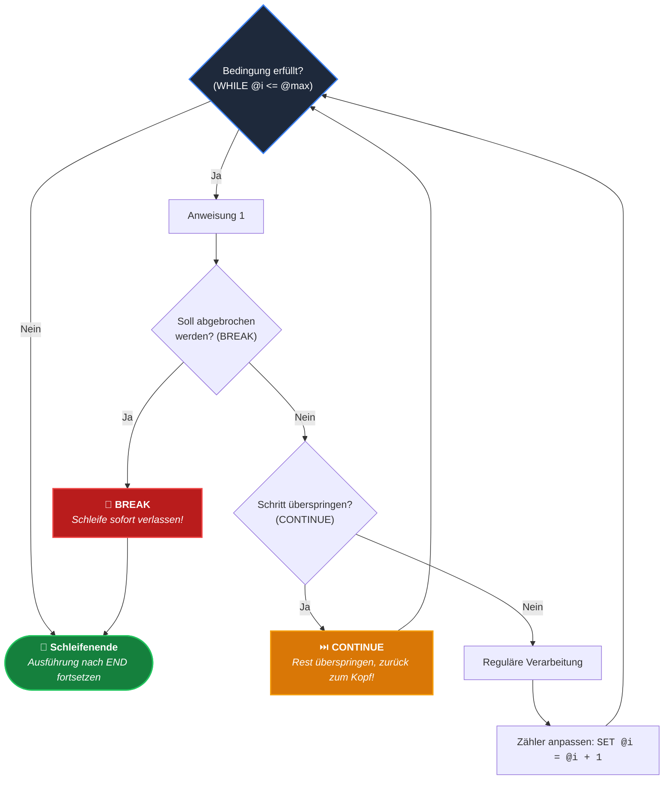
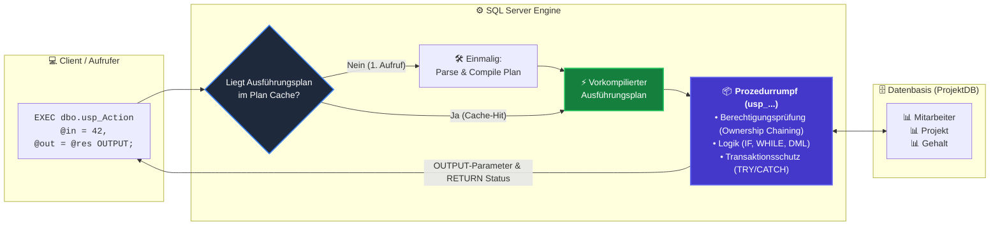

# 📅 Day_24: T-SQL Prozedurale Programmierung – Variablen, Kontrollstrukturen, WHILE-Schleifen & Stored Procedures

## ℹ️ Kurs-Informationen

* **Datum:** Donnerstag, 03.09.2026
* **Arbeitszeit:** 08:15 - 16:00 Uhr
* **Dozent:** Tom S. (BITLC)
* **Autor:** Tobias Boyke
* **Themenschwerpunkt:** `DECLARE`, `SET`, `PRINT`, `[test declare von select]`, `IF...ELSE`, `BEGIN...END`, `WHILE` (`BREAK`, `CONTINUE`), `CREATE PROCEDURE` (Input, `OUTPUT`, `RETURN`)

---

## 🎯 Lernziele des Tages

- [x] **Deklaration & Initialisierung lokaler Variablen mit `DECLARE`:**
  - Lokale Variablen mit Präfix `@` deklarieren (`DECLARE @name Datentyp`).
  - Direkte Wertzuweisung bei der Deklaration (`DECLARE @test INT = 100`).
  - Mehrfach-Deklarationen in einer kompakten Anweisung.
  - Standardwert uninitialisierter Variablen (`NULL`).
- [x] **Gültigkeitsbereich (Batch-Scope) & Lebenszyklus:**
  - Variablen existieren ausschließlich innerhalb des ausführenden Batches.
  - Das Schlüsselwort `GO` als Trenner von Batches und das Ende des Variablen-Lebenszyklus.
- [x] **Skalare Zuweisung mit `SET` & Arithmetik:**
  - Standardkonforme Wertzuweisung mit `SET @var = ausdruck`.
  - Arithmetische Berechnungen und Einbindung von Systemfunktionen (`GETDATE()`, `SUSER_NAME()`, `DB_NAME()`).
- [x] **Meldungsausgabe mit `PRINT` vs. Tabellarisches Resultset (`SELECT`):**
  - Textausgabe in den Reiter *Meldungen* (*Messages Tab*) für Logging und Debugging.
  - Typkonvertierung nicht-textueller Datentypen (`CAST`, `CONVERT`, `FORMAT`).
  - Vermeidung von `NULL`-Fallen bei String-Verkettungen (`CONCAT()` vs. `+`).
- [x] **Dynamische Variablenzuweisung aus Tabellenabfragen (`[test declare von select]`):**
  - Zuweisung via `SELECT @var = spalte FROM tabelle WHERE ...`.
  - Parallele Zuweisung mehrerer Spalten in mehrere Variablen in einem einzigen Lesezugriff.
  - Gegenüberstellung `SELECT @var = col` vs. `SET @var = (SELECT col)`.
  - **Kritische Randfälle:**
    - Verhalten bei Mehrfachtreffern (> 1 Zeile): Stillschweigendes Überschreiben vs. Laufzeitfehler 512.
    - Verhalten bei 0 Treffern: Erhalt des alten Variablenwerts vs. explizites `NULL`.
    - Sichere Initialisierungsmuster zur Fehlervermeidung.
- [x] **Ablaufsteuerung & Kontrollstrukturen (`IF...ELSE`):**
  - Bedingte Anweisungsausführung mit `IF <Bedingung> ... ELSE ...`.
  - **Die zwingende Notwendigkeit von `BEGIN...END`:** Kapselung mehrzeiliger Anweisungsblöcke zur Vermeidung tückischer Einzeiler-Bugs.
  - Kaskadierte Mehrfachverzweigungen mittels `ELSE IF`.
  - Verschachtelte Bedingungen (*Nested IF*) und komplexe logische Ausdrücke (`AND`, `OR`, `NOT`).
  - Performante Existenzprüfungen mit `IF EXISTS (...)` und `IF NOT EXISTS (...)`.
- [x] **Iterative Programmierung mit WHILE-Schleifen:**
  - Kopfgesteuerte `WHILE`-Schleifen mit Bedingungsprüfung.
  - Schleifensteuerung: Vorzeitiger Gesamtabbruch mit `BREAK` und Iterationssprung mit `CONTINUE`.
  - RBAR (*Row-By-Agonizing-Row*) vs. mengenorientiertes SQL (*Set-Based*): Wann Schleifen nützen (Chunk-weises Batching großer Datenmengen zur Vermeidung von Lock Escalation) und wann sie schaden.
  - Iteratives Durchlaufen von Datensätzen via temporärer Tabelle mit `IDENTITY`-Schlüssel (Cursor-Alternative).
- [x] **Gespeicherte Prozeduren (Stored Procedures):**
  - Definition mit `CREATE OR ALTER PROCEDURE dbo.usp_Name`.
  - **Die 4 Kernvorteile:** Plan-Caching & Performance, Sicherheit & Kapselung (Least Privilege / Ownership Chaining), SQL-Injection-Schutz und zentrale Wartbarkeit.
  - Parameter-Architektur: Eingabeparameter mit Standardwerten (Defaults), `OUTPUT`-Parameter für Ergebnisrückgaben an den Aufrufer, ganzzahlige Statuscodes mit `RETURN`.
  - Aufruf mit `EXECUTE` / `EXEC` und Übergabe von Rückgabevariablen.
  - Metadaten-Inspektion via `sys.procedures`, `sys.parameters` und `sp_helptext`.
- [x] **Praxis-Workshop auf der `ProjektDB` (Single Source of Truth):**
  - Implementierung realer Business-Logik: Budget-Ampelprüfung, HR-Gehaltsbenchmark, Mitarbeiter-Auslastungsmonitor, dynamische Provisionsberechnung, transaktionsgesicherte Gehaltserhöhung und geschäftslogische Prozeduren.

---

## 🗺️ Relationale Kompasse & Architektur-Diagramme

### 1. Single Source of Truth (`ProjektDB`)

Alle prozeduralen Skripte, Variablenzuweisungen, Schleifen und Stored Procedures basieren konsistent auf dem kanonischen Schema der **`ProjektDB`**:



---

### 2. Lebenszyklus & Scope einer T-SQL-Variablen

Lokale Variablen werden mit einem führenden `@` gekennzeichnet und besitzen eine strikt begrenzte Lebensdauer innerhalb des jeweiligen Batches:



---

### 3. Zuweisungs-Entscheidungsbaum: `SELECT @var` vs. `SET @var = (SELECT ...)`

Das Verhalten bei der Variablenzuweisung aus Abfragen unterscheidet sich fundamental, sobald das Abfrageergebnis von genau einem Datensatz abweicht:



---

### 4. Kontrollfluss-Architektur: `IF ... BEGIN ... END ELSE`

Strukturierte Ablaufsteuerung mit Anweisungsblöcken:



---

### 5. Ablaufsteuerung in WHILE-Schleifen (`BREAK` & `CONTINUE`)

Die Schleifensteuerung erlaubt vorzeitigen Abbruch oder das Überspringen einzelner Iterationen:



---

### 6. Stored Procedure Architektur & Ausführungs-Pipeline

Gespeicherte Prozeduren bieten Performance- und Sicherheitsvorteile durch Vorkompilierung, Parameter-Bindung und Kapselung:



---

## 📖 Theorie & Kernkonzepte im Detail

---

### 1. Grundlagen von T-SQL-Variablen (`DECLARE`)

In Transact-SQL (T-SQL) dienen lokale Variablen zur temporären Speicherung von Skalarwerten (Zahlen, Texte, Datumsangaben, Booleans als `BIT`) während der Skriptausführung.

#### 1.1 Namenskonvention & Deklaration
* Lokale Variablennamen müssen zwingend mit einem führenden **`@`** beginnen (z. B. `@personalnummer`, `@gehalt`, `@status`).
* Globale Systemfunktionen (historisch teils fälschlich als Systemvariablen bezeichnet) beginnen mit zwei `@@` (z. B. `@@ROWCOUNT`, `@@ERROR`, `@@VERSION`).
* Werden Variablen ohne Initialwert deklariert, besitzen sie standardmäßig den Wert **`NULL`**.

```sql
-- Einzeldeklaration mit Initialwert (seit SQL Server 2008 möglich)
DECLARE @mit_id INT = 25348;
DECLARE @bonusSatz DECIMAL(4, 2) = 0.10;

-- Mehrfach-Deklaration in kompakter Form
DECLARE @vorname NVARCHAR(50) = 'Tobias',
        @nachname NVARCHAR(50) = 'Boyke',
        @istAktiv BIT = 1,
        @erfassungsDatum DATE = GETDATE();
```

#### 1.2 Der Batch-Scope (Gültigkeitsbereich) & `GO`
* Eine lokale Variable ist nur innerhalb des Batches sichtbar, in dem sie deklariert wurde.
* Das Schlüsselwort `GO` ist **kein T-SQL-Befehl**, sondern ein Batch-Trennzeichen für Client-Tools (SSMS, DataGrip, sqlcmd).
* Sobald ein `GO` erreicht wird, sendet das Client-Tool den vorangehenden Codeblock an den SQL Server. Danach wird der Batch beendet und der Arbeitsspeicher für alle darin deklarierten Variablen freigegeben.

---

### 2. Wertzuweisung: `SET` vs. `SELECT`

Für die Wertzuweisung stehen zwei grundlegende Mechanismen zur Verfügung:

| Kriterium | `SET` (`SET @var = ...`) | `SELECT` (`SELECT @var = ...`) |
| :--- | :--- | :--- |
| **SQL-Standard** | Entspricht dem offiziellen ANSI-SQL Standard. | Proprietäre T-SQL Spracherweiterung von Microsoft. |
| **Anzahl Variablen** | Genau **eine** Variable pro `SET`-Anweisung. | **Mehrere** Variablen parallel in einer einzigen Abfrage. |
| **Tabellenzugriff** | Erfordert skalare Unterabfrage in Klammern. | Direkte Zuweisung über Spaltennamen mit `FROM` und `WHERE`. |
| **Performance bei Multi-Assignments** | Geringer: Mehrere Tabellenzugriffe bei mehreren Variablen. | Sehr hoch: Ein einziger Tabellenscan für $N$ Variablen. |
| **Verhalten bei > 1 Treffer** | Wirft **Laufzeitfehler 512** (Subquery returned > 1 value). | **Kein Fehler:** Überschreibt den Wert; letzte Zeile gewinnt! |
| **Verhalten bei 0 Treffern** | Setzt die Variable explizit auf **`NULL`**. | Variable **behält ihren bisherigen Wert** unverändert! |

---

### 3. Zuweisung aus Abfragen (`[test declare von select]`) & Die Randfall-Fallen

#### 3.1 Das Multi-Assignment-Paradigma
Sollen mehrere Attribute eines Datensatzes aus der `ProjektDB` in Variablen geladen werden, ist `SELECT` unschlagbar effizient:

```sql
USE ProjektDB;
GO

DECLARE @vname NVARCHAR(50),
        @nname NVARCHAR(50),
        @gehalt DECIMAL(10, 2),
        @abteilungsName NVARCHAR(50);

-- Ein einziger JOIN-Select befüllt alle 4 Variablen atomar:
SELECT @vname = m.vorname,
       @nname = m.nachname,
       @gehalt = g.gehalt,
       @abteilungsName = a.bezeichnung
FROM dbo.Mitarbeiter AS m
INNER JOIN dbo.Gehalt AS g ON m.id = g.mit_id
INNER JOIN dbo.Abteilung AS a ON m.abt_id = a.id
WHERE m.id = 25348;

PRINT CONCAT(@vname, ' ', @nname, ' arbeitet in ', @abteilungsName, ' mit ', @gehalt, ' EUR Gehalt.');
```

#### 3.2 Die 0-Treffer-Falle (Silent No-Op)
Wenn ein `SELECT @var = col` ins Leere läuft (z. B. ID existiert nicht), wird die Zuweisung gar nicht erst ausgeführt. War die Variable vorher belegt, behält sie fälschlicherweise ihren Altwert:

```sql
DECLARE @gehalt DECIMAL(10, 2) = 5000.00; -- Vorheriger Wert

-- Mitarbeiter -99 existiert nicht:
SELECT @gehalt = gehalt FROM dbo.Gehalt WHERE mit_id = -99;

-- ACHTUNG: @gehalt ist weiterhin 5000.00 und NICHT NULL!
PRINT 'Gehalt: ' + CAST(@gehalt AS VARCHAR(20)); -- Gibt 5000.00 aus!
```

> [!CAUTION]
> **Best Practice gegen die 0-Treffer-Falle:**
> Vor einer Zuweisung über `SELECT` sollte die Variable **immer explizit auf `NULL` vorinitialisiert** werden (`DECLARE @var INT = NULL` oder `SET @var = NULL`), oder das Vorhandensein wird vorab via `IF EXISTS (...)` abgesichert!

---

### 4. Kontrollstrukturen & Verzweigungen (`IF...ELSE`)

#### 4.1 Warum `BEGIN...END` unverzichtbar ist
In T-SQL kapseln die Schlüsselwörter `BEGIN` und `END` einen Block aus mehreren Anweisungen (analog zu den geschweiften Klammern `{ ... }` in C# oder Java).

> [!WARNING]
> **Die fatale Einzeiler-Falle:**
> Ohne `BEGIN...END` gehört **ausschließlich die unmittelbar nächste Anweisung** zum bedingten Zweig. Jede weitere Zeile wird **immer** ausgeführt!

```sql
-- SAUBERER CODE MIT BEGIN...END (Best Practice):
DECLARE @isAdmin BIT = 0;

IF @isAdmin = 1
BEGIN
    PRINT 'Zugriff gewährt!';
    PRINT 'Sensible Finanzdaten werden exportiert...';
END
ELSE
BEGIN
    PRINT 'Zugriff verweigert: Administratorrechte erforderlich.';
END;
```

---

### 5. Iterative Kontrollstrukturen: Die WHILE-Schleife

T-SQL besitzt ausschließlich die kopfgesteuerte **`WHILE`**-Schleife (es gibt keine `FOR`- oder `DO...WHILE`-Schleifen).

#### 5.1 Syntax & Steuerung mit `BREAK` und `CONTINUE`
```sql
DECLARE @i INT = 1;

WHILE @i <= 10
BEGIN
    IF @i = 8
        BREAK;    -- Bricht die gesamte Schleife bei 8 sofort ab

    IF @i % 2 = 0
    BEGIN
        SET @i = @i + 1;
        CONTINUE; -- Überspringt gerade Zahlen und springt zum Kopf zurück
    END;

    PRINT CONCAT('Ungerade Zahl: ', @i);
    SET @i = @i + 1;
END;
```

#### 5.2 Mengenorientierung vs. RBAR (Row-By-Agonizing-Row)
In relationalen Datenbanken gilt: **Mengenbasierte SQL-Operationen (`UPDATE ... WHERE`, `INSERT ... SELECT`) sind iterativen Schleifen immer vorzuziehen!**  
Dennoch existieren zwei wichtige industrielle Anwendungsfälle für `WHILE`:
1. **Chunk-weises Batching (ETL / Archivierung):** Löschen von Millionen Datensätzen in 5.000er-Häppchen (`DELETE TOP (5000)`), um Lock Escalation und Transaktionsprotokoll-Überlauf zu vermeiden.
2. **Cursor-freies zeilenweises Abarbeiten:** Schrittweises Durchlaufen einer Hilfstabelle mit `IDENTITY`-Spalte, wenn Einzelschritte voneinander abhängen.

---

### 6. Gespeicherte Prozeduren (Stored Procedures)

Eine Stored Procedure ist ein benanntes, vorkompiliertes Programmmodul, das dauerhaft in der Datenbank gespeichert ist.

#### 6.1 Die 4 Kernvorteile
1. **Performance & Plan-Caching:** Beim ersten Aufruf erstellt die Engine einen optimierten Ausführungsplan und legt ihn im Cache ab. Nachfolgende Aufrufe sparen Compilation-Time.
2. **Sicherheit & Berechtigungskapselung (Least Privilege):** Anwender benötigen keine Tabellenrechte, sondern nur `GRANT EXECUTE ON dbo.usp_...`. Über das Prinzip der **Ownership Chaining** greift die Prozedur autorisiert auf Basistabellen zu.
3. **Schutz vor SQL Injection:** Parametrisierte Prozeduren trennen Code strikt von Nutzdaten.
4. **Zentralisierung:** Geschäftsregeln liegen zentral in der Datenbank und müssen bei Änderungen nicht in Client-Programmen nachgepflegt werden.

#### 6.2 Parameter-Typen & Syntax
```sql
CREATE OR ALTER PROCEDURE dbo.usp_GehaltsCheck
    @mit_id INT,                               -- Eingabeparameter (Input)
    @mindestGehalt DECIMAL(10, 2) = 2000.00,   -- Input mit Defaultwert
    @aktuellesGehalt DECIMAL(10, 2) OUTPUT     -- Ausgabeparameter (OUTPUT)
AS
BEGIN
    SET NOCOUNT ON;

    -- Validierung
    IF NOT EXISTS (SELECT 1 FROM dbo.Mitarbeiter WHERE id = @mit_id)
        RETURN -1; -- Negativer Statuscode = Fehler

    SELECT @aktuellesGehalt = gehalt FROM dbo.Gehalt WHERE mit_id = @mit_id;

    IF @aktuellesGehalt >= @mindestGehalt
        RETURN 0;  -- 0 = Erfolg
    ELSE
        RETURN 1;  -- 1 = Gehalt unter Mindestgrenze
END;
GO
```

#### 6.3 Prozeduraufruf mit `EXECUTE`
```sql
DECLARE @gehalt DECIMAL(10, 2);
DECLARE @retCode INT;

EXEC @retCode = dbo.usp_GehaltsCheck
    @mit_id = 25348,
    @mindestGehalt = 3000.00,
    @aktuellesGehalt = @gehalt OUTPUT; -- Wichtig: OUTPUT beim Aufruf!

PRINT CONCAT('Returncode: ', @retCode, ' | Gehalt: ', @gehalt, ' EUR');
```

#### 6.4 Best Practice: Optionale Parameter mit Standardwerten & Such-Kaskade

Ein in der Praxis extrem häufiges und elegantes Entwurfsmuster ist die **Multi-Kriteriensuche mit optionalen Parametern**:

```sql
CREATE OR ALTER PROCEDURE dbo.usp_SucheKunden
    @kundenId INT = NULL,          -- Optionaler Parameter 1 (Default: NULL)
    @nachname NVARCHAR(100) = NULL -- Optionaler Parameter 2 (Default: NULL)
AS
BEGIN
    SET NOCOUNT ON;

    -- Variante A: Suche nach Primärschlüssel-ID, wenn übergeben (höchste Selektivität)
    IF @kundenId IS NOT NULL
    BEGIN
        SELECT * FROM dbo.Kunde WHERE id = @kundenId;
    END
    -- Variante B: Suche nach Name/Muster, wenn ID fehlt aber Name vorhanden ist
    ELSE IF @nachname IS NOT NULL
    BEGIN
        SELECT * FROM dbo.Kunde WHERE firma LIKE @nachname + '%';
    END
    -- Variante C: Keine Parameter übergeben -> Defensiver Fallback mit Schutzlimit
    ELSE
    BEGIN
        SELECT TOP (100) * FROM dbo.Kunde ORDER BY id;
    END;
END;
GO
```

> [!TIP]
> **Warum `IF...ELSE IF` statt Catch-All `WHERE (@id IS NULL OR id = @id)`?**  
> 1. **Index-Nutzung & Plan-Optimierung:** In einer monolithischen Catch-All-Abfrage muss der SQL Server Query Optimizer einen einzigen Ausführungsplan finden, der für alle Parameterkombinationen passt. Dies führt häufig zu ineffizienten *Table/Index Scans*. Bei der `IF...ELSE`-Verzweigung hingegen generiert die Engine für **jeden Zweig einen maßgeschneiderten Ausführungsplan** (z. B. blitzschneller *Clustered Index Seek* im ID-Zweig).  
> 2. **Schutz vor Denial-of-Service:** Das defensive `TOP (100)` im Fallback-Zweig verhindert, dass ein unbedachter Aufruf ohne Parameter Millionen Datensätze über das Netzwerk schaufelt.

---

## 💻 Praktische Übungen im Verzeichnis `src/`

Alle praktischen Übungen sind als eigenständige, idempotent ausführbare T-SQL-Skripte im Ordner [`src/`](./src/) abgelegt:

| Datei | Themenschwerpunkt | Beschreibung & Kerninhalte |
| :--- | :--- | :--- |
| [📄 `01_variablen_declare_set_und_print.sql`](./src/01_variablen_declare_set_und_print.sql) | **Variablen-Grundlagen & PRINT** | Deklaration mit `DECLARE`, Mehrfach-Deklarationen, Gültigkeitsbereich (Batch-Scope mit `GO`), Zuweisung mit `SET`, Systemfunktionen, Typkonvertierungen (`CAST`, `CONVERT`, `FORMAT`), String-Handling mit `CONCAT()` und `NULL`-Vermeidung. |
| [📄 `02_variablenzuweisung_select_vs_set.sql`](./src/02_variablenzuweisung_select_vs_set.sql) | **Zuweisung aus Abfragen** | Dynamische Zuweisung über `SELECT @var = col`, parallele Multi-Variablen-Zuweisung, Aggregat-Zuweisung (`SUM`, `AVG`), Multi-Row-Phänomen (Fehler 512 vs. stilles Überschreiben), No-Row-Phänomen (Altwert vs. NULL) und sichere Abfragemuster. |
| [📄 `03_kontrollstrukturen_if_else_begin_end.sql`](./src/03_kontrollstrukturen_if_else_begin_end.sql) | **Kontrollstrukturen & Verzweigungen** | Ablaufsteuerung mit `IF...ELSE`, Demonstration der Gefahrenzone ohne `BEGIN...END`, mehrstufige Einstufungen via `ELSE IF`, verschachtelte Bedingungen (*Nested IF*), komplexe Boolesche Logik und Existenzprüfungen mit `IF EXISTS`. |
| [📄 `04_praxis_business_logik_projektdb.sql`](./src/04_praxis_business_logik_projektdb.sql) | **Praxis-Workshop ProjektDB** | 5 reale Unternehmensszenarien auf der `ProjektDB`: Projekt-Budget-Auditor mit Ampelbewertung, HR-Gehaltsbenchmark mit Abweichungsanalyse, Mitarbeiter-Auslastungsmonitor (`Arbeit`), dynamische Provisionsberechnung (`Umsatz`) und idempotente DML-Guards. |
| [📄 `05_schleifen_while_break_continue.sql`](./src/05_schleifen_while_break_continue.sql) | **Iterative Schleifen (WHILE)** | Zählergesteuerte `WHILE`-Schleifen, Notbremse mit `BREAK`, Iterationsübersprung mit `CONTINUE`, zeilenweises Abarbeiten via temporärer Tabelle (Cursor-Alternative) und Best-Practice-Muster für industrielles Batching (Chunk-Deletes). |
| [📄 `06_stored_procedures_grundlagen_und_parameter.sql`](./src/06_stored_procedures_grundlagen_und_parameter.sql) | **Stored Procedures Grundlagen** | `CREATE OR ALTER PROCEDURE`, Prozeduren ohne Parameter, Eingabeparameter mit Standardwerten (Defaults), `OUTPUT`-Parameter zur Werterückgabe, `RETURN`-Statuscodes, Aufruf via `EXEC` und Metadaten-Inspektion in `sys.procedures`. |
| [📄 `07_stored_procedures_business_logik_projektdb.sql`](./src/07_stored_procedures_business_logik_projektdb.sql) | **Enterprise Stored Procedures** | 3 komplexe Prozeduren auf der `ProjektDB`: `usp_MitarbeiterProjektZuweisen` (validierte DML), `usp_GehaltsanpassungAbteilung` (transaktionsgesichert mit Grenzen) und `usp_IterativerProjektStatusAudit` (integrierte `WHILE`-Schleife). |

---

## 💡 Wichtige Notizen & Best Practices

> [!IMPORTANT]
> **Die 6 goldenen Regeln für prozedurales T-SQL:**
> 1. **IMMER `BEGIN...END` verwenden:** Auch wenn ein `IF`-, `ELSE`- oder `WHILE`-Zweig zunächst nur aus einer einzigen Zeile besteht. Das verhindert gefährliche Logikfehler bei späteren Code-Erweiterungen.
> 2. **Variablen vor `SELECT`-Zuweisungen initialisieren:** Vor einer Wertzuweisung mit `SELECT @var = col` die Variable immer explizit auf `NULL` setzen, um Phantom-Altwerte bei 0 Treffern auszuschließen.
> 3. **Set-Based vor Iteration (RBAR vermeiden):** Schleifen nur für administrative Aufgaben, Simulationen oder Batching von Großlöschungen verwenden. Abfragen und Datenmanipulationen immer mengenbasiert formulieren.
> 4. **Stored Procedures mit `usp_` benennen:** Niemals das Präfix `sp_` verwenden, da der SQL Server sonst immer zuerst in der Systemdatenbank `master` sucht.
> 5. **`SET NOCOUNT ON` am Anfang jeder Prozedur:** Unterdrückt die Übertragung von "X Zeilen betroffen"-Meldungen an den Client und verbessert Netzwerk-Performance sowie Latenz.
> 6. **`OUTPUT` muss beim Aufruf wiederholt werden:** Wenn eine Prozedur einen Parameter als `OUTPUT` definiert, muss beim Aufruf via `EXEC` ebenfalls zwingend das Schlüsselwort `OUTPUT` angegeben werden, sonst wird der Wert nicht in die Aufruf-Variable geschrieben.