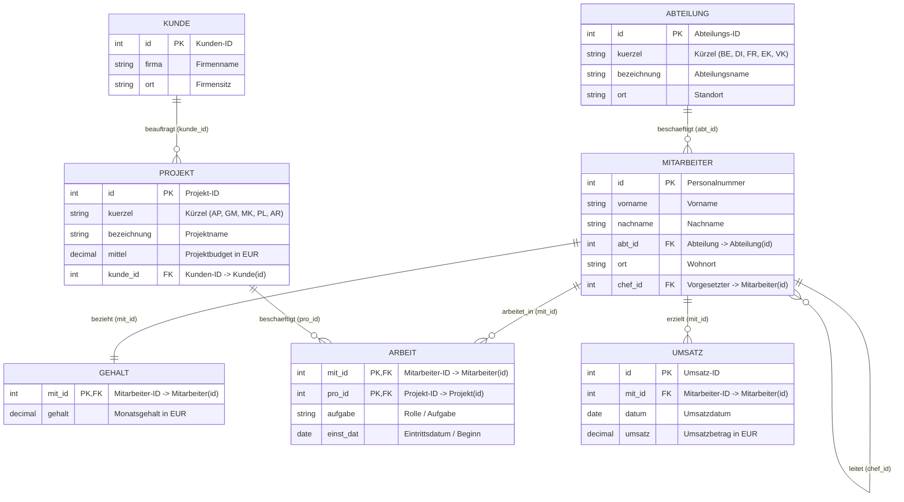

# 📅 Day_26: Intensiv-Repetitorium & Klausurvorbereitung II

## ℹ️ Kurs-Informationen

* **Datum:** Montag, 07.09.2026
* **Arbeitszeit:** 08:15 - 16:00 Uhr
* **Dozent:** Tom S. (BITLC)
* **Autor:** Tobias Boyke
* **Fokus:** Vorbereitung auf die 2. Klausur (Abschlussklausur), Gesamtrepetitorium der Wochen 3–5 & Probeklausur II

---

## 🎯 Lernziele & Tagesablauf

- [x] **Systematische Wiederholung der Kernkompetenzen (Wochen 3 bis 5):**
  - **DQL & Aggregation:** Dreiwertige Logik (`IS NULL`), Pattern Matching (`LIKE`), Filterung mit `HAVING` vs. `WHERE`.
  - **Relationales Join-Kompendium:** `INNER JOIN`, `LEFT/RIGHT/FULL OUTER JOIN`, Anti-Joins (`IS NULL`), `SELF JOIN` (Mitarbeiter/Vorgesetzter) und `CROSS APPLY`.
  - **Mengenoperatoren:** `UNION`, `UNION ALL`, `INTERSECT`, `EXCEPT` und mathematische Präzedenzregeln.
  - **T-SQL Logikfunktionen:** Einfaches & komplexes `CASE`, `COALESCE` vs. `ISNULL`, `IIF`.
  - **DCL & Sicherheit:** 2-stufiges Sicherheitsmodell (Logins & Users), Rollenkonzept (RBAC), `GRANT`, `REVOKE`, `DENY` und Ownership Chaining.
  - **Prozedurale Programmierung:** Lokale Variablen (`DECLARE`, `SET`, `PRINT`), Batch-Scope (`GO`), `IF...BEGIN...END`, `WHILE`-Schleifen (`BREAK`, `CONTINUE`), Stored Procedures (`CREATE OR ALTER PROCEDURE`, Input, `OUTPUT`, `RETURN`) und benutzerdefinierte Funktionen (Skalar, iTVF, MSTVF).
- [x] **Durchführung & Besprechung der Probeklausur II:**
  - Selbstständiges Lösen praxisnaher Prüfungsaufgaben auf der kanonischen `ProjektDB`.
  - Analyse typischer IHK-Fallen und Formulierung präziser, musterlösungskonformer SQL-Statements.

---

## 🗺️ Single Source of Truth (`ProjektDB`)

Als Grundlage für alle Klausuraufgaben und das Repetitorium dient verbindlich das kanonische Schema der **`ProjektDB`**:



---

## 📚 Das Master-Repetitorium: Die 6 Kernsäulen für die Abschlussklausur

### 1. DQL & Aggregationen (Wochen 3 & 4)
* **`WHERE` vs. `HAVING`:** `WHERE` filtert Zeilen **vor** der Gruppierung; `HAVING` filtert Gruppen **nach** der Aggregation (`HAVING AVG(g.gehalt) > 3000`).
* **`COUNT(*)` vs. `COUNT(Spalte)`:** `COUNT(*)` zählt alle Zeilen (auch solche mit `NULL`). `COUNT(Spalte)` zählt nur Zeilen, bei denen die konkrete Spalte ungleich `NULL` ist.
* **Dreiwertige Logik:** Vergleiche mit `NULL` ergeben immer `UNKNOWN`. Prüfungen zwingend mit `IS NULL` oder `IS NOT NULL`.

### 2. Tabellenverknüpfungen (Joins & Relationen)
* **`INNER JOIN`:** Liefert nur Treffer, die in beiden Tabellen existieren.
* **`LEFT JOIN`:** Alle Zeilen der linken Tabelle; fehlende Partnerwerte werden als `NULL` aufgefüllt.
* **Anti-Join-Muster:** Suchen nach Datensätzen ohne Verknüpfung:
  ```sql
  -- Kunden ohne zugeordnetes Projekt finden
  SELECT k.firma
  FROM dbo.Kunde AS k
  LEFT JOIN dbo.Projekt AS p ON k.id = p.kunde_id
  WHERE p.id IS NULL;
  ```
* **`SELF JOIN`:** Verknüpfung einer Tabelle mit sich selbst (z. B. Mitarbeiter und Vorgesetzter):
  ```sql
  SELECT m.nachname AS Mitarbeiter, c.nachname AS Chef
  FROM dbo.Mitarbeiter AS m
  LEFT JOIN dbo.Mitarbeiter AS c ON m.chef_id = c.id;
  ```

### 3. Mengenoperatoren
* **`UNION`:** Vereinigt Ergebnismengen und eliminiert Duplikate (implizites `DISTINCT`, sortierintensiv).
* **`UNION ALL`:** Vereinigt Mengen ohne Duplikatprüfung (deutlich performanter).
* **`INTERSECT`:** Liefert die Schnittmenge zweier Abfragen (nur Datensätze, die in beiden vorkommen).
* **`EXCEPT`:** Liefert alle Zeilen der ersten Abfrage, die **nicht** in der zweiten enthalten sind.

### 4. DCL & SQL Server Sicherheit (Woche 5)
* **2-Stufen-Modell:** Login auf Serverebene (`master`) mappt auf User auf Datenbankebene (`ProjektDB`).
* **Regel:** `DENY` schlägt immer `GRANT`!
* **RBAC-Prinzip:** Berechtigungen immer an Rollen vergeben, Benutzer werden Mitglieder von Rollen.

### 5. T-SQL Prozedurale Logik (Variablen, Verzweigungen & Schleifen)
* **Batch-Scope:** Variablen leben nur bis zum nächsten `GO` (kein Block-Scope in `BEGIN...END`).
* **Zuweisung:** `SELECT @var = col` (mehrere Variablen auf einmal, aber 0 Treffer = Altwert bleibt!) vs. `SET @var = (SELECT col)` (Fehler 512 bei > 1 Treffer, explizit `NULL` bei 0 Treffern).
* **`BEGIN...END`:** Zwingend erforderlich, um mehrzeilige Blöcke im `IF`-, `ELSE`- oder `WHILE`-Zweig zu kapseln.

### 6. Stored Procedures vs. User-Defined Functions
* **Stored Procedure (`CREATE PROCEDURE`):** Für Aktionen, Workflows, DML-Operationen (`INSERT`, `UPDATE`, `DELETE`) und Transaktionen (`BEGIN TRAN`). Aufruf mit `EXEC`.
* **User-Defined Function (`CREATE FUNCTION`):** Für Berechnungen und Transformationen. **Strikt Read-Only** (keine DML, keine Transaktionen, kein `PRINT`). Direkt in `SELECT`, `WHERE` und `JOIN` einbettbar.

---

## 💻 Praktische Übungen im Verzeichnis `src/`

| Datei | Thema | Beschreibung |
| :--- | :--- | :--- |
| [📄 `01_probeklausur_2_aufgaben_und_loesungen.sql`](./src/01_probeklausur_2_aufgaben_und_loesungen.sql) | **Probeklausur II** | Vollständige Generalprobe für die Abschlussklausur: 6 praxisnahe IHK-Aufgabenkomplexe auf der `ProjektDB` inkl. detaillierter Musterlösungen. |

---

## 💡 Top-Tipps für die morgige Abschlussklausur

> [!IMPORTANT]
> 1. **SQL-Keywords groß schreiben:** `SELECT`, `FROM`, `WHERE`, `JOIN`, `ON`, `GROUP BY`, `HAVING`, `ORDER BY`.
> 2. **Aliase für Tabellen verwenden:** Immer `m.id`, `a.bezeichnung` statt unqualifizierter Spaltennamen.
> 3. **Semikolon am Anweisungsende setzen:** Zeigt professionelle und standardkonforme SQL-Syntax.
> 4. **`BEGIN...END` bei Prozeduren und Verzweigungen niemals vergessen.**
> 5. **Aufgabenstellung genau lesen:** Wird ein Skalarwert, eine formatierte Meldung (`PRINT`) oder ein Resultset (`SELECT`) gefordert?
