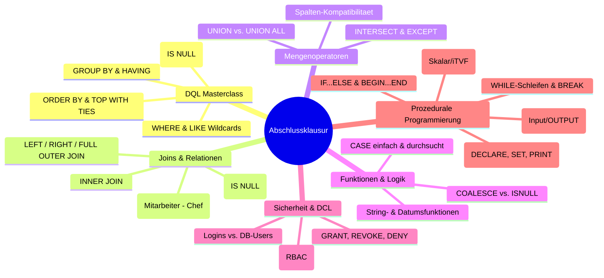

# 🎓 Day_27: 2. Leistungsüberprüfung (Abschlussklausur II)

## ℹ️ Kurs-Informationen

* **Datum:** Dienstag, 08.09.2026
* **Arbeitszeit:** 08:15 - 16:00 Uhr
* **Dozent:** Tom S. (BITLC)
* **Autor:** Tobias Boyke
* **Fokus:** Finale Leistungsüberprüfung über alle Module der Wochen 3 bis 5 (DQL, Joins, Aggregationen, Mengenoperatoren, Funktionen, Sicherheit & Programmierung)

---

## 🎯 Prüfungsziel & Tagesablauf

Heute findet die **Abschlussklausur** des Moduls *SQL Server & Relationale Datenbankgrundlagen* statt:

* **08:15 - 09:00 Uhr:** Letzte organisatorische Hinweise, Warm-up & Bereitstellung der Prüfungsdateien.
* **09:15 - ca. 12:30 Uhr:** **Durchführung der schriftlichen/praktischen Abschlussklausur**.
* **13:30 - 15:30 Uhr:** Besprechung der Musterlösung mit Dozent Tom S., Auswertung und Notenbekanntgabe.
* **15:30 - 16:00 Uhr:** Modul-Abschluss, Feedbackrunde und Ausblick.

---

## 📚 Klausurrelevante Kernkompetenzen im Überblick

Zur finalen Orientierung sind hier die Kernbereiche zusammengefasst, die Gegenstand der Abschlussklausur sind:

---

## 💡 Die 10 goldenen Regeln für die Abschlussklausur

> [!IMPORTANT]
> 1. **SQL-Keywords in GROSSBUCHSTABEN:** `SELECT`, `FROM`, `WHERE`, `INNER JOIN`, `ON`, `GROUP BY`, `HAVING`, `ORDER BY`.
> 2. **Immer mit Tabellen-Aliasen arbeiten:** Nutze stets `m.id`, `a.bezeichnung`, um Mehrdeutigkeiten (*Ambiguous Column Names*) auszuschließen.
> 3. **`WHERE` vs. `HAVING`:** Niemals aggregierte Werte (`AVG`, `SUM`, `COUNT`) in die `WHERE`-Klausel schreiben – dafür ist ausschließlich `HAVING` da!
> 4. **Semikolon am Statement-Ende:** Jede T-SQL-Anweisung sauber mit `;` abschließen.
> 5. **`IS NULL` statt `= NULL`:** Vergleiche mit `NULL` liefern `UNKNOWN`. Prüfungen immer mit `IS NULL` oder `IS NOT NULL`.
> 6. **`BEGIN...END` nicht vergessen:** Sowohl bei `IF...ELSE`-Verzweigungen als auch bei Stored Procedures immer saubere Codeblöcke setzen.
> 7. **Anti-Joins beherrschen:** Bei Aufgaben wie *"Zeigen Sie alle Kunden, die keine Projekte haben"* immer `LEFT JOIN ... WHERE p.id IS NULL` oder `WHERE NOT EXISTS (...)` nutzen.
> 8. **`UNION` vs. `UNION ALL`:** Wenn Duplikate bereits ausgeschlossen sind oder erhalten bleiben sollen, immer `UNION ALL` bevorzugen (Performancevorteil!).
> 9. **Prozeduren mit Parametern testen:** Nach der Prozedurerstellung immer mindestens einen Testaufruf mit `EXEC dbo.usp_...` durchführen.
> 10. **Aufgabenstellung exakt befolgen:** Genau prüfen, welche Spalten und Spaltenüberschriften (`AS Alias`) in der Aufgabenstellung gefordert sind.

---

## 💻 Praktische Übungen & Lösungen

* Die Klausuraufgaben und die anschließende Musterlösung werden nach Freigabe im Verzeichnis [`src/`](./src/) hinterlegt.
