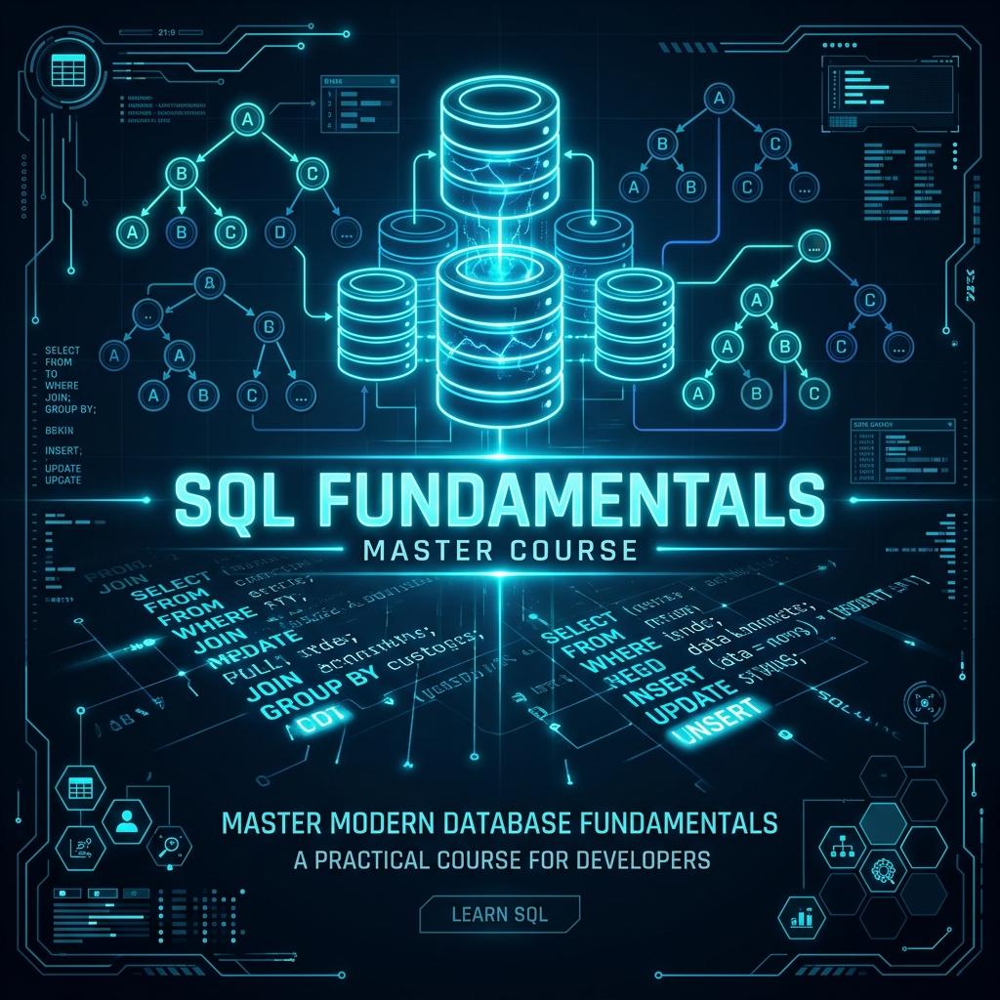
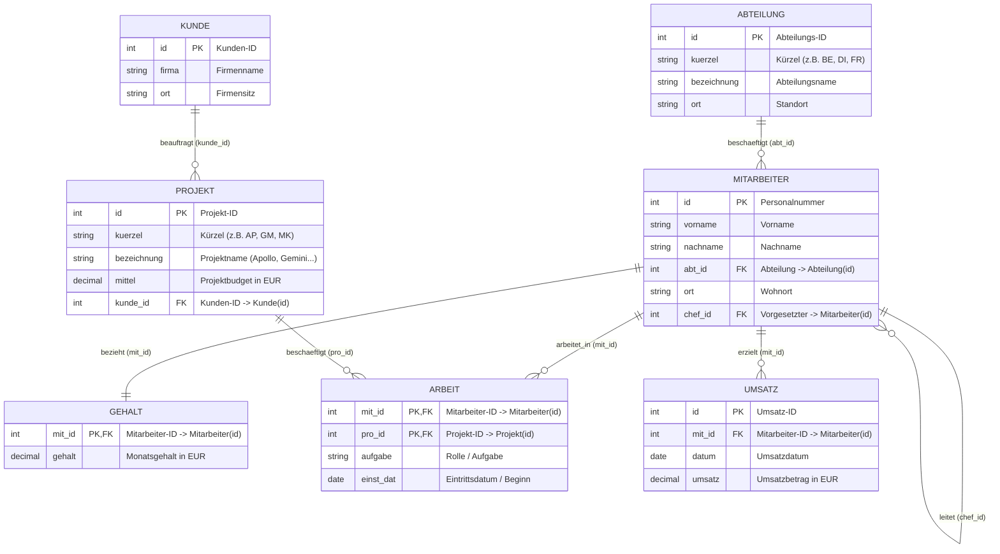

# 🌌 SQL Fundamentals - Das Master-Repository



Willkommen im zentralen Hub für die SQL-Fundamentals-Serie. Dieses Repository dient als strukturierte Wissensbasis, Kursbegleiter und Projektdokumentation für das Modul **SQL Server & Relationale Datenbankgrundlagen**.

---

## 👥 Kurs-Metadaten
* **Autor/Bearbeiter:** Tobias Boyke
* **Dozent:** Tom S.
* **Modulzeitraum:** 03.08.2026 - 08.09.2026
* **Arbeitszeiten:** Montag bis Freitag, 08:15 Uhr - 16:00 Uhr
* **Lizenz:** [AGPL-3.0](./LICENSE)

---

## 🧠 T-SQL Master Mindmap & Architektur-Kompass

Das folgende Diagramm überführt die handgezeichnete [T-SQL Mindmap](./TSQL%20MINDMAP.jpg) in ein interaktives, farbcodiertes Mermaid-Modell. Es fasst alle Kernbereiche der Transact-SQL-Sprachfamilie, analytische Funktionen, Datenkontrolle und Transaktionssteuerung kompakt zusammen:

```mermaid
flowchart LR
    %% =========================================================
    %% ZENTRALER KNOTEN
    %% =========================================================
    TSQL(["⚡ <b>T-SQL</b><br/><i>Transact-SQL Mindmap</i>"]):::rootNode

    %% =========================================================
    %% RECHTE SEITE: SPRACHFAMILIEN (DDL, DML, DCL, TCL)
    %% =========================================================

    %% 1. DDL (Data Definition Language)
    TSQL --> DDL["🏗️ <b>DDL</b><br/>(Data Definition Language)"]:::ddlNode

    DDL --> VIEW_BRANCH["👁️ <b>VIEW</b>"]:::viewNode
    VIEW_BRANCH --- V_CR["• CREATE"]:::leafNode
    VIEW_BRANCH --- V_AL["• ALTER"]:::leafNode
    VIEW_BRANCH --- V_DR["• DROP"]:::leafNode

    DDL --> DDL_CR["✨ <b>CREATE</b>"]:::ddlSub
    DDL_CR --- DC_T["• TABLE"]:::leafNode
    DDL_CR --- DC_D["• DATABASE"]:::leafNode
    DDL_CR --- DC_I["• INDEX"]:::leafNode
    DDL_CR --- DC_V["• VIEW"]:::leafNode
    DDL_CR --- DC_P["• PROCEDURE"]:::leafNode
    DDL_CR --- DC_E["• ETC."]:::leafNode

    DDL --> DDL_ALT["🔧 <b>ALTER TABLE</b>"]:::ddlSub
    DDL_ALT --> ALT_ADD["➕ <b>ADD</b> ➔ COLUMN<br/><i>(TABLE, DB, INDEX, VIEW, PROC, ETC.)</i>"]:::leafNode
    DDL_ALT --> ALT_DRP["➖ <b>DROP</b> ➔ COLUMN, CONSTRAINT"]:::leafNode
    DDL_ALT --> ALT_MOD["✏️ <b>MODIFY</b> ➔ ALTER COLUMN<br/><i>(Data Type, Length)</i>"]:::leafNode

    DDL --> DDL_DRP["🗑️ <b>DROP</b>"]:::ddlSub
    DDL_DRP --- D_TAB["• TABLE"]:::leafNode
    DDL_DRP --- D_DB["• DATABASE"]:::leafNode

    %% 2. DML (Data Manipulation Language)
    TSQL --> DML["✏️ <b>DML</b><br/>(Data Manipulation Language)"]:::dmlNode
    DML --- DML_SEL["🔍 <b>SELECT</b> ➔ COLUMN(S), ALL TABLE (*)"]:::leafNode
    DML --- DML_INS["📥 <b>INSERT</b> ➔ DATA INTO TABLE"]:::leafNode
    DML --- DML_UPD["🔄 <b>UPDATE</b> ➔ SET FIELD VALUES"]:::leafNode
    DML --- DML_DEL["❌ <b>DELETE</b> ➔ REMOVE ROWS FROM TABLE"]:::leafNode
    DML --- DML_TRU["⚡ <b>TRUNCATE</b> ➔ TABLE"]:::leafNode

    %% 3. DCL (Data Control Language)
    TSQL --> DCL["🛡️ <b>DCL</b><br/>(Data Control Language)"]:::dclNode
    DCL --- DCL_G["🔑 <b>GRANT</b> (Rechte vergeben)"]:::leafNode
    DCL --- DCL_R["🚫 <b>REVOKE</b> (Rechte entziehen)"]:::leafNode
    DCL --- DCL_D["⛔ <b>DENY</b> (Rechte explizit verweigern)"]:::leafNode

    %% 4. TCL (Transaction Control Language)
    TSQL --> TCL["💼 <b>TCL</b><br/>(Transaction Control Language)"]:::tclNode
    TCL --- TCL_B["🎬 <b>BEGIN TRANSACTION</b>"]:::leafNode
    TCL --- TCL_C["✅ <b>COMMIT</b>"]:::leafNode
    TCL --- TCL_R["↩️ <b>ROLLBACK</b>"]:::leafNode
    TCL --- TCL_S["📌 <b>SAVEPOINT</b>"]:::leafNode

    %% =========================================================
    %% LINKE SEITE: ABFRAGELOGIK, FILTER & ANALYTIK
    %% =========================================================

    %% 5. GROUP BY & HAVING
    TSQL --> GRP_NODE["📦 <b>GROUP BY</b>"]:::grpNode
    GRP_NODE --- G_COL["• GROUP BY COLUMN(S)"]:::leafNode
    GRP_NODE --- G_HAV["• HAVING (Aggregatfilter)"]:::leafNode

    %% 6. ORDER BY
    TSQL --> ORD_NODE["🔃 <b>ORDER BY</b>"]:::ordNode
    ORD_NODE --- O_ASC["• ORDER BY ASC (Aufsteigend)"]:::leafNode
    ORD_NODE --- O_DESC["• ORDER BY DESC (Absteigend)"]:::leafNode

    %% 7. AGGREGATE FUNCTIONS
    TSQL --> AGG_NODE["📊 <b>AGGREGATE FUNCTIONS</b>"]:::aggNode
    AGG_NODE --- A_AVG["• AVG()"]:::leafNode
    AGG_NODE --- A_SUM["• SUM()"]:::leafNode
    AGG_NODE --- A_CNT["• COUNT()"]:::leafNode
    AGG_NODE --- A_MIN["• MIN()"]:::leafNode
    AGG_NODE --- A_MAX["• MAX()"]:::leafNode

    %% 8. FILTERING & PREDICATES
    TSQL --> FILT_NODE["🔎 <b>FILTERING & PREDICATES</b>"]:::filtNode
    FILT_NODE --- F_PO["• Predicates & Operators"]:::leafNode
    FILT_NODE --- F_IN["• IN"]:::leafNode
    FILT_NODE --- F_EX["• EXISTS"]:::leafNode

    %% 9. WINDOW FUNCTIONS
    TSQL --> WIN_NODE["🪟 <b>WINDOW FUNCTIONS</b><br/><i>(Requires OVER() Clause)</i>"]:::winNode
    WIN_NODE --> WIN_RNK["<b>Ranking:</b><br/>• ROW_NUMBER()<br/>• RANK()<br/>• DENSE_RANK()<br/>• NTILE()"]:::leafNode
    WIN_NODE --> WIN_OFF["<b>Offset:</b><br/>• LEAD()<br/>• LAG()"]:::leafNode

    %% 10. WHERE & OPERATORS
    TSQL --> WHERE_NODE["🎯 <b>WHERE</b><br/>(Prädikate & Filteroperatoren)"]:::whereNode
    WHERE_NODE --- W_COMP["<b>Vergleichsoperatoren:</b><br/>• <, >, <=, >=, <>, !="]:::leafNode
    WHERE_NODE --- W_LOG["<b>Logische Operatoren:</b><br/>• AND, OR, NOT"]:::leafNode
    WHERE_NODE --- W_BET["<b>Muster & Mengen:</b><br/>• BETWEEN<br/>• LIKE<br/>• IN<br/>• ANY, ALL<br/>• EXISTS"]:::leafNode

    %% =========================================================
    %% FARB- & STYLING-KLASSEN (KORRESPONDIEREND ZUM MINDMAP-JPEG)
    %% =========================================================
    classDef rootNode fill:#ea580c,stroke:#ffedd5,stroke-width:3px,color:#ffffff,font-weight:bold,font-size:15px;
    classDef ddlNode fill:#dc2626,stroke:#fecaca,stroke-width:2px,color:#ffffff,font-weight:bold;
    classDef viewNode fill:#16a34a,stroke:#dcfce7,stroke-width:2px,color:#ffffff,font-weight:bold;
    classDef ddlSub fill:#991b1b,stroke:#fca5a5,stroke-width:1.5px,color:#ffffff;
    classDef dmlNode fill:#d97706,stroke:#fef3c7,stroke-width:2px,color:#ffffff,font-weight:bold;
    classDef dclNode fill:#ca8a04,stroke:#fef9c3,stroke-width:2px,color:#ffffff,font-weight:bold;
    classDef tclNode fill:#0891b2,stroke:#cffafe,stroke-width:2px,color:#ffffff,font-weight:bold;
    classDef grpNode fill:#65a30d,stroke:#ecfccb,stroke-width:2px,color:#ffffff,font-weight:bold;
    classDef ordNode fill:#eab308,stroke:#fef08a,stroke-width:2px,color:#ffffff,font-weight:bold;
    classDef aggNode fill:#e11d48,stroke:#ffe4e6,stroke-width:2px,color:#ffffff,font-weight:bold;
    classDef filtNode fill:#0d9488,stroke:#ccfbf1,stroke-width:2px,color:#ffffff,font-weight:bold;
    classDef winNode fill:#9333ea,stroke:#f3e8ff,stroke-width:2px,color:#ffffff,font-weight:bold;
    classDef whereNode fill:#2563eb,stroke:#dbeafe,stroke-width:2px,color:#ffffff,font-weight:bold;
    classDef leafNode fill:#1e293b,stroke:#475569,stroke-width:1px,color:#f8fafc;
```



---

## 🗺️ Kurs-Roadmap & Lernpfad

```mermaid
flowchart TD
    subgraph W1["📅 Woche 1: Relationales Modell, DDL & DML"]
        D01["Tag 01: Relationales Modell & ERM"] --> D02["Tag 02: Relationales Tabellenmodell"]
        D02 --> D03["Tag 03: Normalisierung (1NF-3NF)"]
        D03 --> D04["Tag 04: DDL & Datentypen"]
        D04 --> D05["Tag 05: DML & Datenmanipulation"]
    end

    subgraph W2["📅 Woche 2: Refactoring, Indizes, Transaktionen & Klausur"]
        D06["Tag 06: 3NF-Refactoring & DDL/DML"] --> D07["Tag 07: Indizes & Transaktionen (ACID)"]
        D07 --> D08["Tag 08: Probeklausur & Datentypen"]
        D08 --> D09["Tag 09: Klausurvorbereitung & IHK-Training"]
        D09 --> D10["Tag 10: 1. Klausur"]
    end

    subgraph W3["📅 Woche 3: DQL Masterclass & ProjektDB (SoT)"]
        D11["Tag 11: ProjektDB DQL, WHERE & LIKE"] --> D12["Tag 12: ORDER BY & Aggregationen"]
        D12 --> D13["Tag 13: SQL-Wiederholung & IHK-Training"]
        D13 --> D14["Tag 14: Subqueries & Subselects"]
        D14 --> D15["Tag 15: Joins & Tabellenverknüpfungen"]
    end

    subgraph W4["📅 Woche 4: Advanced SQL, Joins, Mengenoperatoren & Skalare Funktionen"]
        D16["Tag 16: Multi-Table & SELF JOINs"] --> D17["Tag 17: Fortgeschrittene OUTER JOINs"]
        D17 --> D18["Tag 18: IHK-Training & Transaktionen"]
        D18 --> D19["Tag 19: Mengenoperatoren (UNION, INTERSECT, EXCEPT)"]
        D19 --> D20["Tag 20: T-SQL Funktionen & CASE-Ausdrücke"]
    end

    subgraph W5["📅 Woche 5: Datenbank-Design & Modulprojekt"]
        D21["Tag 21: Design & Normalisierung"] --> D22["Tag 22: Projekt DDL"]
        D22 --> D23["Tag 23: Projekt Abfragen"]
        D23 --> D24["Tag 24: Variablen, Schleifen & Prozeduren"]
        D24 --> D25["Tag 25: Modulprojekt Abschluss"]
    end

    subgraph W6["📅 Woche 6: Repetitorium & Abschlussklausur"]
        D26["Tag 26: Intensiv-Repetitorium & Klausurvorbereitung II"] --> D27["Tag 27: 2. Klausur (Abschlussklausur)"]
    end

    D05 --> D06
    D10 --> D11
    D15 --> D16
    D20 --> D21
    D25 --> D26

    %% Style classes
    classDef completed fill:#1e293b,stroke:#22c55e,stroke-width:2px,color:#f8fafc;
    classDef current fill:#1e293b,stroke:#3b82f6,stroke-width:3px,color:#f8fafc;
    classDef pending fill:#1e293b,stroke:#64748b,stroke-width:2px,stroke-dasharray: 5 5,color:#94a3b8;
    classDef exam fill:#311010,stroke:#ef4444,stroke-width:2px,color:#fca5a5;

    class D01,D02,D03,D04,D05,D06,D07,D08,D09,D11,D12,D13,D14,D15,D16,D17,D18,D19,D20,D21,D22,D23,D24 completed;
    class D25 current;
    class D26 pending;
    class D10,D27 exam;

    %% Subgraph Styles
    style W1 fill:#0f172a,stroke:#1e293b,stroke-width:2px,color:#e2e8f0
    style W2 fill:#0f172a,stroke:#1e293b,stroke-width:2px,color:#e2e8f0
    style W3 fill:#0f172a,stroke:#1e293b,stroke-width:2px,color:#e2e8f0
    style W4 fill:#0f172a,stroke:#1e293b,stroke-width:2px,color:#e2e8f0
    style W5 fill:#0f172a,stroke:#1e293b,stroke-width:2px,color:#e2e8f0
    style W6 fill:#0f172a,stroke:#1e293b,stroke-width:2px,color:#e2e8f0
```



---

## 🗄️ Datenbankschema: ProjektDB (Single Source of Truth – SoT)

> [!IMPORTANT]
> **Kanonische Datenbasis für das gesamte Repository:**
> Die **`ProjektDB`** ist die verbindliche **Single Source of Truth (SoT)** für alle Kursmodule (`Day_01` bis `Day_27`). Alle praktischen Übungen, Skripte, Abfragen und Modul-Dokumentationen basieren konsistent auf diesem relationalen Schema.

Das folgende Entity-Relationship-Diagramm (ERD) visualisiert die zentrale Übungsdatenbank `ProjektDB`:



### Relationen & Kardinalitäten im Überblick
* **`Mitarbeiter` ➔ `Abteilung` (n:1):** Mehrere Mitarbeiter gehören zu einer Abteilung (`abt_id`).
* **`Mitarbeiter` ➔ `Mitarbeiter` (1:n Selbstreferenz):** Ein Mitarbeiter kann Vorgesetzter (`chef_id`) mehrerer Mitarbeiter sein.
* **`Mitarbeiter` ➔ `Gehalt` (1:1):** Jeder Mitarbeiter besitzt genau einen Gehaltseintrag (`mit_id`).
* **`Mitarbeiter` ➔ `Projekt` über `Arbeit` (n:m):** Verknüpfungstabelle mit zusammengesetztem Primärschlüssel (`mit_id`, `pro_id`), zusätzlicher Rolle (`aufgabe`) und Eintrittsdatum (`einst_dat` / `beginn`).
* **`Kunde` ➔ `Projekt` (1:n):** Ein Kunde kann Auftraggeber mehrerer Projekte sein (`kunde_id`).
* **`Mitarbeiter` ➔ `Umsatz` (1:n):** Ein Mitarbeiter kann mehrere Umsatzerlöse verbuchen (`mit_id`).

---

## 📂 Kursmodule & Tagesübersicht (ToC)

### 📅 Woche 1: Relationales Modell, DDL & DML
In der ersten Woche wurden die konzeptionellen und relationalen Grundlagen geschaffen. Der Fokus lag auf ER-Modellierung, relationalem Mapping, Normalisierung und grundlegenden DDL/DML-Befehlen.

| Modul | Status | Fokus-Themen | Ausführliche Details | Link |
| :--- | :---: | :--- | :--- | :--- |
| **Tag 01** | ✅ | Relationales Datenmodell & ERM | Grundlagen von DBMS (Codd-Regeln), SQL vs. NoSQL, Mengenlehre und Chen-Notation. | [📖 Day_01](./Day_01/readme.md) |
| **Tag 02** | ✅ | Relationales Tabellenmodell | Transformationsregeln vom ERM zum Tabellenmodell (1:1, 1:N, M:N, Selbstreferenz). | [📖 Day_02](./Day_02/readme.md) |
| **Tag 03** | ✅ | Normalisierung & Anomalien | Datenanomalien (Einfüge-, Änderungs-, Löschanomalie) und Normalformen (1NF, 2NF, 3NF). | [📖 Day_03](./Day_03/readme.md) |
| **Tag 04** | ✅ | DDL & SQL-Datentypen | Anlegen und Verwalten von Tabellen (`CREATE`, `ALTER`, `DROP`) und Constraints (`PK`, `FK`, `CHECK`). | [📖 Day_04](./Day_04/readme.md) |
| **Tag 05** | ✅ | DML & Datenmanipulation | Daten manipulieren (`INSERT`, `UPDATE`, `DELETE`), Vergleich `DELETE` vs. `TRUNCATE TABLE`. | [📖 Day_05](./Day_05/readme.md) |

---

### 📅 Woche 2: Refactoring, Indizes, Transaktionen & Klausur
Die zweite Woche vertiefte das 3NF-Refactoring, physische Speicherarchitektur (Pages/Extents), B-Baum-Indizes und Transaktionssicherheit (ACID / Isolation Levels) vor der ersten Leistungskontrolle.

| Modul | Status | Fokus-Themen | Ausführliche Details | Link |
| :--- | :---: | :--- | :--- | :--- |
| **Tag 06** | ✅ | 3NF-Refactoring & DDL/DML | Schema-Transformation bestehender Altdaten in die 3. Normalform mittels DDL und DML. | [📖 Day_06](./Day_06/readme.md) |
| **Tag 07** | ✅ | Indizes & Transaktionen | Clustered/Non-Clustered Index, B-Bäume, Seeks vs. Scans, ACID und Transaktions-Isolationsstufen. | [📖 Day_07](./Day_07/readme.md) |
| **Tag 08** | ✅ | Probeklausur & Datentypen | Vollständige Ausarbeitung der Probeklausur "Datenbanken und SQL - Teil 1" inkl. IHK-Syntax. | [📖 Day_08](./Day_08/readme.md) |
| **Tag 09** | ✅ | Klausurvorbereitung & IHK-Training | Intensiv-Repetitorium aller Themen der Wochen 1 & 2 anhand realer IHK-Prüfungssätze. | [📖 Day_09](./Day_09/readme.md) |
| **Tag 10** | ✅ | 1. Klausur | Schriftliche Leistungsüberprüfung über die Module der Wochen 1 und 2. | [📖 Day_10](./Day_10/readme.md) |

---

### 📅 Woche 3: DQL Masterclass & ProjektDB (SoT)
In Woche 3 stand die Beherrschung komplexer Datenabfragen auf der kanonischen Übungsdatenbank `ProjektDB` im Mittelpunkt.

| Modul | Status | Fokus-Themen | Ausführliche Details | Link |
| :--- | :---: | :--- | :--- | :--- |
| **Tag 11** | ✅ | ProjektDB DQL, WHERE & LIKE | Einrichtung der `ProjektDB`, Vergleichsoperatoren, Dreiwertige Logik (`IS NULL`), LIKE & Wildcards. | [📖 Day_11](./Day_11/readme.md) |
| **Tag 12** | ✅ | Sortierung & Aggregationen | `ORDER BY`, `NULL`-Handling, `TOP / WITH TIES`, `SUM()`, `AVG()`, `COUNT()` und `GROUP BY / HAVING`. | [📖 Day_12](./Day_12/readme.md) |
| **Tag 13** | ✅ | SQL-Wiederholung & IHK-Training | Große SQL-Wiederholung (Aufgaben 20 & 21) sowie 6 reale IHK-Abschlussprüfungen. | [📖 Day_13](./Day_13/readme.md) |
| **Tag 14** | ✅ | Unterabfragen (Subqueries) | Skalare, Listen- und Tabellen-Unterabfragen (`IN`), `INSERT...SELECT`, korrelierte Subqueries. | [📖 Day_14](./Day_14/readme.md) |
| **Tag 15** | ✅ | Joins & Tabellenverknüpfungen | `INNER JOIN`, `LEFT/RIGHT JOIN`, `FULL OUTER JOIN`, `CROSS JOIN` und Selbstreferenz-Joins. | [📖 Day_15](./Day_15/readme.md) |

---

### 📅 Woche 4: Advanced Joins, IHK-Abschlussprüfungen, Mengenoperatoren & Skalare Funktionen
In Woche 4 stehen Multi-Table-Verknüpfungen, komplexe Outer Joins, reale IHK-Abschlussprüfungen, Mengenoperatoren sowie Skalare Funktionen und CASE-Logik im Fokus.

| Modul | Status | Fokus-Themen | Ausführliche Details | Link |
| :--- | :---: | :--- | :--- | :--- |
| **Tag 16** | ✅ | Multi-Table INNER JOINs & SELF JOINs | Hierarchische/horizontale Selbstverknüpfungen, Verknüpfungspfade über 4 Tabellen, Einstieg OUTER JOINs. | [📖 Day_16](./Day_16/readme.md) |
| **Tag 17** | ✅ | Fortgeschrittene OUTER JOINs & NULL-Werte | Multi-Table LEFT/RIGHT/FULL JOINs, Anti-Joins (`IS NULL`), Aggregationen mit Nullwerten, `ISNULL`/`COALESCE`. | [📖 Day_17](./Day_17/readme.md) |
| **Tag 18** | ✅ | IHK-Training, Archivierung & Transaktionen | 3 vollständige 25-Punkte IHK-Prüfungen (Tiere, Fahrradverleih, Arzttermine), ETL-Archivierung, ACID/TCL. | [📖 Day_18](./Day_18/readme.md) |
| **Tag 19** | ✅ | Mengenoperatoren & IHK-Prüfung | `UNION`, `UNION ALL`, `INTERSECT`, `EXCEPT`, „Punkt vor Strich“-Präzedenz & 30-Punkte IHK-Prüfung (Aktienkurs-Archivierung). | [📖 Day_19](./Day_19/readme.md) |
| **Tag 20** | ✅ | T-SQL Skalare Funktionen & CASE-Ausdrücke | `IIF`, `COALESCE`, `CASE` (einfach/komplex), Datums-/Uhrzeit-Arithmetik, String Cleansing, Mathe & `CAST`/`CONVERT`/`FORMAT`. | [📖 Day_20](./Day_20/readme.md) |

---

### 📅 Woche 5: Datenbank-Design & Modulprojekt
Die letzte Woche widmet sich der praktischen Anwendung. In einem kooperativen Abschlussprojekt wird ein vollständiges System von der Konzeption über Normalisierung und Befüllung bis hin zur Abfrageoptimierung aufgebaut.

| Modul | Status | Fokus-Themen | Ausführliche Details | Link |
| :--- | :---: | :--- | :--- | :--- |
| **Tag 21** | ✅ | Advanced T-SQL: APPLY, MERGE & Window Functions | `CROSS`/`OUTER APPLY`, ETL-`MERGE` mit `OUTPUT`, `GROUPING SETS`/`CUBE`/`ROLLUP` und analytische Fensterfunktionen. | [📖 Day_21](./Day_21/readme.md) |
| **Tag 22** | ✅ | IHK-Prüfungstraining: AP 2021 S GA1 HS5 | 25-Punkte IHK-Abschlussprüfung: Mitgliederbewertung, Durchschnittsnoten, Zeitfenster-Filter & ETL-Archivierung (`MitgliedArchiv`). | [📖 Day_22](./Day_22/readme.md) |
| **Tag 23** | ✅ | DCL, Rollen & SQL Server Sicherheit | 2-Stufen-Sicherheitsmodell (Logins & Users), DCL (`GRANT`, `REVOKE`, `DENY`), RBAC-Rollen, Vererbung & `ProjektDB`-Absicherung. | [📖 Day_23](./Day_23/readme.md) |
| **Tag 24** | ✅ | T-SQL Prozedurale Programmierung | Variablen (`DECLARE`, `SET`, `PRINT`), Abfragezuweisung (`SELECT`), Verzweigungen (`IF...ELSE`), `WHILE`-Schleifen & Stored Procedures. | [📖 Day_24](./Day_24/readme.md) |
| **Tag 25** | ⏳ | Modul-Abschluss & Ausblick | Modulnachbereitung, Feedbackrunde mit Tom S. und Ausblick auf NoSQL sowie Cloud-DBs. | [📖 Day_25](./Day_25/readme.md) |

---

### 📅 Woche 6: Repetitorium & Abschlussprüfung
Die finale Phase des Moduls dient der tiefgehenden Konsolidierung aller erlernten T-SQL-Konzepte, der Durchführung einer umfassenden Generalprobe (Probeklausur II) und dem Ablegen der 2. Modul-Abschlussklausur.

| Modul | Status | Fokus-Themen | Ausführliche Details | Link |
| :--- | :---: | :--- | :--- | :--- |
| **Tag 26** | ⏳ | Intensiv-Repetitorium & Prüfungsvorbereitung II | Systematische Wiederholung aller Kernbereiche (Wochen 3–5), IHK-Prüfungsstrategien & Durchführung der Probeklausur II. | [📖 Day_26](./Day_26/readme.md) |
| **Tag 27** | 🎓 | 2. Leistungsüberprüfung (Abschlussklausur) | Finale Modul-Abschlussprüfung über alle Kernkompetenzen (DQL, Joins, DCL, T-SQL Programmierung & Stored Procedures). | [📖 Day_27](./Day_27/readme.md) |

---

## 🚀 GitHub Features in diesem Repository

Dieses Repository verwendet professionelle Features zur Qualitätssicherung und Strukturierung:

1. **CI/CD GitHub Actions:**
   * [Markdown Linter (markdown-lint.yml)](./.github/workflows/markdown-lint.yml): Validiert automatisch jede Dokumentation auf Formatierungsregeln.
   * [SQL Linter (sql-lint.yml)](./.github/workflows/sql-lint.yml): Nutzt `sqlfluff` zur Prüfung von SQL-Befehlen und Einhaltungen des T-SQL-Dialekts.
2. **Repository-Templates:**
   * [Bug Report Template](./.github/ISSUE_TEMPLATE/bug_report.md) & [Feature Request Template](./.github/ISSUE_TEMPLATE/feature_request.md): Für standardisierte Issues.
   * [PR-Template](./.github/pull_request_template.md): Für strukturierte Code-Reviews und Prüflisten vor dem Merge.
3. **Code-Ownership:**
   * [CODEOWNERS](./.github/CODEOWNERS) setzt Tobias Boyke als Hauptverantwortlichen für alle Skripte und Lektionen.

---

## 🛠️ Automatische Einrichtung (SQL Server & DataGrip)

Um direkt mit den Skripten arbeiten zu können, stellen wir ein automatisches Setup-Skript bereit. Dieses Skript lädt SQL Server Express herunter, installiert es im Hintergrund und konfiguriert die JetBrains DataGrip-Verbindung automatisch für das Repository.

### 🚀 Ausführung
1. Öffne PowerShell als **Administrator**.
2. Navigiere in den Projektordner.
3. Führe das Skript aus:
   ```powershell
   Set-ExecutionPolicy Bypass -Scope Process -Force; .\setup_environment.ps1
   ```

### 💻 JetBrains DataGrip Integration
Dieses Repository enthält eine vorkonfigurierte Datenquelle in [.idea/dataSources.xml](./.idea/dataSources.xml).
* **Vorgehen:** Öffne den Projektordner einfach als Projekt in **DataGrip** (oder Rider).
* Die Verbindung `SQL-Fundamentals (SQLEXPRESS)` wird **automatisch geladen**. Du musst lediglich den JDBC-Treiber per Knopfdruck herunterladen und bist sofort startklar, um Abfragen auf den `Day_XX`-Dateien auszuführen.

---

## 💡 Kurstipps
> [!TIP]
> Alternativ zur lokalen Installation kann ein MS SQL-Server via Docker gestartet werden:
> `docker run -e "ACCEPT_EULA=Y" -e "MSSQL_SA_PASSWORD=DeinPasswort123!" -p 1433:1433 -d mcr.microsoft.com/mssql/server:2022-latest`