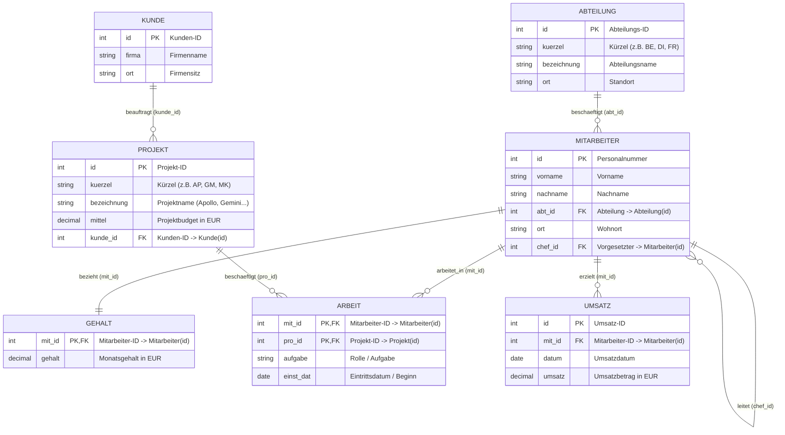

# 🌌 SQL Fundamentals - Das Master-Repository


Willkommen im zentralen Hub für die SQL-Fundamentals-Serie. Dieses Repository dient als strukturierte Wissensbasis, Kursbegleiter und Projektdokumentation für das Modul **SQL Server & Relationale Datenbankgrundlagen**.

---

## 👥 Kurs-Metadaten
*   **Autor/Bearbeiter:** Tobias Boyke
*   **Dozent:** Tom S.
*   **Modulzeitraum:** 03.08.2026 - 04.09.2026
*   **Arbeitszeiten:** Montag bis Freitag, 08:15 Uhr - 16:00 Uhr
*   **Lizenz:** [AGPL-3.0](./LICENSE)

---

## 🗺 Kurs-Roadmap & Lernpfad

```mermaid
flowchart TD
    subgraph W1["📅 Woche 1: Relationales Modell & DQL Basics"]
        D01["Tag 01: Relationales Modell"] --> D02["Tag 02: SELECT & WHERE"]
        D02 --> D03["Tag 03: GROUP BY & HAVING"]
        D03 --> D04["Tag 04: Joins I"]
        D04 --> D05["Tag 05: Joins II & Subqueries"]
    end

    subgraph W2["📅 Woche 2: DDL, DML, Performance & Klausur"]
        D06["Tag 06: DML & DDL Basics"] --> D07["Tag 07: Indizes & Transaktionen"]
        D07 --> D08["Tag 08: Constraints & Datentypen"]
        D08 --> D09["Tag 09: Views & CTEs"]
        D09 --> D10["Tag 10: 1. Klausur"]
    end

    subgraph W3["📅 Woche 3: Programmierbarkeit & Trigger"]
        D11["Tag 11: Fensterfunktionen"] --> D12["Tag 12: Stored Procedures"]
        D12 --> D13["Tag 13: Functions (UDFs)"]
        D13 --> D14["Tag 14: Trigger"]
        D14 --> D15["Tag 15: Error Handling"]
    end

    subgraph W4["📅 Woche 4: Advanced SQL & Optimization"]
        D16["Tag 16: Dynamisches SQL"] --> D17["Tag 17: Temp Tables"]
        D17 --> D18["Tag 18: Query Optimization"]
        D18 --> D19["Tag 19: Backup & Restore"]
        D19 --> D20["Tag 20: XML & JSON"]
    end

    subgraph W5["📅 Woche 5: Datenbank-Design & Projekt"]
        D21["Tag 21: Design & Normalisierung"] --> D22["Tag 22: Projekt DDL"]
        D22 --> D23["Tag 23: Projekt Abfragen"]
        D23 --> D24["Tag 24: Präsentationen"]
        D24 --> D25["Tag 25: Abschluss"]
    end

    D05 --> D06
    D10 --> D11
    D15 --> D16
    D20 --> D21

    %% Style classes
    classDef completed fill:#1e293b,stroke:#22c55e,stroke-width:2px,color:#f8fafc;
    classDef current fill:#1e293b,stroke:#3b82f6,stroke-width:3px,color:#f8fafc;
    classDef pending fill:#1e293b,stroke:#64748b,stroke-width:2px,stroke-dasharray: 5 5,color:#94a3b8;
    classDef exam fill:#311010,stroke:#ef4444,stroke-width:2px,color:#fca5a5;

    class D01,D02,D03,D04,D05,D06,D07,D08,D09,D11 completed;
    class D12 current;
    class D13,D14,D15,D16,D17,D18,D19,D20,D21,D22,D23,D24,D25 pending;
    class D10 exam;

    %% Subgraph Styles
    style W1 fill:#0f172a,stroke:#1e293b,stroke-width:2px,color:#e2e8f0
    style W2 fill:#0f172a,stroke:#1e293b,stroke-width:2px,color:#e2e8f0
    style W3 fill:#0f172a,stroke:#1e293b,stroke-width:2px,color:#e2e8f0
    style W4 fill:#0f172a,stroke:#1e293b,stroke-width:2px,color:#e2e8f0
    style W5 fill:#0f172a,stroke:#1e293b,stroke-width:2px,color:#e2e8f0
```



---

## 🗄️ Datenbankschema: ProjektDB (Single Source of Truth – SoT)

> [!IMPORTANT]
> **Kanonische Datenbasis für das gesamte Repository:**
> Die **`ProjektDB`** ist die verbindliche **Single Source of Truth (SoT)** für alle Kursmodule (`Day_01` bis `Day_25`). Alle praktischen Übungen, Skripte, Abfragen und Modul-Dokumentationen basieren konsistent auf diesem relationalen Schema.

Das folgende Entity-Relationship-Diagramm (ERD) visualisiert die zentrale Übungsdatenbank `ProjektDB`:



### Relationen & Kardinalitäten im Überblick
* **`Mitarbeiter` ➔ `Abteilung` (n:1):** Mehrere Mitarbeiter gehören zu einer Abteilung (`abt_id`).
* **`Mitarbeiter` ➔ `Mitarbeiter` (1:n Selbstreferenz):** Ein Mitarbeiter kann Vorgesetzter (`chef_id`) mehrerer Mitarbeiter sein.
* **`Mitarbeiter` ➔ `Gehalt` (1:1):** Jeder Mitarbeiter besitzt genau einen Gehaltseintrag (`mit_id`).
* **`Mitarbeiter` ➔ `Projekt` über `Arbeit` (n:m):** Verknüpfungstabelle mit zusammengesetztem Primärschlüssel (`mit_id`, `pro_id`), zusätzlicher Rolle (`aufgabe`) und Eintrittsdatum (`einst_dat` / `beginn`).
* **`Kunde` ➔ `Projekt` (1:n):** Ein Kunde kann Auftraggeber mehrerer Projekte sein (`kunde_id`).
* **`Mitarbeiter` ➔ `Umsatz` (1:n):** Ein Mitarbeiter kann mehrere Umsatzerlöse verbuchen (`mit_id`).

---

## 📂 Kursmodule & Tagesübersicht (ToC)

### 📅 Woche 1: Relationales Modell & DQL Basics
In der ersten Woche wurden die relationalen Grundlagen geschaffen. Der Fokus lag auf Entitätsbeziehungen sowie DQL-Abfragekonzepten (Filterungen, Gruppen und Verknüpfungen über Joins).

| Modul | Status | Fokus-Themen | Ausführliche Details | Link |
| :--- | :---: | :--- | :--- | :--- |
| **Tag 01** | ✅ | Relationales Datenmodell & Keys | Struktur relationaler Tabellen, Definition und Wichtigkeit von Primär- und Fremdschlüsseln. | [📖 Day_01](./Day_01/readme.md) |
| **Tag 02** | ✅ | DQL-Einstieg: SELECT & WHERE | Daten abfragen, Filtern mit Operatoren (`AND`, `OR`, `LIKE`, `IN`, `BETWEEN`) sowie Sortieren. | [📖 Day_02](./Day_02/readme.md) |
| **Tag 03** | ✅ | Aggregation & Gruppierung | Konsolidierung von Datensätzen mittels `GROUP BY`, Filterung aggregierter Zeilen via `HAVING`. | [📖 Day_03](./Day_03/readme.md) |
| **Tag 04** | ✅ | Tabellenbeziehungen: Joins I | Zusammenführen von Tabellen mit `INNER JOIN`, `LEFT JOIN`, `RIGHT JOIN` und `FULL OUTER JOIN`. | [📖 Day_04](./Day_04/readme.md) |
| **Tag 05** | ✅ | Subqueries & Fortgeschrittene Joins | Verschachtelte SELECT-Befehle (Subqueries), korrelierte Unterabfragen und Performance-Aspekte. | [📖 Day_05](./Day_05/readme.md) |

---

### 📅 Woche 2: DDL, DML, Performance & Klausur
Die zweite Woche erweitert die SQL-Kenntnisse auf Schreiboperationen, Tabellenerstellung, Performanceoptimierungen durch Indizes sowie Transaktionssicherheit (ACID). Die Woche schließt mit der ersten Leistungsüberprüfung ab.

| Modul | Status | Fokus-Themen | Ausführliche Details | Link |
| :--- | :---: | :--- | :--- | :--- |
| **Tag 06** | ✅ | DML & DDL Grundlagen | Einfügen (`INSERT`), Aktualisieren (`UPDATE`), Löschen (`DELETE`) und Tabellenmanipulationen (`CREATE`/`ALTER`). | [📖 Day_06](./Day_06/readme.md) |
| **Tag 07** | ✅ | Indizes & Transaktionen | Clustered vs. Non-Clustered Index, Seeks vs. Scans. ACID-Prinzip, Isolation Levels und Locking-Verhalten. | [📖 Day_07](./Day_07/readme.md) |
| **Tag 08** | ✅ | Probeklausur & Datentypen | Vollständige Ausarbeitung der Probeklausur "Datenbanken und SQL - Teil 1" inkl. Constraints und Datentypen. | [📖 Day_08](./Day_08/readme.md) |
| **Tag 09** | ✅ | Views & Common Table Expressions | Erstellung logischer Sichten (`VIEW`) und Strukturierung komplexer SQLs über CTEs. | [📖 Day_09](./Day_09/readme.md) |
| **Tag 10** | ✅ | 1. Klausur | Schriftliche Leistungsüberprüfung über alle Themen der Wochen 1 und 2 mit Klausurbesprechung. | [📖 Day_10](./Day_10/readme.md) |

---

### 📅 Woche 3: Programmierbarkeit & Trigger
Woche 3 verlässt das rein deklarative SQL und führt in die prozedurale Programmierung (T-SQL) ein. Es werden Logiken und Automatisierungen direkt auf Datenbankebene entwickelt.

| Modul | Status | Fokus-Themen | Ausführliche Details | Link |
| :--- | :---: | :--- | :--- | :--- |
| **Tag 11** | ✅ | Fensterfunktionen (Window Functions) | Analytische Funktionen wie `ROW_NUMBER()`, `RANK()`, `DENSE_RANK()` und die Klausel `OVER(PARTITION BY)`. | [📖 Day_11](./Day_11/readme.md) |
| **Tag 12** | 📝 | Sortierung & Aggregationen (Heute) | Sortieren mit `ORDER BY`, Handling von `NULL`-Werten, Ergebnisbegrenzung (`TOP`/`WITH TIES`), Aggregatfunktionen und Gruppierungen (`GROUP BY`/`HAVING`). | [📖 Day_12](./Day_12/readme.md) |
| **Tag 13** | ⏳ | User Defined Functions (UDFs) | Skalarwertfunktionen und Tabellenwertfunktionen (Inline- vs. Multi-Statement-UDFs). | [📖 Day_13](./Day_13/readme.md) |
| **Tag 14** | ⏳ | Trigger | Automatische DML-Reaktionen (AFTER-Trigger und INSTEAD OF-Trigger). | [📖 Day_14](./Day_14/readme.md) |
| **Tag 15** | ⏳ | Fehlerbehandlung in T-SQL | Strukturierte Ausnahmebehandlung mit `TRY...CATCH`, Auslösen von Fehlern via `THROW`. | [📖 Day_15](./Day_15/readme.md) |

---

### 📅 Woche 4: Advanced SQL & Optimization
In dieser Woche geht es um komplexe Verarbeitungsmuster, Performance-Diagnostik und administrative Grundlagen wie Datensicherungsstrategien.

| Modul | Status | Fokus-Themen | Ausführliche Details | Link |
| :--- | :---: | :--- | :--- | :--- |
| **Tag 16** | ⏳ | Dynamisches SQL & Injection-Schutz | Dynamisches Erzeugen und Ausführen von SQL-Strings mit `sp_executesql` und Absicherung. | [📖 Day_16](./Day_16/readme.md) |
| **Tag 17** | ⏳ | Temporärer Speicher & Tabellenspeicher | Vergleich: Lokale/Globale Temp-Tabellen (`#`/`##`), Tabellenvariablen (`@`) und CTEs. | [📖 Day_17](./Day_17/readme.md) |
| **Tag 18** | ⏳ | Query Optimization | Lesen von Ausführungsplänen, Identifikation von Flaschenhälsen (Scans, Spills in Tempdb). | [📖 Day_18](./Day_18/readme.md) |
| **Tag 19** | ⏳ | Backup & Restore Strategien | Administrative Durchführung von Vollsicherungen, differentiellen Backups und Log-Backups. | [📖 Day_19](./Day_19/readme.md) |
| **Tag 20** | ⏳ | XML & JSON Verarbeitung | Speichern und Parsen von semistrukturierten XML- und JSON-Dokumenten in relationalen Tabellen. | [📖 Day_20](./Day_20/readme.md) |

---

### 📅 Woche 5: Datenbank-Design & Modulprojekt
Die letzte Woche widmet sich der praktischen Anwendung. In einem kooperativen Abschlussprojekt wird ein vollständiges System von der Konzeption über Normalisierung und Befüllung bis hin zur Abfrageoptimierung aufgebaut.

| Modul | Status | Fokus-Themen | Ausführliche Details | Link |
| :--- | :---: | :--- | :--- | :--- |
| **Tag 21** | ⏳ | Datenbank-Design & Normalisierung | Überführung von Anforderungsdokumenten in ERDs, Normalisierung bis zur 3. Normalform. | [📖 Day_21](./Day_21/readme.md) |
| **Tag 22** | ⏳ | Projektphase: DDL & Generierung | Erstellen des Datenbankschemas und Erzeugung realistischer Testdaten über DML-Skripte. | [📖 Day_22](./Day_22/readme.md) |
| **Tag 23** | ⏳ | Projektphase: Abfragen & Tuning | Implementierung der Geschäftslogik-Queries und Tuning mittels Indizierung. | [📖 Day_23](./Day_23/readme.md) |
| **Tag 24** | ⏳ | Projektpräsentation & Review | Vorstellung der Projektdatenbanken, Begründung der Design-Entscheidungen, Peer Review. | [📖 Day_24](./Day_24/readme.md) |
| **Tag 25** | ⏳ | Modul-Abschluss & Feedback | Modulnachbereitung, Feedbackrunde mit Tom S. und Ausblick auf NoSQL sowie Cloud-DBs. | [📖 Day_25](./Day_25/readme.md) |

---

## 🚀 GitHub Features in diesem Repository

Dieses Repository verwendet professionelle Features zur Qualitätssicherung und Strukturierung:

1.  **CI/CD GitHub Actions:**
    *   [Markdown Linter (markdown-lint.yml)](./.github/workflows/markdown-lint.yml): Validiert automatisch jede Dokumentation auf Formatierungsregeln.
    *   [SQL Linter (sql-lint.yml)](./.github/workflows/sql-lint.yml): Nutzt `sqlfluff` zur Prüfung von SQL-Befehlen und Einhaltungen des T-SQL-Dialekts.
2.  **Repository-Templates:**
    *   [Bug Report Template](./.github/ISSUE_TEMPLATE/bug_report.md) & [Feature Request Template](./.github/ISSUE_TEMPLATE/feature_request.md): Für standardisierte Issues.
    *   [PR-Template](./.github/pull_request_template.md): Für strukturierte Code-Reviews und Prüflisten vor dem Merge.
3.  **Code-Ownership:**
    *   [CODEOWNERS](./.github/CODEOWNERS) setzt Tobias Boyke als Hauptverantwortlichen für alle Skripte und Lektionen.

---

## 🛠️ Automatische Einrichtung (SQL Server & DataGrip)

Um direkt mit den Skripten arbeiten zu können, stellen wir ein automatisches Setup-Skript bereit. Dieses Skript lädt SQL Server Express herunter, installiert es im Hintergrund und konfiguriert die JetBrains DataGrip-Verbindung automatisch für das Repository.

### 🚀 Ausführung
1.  Öffne PowerShell als **Administrator**.
2.  Navigiere in den Projektordner.
3.  Führe das Skript aus:
    ```powershell
    Set-ExecutionPolicy Bypass -Scope Process -Force; .\setup_environment.ps1
    ```

### 💻 JetBrains DataGrip Integration
Dieses Repository enthält eine vorkonfigurierte Datenquelle in [.idea/dataSources.xml](./.idea/dataSources.xml).
*   **Vorgehen:** Öffne den Projektordner einfach als Projekt in **DataGrip** (oder Rider).
*   Die Verbindung `SQL-Fundamentals (SQLEXPRESS)` wird **automatisch geladen**. Du musst lediglich den JDBC-Treiber per Knopfdruck herunterladen und bist sofort startklar, um Abfragen auf den `Day_XX`-Dateien auszuführen.

---

## 💡 Kurstipps
> [!TIP]
> Alternativ zur lokalen Installation kann ein MS SQL-Server via Docker gestartet werden:
> `docker run -e "ACCEPT_EULA=Y" -e "MSSQL_SA_PASSWORD=DeinPasswort123!" -p 1433:1433 -d mcr.microsoft.com/mssql/server:2022-latest`